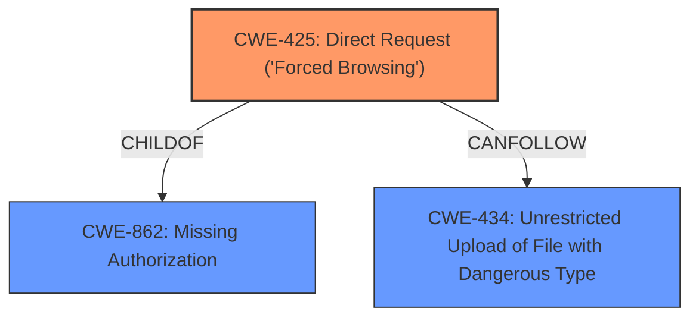

# Enhanced Analysis for CVE-2022-31496

# Summary
| CWE ID | CWE Name | Confidence | CWE Abstraction Level | CWE Vulnerability Mapping Label | CWE-Vulnerability Mapping Notes |
|---|---|---|---|---|---|
| CWE-425 | Direct Request ('Forced Browsing') | 1.0 | Base | Allowed | Primary CWE |
| CWE-862 | Missing Authorization | 0.9 | Base | Allowed | Secondary CWE |
| CWE-434 | Unrestricted Upload of File with Dangerous Type | 0.5 | Base | Allowed | Secondary CWE |

## Evidence and Confidence

*   **Confidence Score:** 0.9
*   **Evidence Strength:** HIGH

## Relationship Analysis
The primary CWE is CWE-425, Direct Request ('Forced Browsing'), as the application **does not adequately enforce appropriate authorization** on all restricted URLs. CWE-425 is a child of CWE-862 (Missing Authorization), indicating a hierarchical relationship where the more specific CWE-425 is chosen due to the nature of the vulnerability being exploitable via direct request. CWE-434 (Unrestricted Upload of File with Dangerous Type) can follow CWE-425 if an attacker uses forced browsing to upload a malicious file.



## Vulnerability Chain
The vulnerability chain starts with **missing authorization** (CWE-862), leading to direct request vulnerability (CWE-425), which then leads to the potential for unrestricted file upload (CWE-434) and ultimately Remote Code Execution (RCE).

## Summary of Analysis
The initial analysis identified a Broken Access Control issue in LibreHealth's `manage_site_files.php`. The application **does not properly verify if a user has the required permissions** to access the functionality, which means the `manage_site_files.php` page **does not enforce super admin privileges**, allowing unauthorized users to modify arbitrary files.

The primary CWE selected is CWE-425 (Direct Request ('Forced Browsing')) because the vulnerability allows unauthorized access to restricted URLs. This aligns with the vulnerability description's statement that the application **does not adequately enforce appropriate authorization** on all restricted URLs. The evidence from "CVE Reference Links Content Summary" indicates that "an attacker can exploit this vulnerability by directly accessing the vulnerable endpoint `librehealth_host/interface/super/manage_site_files.php`". The relationship analysis shows that CWE-425 is a child of CWE-862 (Missing Authorization).

CWE-862 (Missing Authorization) was considered as a primary CWE, but CWE-425 is more specific, as it highlights the exploitation method of directly accessing restricted URLs. The mapping guidance for both CWEs allows their usage, but the principle of selecting the most specific CWE favors CWE-425.

CWE-434 (Unrestricted Upload of File with Dangerous Type) was considered because the vulnerability allows unauthorized users to modify arbitrary files, potentially including uploading malicious files. The "CVE Reference Links Content Summary" mentions that by exploiting the access control vulnerability, an attacker can modify arbitrary files on the server, including PHP files, and inject malicious PHP code. However, CWE-434 is a secondary consequence, so it is listed as a secondary CWE.

The selected CWEs are at the optimal level of specificity because they accurately represent the root cause and potential exploitation paths of the vulnerability, based on the evidence provided.

Relevant CWE Information:
- CWE-425: Direct Request ('Forced Browsing') - The web application does not adequately enforce appropriate authorization on all restricted URLs, scripts, or files.
- CWE-862: Missing Authorization - The product does not perform an authorization check before allowing an actor to access a resource or perform an action.
- CWE-434: Unrestricted Upload of File with Dangerous Type - The product allows the upload or transfer of dangerous file types that are automatically processed within its environment.


## CWE Relationship Analysis

Current CWEs represent these abstraction levels: .


### Vulnerability Chain Analysis

**Chain starting from CWE-862:**
- 862 (Missing Authorization) - ROOT


**Chain starting from CWE-425:**
- 425 (Direct Request ('Forced Browsing')) - ROOT


### CWE Relationship Diagram

```mermaid
graph TD
    classDef primary fill:#f96,stroke:#333,stroke-width:2px
    classDef secondary fill:#69f,stroke:#333
    classDef tertiary fill:#9e9,stroke:#333
```