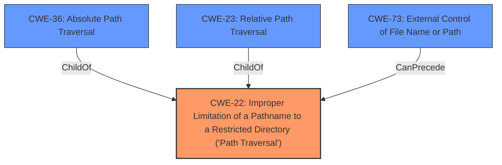

# Raw Analyzer Response for CVE-2022-31505

# Summary
| CWE ID | CWE Name | Confidence | CWE Abstraction Level | CWE Vulnerability Mapping Label | CWE-Vulnerability Mapping Notes |
|---|---|---|---|---|---|
| CWE-22 | Improper Limitation of a Pathname to a Restricted Directory ('Path Traversal') | 1.0 | Base | Allowed | Primary CWE |
| CWE-36 | Absolute Path Traversal | 0.8 | Base | Allowed | Secondary Candidate |
| CWE-73 | External Control of File Name or Path | 0.7 | Base | Allowed | Secondary Candidate |

## Evidence and Confidence

*   **Confidence Score:** 0.9
*   **Evidence Strength:** HIGH

## Relationship Analysis
The primary CWE is CWE-22, which is the base class for path traversal vulnerabilities. CWE-36 (Absolute Path Traversal) and CWE-23 (Relative Path Traversal) are children of CWE-22, representing specific types of path traversal. CWE-73 (External Control of File Name or Path) is related as it describes the condition where user input influences file paths, which often precedes path traversal vulnerabilities. The abstraction levels influenced the selection by favoring the base CWE-22, because the vulnerability allows for path traversal in general, but absolute path traversal is a valid secondary option.

## Vulnerability Chain
The vulnerability chain starts with **external control of the filename** (CWE-73) passed to the `send_file` function. Because of **improper limitation of pathname** (CWE-22) this allows an attacker to access files outside the intended directory. The vulnerability is specifically an **absolute path traversal** (CWE-36) because the Flask send_file function is used unsafely and allows absolute paths.

## Summary of Analysis
The initial analysis focused on the **absolute path traversal** **weakness** in the cleo0/MercadoEnLineaBack repository. The analysis is based on the provided evidence from the vulnerability description and the CVE Reference Links Content Summary.

The CVE Reference Links Content Summary states:

-   "**Unsafe Use of Flask's `send_file` Function:** The primary cause of these vulnerabilities across multiple repositories is the direct use of Flask's `send_file` function with user-controlled input for the filename parameter. This allows attackers to craft malicious file paths that escape the intended directory, resulting in path traversal."
-   "**Path Traversal (CWE-22):** By manipulating the `filename` parameter in the `send_file` function, attackers can access arbitrary files and directories on the server's filesystem. This is typically done using sequences like `../` or using absolute file paths."
-   "**Unsanitized User Input:** The applications do not properly sanitize user input before passing it to the `send_file` function, making them susceptible to path traversal attacks."

The relationship graph influenced the final selection by illustrating the hierarchical relationship between CWE-22 and its child CWE-36. The selected CWEs are at the optimal level of specificity, with CWE-22 representing the general path traversal vulnerability and CWE-36 representing the specific case of absolute path traversal. CWE-73 highlights the external control aspect.

CWE-23 (Relative Path Traversal) was considered, but it was determined that the vulnerability allows absolute path traversal, making CWE-36 a more specific fit. CWE-37, CWE-24, CWE-59, CWE-38, CWE-39, and CWE-182 were considered but were less relevant as they represent other types of path traversal or data collapsing issues not directly related to this vulnerability.

Relevant CWE Information:

# Enhanced Context (25 CWEs)
The following CWEs were identified as potentially relevant to this vulnerability:

## CWE-22: Improper Limitation of a Pathname to a Restricted Directory ('Path Traversal')
**Abstraction Level**: Base
**Similarity Score**: 7079.53
**Source**: sparse

**Description**:
The product uses external input to construct a pathname that is intended to identify a file or directory that is located underneath a restricted parent directory, but the product does not properly neutralize special elements within the pathname that can cause the pathname to resolve to a location that is outside of the restricted directory.

## CWE-36: Absolute Path Traversal
**Abstraction Level**: Base
**Similarity Score**: 6979.32
**Source**: sparse

**Description**:
The product uses external input to construct a pathname that should be within a restricted directory, but it does not properly neutralize absolute path sequences such as "/abs/path" that can resolve to a location that is outside of that directory.

## CWE-73: External Control of File Name or Path
**Abstraction Level**: Base
**Similarity Score**: 6737.36
**Source**: sparse

**Description**:
The product allows user input to control or influence paths or file names that are used in filesystem operations.