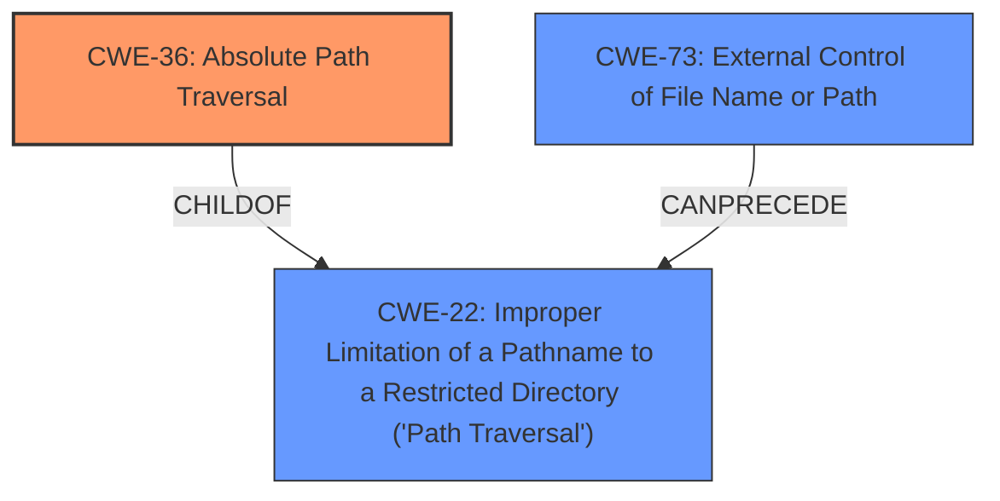

# Analysis Report for CVE-2022-31511

# Vulnerability Analysis Report: CVE-2022-31511

## Description


## Analysis (with Relationship Data)

# Summary
| CWE ID | CWE Name | Confidence | CWE Abstraction Level | CWE Vulnerability Mapping Label | CWE-Vulnerability Mapping Notes |
|---|---|---|---|---|---|
| CWE-36 | Absolute Path Traversal | 0.9 | Base | Allowed | Primary CWE |
| CWE-22 | Improper Limitation of a Pathname to a Restricted Directory ('Path Traversal') | 0.7 | Base | Allowed | Secondary Candidate |
| CWE-73 | External Control of File Name or Path | 0.6 | Base | Allowed | Secondary Candidate |

## Evidence and Confidence

*   **Confidence Score:** 0.8
*   **Evidence Strength:** HIGH

## Relationship Analysis
The primary CWE is CWE-36, which is a child of CWE-22. This indicates that CWE-36 is a more specific type of Path Traversal where the path provided is an absolute path. CWE-73 can precede CWE-22, suggesting that external control of the filename or path might lead to path traversal vulnerabilities. Choosing CWE-36 provides a more precise description of the vulnerability than its parent, CWE-22.



## Vulnerability Chain
The vulnerability chain starts with the **unsafe use of the Flask send_file function**, which leads to **absolute path traversal**.
  - Initial Flaw: **Unsafe use of Flask's send_file function** with untrusted input.
  - Weakness: **CWE-36 (Absolute Path Traversal)** - The application does not properly neutralize absolute path sequences.
  - Impact: **Access to arbitrary files** on the server.

## Summary of Analysis
The initial analysis clearly points to **absolute path traversal** due to the **unsafe use of the Flask send_file function**. The provided evidence from the "CVE Reference Links Content Summary" confirms that the application passes untrusted input directly to the `send_file` function, which can contain absolute file paths.

>   *   The root cause of the vulnerability lies in the **unsafe use of the `flask.send_file` function** within a Flask application.
>   *   Specifically, the application passes untrusted, attacker-controlled input directly to the `send_file` function, which is used to serve files.
>   *   This untrusted input, which is supposed to represent a filename, can contain sequences like `../` or **absolute file paths** which allows an attacker to bypass the intended directory and access arbitrary files outside the intended scope.

The graph relationships highlight that CWE-36 is a more specific type of CWE-22 (Path Traversal), which is appropriate given the vulnerability description.

CWE-36 is chosen because the vulnerability description explicitly mentions **absolute path traversal**. The "CVE Reference Links Content Summary" further confirms the presence of absolute file paths in the untrusted input. Other CWEs like CWE-23 (Relative Path Traversal) are less relevant because the vulnerability is specifically about absolute paths. CWE-73 (External Control of File Name or Path) is a related CWE, as the vulnerability stems from the external control of the file path, but CWE-36 more accurately describes the specific type of path traversal.

The selected CWEs are at the optimal level of specificity, with CWE-36 being a Base level CWE that directly reflects the absolute path traversal vulnerability.


## CWE Relationship Analysis

Current CWEs represent these abstraction levels: .


### Vulnerability Chain Analysis

**Chain starting from CWE-22:**
- 22 (Improper Limitation of a Pathname to a Restricted Directory ('Path Traversal')) - ROOT


**Chain starting from CWE-73:**
- 73 (External Control of File Name or Path) - ROOT


### CWE Relationship Diagram

```mermaid
graph TD
    classDef primary fill:#f96,stroke:#333,stroke-width:2px
    classDef secondary fill:#69f,stroke:#333
    classDef tertiary fill:#9e9,stroke:#333
```


*Report generated on 2025-03-31 11:10:48*
