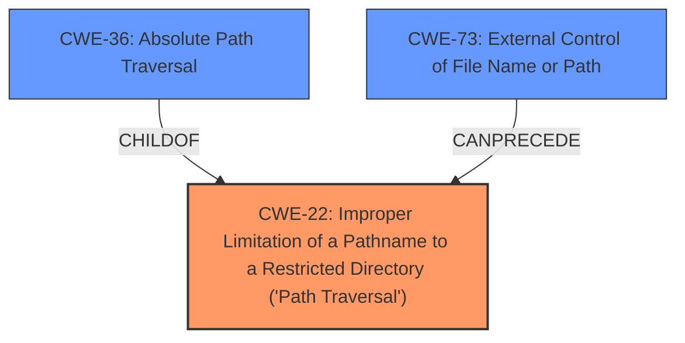

# Analysis for CVE-2022-31513

# Summary
| CWE ID | CWE Name | Confidence | CWE Abstraction Level | CWE Vulnerability Mapping Label | CWE-Vulnerability Mapping Notes |
|---|---|---|---|---|---|
| CWE-22 | Improper Limitation of a Pathname to a Restricted Directory ('Path Traversal') | 1.0 | Base | Allowed | Primary CWE |
| CWE-36 | Absolute Path Traversal | 0.7 | Base | Allowed | Secondary CWE Candidate |
| CWE-73 | External Control of File Name or Path | 0.6 | Base | Allowed | Secondary CWE Candidate |

## Evidence and Confidence

*   **Confidence Score:** 0.9
*   **Evidence Strength:** HIGH

## Relationship Analysis
The primary CWE is CWE-22, which is a base-level CWE for path traversal vulnerabilities. CWE-36, **Absolute Path Traversal**, is a child of CWE-22, representing a specific type of path traversal. CWE-73, **External Control of File Name or Path**, can precede CWE-22, indicating that external control over the file path is a common precursor to path traversal vulnerabilities. The choice of CWE-22 is favored due to its direct relevance to the vulnerability description and the evidence in the CVE reference links. While CWE-36 describes **absolute path traversal**, the broader CWE-22 covers both relative and absolute path traversals, making it a more suitable primary classification given the context of multiple CVEs being referenced.

## Vulnerability Chain
The vulnerability chain starts with the **unsafe usage of the Flask `send_file` function**, which allows external control of the file path. This leads to **Improper Limitation of a Pathname to a Restricted Directory ('Path Traversal')** (CWE-22). The attacker can then read arbitrary files on the server.

## Summary of Analysis
The initial assessment identified **absolute path traversal** as the key weakness. The analysis of the CVE reference links content summary indicates the root cause is the unsafe usage of the Flask `send_file` function, which allows an attacker to traverse the file system using absolute paths provided as user input. This leads to path traversal (CWE-22) due to the insecure use of `send_file`.

The primary selection is CWE-22 because it is the most common weakness described in the CVEs. The evidence for this is:
*   "**Root cause of vulnerability**: Unsafe usage of the Flask `send_file` function, allowing an attacker to traverse the file system using absolute paths provided as user input."
*   "**Weaknesses/vulnerabilities**: Path traversal (CWE-22) due to insecure use of `send_file`."

While the vulnerability description mentions **absolute path traversal**, the CVE summaries indicate that both absolute and relative paths could be used, thus making the more general CWE-22 more appropriate.

CWE-36 (**Absolute Path Traversal**) was considered, but it is a more specific case of CWE-22. Given that the unsafe usage of the `send_file` function doesn't explicitly restrict the attack to absolute paths, it is more accurate to use CWE-22, which covers both relative and absolute path traversal.

CWE-73 (**External Control of File Name or Path**) was also considered, as the **unsafe usage of the Flask `send_file` function** allows external control of the file path. This external control is a prerequisite for the path traversal vulnerability, however, it is the **improper limitation of the pathname** that is the direct cause of the vulnerability, making CWE-22 a more direct and appropriate mapping.

The chosen CWEs are at the optimal level of specificity because they directly describe the root cause and contributing factors of the vulnerability.

Relevant CWE Information:

## Enhanced Context (25 CWEs)
The following CWEs were identified as potentially relevant to this vulnerability:

## CWE-22: Improper Limitation of a Pathname to a Restricted Directory ('Path Traversal')
**Abstraction:** Base
**Status:** Stable

### Description
The product uses external input to construct a pathname that is intended to identify a file or directory that is located underneath a restricted parent directory, but the product does not properly neutralize special elements within the pathname that can cause the pathname to resolve to a location that is outside of the restricted directory.

### Extended Description
Many file operations are intended to take place within a restricted directory. By using special elements such as ".." and "/" separators, attackers can escape outside of the restricted location to access files or directories that are elsewhere on the system. One of the most common special elements is the "../" sequence, which in most modern operating systems is interpreted as the parent directory of the current location. This is referred to as relative path traversal. Path traversal also covers the use of absolute pathnames such as "/usr/local/bin" to access unexpected files. This is referred to as absolute path traversal.