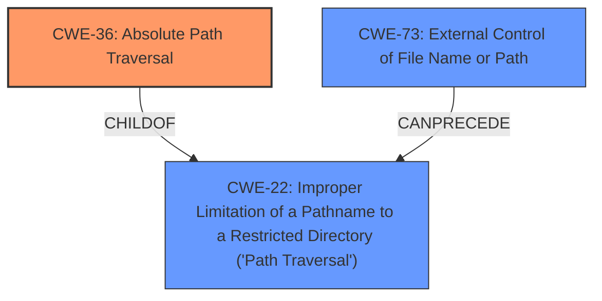

# Analysis for CVE-2022-31514

# Summary
| CWE ID | CWE Name | Confidence | CWE Abstraction Level | CWE Vulnerability Mapping Label | CWE-Vulnerability Mapping Notes |
|---|---|---|---|---|---|
| CWE-36 | Absolute Path Traversal | 1.0 | Base | Allowed | Primary CWE |
| CWE-22 | Improper Limitation of a Pathname to a Restricted Directory ('Path Traversal') | 0.8 | Base | Allowed | Secondary Candidate |
| CWE-73 | External Control of File Name or Path | 0.7 | Base | Allowed | Secondary Candidate |

## Evidence and Confidence

*   **Confidence Score:** 0.9
*   **Evidence Strength:** HIGH

## Relationship Analysis
The primary relationship that impacted my decision was the ChildOf relationship between CWE-36 and CWE-22. CWE-36 is a more specific type of CWE-22. Since the vulnerability is explicitly described as an **absolute path traversal**, CWE-36 is a more appropriate choice than its parent, CWE-22 which is a more general **path traversal**. CWE-73 can precede CWE-22 and describes the general case of external control of a file name or path, but it's less specific than CWE-36.



## Vulnerability Chain
The vulnerability chain starts with the external control of the file path, followed by **improper limitation of a pathname to a restricted directory**, and then finally **absolute path traversal**.

## Summary of Analysis
The initial analysis focused on identifying the most specific CWE that accurately represents the vulnerability. The description clearly states the vulnerability is an "**absolute path traversal**". The "CVE Reference Links Content Summary" section also indicates that "The core vulnerability is an **absolute path traversal** (CWE-22) vulnerability." However, since the description specifies "absolute path traversal", I chose the more specific CWE-36. The retriever results also point to CWE-36, CWE-22 and CWE-73.

*   CWE-36, Absolute Path Traversal, is selected as the primary CWE because the vulnerability description explicitly mentions "**absolute path traversal**". The "CVE Reference Links Content Summary" section also confirms that the root cause stems from the unsafe usage of the `Flask` framework's `send_file` function, where user-controlled input is used to specify the file path, leading to path traversal.

*   CWE-22, Improper Limitation of a Pathname to a Restricted Directory ('Path Traversal'), is considered as a secondary CWE because it's a more general form of path traversal, and the "CVE Reference Links Content Summary" section identified it as a vulnerability. CWE-36 is a child of CWE-22, making it a more specific representation of the vulnerability.

*   CWE-73, External Control of File Name or Path, is considered as a secondary CWE because it represents the initial step in the path traversal vulnerability, where user input influences the file path. However, it's not the most specific weakness, as it doesn't directly describe the path traversal itself.

Based on the evidence and the relationships between the CWEs, CWE-36 is the most appropriate primary CWE, with CWE-22 and CWE-73 as secondary candidates.

Relevant CWE Information:

# Enhanced Context (25 CWEs)
The following CWEs were identified as potentially relevant to this vulnerability:

## CWE-36: Absolute Path Traversal
**Abstraction Level**: Base
**Similarity Score**: 0.80
**Source**: dense

**Description**:
The product uses external input to construct a pathname that should be within a restricted directory, but it does not properly neutralize absolute path sequences such as "/abs/path" that can resolve to a location that is outside of that directory.

**Mapping Guidance**:
- Usage: Allowed
- Rationale: This CWE entry is at the Base level of abstraction, which is a preferred level of abstraction for mapping to the root causes of vulnerabilities.

## CWE-23: Relative Path Traversal
**Abstraction Level**: Base
**Similarity Score**: 0.80
**Source**: dense

**Description**:
The product uses external input to construct a pathname that should be within a restricted directory, but it does not properly neutralize sequences such as ".." that can resolve to a location that is outside of that directory.

**Mapping Guidance**:
- Usage: Allowed
- Rationale: This CWE entry is at the Base level of abstraction, which is a preferred level of abstraction for mapping to the root causes of vulnerabilities.

## CWE-41: Improper Resolution of Path Equivalence
**Abstraction Level**: Base
**Similarity Score**: 0.77
**Source**: dense

**Description**:
The product is vulnerable to file system contents disclosure through path equivalence. Path equivalence involves the use of special characters in file and directory names. The associated manipulations are intended to generate multiple names for the same object.

**Mapping Guidance**:
- Usage: Allowed
- Rationale: This CWE entry is at the Base level of abstraction, which is a preferred level of abstraction for mapping to the root causes of vulnerabilities.

## CWE-24: Path Traversal: '../filedir'
**Abstraction Level**: Variant
**Similarity Score**: 0.77
**Source**: dense

**Description**:
The product uses external input to construct a pathname that should be within a restricted directory, but it does not properly neutralize "../" sequences that can resolve to a location that is outside of that directory.

**Mapping Guidance**:
- Usage: Allowed
- Rationale: This CWE entry is at the Variant level of abstraction, which is a preferred level of abstraction for mapping to the root causes of vulnerabilities.

## CWE-59: Improper Link Resolution Before File Access ('Link Following')
**Abstraction Level**: Base
**Similarity Score**: 0.77
**Source**: dense

**Description**:
The product attempts to access a file based on the filename, but it does not properly prevent that filename from identifying a link or shortcut that resolves to an unintended resource.

**Mapping Guidance**:
- Usage: Allowed
- Rationale: This CWE entry is at the Base level of abstraction, which is a preferred level of abstraction for mapping to the root causes of vulnerabilities.

## CWE-37: Path Traversal: '/absolute/pathname/here'
**Abstraction Level**: Variant
**Similarity Score**: 0.77
**Source**: dense

**Description**:
The product accepts input in the form of a slash absolute path ('/absolute/pathname/here') without appropriate validation, which can allow an attacker to traverse the file system to unintended locations or access arbitrary files.

**Mapping Guidance**:
- Usage: Allowed
- Rationale: This CWE entry is at the Variant level of abstraction, which is a preferred level of abstraction for mapping to the root causes of vulnerabilities.

## CWE-35: Path Traversal: '.../...//'
**Abstraction Level**: Variant
**Similarity Score**: 0.77
**Source**: dense

**Description**:
The product uses external input to construct a pathname that should be within a restricted directory, but it does not properly neutralize '.../...//' (doubled triple dot slash) sequences that can resolve to a location that is outside of that directory.

**Mapping Guidance**:
- Usage: Allowed
- Rationale: This CWE entry is at the Variant level of abstraction, which is a preferred level of abstraction for mapping to the root causes of vulnerabilities.

## CWE-73: External Control of File Name or Path
**Abstraction Level**: Base
**Similarity Score**: 0.76
**Source**: dense

**Description**:
The product allows user input to control or influence paths or file names that are used in filesystem operations.

**Mapping Guidance**:
- Usage: Allowed
- Rationale: This CWE entry is at the Base level of abstraction, which is a preferred level of abstraction for mapping to the root causes of vulnerabilities.

## CWE-25: Path Traversal: '/../filedir'
**Abstraction Level**: Variant
**Similarity Score**: 0.75
**Source**: dense

**Description**:
The product uses external input to construct a pathname that should be within a restricted directory, but it does not properly neutralize "/../" sequences that can resolve to a location that is outside of that directory.

**Mapping Guidance**:
- Usage: Allowed
- Rationale: This CWE entry is at the Variant level of abstraction, which is a preferred level of abstraction for mapping to the root causes of vulnerabilities.

## CWE-29: Path Traversal: '\..\filename'
**Abstraction Level**: Variant
**Similarity Score**: 0.75
**Source**: dense

**Description**:
The product uses external input to construct a pathname that

# Enhanced Query for CVE-2022-31514

## Vulnerability Description
The Caoyongqi912/Fan_Platform repository through 2021-04-20 on GitHub allows **absolute path traversal** because the Flask send_file function is used unsafely.

### Vulnerability Description Key Phrases
- **weakness:** **absolute path traversal**
- **product:** Caoyongqi912/Fan_Platform
- **version:** through 2021-04-20

## CVE Reference Links Content Summary
Here's a breakdown of the vulnerabilities based on the provided content:

**Commonalities across all CVEs:**

*   **Root Cause:** All listed CVEs (CVE-2022-31504, CVE-2022-31505, CVE-2022-31509, CVE-2022-31510, CVE-2022-31511, CVE-2022-31512, CVE-2022-31513, CVE-2022-31514, CVE-2022-31515, CVE-2022-31516, CVE-2022-31518, CVE-2022-31520, CVE-2022-31521, CVE-2022-31526, CVE-2022-31527, CVE-2022-31528, CVE-2022-31532, CVE-2022-31533, CVE-2022-31534, CVE-2022-31535, CVE-2022-31536, CVE-2022-31537, CVE-2022-31538, CVE-2022-31540, CVE-2022-31544, CVE-2022-31545, CVE-2022-31546, CVE-2022-31547, CVE-2022-31548, CVE-2022-31551, CVE-2022-31552, CVE-2022-31553, CVE-2022-31554, CVE-2022-31555, CVE-2022-31556, CVE-2022-31557, CVE-2022-31559, CVE-2022-31560, CVE-2022-31561, CVE-2022-31562, CVE-2022-31563, CVE-2022-31564, CVE-2022-31565, CVE-2022-31566, CVE-2022-31567, CVE-2022-31568, CVE-2022-31570, CVE-2022-31571, CVE-2022-31572, CVE-2022-31574, CVE-2022-31575, CVE-2022-31576, CVE-2022-31577, CVE-2022-31578, CVE-2022-31579, CVE-2022-31582, CVE-2022-31583, CVE-2022-31585, CVE-2022-31587, CVE-2022-31588) stem from the unsafe usage of the `Flask` framework's `send_file` function. Specifically, the applications use user-controlled input to specify the file path that the `send_file` function reads, leading to path traversal.
*   **Weaknesses/Vulnerabilities:** The core vulnerability is an **absolute path traversal** (CWE-22) vulnerability. The `flask.send_file` function is intended to serve files from a designated directory. However, by providing crafted input (absolute paths or relative paths that navigate outside the intended directory), an attacker can access and download arbitrary files from the server's filesystem.
*   **Impact:** An attacker can potentially read any file on the server filesystem that the application user has access to. This includes application source code, configuration files, credentials, and other sensitive data. This can lead to full information disclosure and potentially further exploitation if sensitive keys or passwords are accessed.
*   **Attack Vectors:** The primary attack vector is through network requests to the vulnerable application's endpoints, where an attacker can inject a malicious file path into the request parameters. This can be done using a web browser, command-line tools like `curl`, or any other method to craft HTTP requests.
*   **Attacker Capabilities/Position:** An attacker needs network access to the vulnerable application. They do not require any authentication or special privileges. They are able to exploit the vulnerability by crafting the request that will be sent to the server.

**Specific CVE Details:**

While all the CVEs share the same underlying cause, the specific vulnerable code and affected repositories differ:

*   **CVE-2022-31504:** `ChangeWeDer/BaiduWenkuSpider_flaskWeb` -  BaiduWenkuSpider_flaskWeb repository allows an attacker to download arbitrary files by exploiting the `send_file` function.
*   **CVE-2022-31505:** `cheo0/MercadoEnLineaBack` -  MercadoEnLineaBack repository's unsafe `send_file` use allows for arbitrary file downloads. This repo no longer exists but the vulnerability is still assigned to it.
*   **CVE-2022-31509:** `iedadata/usap-dc-website` - The usap-dc-website repository uses flask `send_file` unsafely.
*   **CVE-2022-31510:** `Harveyzyh/Python` - The Python repository uses flask `send_file` unsafely. This repo no longer exists but the vulnerability is still assigned to it.
*   **CVE-2022-31511:** `AFDudley/equanimity` - The equanimity repository's implementation of `flask.send_file` is vulnerable.
*  **CVE-2022-31512:** `Atom02/flask-mvc` -  The flask-mvc repository allows an attacker to download arbitrary files by exploiting the `send_file` function.
*   **CVE-2022-31513:** `BolunHan/Krypton` - The Krypton repository allows an attacker to download arbitrary files by exploiting the `send_file` function.
*   **CVE-2022-31514:** `Caoyongqi912/Fan_Platform` -  The Fan_Platform repository's unsafe use of `send_file` leads to the potential for arbitrary file downloads.
*   **CVE-2022-31515:** `Delor4/CarceresBE` -  The CarceresBE repository's use of `send_file` allows for arbitrary file downloads.
*  **CVE-2022-31516:** `Harveyzyh/Python` - The Python repository allows an attacker to download arbitrary files by exploiting the `send_file` function.
*   **CVE-2022-31518:** `JustAnotherSoftwareDeveloper/Python-Recipe-Database` - The Python-Recipe-Database repository is vulnerable due to unsafe use of `send_file`.
*   **CVE-2022-31520:** `Luxas98/logstash-management-api` -  The logstash-management-api repository allows an attacker to download arbitrary files by exploiting the `send_file` function.
*   **CVE-2022-31521:** `Niyaz-Mohamed/Mosaic` -  The Mosaic repository's unsafe use of `send_file` exposes it to path traversal.
*   **CVE-2022-31526:** `ThundeRatz/ThunderDocs` - The ThunderDocs repository is vulnerable due to the insecure use of `send_file`
*   **CVE-2022-31527:** `Wildog/flask-file-server` - The flask-file-server repository uses flask `send_file` unsafely.
*  **CVE-2022-31528:** `bonn-activity-maps/bam_annotation_tool` - The bam_annotation_tool repository contains a path traversal vulnerability caused by improper `send_file` use.
*   **CVE-2022-31532:** `dankolbman/travel_blahg` - The travel_blahg repository is vulnerable due to the insecure use of `send_file`
*   **CVE-2022-31533:** `decentraminds/umbral` -  The umbral repository's unsafe usage of `send_file` allows for path traversal.
*   **CVE-2022-31534:** `echoleegroup/PythonWeb` - The PythonWeb repository is vulnerable due to the unsafe usage of `send_file`.
*   **CVE-2022-31535:** `freefood89/Fishtank` - The Fishtank repository contains a path traversal vulnerability caused by improper `send_file` use.
*  **CVE-2022-31536:** `jaygarza1982/ytdl-sync` - The ytdl-sync repository is vulnerable due to the insecure use of `send_file`
*   **CVE-2022-31537:** `jmcginty15/Solar-system-simulator` - The Solar-system-simulator repository allows an attacker to download arbitrary files by exploiting the `send_file` function.
*   **CVE-2022-31538:** `joaopedro-fg/mp-m08-interface` -  The mp-m08-interface repository allows an attacker to download arbitrary files by exploiting the `send_file` function.
*   **CVE-2022-31540:** `kumardeepak/hin-eng-preprocessing` -  The hin-eng-preprocessing repository's implementation of `flask.send_file` is vulnerable to path traversal.
*   **CVE-2022-31544:** `meerstein/rbtm` - The rbtm repository is vulnerable due to the insecure use of `send_file`
*   **CVE-2022-31545:** `ml-inory/ModelConverter` - The ModelConverter repository's unsafe use of the `send_file` function allows for arbitrary file downloads.
*  **CVE-2022-31546:** `nlpweb/glance` - The glance repository allows an attacker to download arbitrary files by exploiting the `send_file` function.
*   **CVE-2022-31547:** `noamezekiel/sphere` - The sphere repository allows an attacker to download arbitrary files by exploiting the `send_file` function.
*   **CVE-2022-31548:** `nrlakin/homepage` - The homepage repository is vulnerable due to the insecure use of `send_file`.
*   **CVE-2022-31551:** `pleomax00/flask-mongo-skel` - The flask-mongo-skel repository's unsafe `send_file` call can be exploited to download arbitrary files.
*  **CVE-2022-31552:** `project-anuvaad/anuvaad-corpus` - The anuvaad-corpus repository's implementation of `flask.send_file` is vulnerable.
*   **CVE-2022-31553:** `rainsoupah/sleep-learner` - The sleep-learner repository contains a path traversal vulnerability due to unsafe use of `send_file`.
*   **CVE-2022-31554:** `rohitnayak/movie-review-sentiment-analysis` - The movie-review-sentiment-analysis repository uses flask `send_file` unsafely, exposing a path traversal vulnerability.
*   **CVE-2022-31555:** `romain20100/nursequest` - The nursequest repository is vulnerable due to the insecure use of `send_file`.
*   **CVE-2022-31556:** `rusyasoft/TrainEnergyServer` - The TrainEnergyServer repository contains a path traversal vulnerability due to the unsafe usage of `send_file`.
*   **CVE-2022-31557:** `seveas/golem` - The golem repository is vulnerable due to the insecure use of `send_file`.
*   **CVE-2022-31559:** `tsileo/flask-yeoman` - The flask-yeoman repository's implementation of `flask.send_file` is vulnerable to path traversal.
*   **CVE-2022-31560:** `uncleYiba/photo_tag` - The photo_tag repository allows an attacker to download arbitrary files by exploiting the `send_file` function.
*  **CVE-2022-31561:** `varijkapil13/Sphere_ImageBackend` - The Sphere_ImageBackend repository's use of flask's `send_file` function is vulnerable.
*   **CVE-2022-31562:** `waveyan/internshipsystem` - The internshipsystem repository uses flask `send_file` unsafely.
*   **CVE-2022-31563:** `whmacmac/vprj` - The vprj repository is vulnerable due to the insecure use of `send_file`.
*   **CVE-2022-31564:** `woduq1414/munhak-moa` - The munhak-moa repository allows an attacker to download arbitrary files by exploiting the `send_file` function.
*   **CVE-2022-31565:** `yogson/syrabond` - The syrabond repository allows an attacker to download arbitrary files by exploiting the `send_file` function.
*   **CVE-2022-31566:** `DSAB-local/DSAB` - The DSAB repository allows an attacker to download arbitrary files by exploiting the `send_file` function.
*   **CVE-2022-31567:** `DSABenchmark/DSAB` - The DSAB repository is vulnerable due to the insecure use of `send_file`.
*   **CVE-2022-31568:** `Rexians/rex-web` - The rex-web repository uses flask `send_file` unsafely.
*  **CVE-2022-31570:** `adriankoczuruek/ceneo-web-scrapper` - The ceneo-web-scrapper repository's implementation of `flask.send_file` is vulnerable to path traversal.
*   **CVE-2022-31571:** `akashtalole/python-flask-restful-api` -  The python-flask-restful-api repository's use of `send_file` allows for arbitrary file downloads.
*   **CVE-2022-31572:** `ceee-vip/cockybook` -  The cockybook repository uses flask `send_file` unsafely, making arbitrary file downloads possible.
*  **CVE-2022-31574:** `deepaliupadhyay/RealEstate` - The RealEstate repository is vulnerable due to the unsafe usage of `send_file`.
*   **CVE-2022-31575:** `duducosmos/livro_python` - The livro_python repository is vulnerable due to the unsafe usage of `send_file`.
*  **CVE-2022-31576:** `heidi-luong1109/shackerpanel` - The shackerpanel repository is vulnerable due to the insecure use of `send_file`.
*  **CVE-2022-31577:** `longmaoteamtf/audio_aligner_app` - The audio_aligner_app repository is vulnerable due to the insecure use of `send_file`.
*  **CVE-2022-31578:** `piaoyunsoft/bt_lnmp` - The bt_lnmp repository's use of `send_file` function allows for arbitrary file downloads.
*   **CVE-2022-31579:** `ralphjzhang/iasset` - The iasset repository's use of `send_file` is vulnerable to path traversal. This repo no longer exists but the vulnerability is still assigned to it.
*  **CVE-2022-31582:** `shaolo1/VideoServer` - The VideoServer repository is vulnerable due to the insecure use of `send_file`
*   **CVE-2022-31583:** `sravaniboinepelli/AutomatedQuizEval` - The AutomatedQuizEval repository uses `send_file` unsafely leading to path traversal.
*  **CVE-2022-31585:** `umeshpatil-dev/Home__internet` - The Home__internet repository is vulnerable due to the insecure use of `send_file`.
*  **CVE-2022-31587:** `yuriyouzhou/KG-fashion-chatbot` - The KG-fashion-chatbot repository's implementation of `flask.send_file` is vulnerable.
*  **CVE-2022-31588:** `zippies/testplatform` - The testplatform repository allows an attacker to download arbitrary files by exploiting the `send_file` function.

**Key Observations**
*   All of these vulnerabilities stem from a common mistake: not properly sanitizing user input before using it in file path operations, particularly with Flask's `send_file` function.
*   The CVSS scores are consistent across most, indicating a high severity (9.3 or 8.6) due to potential for full information disclosure and low complexity of exploitation.
*   The EPSS scores are relatively low, which may reflect the fact that these are specific vulnerabilities in individual github repos that may not be widely deployed. The highest EPSS score was `0.295` (69th percentile) and the lowest was `0.144` (51st percentile).

**Additional Notes:**
*   The vulnerability information was derived from the provided GitHub Advisory Database entries, discussions and comments.
*   Some repositories mentioned in these CVEs were archived or no longer existed, but were still included.
*   The content provides sufficient details for understanding the nature of the path traversal vulnerability.

This consolidated information can be used to understand the root cause and impact of these identified vulnerabilities.

**Note:** CVE-2022-31510, CVE-2022-31516 and CVE-2022-31579 mention repositories that are no longer available but the advisories still apply to them

## Retriever Results

### Top Combined Results

| Rank | CWE ID | Name | Abstraction | Usage  | Retrievers | Individual Scores |
|------|--------|------|-------------|-------|------------|-------------------|
| 1 | 22 | Improper Limitation of a Pathname to a Restricted Directory ('Path Traversal') | Base | Allowed | alternate_terms | 0.800 |
| 2 | 36 | Absolute Path Traversal | Base | Allowed | sparse | 0.333 |
| 3 | 73 | External Control of File Name or Path | Base | Allowed | sparse | 0.201 |
| 4 | 23 | Relative Path Traversal | Base | Allowed | sparse | 0.145 |
| 5 | 37 | Path Traversal: '/absolute/pathname/here' | Variant | Allowed | sparse | 0.124 |
| 6 | 24 | Path Traversal: '../filedir' | Variant | Allowed | dense | 0.581 |
| 7 | 59 | Improper Link Resolution Before File Access ('Link Following') | Base | Allowed | graph | 0.002 |
| 8 | 38 | Path Traversal: '\absolute\pathname\here' | Variant | Allowed | sparse | 0.111 |
| 9 | 182 | Collapse of Data into Unsafe Value | Base | Allowed | sparse | 0.101 |
| 10 | 95 | Improper Neutralization of Directives in Dynamically Evaluated Code ('Eval Injection') | Variant | Allowed | sparse | 0.100 |


# Complete CWE Specifications


## CWE-22: Improper Limitation of a Pathname to a Restricted Directory ('Path Traversal')
**Abstraction:** Base
**Status:** Stable

### Description
The product uses external input to construct a pathname that is intended to identify a file or directory that is located underneath a restricted parent directory, but the product does not properly neutralize special elements within the pathname that can cause the pathname to resolve to a location that is outside of the restricted directory.

### Extended Description


Many file operations are intended to take place within a restricted directory. By using special elements such as ".." and "/" separators, attackers can escape outside of the restricted location to access files or directories that are elsewhere on the system. One of the most common special elements is the "../" sequence, which in most modern operating systems is interpreted as the parent directory of the current location. This is referred to as relative path traversal. Path traversal also covers the use of absolute pathnames such as "/usr/local/bin" to access unexpected files. This is referred to as absolute path traversal.


### Alternative Terms
Directory traversal
Path traversal: "Path traversal" is preferred over "directory traversal," but both terms are attack-focused.

### Relationships
ChildOf -> CWE-706
ChildOf -> CWE-706
ChildOf -> CWE-668

### Mapping Guidance
**Usage:** Allowed
**Rationale:** This CWE entry is at the Base level of abstraction, which is a preferred level of abstraction for mapping to the root causes of vulnerabilities.
**Comments:** Carefully read both the name and description to ensure that this mapping is an appropriate fit. Do not try to 'force' a mapping to a lower-level Base/Variant simply to comply with this preferred level of abstraction.
**Reasons:**
- Acceptable-Use


### Additional Notes
**[Other]** In many programming languages, the injection of a null byte (the 0 or NUL) may allow an attacker to truncate a generated filename to apply to a wider range of files. For example, the product may add ".txt" to any pathname, thus limiting the attacker to text files, but a null injection may effectively remove this restriction.

**[Relationship]** Pathname equivalence can be regarded as a type of canonicalization error.

**[Relationship]** Some pathname equivalence issues are not directly related to directory traversal, rather are used to bypass security-relevant checks for whether a file/directory can be accessed by the attacker (e.g. a trailing "/" on a filename could bypass access rules that don't expect a trailing /, causing a server to provide the file when it normally would not).

**[Terminology]** 

Like other weaknesses, terminology is often based on the types of manipulations used, instead of the underlying weaknesses. Some people use "directory traversal" only to refer to the injection of ".." and equivalent sequences whose specific meaning is to traverse directories.


Other variants like "absolute pathname" and "drive letter" have the *effect* of directory traversal, but some people may not call it such, since it doesn't involve ".." or equivalent.


**[Research Gap]** Many variants of path traversal attacks are probably under-studied with respect to root cause. CWE-790 and CWE-182 begin to cover part of this gap.

**[Research Gap]** 

Incomplete diagnosis or reporting of vulnerabilities can make it difficult to know which variant is affected. For example, a researcher might say that "..\" is vulnerable, but not test "../" which may also be vulnerable.


Any combination of directory separators ("/", "\", etc.) and numbers of "." (e.g. "....") can produce unique variants; for example, the "//../" variant is not listed (CVE-2004-0325). See this entry's children and lower-level descendants.


### Observed Examples
- **CVE-2024-37032:** Large language model (LLM) management tool does not validate the format of a digest value (CWE-1287) from a private, untrusted model registry, enabling relative path traversal (CWE-23), a.k.a. Probllama
- **CVE-2024-4315:** Chain: API for text generation using Large Language Models (LLMs) does not include the "\" Windows folder separator in its denylist (CWE-184) when attempting to prevent Local File Inclusion via path traversal (CWE-22), allowing deletion of arbitrary files on Windows systems.
- **CVE-2022-45918:** Chain: a learning management tool debugger uses external input to locate previous session logs (CWE-73) and does not properly validate the given path (CWE-20), allowing for filesystem path traversal using "../" sequences (CWE-24)


## CWE-36: Absolute Path Traversal
**Abstraction:** Base
**Status:** Draft

### Description
The product uses external input to construct a pathname that should be within a restricted directory, but it does not properly neutralize absolute path sequences such as "/abs/path" that can resolve to a location that is outside of that directory.

### Extended Description
This allows attackers to traverse the file system to access files or directories that are outside of the restricted directory.

### Alternative Terms
None

### Relationships
ChildOf -> CWE-22
ChildOf -> CWE-22
ChildOf -> CWE-22

### Mapping Guidance
**Usage:** Allowed
**Rationale:** This CWE entry is at the Base level of abstraction, which is a preferred level of abstraction for mapping to the root causes of vulnerabilities.
**Comments:** Carefully read both the name and description to ensure that this mapping is an appropriate fit. Do not try to 'force' a mapping to a lower-level Base/Variant simply to comply with this preferred level of abstraction.
**Reasons:**
- Acceptable-Use


### Observed Examples
- **CVE-2022-31503:** Python package constructs filenames using an unsafe os.path.join call on untrusted input, allowing absolute path traversal because os.path.join resets the pathname to an absolute path that is specified as part of the input.
- **CVE-2002-1345:** Multiple FTP clients write arbitrary files via absolute paths in server responses
- **CVE-2001-1269:** ZIP file extractor allows full path


## CWE-73: External Control of File Name or Path
**Abstraction:** Base
**Status:** Draft

### Description
The product allows user input to control or influence paths or file names that are used in filesystem operations.

### Extended Description


This could allow an attacker to access or modify system files or other files that are critical to the application.


Path manipulation errors occur when the following two conditions are met:

```
		1. An attacker can specify a path used in an operation on the filesystem.
		2. By specifying the resource, the attacker gains a capability that would not otherwise be permitted.
```
For example, the program may give the attacker the ability to overwrite the specified file or run with a configuration controlled by the attacker.

### Alternative Terms
None

### Relationships
ChildOf -> CWE-642
ChildOf -> CWE-610
ChildOf -> CWE-20
CanPrecede -> CWE-22
CanPrecede -> CWE-41
CanPrecede -> CWE-98
CanPrecede -> CWE-434
CanPrecede -> CWE-59

### Mapping Guidance
**Usage:** Allowed
**Rationale:** This CWE entry is at the Base level of abstraction, which is a preferred level of abstraction for mapping to the root causes of vulnerabilities.
**Comments:** Carefully read both the name and description to ensure that this mapping is an appropriate fit. Do not try to 'force' a mapping to a lower-level Base/Variant simply to comply with this preferred level of abstraction.
**Reasons:**
- Acceptable-Use


### Additional Notes
**[Maintenance]** CWE-114 is a Class, but it is listed a child of CWE-73 in view 1000. This suggests some abstraction problems that should be resolved in future versions.

**[Relationship]** 

The external control of filenames can be the primary link in chains with other file-related weaknesses, as seen in the CanPrecede relationships. This is because software systems use files for many different purposes: to execute programs, load code libraries, to store application data, to store configuration settings, record temporary data, act as signals or semaphores to other processes, etc.


However, those weaknesses do not always require external control. For example, link-following weaknesses (CWE-59) often involve pathnames that are not controllable by the attacker at all.


The external control can be resultant from other issues. For example, in PHP applications, the register_globals setting can allow an attacker to modify variables that the programmer thought were immutable, enabling file inclusion (CWE-98) and path traversal (CWE-22). Operating with excessive privileges (CWE-250) might allow an attacker to specify an input filename that is not directly readable by the attacker, but is accessible to the privileged program. A buffer overflow (CWE-119) might give an attacker control over nearby memory locations that are related to pathnames, but were not directly modifiable by the attacker.


### Observed Examples
- **CVE-2022-45918:** Chain: a learning management tool debugger uses external input to locate previous session logs (CWE-73) and does not properly validate the given path (CWE-20), allowing for filesystem path traversal using "../" sequences (CWE-24)
- **CVE-2008-5748:** Chain: external control of values for user's desired language and theme enables path traversal.
- **CVE-2008-5764:** Chain: external control of user's target language enables remote file inclusion.


## CWE-23: Relative Path Traversal
**Abstraction:** Base
**Status:** Draft

### Description
The product uses external input to construct a pathname that should be within a restricted directory, but it does not properly neutralize sequences such as ".." that can resolve to a location that is outside of that directory.

### Extended Description
This allows attackers to traverse the file system to access files or directories that are outside of the restricted directory.

### Alternative Terms
Zip Slip: "Zip slip" is an attack that uses file archives (e.g., ZIP, tar, rar, etc.) that contain filenames with path traversal sequences that cause the files to be written outside of the directory under which the archive is expected to be extracted [REF-1282]. It is most commonly used for relative path traversal (CWE-23) and link following (CWE-59).

### Relationships
ChildOf -> CWE-22
ChildOf -> CWE-22
ChildOf -> CWE-22

### Mapping Guidance
**Usage:** Allowed
**Rationale:** This CWE entry is at the Base level of abstraction, which is a preferred level of abstraction for mapping to the root causes of vulnerabilities.
**Comments:** Carefully read both the name and description to ensure that this mapping is an appropriate fit. Do not try to 'force' a mapping to a lower-level Base/Variant simply to comply with this preferred level of abstraction.
**Reasons:**
- Acceptable-Use


### Observed Examples
- **CVE-2024-37032:** Large language model (LLM) management tool does not validate the format of a digest value (CWE-1287) from a private, untrusted model registry, enabling relative path traversal (CWE-23), a.k.a. Probllama
- **CVE-2022-45918:** Chain: a learning management tool debugger uses external input to locate previous session logs (CWE-73) and does not properly validate the given path (CWE-20), allowing for filesystem path traversal using "../" sequences (CWE-24)
- **CVE-2019-20916:** Python package manager does not correctly restrict the filename specified in a Content-Disposition header, allowing arbitrary file read using path traversal sequences such as "../"


## CWE-37: Path Traversal: '/absolute/pathname/here'
**Abstraction:** Variant
**Status:** Draft

### Description
The product accepts input in the form of a slash absolute path ('/absolute/pathname/here') without appropriate validation, which can allow an attacker to traverse the file system to unintended locations or access arbitrary files.

### Extended Description
Not provided

### Alternative Terms
None

### Relationships
ChildOf -> CWE-36
ChildOf -> CWE-160

### Mapping Guidance
**Usage:** Allowed
**Rationale:** This CWE entry is at the Variant level of abstraction, which is a preferred level of abstraction for mapping to the root causes of vulnerabilities.
**Comments:** Carefully read both the name and description to ensure that this mapping is an appropriate fit. Do not try to 'force' a mapping to a lower-level Base/Variant simply to comply with this preferred level of abstraction.
**Reasons:**
- Acceptable-Use


### Observed Examples
- **CVE-2002-1345:** Multiple FTP clients write arbitrary files via absolute paths in server responses
- **CVE-2001-1269:** ZIP file extractor allows full path
- **CVE-2002-1818:** Path traversal using absolute pathname


## CWE-24: Path Traversal: '../filedir'
**Abstraction:** Variant
**Status:** Incomplete

### Description
The product uses external input to construct a pathname that should be within a restricted directory, but it does not properly neutralize "../" sequences that can resolve to a location that is outside of that directory.

### Extended Description


This allows attackers to traverse the file system to access files or directories that are outside of the restricted directory.


The "../" manipulation is the canonical manipulation for operating systems that use "/" as directory separators, such as UNIX- and Linux-based systems. In some cases, it is useful for bypassing protection schemes in environments for which "/" is supported but not the primary separator, such as Windows, which uses "\" but can also accept "/".


### Alternative Terms
None

### Relationships
ChildOf -> CWE-23

### Mapping Guidance
**Usage:** Allowed
**Rationale:** This CWE entry is at the Variant level of abstraction, which is a preferred level of abstraction for mapping to the root causes of vulnerabilities.
**Comments:** Carefully read both the name and description to ensure that this mapping is an appropriate fit. Do not try to 'force' a mapping to a lower-level Base/Variant simply to comply with this preferred level of abstraction.
**Reasons:**
- Acceptable-Use


### Observed Examples
- **CVE-2022-45918:** Chain: a learning management tool debugger uses external input to locate previous session logs (CWE-73) and does not properly validate the given path (CWE-20), allowing for filesystem path traversal using "../" sequences (CWE-24)


## CWE-59: Improper Link Resolution Before File Access ('Link Following')
**Abstraction:** Base
**Status:** Draft

### Description
The product attempts to access a file based on the filename, but it does not properly prevent that filename from identifying a link or shortcut that resolves to an unintended resource.

### Extended Description
Not provided

### Alternative Terms
insecure temporary file: Some people use the phrase "insecure temporary file" when referring to a link following weakness, but other weaknesses can produce insecure temporary files without any symlink involvement at all.
Zip Slip: "Zip slip" is an attack that uses file archives (e.g., ZIP, tar, rar, etc.) that contain filenames with path traversal sequences that cause the files to be written outside of the directory under which the archive is expected to be extracted [REF-1282]. It is most commonly used for relative path traversal (CWE-23) and link following (CWE-59).

### Relationships
ChildOf -> CWE-706
ChildOf -> CWE-706

### Mapping Guidance
**Usage:** Allowed
**Rationale:** This CWE entry is at the Base level of abstraction, which is a preferred level of abstraction for mapping to the root causes of vulnerabilities.
**Comments:** Carefully read both the name and description to ensure that this mapping is an appropriate fit. Do not try to 'force' a mapping to a lower-level Base/Variant simply to comply with this preferred level of abstraction.
**Reasons:**
- Acceptable-Use


### Additional Notes
**[Theoretical]** 

Link following vulnerabilities are Multi-factor Vulnerabilities (MFV). They are the combination of multiple elements: file or directory permissions, filename predictability, race conditions, and in some cases, a design limitation in which there is no mechanism for performing atomic file creation operations.


Some potential factors are race conditions, permissions, and predictability.


### Observed Examples
- **CVE-1999-1386:** Some versions of Perl follow symbolic links when running with the -e option, which allows local users to overwrite arbitrary files via a symlink attack.
- **CVE-2000-1178:** Text editor follows symbolic links when creating a rescue copy during an abnormal exit, which allows local users to overwrite the files of other users.
- **CVE-2004-0217:** Antivirus update allows local users to create or append to arbitrary files via a symlink attack on a logfile.


## CWE-38: Path Traversal: '\absolute\pathname\here'
**Abstraction:** Variant
**Status:** Draft

### Description
The product accepts input in the form of a backslash absolute path ('\absolute\pathname\here') without appropriate validation, which can allow an attacker to traverse the file system to unintended locations or access arbitrary files.

### Extended Description
Not provided

### Alternative Terms
None

### Relationships
ChildOf -> CWE-36

### Mapping Guidance
**Usage:** Allowed
**Rationale:** This CWE entry is at the Variant level of abstraction, which is a preferred level of abstraction for mapping to the root causes of vulnerabilities.
**Comments:** Carefully read both the name and description to ensure that this mapping is an appropriate fit. Do not try to 'force' a mapping to a lower-level Base/Variant simply to comply with this preferred level of abstraction.
**Reasons:**
- Acceptable-Use


### Observed Examples
- **CVE-1999-1263:** Mail client allows remote attackers to overwrite arbitrary files via an e-mail message containing a uuencoded attachment that specifies the full pathname for the file to be modified.
- **CVE-2003-0753:** Remote attackers can read arbitrary files via a full pathname to the target file in config parameter.
- **CVE-2002-1525:** Remote attackers can read arbitrary files via an absolute pathname.


## CWE-182: Collapse of Data into Unsafe Value
**Abstraction:** Base
**Status:** Draft

### Description
The product filters data in a way that causes it to be reduced or "collapsed" into an unsafe value that violates an expected security property.

### Extended Description
Not provided

### Alternative Terms
None

### Relationships
ChildOf -> CWE-693
CanPrecede -> CWE-33
CanPrecede -> CWE-34
CanPrecede -> CWE-35

### Mapping Guidance
**Usage:** Allowed
**Rationale:** This CWE entry is at the Base level of abstraction, which is a preferred level of abstraction for mapping to the root causes of vulnerabilities.
**Comments:** Carefully read both the name and description to ensure that this mapping is an appropriate fit. Do not try to 'force' a mapping to a lower-level Base/Variant simply to comply with this preferred level of abstraction.
**Reasons:**
- Acceptable-Use


### Additional Notes
**[Relationship]** Overlaps regular expressions, although an implementation might not necessarily use regexp's.


### Observed Examples
- **CVE-2004-0815:** "/.////" in pathname collapses to absolute path.
- **CVE-2005-3123:** "/.//..//////././" is collapsed into "/.././" after ".." and "//" sequences are removed.
- **CVE-2002-0325:** ".../...//" collapsed to "..." due to removal of "./" in web server.


## CWE-95: Improper Neutralization of Directives in Dynamically Evaluated Code ('Eval Injection')
**Abstraction:** Variant
**Status:** Incomplete

### Description
The product receives input from an upstream component, but it does not neutralize or incorrectly neutralizes code syntax before using the input in a dynamic evaluation call (e.g. "eval").

### Extended Description
This may allow an attacker to execute arbitrary code, or at least modify what code can be executed.

### Alternative Terms
None

### Relationships
ChildOf -> CWE-94

### Mapping Guidance
**Usage:** Allowed
**Rationale:** This CWE entry is at the Variant level of abstraction, which is a preferred level of abstraction for mapping to the root causes of vulnerabilities.
**Comments:** Carefully read both the name and description to ensure that this mapping is an appropriate fit. Do not try to 'force' a mapping to a lower-level Base/Variant simply to comply with this preferred level of abstraction.
**Reasons:**
- Acceptable-Use


### Additional Notes
**[Other]** Factors: special character errors can play a role in increasing the variety of code that can be injected, although some vulnerabilities do not require special characters at all, e.g. when a single function without arguments can be referenced and a terminator character is not necessary.


### Observed Examples
- **CVE-2024-4181:** Framework for LLM applications allows eval injection via a crafted response from a hosting provider.
- **CVE-2022-2054:** Python compiler uses eval() to execute malicious strings as Python code.
- **CVE-2021-22204:** Chain: regex in EXIF processor code does not correctly determine where a string ends (CWE-625), enabling eval injection (CWE-95), as exploited in the wild per CISA KEV.

