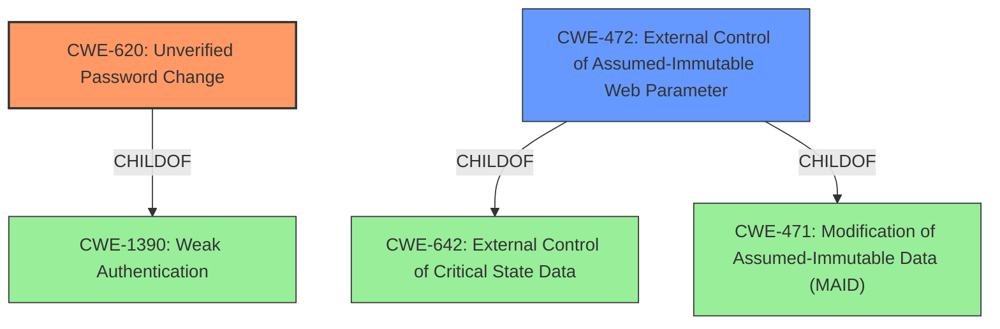

# Enhanced Analysis for CVE-2022-3152

# Summary
| CWE ID | CWE Name | Confidence | CWE Abstraction Level | CWE Vulnerability Mapping Label | CWE-Vulnerability Mapping Notes |
|---|---|---|---|---|---|
| CWE-620 | Unverified Password Change | 0.9 | Base | Primary | Allowed |
| CWE-472 | External Control of Assumed-Immutable Web Parameter | 0.7 | Base | Secondary | Allowed |

## Evidence and Confidence

*   **Confidence Score:** 0.8
*   **Evidence Strength:** HIGH

## Relationship Analysis
The primary CWE selected is CWE-620 which has a hierarchical relationship to CWE-1390 (Weak Authentication) as a child. This means CWE-620 is a more specific case of weak authentication. CWE-472 (External Control of Assumed-Immutable Web Parameter) is related to CWE-642 (External Control of Critical State Data) and CWE-471 (Modification of Assumed-Immutable Data). These relationships indicate that the vulnerability involves manipulating data assumed to be immutable. The abstraction levels are appropriate, with both selected CWEs at the Base level.



## Vulnerability Chain
The chain of weaknesses begins with **insufficient input validation** of user-controlled parameters (`user_hash`, `user_id`). This leads to the ability to perform an **Unverified Password Change** (CWE-620) and can be viewed as **External Control of Assumed-Immutable Web Parameter** (CWE-472) since the application does not sufficiently verify the `user_hash` and `user_id` that should be immutable. The final impact is unauthorized modification of user profiles, potentially leading to privilege escalation.

## Summary of Analysis
The initial assessment identified **Unverified Password Change** as the primary weakness, supported by the vulnerability description and retriever results. The analysis of the CVE reference links content summary confirms that the vulnerability is due to insufficient validation of `user_hash` and `user_id` parameters, allowing attackers to modify another user's profile. This aligns with the description of CWE-620, where the product does not require knowledge of the original password or another form of authentication when setting a new password. Additionally, the ability to manipulate hidden form fields to change user information makes CWE-472 a relevant secondary weakness.

The selection of CWE-620 is based on the explicit mention of "**Unverified Password Change**" in the vulnerability description and its high ranking in the retriever results. The CVE reference links content summary provides further evidence, stating that the code "**failed to properly verify that the `user_hash` and `user_id` parameters submitted by the user matched the existing user's data.**"

CWE-472 is included as a secondary weakness because the attacker manipulates `user_hash` and `user_id` via hidden form fields. The "CVE Reference Links Content Summary" mentions "**Hidden Input Tampering:** The vulnerability allowed an attacker to manipulate hidden form fields related to user authentication (`user_hash`, `user_id`)."

Other CWEs were considered but not selected because they were either too general (e.g., CWE-285, CWE-1390) or did not directly address the root cause of the vulnerability as effectively as CWE-620 and CWE-472. For instance, CWE-836 (Use of Password Hash Instead of Password for Authentication) is not relevant since the vulnerability does not involve using a password hash instead of a password for authentication.

The selected CWEs are at the optimal level of specificity, as they accurately represent the root cause of the vulnerability (CWE-620) and a contributing factor (CWE-472) without being overly broad or abstract.

Relevant CWE Information:

# Enhanced Context (25 CWEs)
The following CWEs were identified as potentially relevant to this vulnerability:

## CWE-472: External Control of Assumed-Immutable Web Parameter
**Abstraction Level**: Base
**Similarity Score**: 0.79
**Source**: dense

**Description**:
The web application does not sufficiently verify inputs that are assumed to be immutable but are actually externally controllable, such as hidden form fields.

**Mapping Guidance**:
- Usage: Allowed
- Rationale: This CWE entry is at the Base level of abstraction, which is a preferred level of abstraction for mapping to the root causes of vulnerabilities.


## CWE-807: Reliance on Untrusted Inputs in a Security Decision
**Abstraction Level**: Base
**Similarity Score**: 0.78
**Source**: dense

**Description**:
The product uses a protection mechanism that relies on the existence or values of an input, but the input can be modified by an untrusted actor in a way that bypasses the protection mechanism.

**Mapping Guidance**:
- Usage: Allowed
- Rationale: This CWE entry is at the Base level of abstraction, which is a preferred level of abstraction for mapping to the root causes of vulnerabilities.


## CWE-302: Authentication Bypass by Assumed-Immutable Data
**Abstraction Level**: Base
**Similarity Score**: 0.76
**Source**: dense

**Description**:
The authentication scheme or implementation uses key data elements that are assumed to be immutable, but can be controlled or modified by the attacker.

**Mapping Guidance**:
- Usage: Allowed
- Rationale: This CWE entry is at the Base level of abstraction, which is a preferred level of abstraction for mapping to the root causes of vulnerabilities.


## CWE-1391: Use of Weak Credentials
**Abstraction Level**: Class
**Similarity Score**: 0.76
**Source**: dense

**Description**:
The product uses weak credentials (such as a default key or hard-coded password) that can be calculated, derived, reused, or guessed by an attacker.

**Mapping Guidance**:
- Usage: Allowed-with-Review
- Rationale: This CWE entry is a Class and might have Base-level children that would be more appropriate


## CWE-639: Authorization Bypass Through User-Controlled Key
**Abstraction Level**: Base
**Similarity Score**: 0.76
**Source**: dense

**Description**:
The system's authorization functionality does not prevent one user from gaining access to another user's data or record by modifying the key value identifying the data.

**Mapping Guidance**:
- Usage: Allowed
- Rationale: This CWE entry is at the Base level of abstraction, which is a preferred level of abstraction for mapping to the root causes of vulnerabilities.


## CWE-74: Improper Neutralization of Special Elements in Output Used by a Downstream Component ('Injection')
**Abstraction Level**: Class
**Similarity Score**: 0.76
**Source**: dense

**Description**:
The product constructs all or part of a command, data structure, or record using externally-influenced input from an upstream component, but it does not neutralize or incorrectly neutralizes special elements that could modify how it is parsed or interpreted when it is sent to a downstream component.

**Mapping Guidance**:
- Usage: Discouraged
- Rationale: CWE-74 is high-level and often misused when lower-level weaknesses are more appropriate.


## CWE-538: Insertion of Sensitive Information into Externally-Accessible File or Directory
**Abstraction Level**: Base
**Similarity Score**: 0.76
**Source**: dense

**Description**:
The product places sensitive information into files or directories that are accessible to actors who are allowed to have access to the files, but not to the sensitive information.

**Mapping Guidance**:
- Usage: Allowed
- Rationale: This CWE entry is at the Base level of abstraction, which is a preferred level of abstraction for mapping to the root causes of vulnerabilities.


## CWE-1289: Improper Validation of Unsafe Equivalence in Input
**Abstraction Level**: Base
**Similarity Score**: 0.75
**Source**: dense

**Description**:
The product receives an input value that is used as a resource identifier or other type of reference, but it does not validate or incorrectly validates that the input is equivalent to a potentially-unsafe value.

**Mapping Guidance**:
- Usage: Allowed
- Rationale: This CWE entry is at the Base level of abstraction, which is a preferred level of abstraction for mapping to the root


## CWE Relationship Analysis

Current CWEs represent these abstraction levels: .


### Vulnerability Chain Analysis

**Chain starting from CWE-472:**
- 472 (External Control of Assumed-Immutable Web Parameter) - ROOT


**Chain starting from CWE-538:**
- 538 (Insertion of Sensitive Information into Externally-Accessible File or Directory) - ROOT


### CWE Relationship Diagram

```mermaid
graph TD
    classDef primary fill:#f96,stroke:#333,stroke-width:2px
    classDef secondary fill:#69f,stroke:#333
    classDef tertiary fill:#9e9,stroke:#333
```