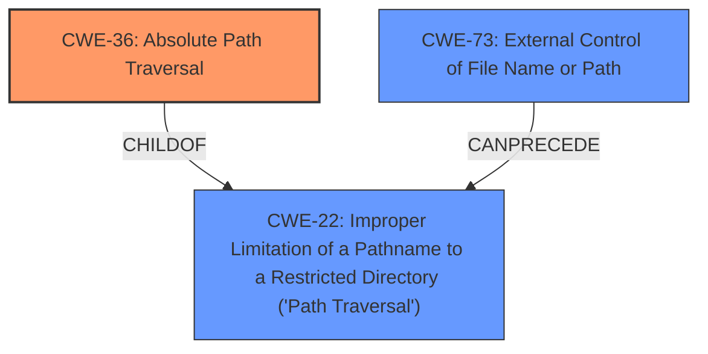

# Analysis Report for CVE-2022-31523

# Vulnerability Analysis Report: CVE-2022-31523

## Description


## Analysis (with Relationship Data)

# Summary
| CWE ID | CWE Name | Confidence | CWE Abstraction Level | CWE Vulnerability Mapping Label | CWE-Vulnerability Mapping Notes |
|---|---|---|---|---|---|
| CWE-36 | Absolute Path Traversal | 1 | Base | Allowed | Primary CWE |
| CWE-22 | Improper Limitation of a Pathname to a Restricted Directory ('Path Traversal') | 0.8 | Base | Allowed | Secondary Candidate |
| CWE-73 | External Control of File Name or Path | 0.6 | Base | Allowed | Secondary Candidate |

## Evidence and Confidence

*   **Confidence Score:** 0.9
*   **Evidence Strength:** HIGH

## Relationship Analysis
The primary CWE is CWE-36 (Absolute Path Traversal), which is a child of CWE-22 (Improper Limitation of a Pathname to a Restricted Directory ('Path Traversal')). CWE-73 (External Control of File Name or Path) can precede CWE-22, indicating a potential chain where external control leads to path traversal. The selection favored the more specific CWE-36 due to the explicit mention of **absolute path traversal** in the vulnerability description.



## Vulnerability Chain
The vulnerability chain starts with the external control of the file path (potentially CWE-73), leading to **improper limitation of pathname** (CWE-22), and specifically manifesting as **absolute path traversal** (CWE-36) due to the **insecure use of the Flask send_file function**.
  - Root Cause: **Insecure use of Flask send_file** allowing external control of filename.
  - Weakness: **Absolute Path Traversal**.
  - Impact: Attackers can access arbitrary files on the server.

## Summary of Analysis
The initial assessment identified the **absolute path traversal** as a key weakness, aligning with CWE-36. The supporting evidence is strong, given the vulnerability description explicitly mentions **absolute path traversal** and the CVE reference summary confirms the use of absolute paths to bypass `os.path.join`.

The analysis considered CWE-22 (Improper Limitation of a Pathname to a Restricted Directory ('Path Traversal')) and CWE-73 (External Control of File Name or Path). While CWE-22 is a parent of CWE-36 and generally applicable to path traversal issues, CWE-36 is a more specific fit due to the **absolute path traversal** being the described vulnerability. CWE-73 was considered because external control of the file name or path is often a prerequisite for path traversal vulnerabilities; however, the primary issue is the lack of proper neutralization of absolute paths, making CWE-36 the more direct and appropriate classification. The retriever results also support these findings.

The final selection of CWE-36 is at the optimal level of specificity, addressing the root cause of the vulnerability. The confidence is high (0.9) because the evidence directly supports the classification.

Relevant CWE Information:

# Enhanced Context (25 CWEs)
The following CWEs were identified as potentially relevant to this vulnerability:

## CWE-37: Path Traversal: '/absolute/pathname/here'
**Abstraction Level**: Variant
**Similarity Score**: 0.81
**Source**: dense

**Description**:
The product accepts input in the form of a slash absolute path ('/absolute/pathname/here') without appropriate validation, which can allow an attacker to traverse the file system to unintended locations or access arbitrary files.

**Mapping Guidance**:
- Usage: Allowed
- Rationale: This CWE entry is at the Variant level of abstraction, which is a preferred level of abstraction for mapping to the root causes of vulnerabilities.

## CWE-22: Improper Limitation of a Pathname to a Restricted Directory ('Path Traversal')
**Abstraction Level**: Base
**Similarity Score**: 6649.28
**Source**: sparse

**Description**:
The product uses external input to construct a pathname that is intended to identify a file or directory that is located underneath a restricted parent directory, but the product does not properly neutralize special elements within the pathname that can cause the pathname to resolve to a location that is outside of the restricted directory.

**Mapping Guidance**:
- Usage: Allowed
- Rationale: This CWE entry is at the Base level of abstraction, which is a preferred level of abstraction for mapping to the root causes of vulnerabilities.
**Comments:** Carefully read both the name and description to ensure that this mapping is an appropriate fit. Do not try to 'force' a mapping to a lower-level Base/Variant simply to comply with this preferred level of abstraction.
**Reasons:**
- Acceptable-Use

## CWE-36: Absolute Path Traversal
**Abstraction Level**: Base
**Similarity Score**: 0.80
**Source**: dense

**Description**:
The product uses external input to construct a pathname that should be within a restricted directory, but it does not properly neutralize absolute path sequences such as "/abs/path" that can resolve to a location that is outside of that directory.

**Mapping Guidance**:
- Usage: Allowed
- Rationale: This CWE entry is at the Base level of abstraction, which is a preferred level of abstraction for mapping to the root causes of vulnerabilities.
**Comments:** Carefully read both the name and description to ensure that this mapping is an appropriate fit. Do not try to 'force' a mapping to a lower-level Base/Variant simply to comply with this preferred level of abstraction.
**Reasons:**
- Acceptable-Use

## CWE-73: External Control of File Name or Path
**Abstraction Level**: Base
**Similarity Score**: 6194.23
**Source**: sparse

**Description**:
The product allows user input to control or influence paths or file names that are used in filesystem operations.

**Mapping Guidance**:
- Usage: Allowed
- Rationale: This CWE entry is at the Base level of abstraction, which is a preferred level of abstraction for mapping to the root causes of vulnerabilities.
**Comments:** Carefully read both the name and description to ensure that this mapping is an appropriate fit. Do not try to 'force' a mapping to a lower-level Base/Variant simply to comply with this preferred level of abstraction.
**Reasons:**
- Acceptable-Use

CWE-37 was considered but not used because it is a variant of CWE-36 and less descriptive. CWE-23, CWE-24, CWE-25, CWE-26, and CWE-29 were not used because they deal with relative path traversal, while the description specifies absolute path traversal. CWE-41 and CWE-59 were not used because they address different aspects of file access and resolution that are not the primary concern in this vulnerability. The other CWEs (CWE-184, CWE-94, CWE-98, CWE-625, CWE-183, CWE-843, CWE-434) were not considered relevant as they focus on different types of weaknesses (e.g., code injection, permissive lists, type confusion) that are not directly related to path traversal.


## CWE Relationship Analysis

Current CWEs represent these abstraction levels: .


### Vulnerability Chain Analysis

**Chain starting from CWE-98:**
- 98 (Improper Control of Filename for Include/Require Statement in PHP Program ('PHP Remote File Inclusion')) - ROOT


**Chain starting from CWE-41:**
- 41 (Improper Resolution of Path Equivalence) - ROOT


### CWE Relationship Diagram

```mermaid
graph TD
    classDef primary fill:#f96,stroke:#333,stroke-width:2px
    classDef secondary fill:#69f,stroke:#333
    classDef tertiary fill:#9e9,stroke:#333
```


*Report generated on 2025-03-31 12:40:41*
