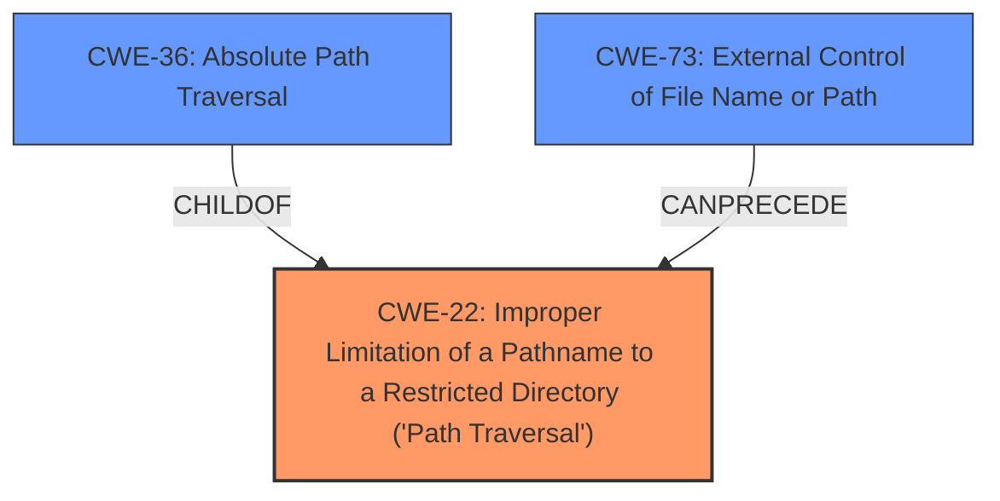

# Raw Analyzer Response for CVE-2022-31530

# Summary
| CWE ID | CWE Name | Confidence | CWE Abstraction Level | CWE Vulnerability Mapping Label | CWE-Vulnerability Mapping Notes |
|---|---|---|---|---|---|
| CWE-22 | Improper Limitation of a Pathname to a Restricted Directory ('Path Traversal') | 1.0 | Base | Allowed | Primary CWE |
| CWE-36 | Absolute Path Traversal | 0.9 | Base | Allowed | Secondary Candidate |
| CWE-73 | External Control of File Name or Path | 0.8 | Base | Allowed | Secondary Candidate |

## Evidence and Confidence

*   **Confidence Score:** 0.9
*   **Evidence Strength:** HIGH

## Relationship Analysis
The primary CWE is CWE-22, which represents the broad category of path traversal vulnerabilities. CWE-36, **Absolute Path Traversal**, is a child of CWE-22 and represents a specific type of path traversal where absolute paths are used. CWE-73, **External Control of File Name or Path**, can precede CWE-22, indicating that external control of the file name or path is a prerequisite for path traversal. The selected CWEs are at the Base abstraction level, providing a good balance between specificity and generality.

## Vulnerability Chain
The vulnerability chain starts with **CWE-73 (External Control of File Name or Path)**, where user input influences the file path. This leads to **CWE-22 (Improper Limitation of a Pathname to a Restricted Directory)**, specifically **CWE-36 (Absolute Path Traversal)**, where the application fails to restrict the path to the intended directory, allowing access to arbitrary files.

## Summary of Analysis
The initial assessment identified **absolute path traversal** as the primary **weakness**. The analysis of the vulnerability description, particularly the CVE Reference Links Content Summary, confirms that the **root cause** is the **improper handling of user-controlled input** in conjunction with `flask.send_file` allowing an attacker to specify an arbitrary file path.

The evidence from the CVE Reference Links Content Summary includes:
- The vulnerability stems from the use of `flask.send_file` with unsanitized, attacker-controlled input.
- Specifically, the `filename` parameter passed to `send_file` is directly derived from user input without sufficient validation.
- Additionally, the use of `os.path.join` to construct file paths before passing them to `flask.send_file` can be exploited with absolute paths, effectively bypassing the intended directory and leading to arbitrary file access.

This evidence supports the selection of **CWE-22 (Improper Limitation of a Pathname to a Restricted Directory ('Path Traversal'))** as the primary CWE, with a confidence level of 1.0, because the application **fails to properly limit the pathname to a restricted directory**. The retriever results also list CWE-22 as the top match.

**CWE-36 (Absolute Path Traversal)** is a more specific variant of CWE-22 and is also applicable because the vulnerability allows the use of absolute paths to bypass the intended directory restrictions. It's included as a secondary candidate with a confidence of 0.9.

**CWE-73 (External Control of File Name or Path)** is relevant because the vulnerability involves user-controlled input influencing the file path. This external control is a prerequisite for the path traversal vulnerability. It's included as a secondary candidate with a confidence of 0.8.

The selection of these CWEs is based on the provided evidence and the CWE specifications. The chosen CWEs are at the Base abstraction level, which is the preferred level for mapping root causes.

Other CWEs Considered:

- **CWE-23 (Relative Path Traversal)**: While related to path traversal, the vulnerability description specifically mentions absolute path traversal, making CWE-36 a more appropriate choice.
- **CWE-24 (Path Traversal: '../filedir')**: This is a specific type of relative path traversal and is not applicable because the vulnerability involves absolute path traversal.
- **CWE-59 (Improper Link Resolution Before File Access ('Link Following'))**: This CWE is not applicable as the vulnerability does not involve symbolic links.
- **CWE-95 (Improper Neutralization of Directives in Dynamically Evaluated Code ('Eval Injection'))**: This CWE is not applicable as the vulnerability does not involve code injection.
- **CWE-182 (Collapse of Data into Unsafe Value)**: This CWE is not directly applicable as the vulnerability does not involve data collapsing into an unsafe value.
Relevant CWE Information:

# Enhanced Context (25 CWEs)
The following CWEs were identified as potentially relevant to this vulnerability:

## CWE-23: Relative Path Traversal
**Abstraction Level**: Base
**Similarity Score**: 0.80
**Source**: dense

**Description**:
The product uses external input to construct a pathname that should be within a restricted directory, but it does not properly neutralize sequences such as ".." that can resolve to a location that is outside of that directory.

**Mapping Guidance**:
- Usage: Allowed
- Rationale: This CWE entry is at the Base level of abstraction, which is a preferred level of abstraction for mapping to the root causes of vulnerabilities.

## CWE-41: Improper Resolution of Path Equivalence
**Abstraction Level**: Base
**Similarity Score**: 0.79
**Source**: dense

**Description**:
The product is vulnerable to file system contents disclosure through path equivalence. Path equivalence involves the use of special characters in file and directory names. The associated manipulations are intended to generate multiple names for the same object.

**Mapping Guidance**:
- Usage: Allowed
- Rationale: This CWE entry is at the Base level of abstraction, which is a preferred level of abstraction for mapping to the root causes of vulnerabilities.

## CWE-36: Absolute Path Traversal
**Abstraction Level**: Base
**Similarity Score**: 0.78
**Source**: dense

**Description**:
The product uses external input to construct a pathname that should be within a restricted directory, but it does not properly neutralize absolute path sequences such as "/abs/path" that can resolve to a location that is outside of that directory.

**Mapping Guidance**:
- Usage: Allowed
- Rationale: This CWE entry is at the Base level of abstraction, which is a preferred level of abstraction for mapping to the root causes of vulnerabilities.

## CWE-59: Improper Link Resolution Before File Access ('Link Following')
**Abstraction Level**: Base
**Similarity Score**: 0.77
**Source**: dense

**Description**:
The product attempts to access a file based on the filename, but it does not properly prevent that filename from identifying a link or shortcut that resolves to an unintended resource.

**Mapping Guidance**:
- Usage: Allowed
- Rationale: This CWE entry is at the Base level of abstraction, which is a preferred level of abstraction for mapping to the root causes of vulnerabilities.

## CWE-73: External Control of File Name or Path
**Abstraction Level**: Base
**Similarity Score**: 0.77
**Source**: dense

**Description**:
The product allows user input to control or influence paths or file names that are used in filesystem operations.

**Mapping Guidance**:
- Usage: Allowed
- Rationale: This CWE entry is at the Base level of abstraction, which is a preferred level of abstraction for mapping to the root causes of vulnerabilities.

## CWE-37: Path Traversal: '/absolute/pathname/here'
**Abstraction Level**: Variant
**Similarity Score**: 0.77
**Source**: dense

**Description**:
The product accepts input in the form of a slash absolute path ('/absolute/pathname/here') without appropriate validation, which can allow an attacker to traverse the file system to unintended locations or access arbitrary files.

**Mapping Guidance**:
- Usage: Allowed
- Rationale: This CWE entry is at the Variant level of abstraction, which is a preferred level of abstraction for mapping to the root causes of vulnerabilities.

## CWE-24: Path Traversal: '../filedir'
**Abstraction Level**: Variant
**Similarity Score**: 0.77
**Source**: dense

**Description**:
The product uses external input to construct a pathname that should be within a restricted directory, but it does not properly neutralize "../" sequences that can resolve to a location that is outside of that directory.

**Mapping Guidance**:
- Usage: Allowed
- Rationale: This CWE entry is at the Variant level of abstraction, which is a preferred level of abstraction for mapping to the root causes of vulnerabilities.

## CWE-35: Path Traversal: '.../...//'
**Abstraction