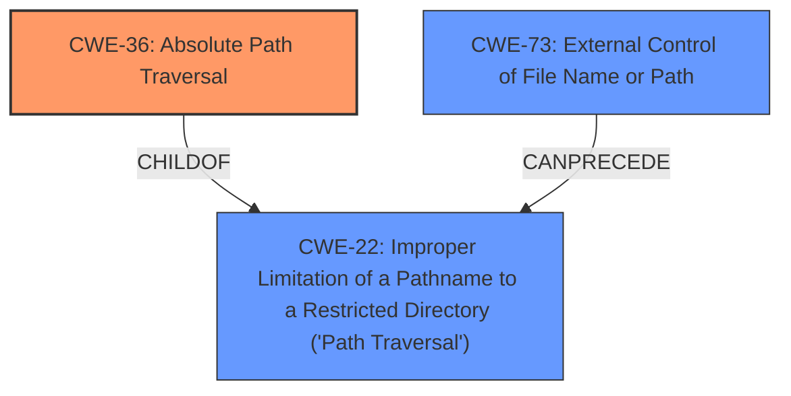

# Enhanced Analysis for CVE-2022-31539

# Summary
| CWE ID | CWE Name | Confidence | CWE Abstraction Level | CWE Vulnerability Mapping Label | CWE-Vulnerability Mapping Notes |
|---|---|---|---|---|---|
| CWE-36 | Absolute Path Traversal | 0.9 | Base | Allowed | Primary CWE |
| CWE-22 | Improper Limitation of a Pathname to a Restricted Directory ('Path Traversal') | 0.7 | Base | Allowed | Secondary Candidate |
| CWE-73 | External Control of File Name or Path | 0.6 | Base | Allowed | Secondary Candidate |

## Evidence and Confidence

*   **Confidence Score:** 0.8
*   **Evidence Strength:** HIGH

## Relationship Analysis
The primary weakness is `CWE-36` **Absolute Path Traversal**, which is a child of `CWE-22` **Improper Limitation of a Pathname to a Restricted Directory ('Path Traversal')**. `CWE-22` describes the general case of path traversal, while `CWE-36` is specific to absolute path traversal. `CWE-73` **External Control of File Name or Path** can precede `CWE-22` because external control of the file name or path can lead to path traversal if not properly validated. Choosing `CWE-36` is preferred because the vulnerability description specifically mentions **absolute path traversal**.



## Vulnerability Chain
The chain of events is:

1.  **External Control of File Name or Path** (`CWE-73`): User input controls the file path.
2.  **Absolute Path Traversal** (`CWE-36`): The application fails to properly sanitize or restrict the path, allowing absolute path traversal.
3.  **Improper Limitation of a Pathname to a Restricted Directory ('Path Traversal')** (`CWE-22`) The application does not properly limit the pathname to the restricted directory which can lead to arbitrary file access.

## Summary of Analysis
The initial analysis identified `CWE-36` **Absolute Path Traversal** as the primary weakness, supported by the vulnerability description explicitly mentioning **absolute path traversal** and the CVE Reference Links Content Summary describing the unsafe use of `flask.send_file` and `os.path.join` leading to path traversal. This is further supported by the retriever results which listed `CWE-36` with a high similarity score.

The relationship analysis clarifies that `CWE-36` is a more specific case of `CWE-22` **Improper Limitation of a Pathname to a Restricted Directory ('Path Traversal')**, and `CWE-73` **External Control of File Name or Path** can be a prerequisite for `CWE-22`.

The final decision to assign `CWE-36` as the primary CWE is based on the explicit mention of **absolute path traversal** in the vulnerability description and the function's behavior of accepting an absolute path. The evidence from the vulnerability description is: "The kotekan/kotekan repository through 2021.11 on GitHub allows **absolute path traversal** because the Flask send_file function is used unsafely."

The selection of `CWE-36` is at the optimal level of specificity because it directly describes the vulnerability, while `CWE-22` is more general.

**CWEs Considered But Not Used:**

*   `CWE-22`: While related, it's a more general case of path traversal. The description specifically mentions absolute path traversal, making `CWE-36` a more accurate fit.
*   `CWE-73`: While external control of the file name or path is a prerequisite, the core issue is the lack of proper validation of the absolute path, making `CWE-36` a more direct representation of the weakness.
*   `CWE-23`: This CWE is for Relative Path Traversal. The vulnerability is for Absolute Path Traversal.
*   `CWE-37`: This CWE is a variant of `CWE-36` but the description of the vulnerability does not specify the format '/absolute/pathname/here'.
*   `CWE-24`: This CWE is a variant of `CWE-23` for relative path traversal.
*   `CWE-59`: This CWE is for Improper Link Resolution Before File Access ('Link Following'). The vulnerability does not describe issues with links.
*   `CWE-38`: This CWE is a variant of `CWE-36` but the description of the vulnerability does not specify the format '\absolute\pathname\here'.
*   `CWE-182`: This CWE is for Collapse of Data into Unsafe Value. The vulnerability description does not discuss the filtering or collapsing of data.
*   `CWE-39`: This CWE is a variant of `CWE-36` but the description of the vulnerability does not specify the format 'C:dirname'.


## CWE Relationship Analysis

Current CWEs represent these abstraction levels: .


### Vulnerability Chain Analysis

**Chain starting from CWE-36:**
- 36 (Absolute Path Traversal) - ROOT


**Chain starting from CWE-24:**
- 24 (Path Traversal: '../filedir') - ROOT


### CWE Relationship Diagram

```mermaid
graph TD
    classDef primary fill:#f96,stroke:#333,stroke-width:2px
    classDef secondary fill:#69f,stroke:#333
    classDef tertiary fill:#9e9,stroke:#333
```