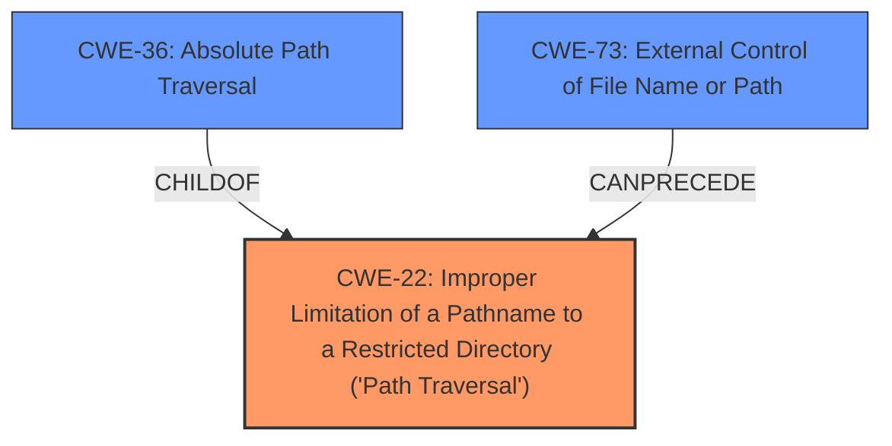

# Enhanced Analysis for CVE-2022-31540

# Summary
| CWE ID | CWE Name | Confidence | CWE Abstraction Level | CWE Vulnerability Mapping Label | CWE-Vulnerability Mapping Notes |
|---|---|---|---|---|---|
| CWE-22 | Improper Limitation of a Pathname to a Restricted Directory ('Path Traversal') | 1.0 | Base | Primary | Allowed |
| CWE-36 | Absolute Path Traversal | 0.75 | Base | Secondary | Allowed |
| CWE-73 | External Control of File Name or Path | 0.5 | Base | Secondary | Allowed |

## Evidence and Confidence

*   **Confidence Score:** 0.9
*   **Evidence Strength:** HIGH

## Relationship Analysis
The primary CWE is CWE-22, which represents the broader class of path traversal vulnerabilities. CWE-36 is a child of CWE-22, representing **absolute path traversal**, which is a specific case of path traversal. CWE-73 is related as it represents external control of a file name or path, a condition that often precedes path traversal vulnerabilities. The selection favors the base CWE-22 due to explicit evidence and references from the vulnerability description.mermaid



## Vulnerability Chain
The vulnerability chain starts with the unsafe use of the Flask `send_file` function, leading to an **improper limitation of pathname** to a restricted directory (**CWE-22**). An attacker can exploit this to achieve **absolute path traversal** to access sensitive data. The chain could also involve **external control of file name or path** (**CWE-73**) if the path is directly influenced by user input.

## Summary of Analysis
The initial assessment strongly points towards **CWE-22 (Improper Limitation of a Pathname to a Restricted Directory ('Path Traversal'))** as the primary weakness. The vulnerability description explicitly mentions "**absolute path traversal**" and the CVE Reference Links Content Summary section lists **CWE-22** as the weakness for all listed CVEs.

The description mentions that "the Flask send_file function is used unsafely". The CVE Reference Links Content Summary includes entries like:
```json
{
    "cve": "CVE-2022-31582",
    "root_cause": "The Flask send\_file function is used unsafely.",
    "weaknesses": [
      "CWE-22"
    ],
    "impact": "Absolute path traversal allows an attacker to access files and directories outside the web root folder, potentially exposing sensitive data.",
    "attack_vectors": [
      "Network"
    ],
    "attacker_capabilities": "No privileges or user interaction required"
  }
```
The retriever results also list CWE-22 as the top candidate.

CWE-36 (Absolute Path Traversal) is also considered, since the vulnerability description mentions "**absolute path traversal**". However, CWE-22 is a broader category that encompasses this type of traversal, and the CVE reference links specifically list CWE-22, therefore, CWE-22 is the better fit.

CWE-73 (External Control of File Name or Path) is a relevant factor, depending on the specific implementation. If the file path is directly controlled by user input, then CWE-73 would be applicable.

The selection of CWE-22 as the primary weakness is based on direct evidence from the vulnerability description and the provided CVE reference links. The graph relationships reinforce this choice by illustrating that CWE-36 is a specific type of CWE-22. The chosen CWEs are at the optimal level of specificity, with CWE-22 accurately representing the root cause and CWE-36 and CWE-73 highlighting contributing factors.
```


## CWE Relationship Analysis

Current CWEs represent these abstraction levels: .


### Vulnerability Chain Analysis

**Chain starting from CWE-22:**
- 22 (Improper Limitation of a Pathname to a Restricted Directory ('Path Traversal')) - ROOT


**Chain starting from CWE-73:**
- 73 (External Control of File Name or Path) - ROOT


### CWE Relationship Diagram

```mermaid
graph TD
    classDef primary fill:#f96,stroke:#333,stroke-width:2px
    classDef secondary fill:#69f,stroke:#333
    classDef tertiary fill:#9e9,stroke:#333
```