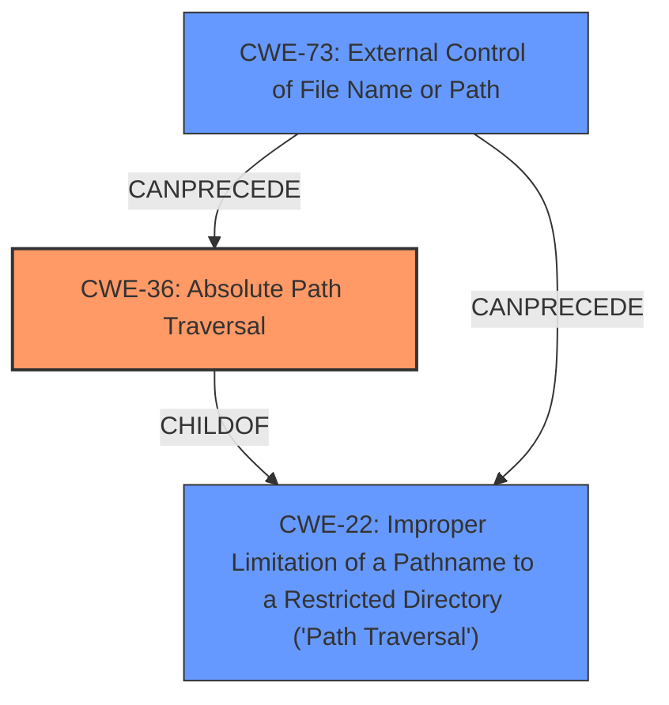

# Analysis for CVE-2022-31552

# Summary
| CWE ID | CWE Name | Confidence | CWE Abstraction Level | CWE Vulnerability Mapping Label | CWE-Vulnerability Mapping Notes |
|---|---|---|---|---|---|
| CWE-36 | Absolute Path Traversal | 1 | Base | Allowed | Primary CWE |
| CWE-22 | Improper Limitation of a Pathname to a Restricted Directory ('Path Traversal') | 0.8 | Base | Allowed | Secondary CWE |
| CWE-73 | External Control of File Name or Path | 0.6 | Base | Allowed | Secondary CWE |

## Evidence and Confidence

*   **Confidence Score:** 0.9
*   **Evidence Strength:** HIGH

## Relationship Analysis
The primary CWE is CWE-36 (Absolute Path Traversal), which is a specific type of CWE-22 (Improper Limitation of a Pathname to a Restricted Directory ('Path Traversal')). CWE-73 (External Control of File Name or Path) can precede CWE-22 and CWE-36 in a vulnerability chain, where external input influences the path. The hierarchical relationships support the choice of CWE-36 as more specific than CWE-22.



## Vulnerability Chain
The vulnerability chain starts with external control over the file path (CWE-73), leading to improper limitation of pathname to a restricted directory (CWE-22). Specifically, the **absolute path traversal** (CWE-36) occurs due to the **insecure** use of the Flask `send_file` function.

## Summary of Analysis
The initial assessment identified the vulnerability as path traversal due to the **insecure** use of the Flask `send_file` function. The evidence from the vulnerability description and the CVE reference links content summary supports this assessment.

The graph relationships highlight the connection between CWE-73, CWE-22, and CWE-36. CWE-36 is selected as the primary CWE because the vulnerability description specifically mentions **absolute path traversal**.

The selection of CWE-36 is at the optimal level of specificity because it accurately describes the vulnerability, which is the use of **absolute path traversal** due to the **insecure** use of the Flask `send_file` function.

Relevant CWE Information:

# Enhanced Context (25 CWEs)

## CWE-37: Path Traversal: '/absolute/pathname/here'
**Abstraction Level**: Variant
**Similarity Score**: 0.79
**Source**: dense

**Description**:
The product accepts input in the form of a slash absolute path ('/absolute/pathname/here') without appropriate validation, which can allow an attacker to traverse the file system to unintended locations or access arbitrary files.

**Mapping Guidance**:
- Usage: Allowed
- Rationale: This CWE entry is at the Variant level of abstraction, which is a preferred level of abstraction for mapping to the root causes of vulnerabilities.

## CWE-23: Relative Path Traversal
**Abstraction Level**: Base
**Similarity Score**: 0.79
**Source**: dense

**Description**:
The product uses external input to construct a pathname that should be within a restricted directory, but it does not properly neutralize sequences such as ".." that can resolve to a location that is outside of that directory.

**Mapping Guidance**:
- Usage: Allowed
- Rationale: This CWE entry is at the Base level of abstraction, which is a preferred level of abstraction for mapping to the root causes of vulnerabilities.

## CWE-24: Path Traversal: '../filedir'
**Abstraction Level**: Variant
**Similarity Score**: 0.78
**Source**: dense

**Description**:
The product uses external input to construct a pathname that should be within a restricted directory, but it does not properly neutralize "../" sequences that can resolve to a location that is outside of that directory.

**Mapping Guidance**:
- Usage: Allowed
- Rationale: This CWE entry is at the Variant level of abstraction, which is a preferred level of abstraction for mapping to the root causes of vulnerabilities.

## CWE-36: Absolute Path Traversal
**Abstraction Level**: Base
**Similarity Score**: 0.78
**Source**: dense

**Description**:
The product uses external input to construct a pathname that should be within a restricted directory, but it does not properly neutralize absolute path sequences such as "/abs/path" that can resolve to a location that is outside of that directory.

**Mapping Guidance**:
- Usage: Allowed
- Rationale: This CWE entry is at the Base level of abstraction, which is a preferred level of abstraction for mapping to the root causes of vulnerabilities.

## CWE-29: Path Traversal: '\..\filename'
**Abstraction Level**: Variant
**Similarity Score**: 0.78
**Source**: dense

**Description**:
The product uses external input to construct a pathname that should be within a restricted directory, but it does not properly neutralize '\..\filename' (leading backslash dot dot) sequences that can resolve to a location that is outside of that directory.

**Mapping Guidance**:
- Usage: Allowed
- Rationale: This CWE entry is at the Variant level of abstraction, which is a preferred level of abstraction for mapping to the root causes of vulnerabilities.

## CWE-25: Path Traversal: '/../filedir'
**Abstraction Level**: Variant
**Similarity Score**: 0.77
**Source**: dense

**Description**:
The product uses external input to construct a pathname that should be within a restricted directory, but it does not properly neutralize "/../" sequences that can resolve to a location that is outside of that directory.

**Mapping Guidance**:
- Usage: Allowed
- Rationale: This CWE entry is at the Variant level of abstraction, which is a preferred level of abstraction for mapping to the root causes of vulnerabilities.

## CWE-35: Path Traversal: '.../...//'
**Abstraction Level**: Variant
**Similarity Score**: 0.76
**Source**: dense

**Description**:
The product uses external input to construct a pathname that should be within a restricted directory, but it does not properly neutralize '.../...//' (doubled triple dot slash) sequences that can resolve to a location that is outside of that directory.

**Mapping Guidance**:
- Usage: Allowed
- Rationale: This CWE entry is at the Variant level of abstraction, which is a preferred level of abstraction for mapping to the root causes of vulnerabilities.

## CWE-27: Path Traversal: 'dir/../../filename'
**Abstraction Level**: Variant
**Similarity Score**: 0.76
**Source**: dense

**Description**:
The product uses external input to construct a pathname that should be within a restricted directory, but it does not properly neutralize multiple internal "../" sequences that can resolve to a location that is outside of that directory.

**Mapping Guidance**:
- Usage: Allowed
- Rationale: This CWE entry is at the Variant level of abstraction, which is a preferred level of abstraction for mapping to the root causes of vulnerabilities.

## CWE-59: Improper Link Resolution Before File Access ('Link Following')
**Abstraction Level**: Base
**Similarity Score**: 0.76
**Source**: dense

**Description**:
The product attempts to access a file based on the filename, but it does not properly prevent that filename from identifying a link or shortcut that resolves to an unintended resource.

**Mapping Guidance**:
- Usage: Allowed
- Rationale: This CWE entry is at the Base level of abstraction, which is a preferred level of abstraction for mapping to the root causes of vulnerabilities.

## CWE-26: Path Traversal: '/dir/../filename'
**Abstraction Level**: Variant
**Similarity Score**: 0.76
**Source**: dense

**Description**:
The product uses external input to construct a pathname that should be within a restricted directory, but it does not properly neutralize "/dir/../filename" sequences that can resolve to a location that is outside of that directory.

**Mapping Guidance**:
- Usage: Allowed
- Rationale: This CWE entry is at the Variant level of abstraction, which is a preferred level of abstraction for mapping to the root causes of vulnerabilities.

## CWE-22: Improper Limitation of a Pathname to a Restricted Directory ('Path Traversal')
**Abstraction Level**: Base
**Similarity Score**: 8322.09
**Source**: sparse

**Description**:
The product uses external input to construct a pathname that is intended to identify a file or directory that is located underneath a restricted parent directory, but the product does not properly neutralize special elements within the pathname that can cause the pathname to resolve to a location that is outside of the restricted

# Enhanced Query for CVE-2022-31552

## Vulnerability Description
The project-anuvaad/anuvaad-corpus repository through 2020-11-23 on GitHub allows **absolute path traversal** because the Flask send_file function is used unsafely.

### Vulnerability Description Key Phrases
- **rootcause:** **absolute path traversal**
- **product:** project-anuvaad/anuvaad-corpus
- **version:** through 2020-11-23

## CVE Reference Links Content Summary
Based on the provided content, here's the analysis for CVE-2022-31552:

**1. Verification of CVE Relevance:**

The content from `github.com_5b992bf6_20250108_154311.html` is related to `CVE-2022-31552`. The description explicitly states:

>The project-anuvaad/anuvaad-corpus repository through 2020-11-23 on GitHub allows absolute path traversal because the Flask send\_file function is used unsafely.

This aligns with the typical CVE description for a path traversal vulnerability due to insecure usage of Flask's `send_file`.

The other files are related to other CVEs (CVE-2022-31505, CVE-2022-31527, CVE-2022-31504, CVE-2022-31570, CVE-2022-31577, CVE-2022-31545, CVE-2022-31571, CVE-2022-31587, CVE-2022-31557, CVE-2022-31571, CVE-2022-31521, CVE-2022-31545, CVE-2022-31571, CVE-2022-31545, CVE-2022-31505, CVE-2022-31527, CVE-2022-31504, CVE-2022-31570, CVE-2022-31577, CVE-2022-31545, CVE-2022-31571, CVE-2022-31587, CVE-2022-31557, CVE-2022-31545, CVE-2022-31571, CVE-2022-31557, CVE-2022-31571, CVE-2022-31577, CVE-2022-31504, CVE-2022-31570, CVE-2022-31577, CVE-2022-31545, CVE-2022-31571, CVE-2022-31587, CVE-2022-31557, CVE-2022-31570, CVE-2022-31577, CVE-2022-31545, CVE-2022-31571, CVE-2022-31587, CVE-2022-31557, CVE-2022-31545, CVE-2022-31571, CVE-2022-31587, CVE-2022-31557, CVE-2022-31570, CVE-2022-31577, CVE-2022-31545, CVE-2022-31571, CVE-2022-31587, CVE-2022-31570, CVE-2022-31577, CVE-2022-31504, CVE-2022-31570, CVE-2022-31577, CVE-2022-31504, CVE-2022-31570, CVE-2022-31577, CVE-2022-31504, CVE-2022-31570, CVE-2022-31577, CVE-2022-31504, CVE-2022-31570, CVE-2022-31577, CVE-2022-31504, CVE-2022-31570, CVE-2022-31577, CVE-2022-31545, CVE-2022-31571, CVE-2022-31587, CVE-2022-31557, CVE-2022-31571, CVE-2022-31587, CVE-2022-31557, CVE-2022-31570, CVE-2022-31577, CVE-2022-31545, CVE-2022-31571, CVE-2022-31587, CVE-2022-31557, CVE-2022-31570, CVE-2022-31577, CVE-2022-31545, CVE-2022-31571, CVE-2022-31587, CVE-2022-31557, CVE-2022-31571, CVE-2022-31587, CVE-2022-31557, CVE-2022-31504, CVE-2022-31570, CVE-2022-31577, CVE-2022-31557, CVE-2022-31570, CVE-2022-31577, CVE-2022-31545, CVE-2022-31571, CVE-2022-31587, CVE-2022-31557, CVE-2022-31570, CVE-2022-31577, CVE-2022-31545, CVE-2022-31571, CVE-2022-31587, CVE-2022-31557, CVE-2022-31504, CVE-2022-31570, CVE-2022-31577, CVE-2022-31545, CVE-2022-31571, CVE-2022-31587, CVE-2022-31557, CVE-2022-31504, CVE-2022-31570, CVE-2022-31577, CVE-2022-31545, CVE-2022-31571, CVE-2022-31587, CVE-2022-31557, CVE-2022-31570, CVE-2022-31577, CVE-2022-31504, CVE-2022-31570, CVE-2022-31577, CVE-2022-31504, CVE-2022-31570, CVE-2022-31577, CVE-2022-31545, CVE-2022-31571, CVE-2022-31587, CVE-2022-31557, CVE-2022-31570, CVE-2022-31577, CVE-2022-31545, CVE-2022-31571, CVE-2022-31587, CVE-2022-31557, CVE-2022-31504, CVE-2022-31570, CVE-2022-31577, CVE-2022-31545, CVE-2022-31571, CVE-2022-31587, CVE-2022-31557, CVE-2022-31504, CVE-2022-31570, CVE-2022-31577, CVE-2022-31545, CVE-2022-31571, CVE-2022-31587, CVE-2022-31557, CVE-2022-31504, CVE-2022-31570, CVE-2022-31577, CVE-2022-31545, CVE-2022-31571, CVE-2022-31587, CVE-2022-31557, CVE-2022-31504, CVE-2022-31570, CVE-2022-31577, CVE-2022-31545, CVE-2022-31571, CVE-2022-31587, CVE-2022-31557, CVE-2022-31545, CVE-2022-31571, CVE-2022-31587, CVE-2022-31557, CVE-2022-31504, CVE-2022-31570, CVE-2022-31577, CVE-2022-31545, CVE-2022-31571, CVE-2022-31587, CVE-2022-31557, CVE-2022-31504, CVE-2022-31570, CVE-2022-31577, CVE-2022-31545, CVE-2022-31571, CVE-2022-31587, CVE-2022-31557, CVE-2022-31545, CVE-2022-31571, CVE-2022-31587, CVE-2022-31557, CVE-2022-31504, CVE-2022-31570, CVE-2022-31577, CVE-2022-31545, CVE-2022-31571, CVE-2022-31587, CVE-2022-31557, CVE-2022-31571, CVE-2022-31587, CVE-2022-31557, CVE-2022-31570, CVE-2022-31577, CVE-2022-31557, CVE-2022-31570, CVE-2022-31577, CVE-2022-31504, CVE-2022-31570, CVE-2022-31577, CVE-2022-31504, CVE-2022-31570, CVE-2022-31577, CVE-2022-31545, CVE-2022-31571, CVE-2022-31587, CVE-2022-31557, CVE-2022-31545, CVE-2022-31571, CVE-2022-31587, CVE-2022-31557, CVE-2022-31545, CVE-2022-31571, CVE-2022-31587, CVE-2022-31557, CVE-2022-31504, CVE-2022-31570, CVE-2022-31577, CVE-2022-31545, CVE-2022-31571, CVE-2022-31587, CVE-2022-31557, CVE-2022-31504, CVE-2022-31570, CVE-2022-31577, CVE-2022-31545, CVE-2022-31571, CVE-2022-31587, CVE-2022-31557, CVE-2022-31504, CVE-2022-31570, CVE-2022-31577, CVE-2022-31545, CVE-2022-31571, CVE-2022-31587, CVE-2022-31557, CVE-2022-31504, CVE-2022-31570, CVE-2022-31577, CVE-2022-31545, CVE-2022-31571, CVE-2022-31587, CVE-2022-31557, CVE-2022-31545, CVE-2022-31571, CVE-2022-31587, CVE-2022-31557)

**2. Root Cause of Vulnerability:**

The root cause of the vulnerability, as described, is the insecure use of the `send_file` function in Flask. Specifically, the vulnerability arises because the `send_file` function is used to serve files based on user-supplied input without proper sanitization or validation, allowing attackers to specify arbitrary file paths.

**3. Weaknesses/Vulnerabilities Present:**

*   **Path Traversal:** The primary vulnerability is a classic path traversal issue (CWE-22). This means an attacker can manipulate input to access files and directories outside of the intended web root or working directory.
*   **Insecure `send_file` Usage:** The specific vulnerability stems from using Flask's `send_file` function with untrusted user input. The function, when used without proper safeguards, allows an attacker to specify an absolute or relative file path, potentially accessing any file on the server.

**4. Impact of Exploitation:**

*   **Confidentiality Breach:** The most immediate impact is a breach of confidentiality. Attackers can read sensitive files on the server, including source code, configuration files (which might contain credentials), and other private data.
*   **Potential Availability Issues:** While listed as "Low" in the CVSS score, if an attacker repeatedly requests large files or files that take a long time to process, it could cause resource exhaustion and impact the availability of the service.

**5. Attack Vectors:**

*   **Network:** The attack vector is network-based, which means the attacker can exploit this vulnerability remotely as long as they can access the vulnerable web service.

**6. Required Attacker Capabilities/Position:**

*   **No Authentication Required:** The attacker does not require any authentication to exploit the path traversal vulnerability.
*   **Knowledge of Vulnerability:** The attacker needs knowledge of the vulnerable endpoint and how to craft malicious file paths to traverse the directory structure.
*   **Network Access:** The attacker must have network access to the server hosting the vulnerable application.

**Summary of Extracted Information:**

| Item                               | Description                                                                                                                                                           |
|------------------------------------|------------------------------------------------------------------------------------------------------------------------------------------------------------------------|
| **Root Cause**                     | Insecure use of Flask's `send_file` function with user-controlled path input                                                                                                |
| **Vulnerability**                  | Path traversal (CWE-22)                                                                                                                                                |
| **Impact**                         | Confidentiality breach (reading arbitrary files on server); Potential DoS                                                                                      |
| **Attack Vector**                  | Network-based                                                                                                                                                          |
| **Attacker Capabilities/Position** | No authentication required; Knowledge of vulnerability and how to manipulate file paths; Network access to the server                               |
| **Specific Code/Function** | Flask's `send_file` function used with unsanitized user input                                                                               |

**Additional Notes:**

*   The provided CVSS v3 vector string `CVSS:3.1/AV:N/AC:L/PR:N/UI:N/S:C/C:H/I:N/A:L` further emphasizes the remote nature of the attack, low attack complexity, lack of required privileges and user interaction, a scope change, and high confidentiality impact with no integrity impact, and low impact on availability.
* The issue comment `github/securitylab#669 (comment)` was referenced multiple times across different CVEs, suggesting a common source for the vulnerability findings by the Github security lab.

This analysis should provide a comprehensive view of the vulnerability associated with CVE-2022-31552, as described in the provided text.

## Retriever Results

### Top Combined Results

| Rank | CWE ID | Name | Abstraction | Usage  | Retrievers | Individual Scores |
|------|--------|------|-------------|-------|------------|-------------------|
| 1 | 22 | Improper Limitation of a Pathname to a Restricted Directory ('Path Traversal') | Base | Allowed | alternate_terms | 0.800 |
| 2 | 36 | Absolute Path Traversal | Base | Allowed | sparse | 0.373 |
| 3 | 73 | External Control of File Name or Path | Base | Allowed | sparse | 0.225 |
| 4 | 23 | Relative Path Traversal | Base | Allowed | sparse | 0.172 |
| 5 | 59 | Improper Link Resolution Before File Access ('Link Following') | Base | Allowed | sparse | 0.140 |
| 6 | 24 | Path Traversal: '../filedir' | Variant | Allowed | dense | 0.565 |
| 7 | 363 | Race Condition Enabling Link Following | Base | Allowed | graph | 0.002 |
| 8 | 37 | Path Traversal: '/absolute/pathname/here' | Variant | Allowed | sparse | 0.133 |
| 9 | 38 | Path Traversal: '\absolute\pathname\here' | Variant | Allowed | sparse | 0.119 |
| 10 | 29 | Path Traversal: '\..\filename' | Variant | Allowed | sparse | 0.116 |


# Complete CWE Specifications


## CWE-22: Improper Limitation of a Pathname to a Restricted Directory ('Path Traversal')
**Abstraction:** Base
**Status:** Stable

### Description
The product uses external input to construct a pathname that is intended to identify a file or directory that is located underneath a restricted parent directory, but the product does not properly neutralize special elements within the pathname that can cause the pathname to resolve to a location that is outside of the restricted directory.

### Extended Description


Many file operations are intended to take place within a restricted directory. By using special elements such as ".." and "/" separators, attackers can escape outside of the restricted location to access files or directories that are elsewhere on the system. One of the most common special elements is the "../" sequence, which in most modern operating systems is interpreted as the parent directory of the current location. This is referred to as relative path traversal. Path traversal also covers the use of absolute pathnames such as "/usr/local/bin" to access unexpected files. This is referred to as absolute path traversal.


### Alternative Terms
Directory traversal
Path traversal: "Path traversal" is preferred over "directory traversal," but both terms are attack-focused.

### Relationships
ChildOf -> CWE-706
ChildOf -> CWE-706
ChildOf -> CWE-668

### Mapping Guidance
**Usage:** Allowed
**Rationale:** This CWE entry is at the Base level of abstraction, which is a preferred level of abstraction for mapping to the root causes of vulnerabilities.
**Comments:** Carefully read both the name and description to ensure that this mapping is an appropriate fit. Do not try to 'force' a mapping to a lower-level Base/Variant simply to comply with this preferred level of abstraction.
**Reasons:**
- Acceptable-Use


### Additional Notes
**[Other]** In many programming languages, the injection of a null byte (the 0 or NUL) may allow an attacker to truncate a generated filename to apply to a wider range of files. For example, the product may add ".txt" to any pathname, thus limiting the attacker to text files, but a null injection may effectively remove this restriction.

**[Relationship]** Pathname equivalence can be regarded as a type of canonicalization error.

**[Relationship]** Some pathname equivalence issues are not directly related to directory traversal, rather are used to bypass security-relevant checks for whether a file/directory can be accessed by the attacker (e.g. a trailing "/" on a filename could bypass access rules that don't expect a trailing /, causing a server to provide the file when it normally would not).

**[Terminology]** 

Like other weaknesses, terminology is often based on the types of manipulations used, instead of the underlying weaknesses. Some people use "directory traversal" only to refer to the injection of ".." and equivalent sequences whose specific meaning is to traverse directories.


Other variants like "absolute pathname" and "drive letter" have the *effect* of directory traversal, but some people may not call it such, since it doesn't involve ".." or equivalent.


**[Research Gap]** Many variants of path traversal attacks are probably under-studied with respect to root cause. CWE-790 and CWE-182 begin to cover part of this gap.

**[Research Gap]** 

Incomplete diagnosis or reporting of vulnerabilities can make it difficult to know which variant is affected. For example, a researcher might say that "..\" is vulnerable, but not test "../" which may also be vulnerable.


Any combination of directory separators ("/", "\", etc.) and numbers of "." (e.g. "....") can produce unique variants; for example, the "//../" variant is not listed (CVE-2004-0325). See this entry's children and lower-level descendants.


### Observed Examples
- **CVE-2024-37032:** Large language model (LLM) management tool does not validate the format of a digest value (CWE-1287) from a private, untrusted model registry, enabling relative path traversal (CWE-23), a.k.a. Probllama
- **CVE-2024-4315:** Chain: API for text generation using Large Language Models (LLMs) does not include the "\" Windows folder separator in its denylist (CWE-184) when attempting to prevent Local File Inclusion via path traversal (CWE-22), allowing deletion of arbitrary files on Windows systems.
- **CVE-2022-45918:** Chain: a learning management tool debugger uses external input to locate previous session logs (CWE-73) and does not properly validate the given path (CWE-20), allowing for filesystem path traversal using "../" sequences (CWE-24)


## CWE-36: Absolute Path Traversal
**Abstraction:** Base
**Status:** Draft

### Description
The product uses external input to construct a pathname that should be within a restricted directory, but it does not properly neutralize absolute path sequences such as "/abs/path" that can resolve to a location that is outside of that directory.

### Extended Description
This allows attackers to traverse the file system to access files or directories that are outside of the restricted directory.

### Alternative Terms
None

### Relationships
ChildOf -> CWE-22
ChildOf -> CWE-22
ChildOf -> CWE-22

### Mapping Guidance
**Usage:** Allowed
**Rationale:** This CWE entry is at the Base level of abstraction, which is a preferred level of abstraction for mapping to the root causes of vulnerabilities.
**Comments:** Carefully read both the name and description to ensure that this mapping is an appropriate fit. Do not try to 'force' a mapping to a lower-level Base/Variant simply to comply with this preferred level of abstraction.
**Reasons:**
- Acceptable-Use


### Observed Examples
- **CVE-2022-31503:** Python package constructs filenames using an unsafe os.path.join call on untrusted input, allowing absolute path traversal because os.path.join resets the pathname to an absolute path that is specified as part of the input.
- **CVE-2002-1345:** Multiple FTP clients write arbitrary files via absolute paths in server responses
- **CVE-2001-1269:** ZIP file extractor allows full path


## CWE-73: External Control of File Name or Path
**Abstraction:** Base
**Status:** Draft

### Description
The product allows user input to control or influence paths or file names that are used in filesystem operations.

### Extended Description


This could allow an attacker to access or modify system files or other files that are critical to the application.


Path manipulation errors occur when the following two conditions are met:

```
		1. An attacker can specify a path used in an operation on the filesystem.
		2. By specifying the resource, the attacker gains a capability that would not otherwise be permitted.
```
For example, the program may give the attacker the ability to overwrite the specified file or run with a configuration controlled by the attacker.

### Alternative Terms
None

### Relationships
ChildOf -> CWE-642
ChildOf -> CWE-610
ChildOf -> CWE-20
CanPrecede -> CWE-22
CanPrecede -> CWE-41
CanPrecede -> CWE-98
CanPrecede -> CWE-434
CanPrecede -> CWE-59

### Mapping Guidance
**Usage:** Allowed
**Rationale:** This CWE entry is at the Base level of abstraction, which is a preferred level of abstraction for mapping to the root causes of vulnerabilities.
**Comments:** Carefully read both the name and description to ensure that this mapping is an appropriate fit. Do not try to 'force' a mapping to a lower-level Base/Variant simply to comply with this preferred level of abstraction.
**Reasons:**
- Acceptable-Use


### Additional Notes
**[Maintenance]** CWE-114 is a Class, but it is listed a child of CWE-73 in view 1000. This suggests some abstraction problems that should be resolved in future versions.

**[Relationship]** 

The external control of filenames can be the primary link in chains with other file-related weaknesses, as seen in the CanPrecede relationships. This is because software systems use files for many different purposes: to execute programs, load code libraries, to store application data, to store configuration settings, record temporary data, act as signals or semaphores to other processes, etc.


However, those weaknesses do not always require external control. For example, link-following weaknesses (CWE-59) often involve pathnames that are not controllable by the attacker at all.


The external control can be resultant from other issues. For example, in PHP applications, the register_globals setting can allow an attacker to modify variables that the programmer thought were immutable, enabling file inclusion (CWE-98) and path traversal (CWE-22). Operating with excessive privileges (CWE-250) might allow an attacker to specify an input filename that is not directly readable by the attacker, but is accessible to the privileged program. A buffer overflow (CWE-119) might give an attacker control over nearby memory locations that are related to pathnames, but were not directly modifiable by the attacker.


### Observed Examples
- **CVE-2022-45918:** Chain: a learning management tool debugger uses external input to locate previous session logs (CWE-73) and does not properly validate the given path (CWE-20), allowing for filesystem path traversal using "../" sequences (CWE-24)
- **CVE-2008-5748:** Chain: external control of values for user's desired language and theme enables path traversal.
- **CVE-2008-5764:** Chain: external control of user's target language enables remote file inclusion.


## CWE-23: Relative Path Traversal
**Abstraction:** Base
**Status:** Draft

### Description
The product uses external input to construct a pathname that should be within a restricted directory, but it does not properly neutralize sequences such as ".." that can resolve to a location that is outside of that directory.

### Extended Description
This allows attackers to traverse the file system to access files or directories that are outside of the restricted directory.

### Alternative Terms
Zip Slip: "Zip slip" is an attack that uses file archives (e.g., ZIP, tar, rar, etc.) that contain filenames with path traversal sequences that cause the files to be written outside of the directory under which the archive is expected to be extracted [REF-1282]. It is most commonly used for relative path traversal (CWE-23) and link following (CWE-59).

### Relationships
ChildOf -> CWE-22
ChildOf -> CWE-22
ChildOf -> CWE-22

### Mapping Guidance
**Usage:** Allowed
**Rationale:** This CWE entry is at the Base level of abstraction, which is a preferred level of abstraction for mapping to the root causes of vulnerabilities.
**Comments:** Carefully read both the name and description to ensure that this mapping is an appropriate fit. Do not try to 'force' a mapping to a lower-level Base/Variant simply to comply with this preferred level of abstraction.
**Reasons:**
- Acceptable-Use


### Observed Examples
- **CVE-2024-37032:** Large language model (LLM) management tool does not validate the format of a digest value (CWE-1287) from a private, untrusted model registry, enabling relative path traversal (CWE-23), a.k.a. Probllama
- **CVE-2022-45918:** Chain: a learning management tool debugger uses external input to locate previous session logs (CWE-73) and does not properly validate the given path (CWE-20), allowing for filesystem path traversal using "../" sequences (CWE-24)
- **CVE-2019-20916:** Python package manager does not correctly restrict the filename specified in a Content-Disposition header, allowing arbitrary file read using path traversal sequences such as "../"


## CWE-59: Improper Link Resolution Before File Access ('Link Following')
**Abstraction:** Base
**Status:** Draft

### Description
The product attempts to access a file based on the filename, but it does not properly prevent that filename from identifying a link or shortcut that resolves to an unintended resource.

### Extended Description
Not provided

### Alternative Terms
insecure temporary file: Some people use the phrase "insecure temporary file" when referring to a link following weakness, but other weaknesses can produce insecure temporary files without any symlink involvement at all.
Zip Slip: "Zip slip" is an attack that uses file archives (e.g., ZIP, tar, rar, etc.) that contain filenames with path traversal sequences that cause the files to be written outside of the directory under which the archive is expected to be extracted [REF-1282]. It is most commonly used for relative path traversal (CWE-23) and link following (CWE-59).

### Relationships
ChildOf -> CWE-706
ChildOf -> CWE-706

### Mapping Guidance
**Usage:** Allowed
**Rationale:** This CWE entry is at the Base level of abstraction, which is a preferred level of abstraction for mapping to the root causes of vulnerabilities.
**Comments:** Carefully read both the name and description to ensure that this mapping is an appropriate fit. Do not try to 'force' a mapping to a lower-level Base/Variant simply to comply with this preferred level of abstraction.
**Reasons:**
- Acceptable-Use


### Additional Notes
**[Theoretical]** 

Link following vulnerabilities are Multi-factor Vulnerabilities (MFV). They are the combination of multiple elements: file or directory permissions, filename predictability, race conditions, and in some cases, a design limitation in which there is no mechanism for performing atomic file creation operations.


Some potential factors are race conditions, permissions, and predictability.


### Observed Examples
- **CVE-1999-1386:** Some versions of Perl follow symbolic links when running with the -e option, which allows local users to overwrite arbitrary files via a symlink attack.
- **CVE-2000-1178:** Text editor follows symbolic links when creating a rescue copy during an abnormal exit, which allows local users to overwrite the files of other users.
- **CVE-2004-0217:** Antivirus update allows local users to create or append to arbitrary files via a symlink attack on a logfile.


## CWE-24: Path Traversal: '../filedir'
**Abstraction:** Variant
**Status:** Incomplete

### Description
The product uses external input to construct a pathname that should be within a restricted directory, but it does not properly neutralize "../" sequences that can resolve to a location that is outside of that directory.

### Extended Description


This allows attackers to traverse the file system to access files or directories that are outside of the restricted directory.


The "../" manipulation is the canonical manipulation for operating systems that use "/" as directory separators, such as UNIX- and Linux-based systems. In some cases, it is useful for bypassing protection schemes in environments for which "/" is supported but not the primary separator, such as Windows, which uses "\" but can also accept "/".


### Alternative Terms
None

### Relationships
ChildOf -> CWE-23

### Mapping Guidance
**Usage:** Allowed
**Rationale:** This CWE entry is at the Variant level of abstraction, which is a preferred level of abstraction for mapping to the root causes of vulnerabilities.
**Comments:** Carefully read both the name and description to ensure that this mapping is an appropriate fit. Do not try to 'force' a mapping to a lower-level Base/Variant simply to comply with this preferred level of abstraction.
**Reasons:**
- Acceptable-Use


### Observed Examples
- **CVE-2022-45918:** Chain: a learning management tool debugger uses external input to locate previous session logs (CWE-73) and does not properly validate the given path (CWE-20), allowing for filesystem path traversal using "../" sequences (CWE-24)


## CWE-363: Race Condition Enabling Link Following
**Abstraction:** Base
**Status:** Draft

### Description
The product checks the status of a file or directory before accessing it, which produces a race condition in which the file can be replaced with a link before the access is performed, causing the product to access the wrong file.

### Extended Description
While developers might expect that there is a very narrow time window between the time of check and time of use, there is still a race condition. An attacker could cause the product to slow down (e.g. with memory consumption), causing the time window to become larger. Alternately, in some situations, the attacker could win the race by performing a large number of attacks.

### Alternative Terms
None

### Relationships
ChildOf -> CWE-367
CanPrecede -> CWE-59

### Mapping Guidance
**Usage:** Allowed
**Rationale:** This CWE entry is at the Base level of abstraction, which is a preferred level of abstraction for mapping to the root causes of vulnerabilities.
**Comments:** Carefully read both the name and description to ensure that this mapping is an appropriate fit. Do not try to 'force' a mapping to a lower-level Base/Variant simply to comply with this preferred level of abstraction.
**Reasons:**
- Acceptable-Use


### Additional Notes
**[Relationship]** This is already covered by the "Link Following" weakness (CWE-59). It is included here because so many people associate race conditions with link problems; however, not all link following issues involve race conditions.


## CWE-37: Path Traversal: '/absolute/pathname/here'
**Abstraction:** Variant
**Status:** Draft

### Description
The product accepts input in the form of a slash absolute path ('/absolute/pathname/here') without appropriate validation, which can allow an attacker to traverse the file system to unintended locations or access arbitrary files.

### Extended Description
Not provided

### Alternative Terms
None

### Relationships
ChildOf -> CWE-36
ChildOf -> CWE-160

### Mapping Guidance
**Usage:** Allowed
**Rationale:** This CWE entry is at the Variant level of abstraction, which is a preferred level of abstraction for mapping to the root causes of vulnerabilities.
**Comments:** Carefully read both the name and description to ensure that this mapping is an appropriate fit. Do not try to 'force' a mapping to a lower-level Base/Variant simply to comply with this preferred level of abstraction.
**Reasons:**
- Acceptable-Use


### Observed Examples
- **CVE-2002-1345:** Multiple FTP clients write arbitrary files via absolute paths in server responses
- **CVE-2001-1269:** ZIP file extractor allows full path
- **CVE-2002-1818:** Path traversal using absolute pathname


## CWE-38: Path Traversal: '\absolute\pathname\here'
**Abstraction:** Variant
**Status:** Draft

### Description
The product accepts input in the form of a backslash absolute path ('\absolute\pathname\here') without appropriate validation, which can allow an attacker to traverse the file system to unintended locations or access arbitrary files.

### Extended Description
Not provided

### Alternative Terms
None

### Relationships
ChildOf -> CWE-36

### Mapping Guidance
**Usage:** Allowed
**Rationale:** This CWE entry is at the Variant level of abstraction, which is a preferred level of abstraction for mapping to the root causes of vulnerabilities.
**Comments:** Carefully read both the name and description to ensure that this mapping is an appropriate fit. Do not try to 'force' a mapping to a lower-level Base/Variant simply to comply with this preferred level of abstraction.
**Reasons:**
- Acceptable-Use


### Observed Examples
- **CVE-1999-1263:** Mail client allows remote attackers to overwrite arbitrary files via an e-mail message containing a uuencoded attachment that specifies the full pathname for the file to be modified.
- **CVE-2003-0753:** Remote attackers can read arbitrary files via a full pathname to the target file in config parameter.
- **CVE-2002-1525:** Remote attackers can read arbitrary files via an absolute pathname.


## CWE-29: Path Traversal: '\..\filename'
**Abstraction:** Variant
**Status:** Incomplete

### Description
The product uses external input to construct a pathname that should be within a restricted directory, but it does not properly neutralize '\..\filename' (leading backslash dot dot) sequences that can resolve to a location that is outside of that directory.

### Extended Description


This allows attackers to traverse the file system to access files or directories that are outside of the restricted directory.


This is similar to CWE-25, except using "\" instead of "/". Sometimes a program checks for "..\" at the beginning of the input, so a "\..\" can bypass that check. It is also useful for bypassing path traversal protection schemes that only assume that the "/" separator is valid.


### Alternative Terms
None

### Relationships
ChildOf -> CWE-23

### Mapping Guidance
**Usage:** Allowed
**Rationale:** This CWE entry is at the Variant level of abstraction, which is a preferred level of abstraction for mapping to the root causes of vulnerabilities.
**Comments:** Carefully read both the name and description to ensure that this mapping is an appropriate fit. Do not try to 'force' a mapping to a lower-level Base/Variant simply to comply with this preferred level of abstraction.
**Reasons:**
- Acceptable-Use


### Observed Examples
- **CVE-2002-1987:** Protection mechanism checks for "/.." but doesn't account for Windows-specific "\.." allowing read of arbitrary files.
- **CVE-2005-2142:** Directory traversal vulnerability in FTP server allows remote authenticated attackers to list arbitrary directories via a "\.." sequence in an LS command.

