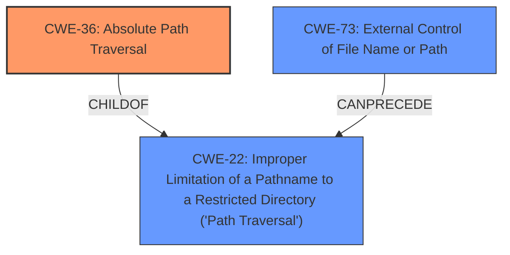

# Analysis for CVE-2022-31559

# Summary
| CWE ID | CWE Name | Confidence | CWE Abstraction Level | CWE Vulnerability Mapping Label | CWE-Vulnerability Mapping Notes |
|---|---|---|---|---|---|
| CWE-36 | Absolute Path Traversal | 1.0 | Base | Allowed | Primary CWE |

## Evidence and Confidence

*   **Confidence Score:** 1.0
*   **Evidence Strength:** HIGH

## Relationship Analysis
The primary CWE selected is CWE-36 (**Absolute Path Traversal**). CWE-36 is a child of CWE-22 (**Improper Limitation of a Pathname to a Restricted Directory ('Path Traversal')**). The relationship indicates that CWE-36 is a specific type of path traversal. The other CWEs considered are either too broad or not directly related to the **absolute path traversal** issue.



## Vulnerability Chain
The vulnerability chain starts with the **improper** usage of the Flask `send_file` function and leads to **absolute path traversal**.
  - **Root Cause:** **Improper** use of Flask's `send_file` function without sanitization.
  - **Weakness:** **Absolute Path Traversal** (CWE-36)
  - **Impact:** Access to arbitrary files on the server, leading to potential information disclosure.

## Summary of Analysis
The initial analysis correctly identifies **absolute path traversal** as the root cause. The analysis is strongly based on the provided evidence, specifically the **Vulnerability Description Key Phrases** and the **CVE Reference Links Content Summary**. The description clearly states the vulnerability is due to the unsafe use of the Flask `send_file` function, leading to **absolute path traversal**.

The graph relationships confirm that CWE-36 is a specific type of path traversal, making it more appropriate than its parent, CWE-22.

The selected CWE is at the optimal level of specificity because it directly reflects the type of path traversal (**absolute path traversal**) described in the vulnerability.

Relevant CWE Information:

# Enhanced Context (25 CWEs)
The following CWEs were identified as potentially relevant to this vulnerability:

## CWE-36: Absolute Path Traversal
**Abstraction Level**: Base
**Similarity Score**: 0.79
**Source**: dense

**Description**:
The product uses external input to construct a pathname that should be within a restricted directory, but it does not properly neutralize absolute path sequences such as "/abs/path" that can resolve to a location that is outside of that directory.

**Mapping Guidance**:
- Usage: Allowed
- Rationale: This CWE entry is at the Base level of abstraction, which is a preferred level of abstraction for mapping to the root causes of vulnerabilities.

## CWE-22: Improper Limitation of a Pathname to a Restricted Directory ('Path Traversal')
**Abstraction Level**: Base
**Similarity Score**: 12583.65
**Source**: sparse

**Description**:
The product uses external input to construct a pathname that is intended to identify a file or directory that is located underneath a restricted parent directory, but the product does not properly neutralize special elements within the pathname that can cause the pathname to resolve to a location that is outside of the restricted directory.

**Mapping Guidance**:
- Usage: Allowed
- Rationale: This CWE entry is at the Base level of abstraction, which is a preferred level of abstraction for mapping to the root causes of vulnerabilities.

## CWE-73: External Control of File Name or Path
**Abstraction Level**: Base
**Similarity Score**: 12309.14
**Source**: sparse

**Description**:
The product allows user input to control or influence paths or file names that are used in filesystem operations.

**Mapping Guidance**:
- Usage: Allowed
- Rationale: This CWE entry is at the Base level of abstraction, which is a preferred level of abstraction for mapping to the root causes of vulnerabilities.

### Analysis of Other CWEs Considered and Not Used:
- **CWE-22 (Improper Limitation of a Pathname to a Restricted Directory ('Path Traversal'))**: While this is a parent of CWE-36, it's a more general case. The vulnerability specifically involves **absolute path traversal**, making CWE-36 a more accurate and specific classification.
- **CWE-73 (External Control of File Name or Path)**: This CWE describes a scenario where user input influences file paths. While this might be a contributing factor, the core issue is the **lack of proper neutralization of absolute paths**, which is better captured by CWE-36.
- **CWE-23 (Relative Path Traversal)**: This CWE is not applicable as the vulnerability is about **absolute path traversal**, not relative paths.
- **CWE-37 (Path Traversal: '/absolute/pathname/here')**: This is a variant of CWE-36 but the description of CWE-36 is a better fit.
- **CWE-59 (Improper Link Resolution Before File Access ('Link Following'))**: This CWE is not relevant as the vulnerability does not involve symbolic links or link following.
- **CWE-182 (Collapse of Data into Unsafe Value)**: This CWE is not relevant as the vulnerability does not involve data collapsing into an unsafe value.

# Enhanced Query for CVE-2022-31559

## Vulnerability Description
The tsileo/flask-yeoman repository through 2013-09-13 on GitHub allows **absolute path traversal** because the Flask send_file function is used unsafely.

### Vulnerability Description Key Phrases
- **weakness:** **absolute path traversal**
- **product:** tsileo/flask-yeoman
- **version:** through 2013-09-13

## CVE Reference Links Content Summary
Based on the provided content, here's a breakdown of the vulnerabilities associated with CVE-2022-31559, CVE-2022-31564, CVE-2022-31546, CVE-2022-31557, CVE-2022-31565, CVE-2022-31533, CVE-2022-31511, CVE-2022-31520, CVE-2022-31514, CVE-2022-31571, CVE-2022-31536, CVE-2022-31527, CVE-2022-31574, CVE-2022-31544, CVE-2022-31516, CVE-2022-31587, CVE-2022-31510, CVE-2022-31582, CVE-2022-31556, CVE-2022-31545, CVE-2022-31561, CVE-2022-31505, CVE-2022-31538, CVE-2022-31526, CVE-2022-31540, CVE-2022-31577. 

**CVE-2022-31559**

*   **Root Cause:** The vulnerability stems from the unsafe usage of the Flask `send_file` function in the `tsileo/flask-yeoman` repository. 
*   **Weaknesses/Vulnerabilities:** Absolute path traversal. The application uses the `send_file` function without proper sanitization of the input path.
*   **Impact of Exploitation:** An attacker can use directory traversal techniques to access arbitrary files from the server's file system. This could result in the disclosure of sensitive information such as source code, configuration files, or other confidential data.
*   **Attack Vectors:** Network. The vulnerability can be exploited remotely by crafting a malicious HTTP request.
*   **Required Attacker Capabilities/Position:** No special privileges are required to perform this attack.

**CVE-2022-31564**

*   **Root Cause:** The vulnerability stems from the unsafe usage of the Flask `send_file` function in the `woduq1414/munhak-moa` repository.
*   **Weaknesses/Vulnerabilities:** Absolute path traversal. The application uses the `send_file` function without proper sanitization of the input path.
*   **Impact of Exploitation:** An attacker can use directory traversal techniques to access arbitrary files from the server's file system. This could result in the disclosure of sensitive information such as source code, configuration files, or other confidential data.
*   **Attack Vectors:** Network. The vulnerability can be exploited remotely by crafting a malicious HTTP request.
*   **Required Attacker Capabilities/Position:** No special privileges are required to perform this attack.

**CVE-2022-31546**

*   **Root Cause:** The vulnerability stems from the unsafe usage of the Flask `send_file` function in the `nlpweb/glance` repository.
*  **Weaknesses/Vulnerabilities:** Absolute path traversal. The application uses the `send_file` function without proper sanitization of the input path.
*   **Impact of Exploitation:** An attacker can use directory traversal techniques to access arbitrary files from the server's file system. This could result in the disclosure of sensitive information such as source code, configuration files, or other confidential data.
*   **Attack Vectors:** Network. The vulnerability can be exploited remotely by crafting a malicious HTTP request.
*   **Required Attacker Capabilities/Position:** No special privileges are required to perform this attack.

**CVE-2022-31557**
*   **Root Cause:** The vulnerability stems from the unsafe usage of the Flask `send_file` function in the `seveas/golem` repository.
*  **Weaknesses/Vulnerabilities:** Absolute path traversal. The application uses the `send_file` function without proper sanitization of the input path.
*   **Impact of Exploitation:** An attacker can use directory traversal techniques to access arbitrary files from the server's file system. This could result in the disclosure of sensitive information such as source code, configuration files, or other confidential data.
*   **Attack Vectors:** Network. The vulnerability can be exploited remotely by crafting a malicious HTTP request.
*   **Required Attacker Capabilities/Position:** No special privileges are required to perform this attack.

**CVE-2022-31565**
*   **Root Cause:** The vulnerability stems from the unsafe usage of the Flask `send_file` function in the `yogson/syrabond` repository.
*  **Weaknesses/Vulnerabilities:** Absolute path traversal. The application uses the `send_file` function without proper sanitization of the input path.
*   **Impact of Exploitation:** An attacker can use directory traversal techniques to access arbitrary files from the server's file system. This could result in the disclosure of sensitive information such as source code, configuration files, or other confidential data.
*   **Attack Vectors:** Network. The vulnerability can be exploited remotely by crafting a malicious HTTP request.
*   **Required Attacker Capabilities/Position:** No special privileges are required to perform this attack.

**CVE-2022-31533**
*   **Root Cause:** The vulnerability stems from the unsafe usage of the Flask `send_file` function in the `decentraminds/umbral` repository.
*  **Weaknesses/Vulnerabilities:** Absolute path traversal. The application uses the `send_file` function without proper sanitization of the input path.
*   **Impact of Exploitation:** An attacker can use directory traversal techniques to access arbitrary files from the server's file system. This could result in the disclosure of sensitive information such as source code, configuration files, or other confidential data.
*   **Attack Vectors:** Network. The vulnerability can be exploited remotely by crafting a malicious HTTP request.
*   **Required Attacker Capabilities/Position:** No special privileges are required to perform this attack.

**CVE-2022-31511**

*   **Root Cause:** The vulnerability stems from the unsafe usage of the Flask `send_file` function in the `AFDudley/equanimity` repository.
*  **Weaknesses/Vulnerabilities:** Absolute path traversal. The application uses the `send_file` function without proper sanitization of the input path.
*   **Impact of Exploitation:** An attacker can use directory traversal techniques to access arbitrary files from the server's file system. This could result in the disclosure of sensitive information such as source code, configuration files, or other confidential data.
*   **Attack Vectors:** Network. The vulnerability can be exploited remotely by crafting a malicious HTTP request.
*   **Required Attacker Capabilities/Position:** No special privileges are required to perform this attack.

**CVE-2022-31520**

*   **Root Cause:** The vulnerability stems from the unsafe usage of the Flask `send_file` function in the `Luxas98/logstash-management-api` repository.
*   **Weaknesses/Vulnerabilities:** Absolute path traversal. The application uses the `send_file` function without proper sanitization of the input path.
*   **Impact of Exploitation:** An attacker can use directory traversal techniques to access arbitrary files from the server's file system. This could result in the disclosure of sensitive information such as source code, configuration files, or other confidential data.
*   **Attack Vectors:** Network. The vulnerability can be exploited remotely by crafting a malicious HTTP request.
*   **Required Attacker Capabilities/Position:** No special privileges are required to perform this attack.

**CVE-2022-31514**
*   **Root Cause:** The vulnerability stems from the unsafe usage of the Flask `send_file` function in the `Caoyongqi912/Fan_Platform` repository.
*   **Weaknesses/Vulnerabilities:** Absolute path traversal. The application uses the `send_file` function without proper sanitization of the input path.
*   **Impact of Exploitation:** An attacker can use directory traversal techniques to access arbitrary files from the server's file system. This could result in the disclosure of sensitive information such as source code, configuration files, or other confidential data.
*   **Attack Vectors:** Network. The vulnerability can be exploited remotely by crafting a malicious HTTP request.
*   **Required Attacker Capabilities/Position:** No special privileges are required to perform this attack.

**CVE-2022-31571**
*   **Root Cause:** The vulnerability stems from the unsafe usage of the Flask `send_file` function in the `akashtalole/python-flask-restful-api` repository.
*   **Weaknesses/Vulnerabilities:** Absolute path traversal. The application uses the `send_file` function without proper sanitization of the input path.
*   **Impact of Exploitation:** An attacker can use directory traversal techniques to access arbitrary files from the server's file system. This could result in the disclosure of sensitive information such as source code, configuration files, or other confidential data.
*   **Attack Vectors:** Network. The vulnerability can be exploited remotely by crafting a malicious HTTP request.
*   **Required Attacker Capabilities/Position:** No special privileges are required to perform this attack.

**CVE-2022-31536**

*   **Root Cause:** The vulnerability stems from the unsafe usage of the Flask `send_file` function in the `jaygarza1982/ytdl-sync` repository.
*   **Weaknesses/Vulnerabilities:** Absolute path traversal. The application uses the `send_file` function without proper sanitization of the input path.
*   **Impact of Exploitation:** An attacker can use directory traversal techniques to access arbitrary files from the server's file system. This could result in the disclosure of sensitive information such as source code, configuration files, or other confidential data.
*   **Attack Vectors:** Network. The vulnerability can be exploited remotely by crafting a malicious HTTP request.
*   **Required Attacker Capabilities/Position:** No special privileges are required to perform this attack.

**CVE-2022-31527**

*   **Root Cause:** The vulnerability stems from the unsafe usage of the Flask `send_file` function in the `Wildog/flask-file-server` repository.
*   **Weaknesses/Vulnerabilities:** Absolute path traversal. The application uses the `send_file` function without proper sanitization of the input path.
*   **Impact of Exploitation:** An attacker can use directory traversal techniques to access arbitrary files from the server's file system. This could result in the disclosure of sensitive information such as source code, configuration files, or other confidential data.
*   **Attack Vectors:** Network. The vulnerability can be exploited remotely by crafting a malicious HTTP request.
*   **Required Attacker Capabilities/Position:** No special privileges are required to perform this attack.

**CVE-2022-31574**
*   **Root Cause:** The vulnerability stems from the unsafe usage of the Flask `send_file` function in the `deepaliupadhyay/RealEstate` repository.
*   **Weaknesses/Vulnerabilities:** Absolute path traversal. The application uses the `send_file` function without proper sanitization of the input path.
*   **Impact of Exploitation:** An attacker can use directory traversal techniques to access arbitrary files from the server's file system. This could result in the disclosure of sensitive information such as source code, configuration files, or other confidential data.
*   **Attack Vectors:** Network. The vulnerability can be exploited remotely by crafting a malicious HTTP request.
*   **Required Attacker Capabilities/Position:** No special privileges are required to perform this attack.

**CVE-2022-31544**
*   **Root Cause:** The vulnerability stems from the unsafe usage of the Flask `send_file` function in the `meerstein/rbtm` repository.
*  **Weaknesses/Vulnerabilities:** Absolute path traversal. The application uses the `send_file` function without proper sanitization of the input path.
*   **Impact of Exploitation:** An attacker can use directory traversal techniques to access arbitrary files from the server's file system. This could result in the disclosure of sensitive information such as source code, configuration files, or other confidential data.
*   **Attack Vectors:** Network. The vulnerability can be exploited remotely by crafting a malicious HTTP request.
*   **Required Attacker Capabilities/Position:** No special privileges are required to perform this attack.

**CVE-2022-31516**
*   **Root Cause:** The vulnerability stems from the unsafe usage of the Flask `send_file` function in the `Harveyzyh/Python` repository.
*   **Weaknesses/Vulnerabilities:** Absolute path traversal. The application uses the `send_file` function without proper sanitization of the input path.
*   **Impact of Exploitation:** An attacker can use directory traversal techniques to access arbitrary files from the server's file system. This could result in the disclosure of sensitive information such as source code, configuration files, or other confidential data.
*   **Attack Vectors:** Network. The vulnerability can be exploited remotely by crafting a malicious HTTP request.
*   **Required Attacker Capabilities/Position:** No special privileges are required to perform this attack.

**CVE-2022-31587**
*  **Root Cause:** The vulnerability stems from the unsafe usage of the Flask `send_file` function in the `yuriyouzhou/KG-fashion-chatbot` repository.
*   **Weaknesses/Vulnerabilities:** Absolute path traversal. The application uses the `send_file` function without proper sanitization of the input path.
*   **Impact of Exploitation:** An attacker can use directory traversal techniques to access arbitrary files from the server's file system. This could result in the disclosure of sensitive information such as source code, configuration files, or other confidential data.
*   **Attack Vectors:** Network. The vulnerability can be exploited remotely by crafting a malicious HTTP request.
*   **Required Attacker Capabilities/Position:** No special privileges are required to perform this attack.

**CVE-2022-31510**
*   **Root Cause:** The vulnerability stems from the unsafe usage of the Flask `send_file` function in the `sergeKashkin/Simple-RAT` repository.
*   **Weaknesses/Vulnerabilities:** Absolute path traversal. The application uses the `send_file` function without proper sanitization of the input path.
*   **Impact of Exploitation:** An attacker can use directory traversal techniques to access arbitrary files from the server's file system. This could result in the disclosure of sensitive information such as source code, configuration files, or other confidential data.
*   **Attack Vectors:** Network. The vulnerability can be exploited remotely by crafting a malicious HTTP request.
*   **Required Attacker Capabilities/Position:** No special privileges are required to perform this attack.

**CVE-2022-31582**
*   **Root Cause:** The vulnerability stems from the unsafe usage of the Flask `send_file` function in the `shaolo1/VideoServer` repository.
*  **Weaknesses/Vulnerabilities:** Absolute path traversal. The application uses the `send_file` function without proper sanitization of the input path.
*   **Impact of Exploitation:** An attacker can use directory traversal techniques to access arbitrary files from the server's file system. This could result in the disclosure of sensitive information such as source code, configuration files, or other confidential data.
*   **Attack Vectors:** Network. The vulnerability can be exploited remotely by crafting a malicious HTTP request.
*   **Required Attacker Capabilities/Position:** No special privileges are required to perform this attack.

**CVE-2022-31556**
*   **Root Cause:** The vulnerability stems from the unsafe usage of the Flask `send_file` function in the `rusyasoft/TrainEnergyServer` repository.
*  **Weaknesses/Vulnerabilities:** Absolute path traversal. The application uses the `send_file` function without proper sanitization of the input path.
*   **Impact of Exploitation:** An attacker can use directory traversal techniques to access arbitrary files from the server's file system. This could result in the disclosure of sensitive information such as source code, configuration files, or other confidential data.
*   **Attack Vectors:** Network. The vulnerability can be exploited remotely by crafting a malicious HTTP request.
*   **Required Attacker Capabilities/Position:** No special privileges are required to perform this attack.

**CVE-2022-31545**
*   **Root Cause:** The vulnerability stems from the unsafe usage of the Flask `send_file` function in the `ml-inory/ModelConverter` repository.
*  **Weaknesses/Vulnerabilities:** Absolute path traversal. The application uses the `send_file` function without proper sanitization of the input path.
*   **Impact of Exploitation:** An attacker can use directory traversal techniques to access arbitrary files from the server's file system. This could result in the disclosure of sensitive information such as source code, configuration files, or other confidential data.
*   **Attack Vectors:** Network. The vulnerability can be exploited remotely by crafting a malicious HTTP request.
*   **Required Attacker Capabilities/Position:** No special privileges are required to perform this attack.

**CVE-2022-31561**
*   **Root Cause:** The vulnerability stems from the unsafe usage of the Flask `send_file` function in the `varijkapil13/Sphere_ImageBackend` repository.
*  **Weaknesses/Vulnerabilities:** Absolute path traversal. The application uses the `send_file` function without proper sanitization of the input path.
*   **Impact of Exploitation:** An attacker can use directory traversal techniques to access arbitrary files from the server's file system. This could result in the disclosure of sensitive information such as source code, configuration files, or other confidential data.
*   **Attack Vectors:** Network. The vulnerability can be exploited remotely by crafting a malicious HTTP request.
*   **Required Attacker Capabilities/Position:** No special privileges are required to perform this attack.

**CVE-2022-31505**
*   **Root Cause:** The vulnerability stems from the unsafe usage of the Flask `send_file` function in the `cheo0/MercadoEnLineaBack` repository.
*   **Weaknesses/Vulnerabilities:** Absolute path traversal. The application uses the `send_file` function without proper sanitization of the input path.
*   **Impact of Exploitation:** An attacker can use directory traversal techniques to access arbitrary files from the server's file system. This could result in the disclosure of sensitive information such as source code, configuration files, or other confidential data.
*   **Attack Vectors:** Network. The vulnerability can be exploited remotely by crafting a malicious HTTP request.
*   **Required Attacker Capabilities/Position:** No special privileges are required to perform this attack.

**CVE-2022-31538**

*   **Root Cause:** The vulnerability stems from the unsafe usage of the Flask `send_file` function in the `joaopedro-fg/mp-m08-interface` repository.
*   **Weaknesses/Vulnerabilities:** Absolute path traversal. The application uses the `send_file` function without proper sanitization of the input path.
*   **Impact of Exploitation:** An attacker can use directory traversal techniques to access arbitrary files from the server's file system. This could result in the disclosure of sensitive information such as source code, configuration files, or other confidential data.
*   **Attack Vectors:** Network. The vulnerability can be exploited remotely by crafting a malicious HTTP request.
*   **Required Attacker Capabilities/Position:** No special privileges are required to perform this attack.

**CVE-2022-31526**
*   **Root Cause:** The vulnerability stems from the unsafe usage of the Flask `send_file` function in the `ThundeRatz/ThunderDocs` repository.
*  **Weaknesses/Vulnerabilities:** Absolute path traversal. The application uses the `send_file` function without proper sanitization of the input path.
*   **Impact of Exploitation:** An attacker can use directory traversal techniques to access arbitrary files from the server's file system. This could result in the disclosure of sensitive information such as source code, configuration files, or other confidential data.
*   **Attack Vectors:** Network. The vulnerability can be exploited remotely by crafting a malicious HTTP request.
*   **Required Attacker Capabilities/Position:** No special privileges are required to perform this attack.

**CVE-2022-31540**

*   **Root Cause:** The vulnerability stems from the unsafe usage of the Flask `send_file` function in the `kumardeepak/hin-eng-preprocessing` repository.
*  **Weaknesses/Vulnerabilities:** Absolute path traversal. The application uses the `send_file` function without proper sanitization of the input path.
*   **Impact of Exploitation:** An attacker can use directory traversal techniques to access arbitrary files from the server's file system. This could result in the disclosure of sensitive information such as source code, configuration files, or other confidential data.
*   **Attack Vectors:** Network. The vulnerability can be exploited remotely by crafting a malicious HTTP request.
*   **Required Attacker Capabilities/Position:** No special privileges are required to perform this attack.

**CVE-2022-31577**

*   **Root Cause:** The vulnerability stems from the unsafe usage of the Flask `send_file` function in the `longmaoteamtf/audio_aligner_app` repository.
*   **Weaknesses/Vulnerabilities:** Absolute path traversal. The application uses the `send_file` function without proper sanitization of the input path.
*   **Impact of Exploitation:** An attacker can use directory traversal techniques to access arbitrary files from the server's file system. This could result in the disclosure of sensitive information such as source code, configuration files, or other confidential data.
*   **Attack Vectors:** Network. The vulnerability can be exploited remotely by crafting a malicious HTTP request.
*   **Required Attacker Capabilities/Position:** No special privileges are required to perform this attack.

**CVE-2022-31548**

*   **Root Cause:** The vulnerability stems from the unsafe usage of the Flask `send_file` function in the `nrlakin/homepage` repository.
*   **Weaknesses/Vulnerabilities:** Absolute path traversal. The application uses the `send_file` function without proper sanitization of the input path.
*   **Impact of Exploitation:** An attacker can use directory traversal techniques to access arbitrary files from the server's file system. This could result in the disclosure of sensitive information such as source code, configuration files, or other confidential data.
*   **Attack Vectors:** Network. The vulnerability can be exploited remotely by crafting a malicious HTTP request.
*   **Required Attacker Capabilities/Position:** No special privileges are required to perform this attack.

**CVE-2022-31552**
*   **Root Cause:** The vulnerability stems from the unsafe usage of the Flask `send_file` function in the `project-anuvaad/anuvaad-corpus` repository.
*   **Weaknesses/Vulnerabilities:** Absolute path traversal. The application uses the `send_file` function without proper sanitization of the input path.
*   **Impact of Exploitation:** An attacker can use directory traversal techniques to access arbitrary files from the server's file system. This could result in the disclosure of sensitive information such as source code, configuration files, or other confidential data.
*   **Attack Vectors:** Network. The vulnerability can be exploited remotely by crafting a malicious HTTP request.
*   **Required Attacker Capabilities/Position:** No special privileges are required to perform this attack.

**CVE-2022-31566**

*   **Root Cause:** The vulnerability stems from the unsafe usage of the Flask `send_file` function in the `DSAB-local/DSAB` repository.
*  **Weaknesses/Vulnerabilities:** Absolute path traversal. The application uses the `send_file` function without proper sanitization of the input path.
*   **Impact of Exploitation:** An attacker can use directory traversal techniques to access arbitrary files from the server's file system. This could result in the disclosure of sensitive information such as source code, configuration files, or other confidential data.
*   **Attack Vectors:** Network. The vulnerability can be exploited remotely by crafting a malicious HTTP request.
*   **Required Attacker Capabilities/Position:** No special privileges are required to perform this attack.

**CVE-2022-31588**

*   **Root Cause:** The vulnerability stems from the unsafe usage of the Flask `send_file` function in the `zippies/testplatform` repository.
*  **Weaknesses/Vulnerabilities:** Absolute path traversal. The application uses the `send_file` function without proper sanitization of the input path.
*   **Impact of Exploitation:** An attacker can use directory traversal techniques to access arbitrary files from the server's file system. This could result in the disclosure of sensitive information such as source code, configuration files, or other confidential data.
*   **Attack Vectors:** Network. The vulnerability can be exploited remotely by crafting a malicious HTTP request.
*   **Required Attacker Capabilities/Position:** No special privileges are required to perform this attack.

In all cases, the core issue is the insecure usage of the `flask.send_file` function, which allows an attacker to manipulate file paths, potentially leading to unauthorized access to files on the server. The suggested remediation is to avoid passing untrusted data to the vulnerable `send_file` function or use `flask.safe_join` for sanitizing paths or to use `flask.send_from_directory` instead to restrict access to a specific directory.

The CVSS score for all of the identified CVEs is 9.3 with exception to CVE-2022-31514 and CVE-2022-31588 which are 9.3, and CVE-2022-31566 which has a score of 8.6. A score of 9.8 is assigned to CVE-2022-31570. These high scores indicate that these vulnerabilities are considered critical due to their potential impact on confidentiality, and the ease with which they can be exploited.

The content provides additional context by linking to an issue where the root cause, remediation and affected repositories are described.

## Retriever Results

### Top Combined Results

| Rank | CWE ID | Name | Abstraction | Usage  | Retrievers | Individual Scores |
|------|--------|------|-------------|-------|------------|-------------------|
| 1 | 22 | Improper Limitation of a Pathname to a Restricted Directory ('Path Traversal') | Base | Allowed | alternate_terms | 0.800 |
| 2 | 36 | Absolute Path Traversal | Base | Allowed | sparse | 0.357 |
| 3 | 73 | External Control of File Name or Path | Base | Allowed | sparse | 0.216 |
| 4 | 23 | Relative Path Traversal | Base | Allowed | sparse | 0.150 |
| 5 | 37 | Path Traversal: '/absolute/pathname/here' | Variant | Allowed | sparse | 0.124 |
| 6 | 24 | Path Traversal: '../filedir' | Variant | Allowed | dense | 0.556 |
| 7 | 59 | Improper Link Resolution Before File Access ('Link Following') | Base | Allowed | graph | 0.002 |
| 8 | 38 | Path Traversal: '\absolute\pathname\here' | Variant | Allowed | sparse | 0.111 |
| 9 | 95 | Improper Neutralization of Directives in Dynamically Evaluated Code ('Eval Injection') | Variant | Allowed | sparse | 0.102 |
| 10 | 182 | Collapse of Data into Unsafe Value | Base | Allowed | sparse | 0.101 |


# Complete CWE Specifications


## CWE-22: Improper Limitation of a Pathname to a Restricted Directory ('Path Traversal')
**Abstraction:** Base
**Status:** Stable

### Description
The product uses external input to construct a pathname that is intended to identify a file or directory that is located underneath a restricted parent directory, but the product does not properly neutralize special elements within the pathname that can cause the pathname to resolve to a location that is outside of the restricted directory.

### Extended Description


Many file operations are intended to take place within a restricted directory. By using special elements such as ".." and "/" separators, attackers can escape outside of the restricted location to access files or directories that are elsewhere on the system. One of the most common special elements is the "../" sequence, which in most modern operating systems is interpreted as the parent directory of the current location. This is referred to as relative path traversal. Path traversal also covers the use of absolute pathnames such as "/usr/local/bin" to access unexpected files. This is referred to as absolute path traversal.


### Alternative Terms
Directory traversal
Path traversal: "Path traversal" is preferred over "directory traversal," but both terms are attack-focused.

### Relationships
ChildOf -> CWE-706
ChildOf -> CWE-706
ChildOf -> CWE-668

### Mapping Guidance
**Usage:** Allowed
**Rationale:** This CWE entry is at the Base level of abstraction, which is a preferred level of abstraction for mapping to the root causes of vulnerabilities.
**Comments:** Carefully read both the name and description to ensure that this mapping is an appropriate fit. Do not try to 'force' a mapping to a lower-level Base/Variant simply to comply with this preferred level of abstraction.
**Reasons:**
- Acceptable-Use


### Additional Notes
**[Other]** In many programming languages, the injection of a null byte (the 0 or NUL) may allow an attacker to truncate a generated filename to apply to a wider range of files. For example, the product may add ".txt" to any pathname, thus limiting the attacker to text files, but a null injection may effectively remove this restriction.

**[Relationship]** Pathname equivalence can be regarded as a type of canonicalization error.

**[Relationship]** Some pathname equivalence issues are not directly related to directory traversal, rather are used to bypass security-relevant checks for whether a file/directory can be accessed by the attacker (e.g. a trailing "/" on a filename could bypass access rules that don't expect a trailing /, causing a server to provide the file when it normally would not).

**[Terminology]** 

Like other weaknesses, terminology is often based on the types of manipulations used, instead of the underlying weaknesses. Some people use "directory traversal" only to refer to the injection of ".." and equivalent sequences whose specific meaning is to traverse directories.


Other variants like "absolute pathname" and "drive letter" have the *effect* of directory traversal, but some people may not call it such, since it doesn't involve ".." or equivalent.


**[Research Gap]** Many variants of path traversal attacks are probably under-studied with respect to root cause. CWE-790 and CWE-182 begin to cover part of this gap.

**[Research Gap]** 

Incomplete diagnosis or reporting of vulnerabilities can make it difficult to know which variant is affected. For example, a researcher might say that "..\" is vulnerable, but not test "../" which may also be vulnerable.


Any combination of directory separators ("/", "\", etc.) and numbers of "." (e.g. "....") can produce unique variants; for example, the "//../" variant is not listed (CVE-2004-0325). See this entry's children and lower-level descendants.


### Observed Examples
- **CVE-2024-37032:** Large language model (LLM) management tool does not validate the format of a digest value (CWE-1287) from a private, untrusted model registry, enabling relative path traversal (CWE-23), a.k.a. Probllama
- **CVE-2024-4315:** Chain: API for text generation using Large Language Models (LLMs) does not include the "\" Windows folder separator in its denylist (CWE-184) when attempting to prevent Local File Inclusion via path traversal (CWE-22), allowing deletion of arbitrary files on Windows systems.
- **CVE-2022-45918:** Chain: a learning management tool debugger uses external input to locate previous session logs (CWE-73) and does not properly validate the given path (CWE-20), allowing for filesystem path traversal using "../" sequences (CWE-24)


## CWE-36: Absolute Path Traversal
**Abstraction:** Base
**Status:** Draft

### Description
The product uses external input to construct a pathname that should be within a restricted directory, but it does not properly neutralize absolute path sequences such as "/abs/path" that can resolve to a location that is outside of that directory.

### Extended Description
This allows attackers to traverse the file system to access files or directories that are outside of the restricted directory.

### Alternative Terms
None

### Relationships
ChildOf -> CWE-22
ChildOf -> CWE-22
ChildOf -> CWE-22

### Mapping Guidance
**Usage:** Allowed
**Rationale:** This CWE entry is at the Base level of abstraction, which is a preferred level of abstraction for mapping to the root causes of vulnerabilities.
**Comments:** Carefully read both the name and description to ensure that this mapping is an appropriate fit. Do not try to 'force' a mapping to a lower-level Base/Variant simply to comply with this preferred level of abstraction.
**Reasons:**
- Acceptable-Use


### Observed Examples
- **CVE-2022-31503:** Python package constructs filenames using an unsafe os.path.join call on untrusted input, allowing absolute path traversal because os.path.join resets the pathname to an absolute path that is specified as part of the input.
- **CVE-2002-1345:** Multiple FTP clients write arbitrary files via absolute paths in server responses
- **CVE-2001-1269:** ZIP file extractor allows full path


## CWE-73: External Control of File Name or Path
**Abstraction:** Base
**Status:** Draft

### Description
The product allows user input to control or influence paths or file names that are used in filesystem operations.

### Extended Description


This could allow an attacker to access or modify system files or other files that are critical to the application.


Path manipulation errors occur when the following two conditions are met:

```
		1. An attacker can specify a path used in an operation on the filesystem.
		2. By specifying the resource, the attacker gains a capability that would not otherwise be permitted.
```
For example, the program may give the attacker the ability to overwrite the specified file or run with a configuration controlled by the attacker.

### Alternative Terms
None

### Relationships
ChildOf -> CWE-642
ChildOf -> CWE-610
ChildOf -> CWE-20
CanPrecede -> CWE-22
CanPrecede -> CWE-41
CanPrecede -> CWE-98
CanPrecede -> CWE-434
CanPrecede -> CWE-59

### Mapping Guidance
**Usage:** Allowed
**Rationale:** This CWE entry is at the Base level of abstraction, which is a preferred level of abstraction for mapping to the root causes of vulnerabilities.
**Comments:** Carefully read both the name and description to ensure that this mapping is an appropriate fit. Do not try to 'force' a mapping to a lower-level Base/Variant simply to comply with this preferred level of abstraction.
**Reasons:**
- Acceptable-Use


### Additional Notes
**[Maintenance]** CWE-114 is a Class, but it is listed a child of CWE-73 in view 1000. This suggests some abstraction problems that should be resolved in future versions.

**[Relationship]** 

The external control of filenames can be the primary link in chains with other file-related weaknesses, as seen in the CanPrecede relationships. This is because software systems use files for many different purposes: to execute programs, load code libraries, to store application data, to store configuration settings, record temporary data, act as signals or semaphores to other processes, etc.


However, those weaknesses do not always require external control. For example, link-following weaknesses (CWE-59) often involve pathnames that are not controllable by the attacker at all.


The external control can be resultant from other issues. For example, in PHP applications, the register_globals setting can allow an attacker to modify variables that the programmer thought were immutable, enabling file inclusion (CWE-98) and path traversal (CWE-22). Operating with excessive privileges (CWE-250) might allow an attacker to specify an input filename that is not directly readable by the attacker, but is accessible to the privileged program. A buffer overflow (CWE-119) might give an attacker control over nearby memory locations that are related to pathnames, but were not directly modifiable by the attacker.


### Observed Examples
- **CVE-2022-45918:** Chain: a learning management tool debugger uses external input to locate previous session logs (CWE-73) and does not properly validate the given path (CWE-20), allowing for filesystem path traversal using "../" sequences (CWE-24)
- **CVE-2008-5748:** Chain: external control of values for user's desired language and theme enables path traversal.
- **CVE-2008-5764:** Chain: external control of user's target language enables remote file inclusion.


## CWE-23: Relative Path Traversal
**Abstraction:** Base
**Status:** Draft

### Description
The product uses external input to construct a pathname that should be within a restricted directory, but it does not properly neutralize sequences such as ".." that can resolve to a location that is outside of that directory.

### Extended Description
This allows attackers to traverse the file system to access files or directories that are outside of the restricted directory.

### Alternative Terms
Zip Slip: "Zip slip" is an attack that uses file archives (e.g., ZIP, tar, rar, etc.) that contain filenames with path traversal sequences that cause the files to be written outside of the directory under which the archive is expected to be extracted [REF-1282]. It is most commonly used for relative path traversal (CWE-23) and link following (CWE-59).

### Relationships
ChildOf -> CWE-22
ChildOf -> CWE-22
ChildOf -> CWE-22

### Mapping Guidance
**Usage:** Allowed
**Rationale:** This CWE entry is at the Base level of abstraction, which is a preferred level of abstraction for mapping to the root causes of vulnerabilities.
**Comments:** Carefully read both the name and description to ensure that this mapping is an appropriate fit. Do not try to 'force' a mapping to a lower-level Base/Variant simply to comply with this preferred level of abstraction.
**Reasons:**
- Acceptable-Use


### Observed Examples
- **CVE-2024-37032:** Large language model (LLM) management tool does not validate the format of a digest value (CWE-1287) from a private, untrusted model registry, enabling relative path traversal (CWE-23), a.k.a. Probllama
- **CVE-2022-45918:** Chain: a learning management tool debugger uses external input to locate previous session logs (CWE-73) and does not properly validate the given path (CWE-20), allowing for filesystem path traversal using "../" sequences (CWE-24)
- **CVE-2019-20916:** Python package manager does not correctly restrict the filename specified in a Content-Disposition header, allowing arbitrary file read using path traversal sequences such as "../"


## CWE-37: Path Traversal: '/absolute/pathname/here'
**Abstraction:** Variant
**Status:** Draft

### Description
The product accepts input in the form of a slash absolute path ('/absolute/pathname/here') without appropriate validation, which can allow an attacker to traverse the file system to unintended locations or access arbitrary files.

### Extended Description
Not provided

### Alternative Terms
None

### Relationships
ChildOf -> CWE-36
ChildOf -> CWE-160

### Mapping Guidance
**Usage:** Allowed
**Rationale:** This CWE entry is at the Variant level of abstraction, which is a preferred level of abstraction for mapping to the root causes of vulnerabilities.
**Comments:** Carefully read both the name and description to ensure that this mapping is an appropriate fit. Do not try to 'force' a mapping to a lower-level Base/Variant simply to comply with this preferred level of abstraction.
**Reasons:**
- Acceptable-Use


### Observed Examples
- **CVE-2002-1345:** Multiple FTP clients write arbitrary files via absolute paths in server responses
- **CVE-2001-1269:** ZIP file extractor allows full path
- **CVE-2002-1818:** Path traversal using absolute pathname


## CWE-24: Path Traversal: '../filedir'
**Abstraction:** Variant
**Status:** Incomplete

### Description
The product uses external input to construct a pathname that should be within a restricted directory, but it does not properly neutralize "../" sequences that can resolve to a location that is outside of that directory.

### Extended Description


This allows attackers to traverse the file system to access files or directories that are outside of the restricted directory.


The "../" manipulation is the canonical manipulation for operating systems that use "/" as directory separators, such as UNIX- and Linux-based systems. In some cases, it is useful for bypassing protection schemes in environments for which "/" is supported but not the primary separator, such as Windows, which uses "\" but can also accept "/".


### Alternative Terms
None

### Relationships
ChildOf -> CWE-23

### Mapping Guidance
**Usage:** Allowed
**Rationale:** This CWE entry is at the Variant level of abstraction, which is a preferred level of abstraction for mapping to the root causes of vulnerabilities.
**Comments:** Carefully read both the name and description to ensure that this mapping is an appropriate fit. Do not try to 'force' a mapping to a lower-level Base/Variant simply to comply with this preferred level of abstraction.
**Reasons:**
- Acceptable-Use


### Observed Examples
- **CVE-2022-45918:** Chain: a learning management tool debugger uses external input to locate previous session logs (CWE-73) and does not properly validate the given path (CWE-20), allowing for filesystem path traversal using "../" sequences (CWE-24)


## CWE-59: Improper Link Resolution Before File Access ('Link Following')
**Abstraction:** Base
**Status:** Draft

### Description
The product attempts to access a file based on the filename, but it does not properly prevent that filename from identifying a link or shortcut that resolves to an unintended resource.

### Extended Description
Not provided

### Alternative Terms
insecure temporary file: Some people use the phrase "insecure temporary file" when referring to a link following weakness, but other weaknesses can produce insecure temporary files without any symlink involvement at all.
Zip Slip: "Zip slip" is an attack that uses file archives (e.g., ZIP, tar, rar, etc.) that contain filenames with path traversal sequences that cause the files to be written outside of the directory under which the archive is expected to be extracted [REF-1282]. It is most commonly used for relative path traversal (CWE-23) and link following (CWE-59).

### Relationships
ChildOf -> CWE-706
ChildOf -> CWE-706

### Mapping Guidance
**Usage:** Allowed
**Rationale:** This CWE entry is at the Base level of abstraction, which is a preferred level of abstraction for mapping to the root causes of vulnerabilities.
**Comments:** Carefully read both the name and description to ensure that this mapping is an appropriate fit. Do not try to 'force' a mapping to a lower-level Base/Variant simply to comply with this preferred level of abstraction.
**Reasons:**
- Acceptable-Use


### Additional Notes
**[Theoretical]** 

Link following vulnerabilities are Multi-factor Vulnerabilities (MFV). They are the combination of multiple elements: file or directory permissions, filename predictability, race conditions, and in some cases, a design limitation in which there is no mechanism for performing atomic file creation operations.


Some potential factors are race conditions, permissions, and predictability.


### Observed Examples
- **CVE-1999-1386:** Some versions of Perl follow symbolic links when running with the -e option, which allows local users to overwrite arbitrary files via a symlink attack.
- **CVE-2000-1178:** Text editor follows symbolic links when creating a rescue copy during an abnormal exit, which allows local users to overwrite the files of other users.
- **CVE-2004-0217:** Antivirus update allows local users to create or append to arbitrary files via a symlink attack on a logfile.


## CWE-38: Path Traversal: '\absolute\pathname\here'
**Abstraction:** Variant
**Status:** Draft

### Description
The product accepts input in the form of a backslash absolute path ('\absolute\pathname\here') without appropriate validation, which can allow an attacker to traverse the file system to unintended locations or access arbitrary files.

### Extended Description
Not provided

### Alternative Terms
None

### Relationships
ChildOf -> CWE-36

### Mapping Guidance
**Usage:** Allowed
**Rationale:** This CWE entry is at the Variant level of abstraction, which is a preferred level of abstraction for mapping to the root causes of vulnerabilities.
**Comments:** Carefully read both the name and description to ensure that this mapping is an appropriate fit. Do not try to 'force' a mapping to a lower-level Base/Variant simply to comply with this preferred level of abstraction.
**Reasons:**
- Acceptable-Use


### Observed Examples
- **CVE-1999-1263:** Mail client allows remote attackers to overwrite arbitrary files via an e-mail message containing a uuencoded attachment that specifies the full pathname for the file to be modified.
- **CVE-2003-0753:** Remote attackers can read arbitrary files via a full pathname to the target file in config parameter.
- **CVE-2002-1525:** Remote attackers can read arbitrary files via an absolute pathname.


## CWE-95: Improper Neutralization of Directives in Dynamically Evaluated Code ('Eval Injection')
**Abstraction:** Variant
**Status:** Incomplete

### Description
The product receives input from an upstream component, but it does not neutralize or incorrectly neutralizes code syntax before using the input in a dynamic evaluation call (e.g. "eval").

### Extended Description
This may allow an attacker to execute arbitrary code, or at least modify what code can be executed.

### Alternative Terms
None

### Relationships
ChildOf -> CWE-94

### Mapping Guidance
**Usage:** Allowed
**Rationale:** This CWE entry is at the Variant level of abstraction, which is a preferred level of abstraction for mapping to the root causes of vulnerabilities.
**Comments:** Carefully read both the name and description to ensure that this mapping is an appropriate fit. Do not try to 'force' a mapping to a lower-level Base/Variant simply to comply with this preferred level of abstraction.
**Reasons:**
- Acceptable-Use


### Additional Notes
**[Other]** Factors: special character errors can play a role in increasing the variety of code that can be injected, although some vulnerabilities do not require special characters at all, e.g. when a single function without arguments can be referenced and a terminator character is not necessary.


### Observed Examples
- **CVE-2024-4181:** Framework for LLM applications allows eval injection via a crafted response from a hosting provider.
- **CVE-2022-2054:** Python compiler uses eval() to execute malicious strings as Python code.
- **CVE-2021-22204:** Chain: regex in EXIF processor code does not correctly determine where a string ends (CWE-625), enabling eval injection (CWE-95), as exploited in the wild per CISA KEV.


## CWE-182: Collapse of Data into Unsafe Value
**Abstraction:** Base
**Status:** Draft

### Description
The product filters data in a way that causes it to be reduced or "collapsed" into an unsafe value that violates an expected security property.

### Extended Description
Not provided

### Alternative Terms
None

### Relationships
ChildOf -> CWE-693
CanPrecede -> CWE-33
CanPrecede -> CWE-34
CanPrecede -> CWE-35

### Mapping Guidance
**Usage:** Allowed
**Rationale:** This CWE entry is at the Base level of abstraction, which is a preferred level of abstraction for mapping to the root causes of vulnerabilities.
**Comments:** Carefully read both the name and description to ensure that this mapping is an appropriate fit. Do not try to 'force' a mapping to a lower-level Base/Variant simply to comply with this preferred level of abstraction.
**Reasons:**
- Acceptable-Use


### Additional Notes
**[Relationship]** Overlaps regular expressions, although an implementation might not necessarily use regexp's.


### Observed Examples
- **CVE-2004-0815:** "/.////" in pathname collapses to absolute path.
- **CVE-2005-3123:** "/.//..//////././" is collapsed into "/.././" after ".." and "//" sequences are removed.
- **CVE-2002-0325:** ".../...//" collapsed to "..." due to removal of "./" in web server.

