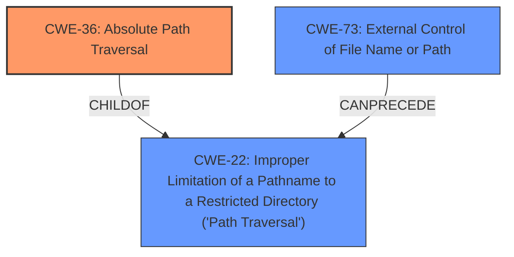

# Analysis Report for CVE-2022-31559

# Vulnerability Analysis Report: CVE-2022-31559

## Description


## Analysis (with Relationship Data)

# Summary
| CWE ID | CWE Name | Confidence | CWE Abstraction Level | CWE Vulnerability Mapping Label | CWE-Vulnerability Mapping Notes |
|---|---|---|---|---|---|
| CWE-36 | Absolute Path Traversal | 1.0 | Base | Allowed | Primary CWE |

## Evidence and Confidence

*   **Confidence Score:** 1.0
*   **Evidence Strength:** HIGH

## Relationship Analysis
The primary CWE selected is CWE-36 (**Absolute Path Traversal**). CWE-36 is a child of CWE-22 (**Improper Limitation of a Pathname to a Restricted Directory ('Path Traversal')**). The relationship indicates that CWE-36 is a specific type of path traversal. The other CWEs considered are either too broad or not directly related to the **absolute path traversal** issue.



## Vulnerability Chain
The vulnerability chain starts with the **improper** usage of the Flask `send_file` function and leads to **absolute path traversal**.
  - **Root Cause:** **Improper** use of Flask's `send_file` function without sanitization.
  - **Weakness:** **Absolute Path Traversal** (CWE-36)
  - **Impact:** Access to arbitrary files on the server, leading to potential information disclosure.

## Summary of Analysis
The initial analysis correctly identifies **absolute path traversal** as the root cause. The analysis is strongly based on the provided evidence, specifically the **Vulnerability Description Key Phrases** and the **CVE Reference Links Content Summary**. The description clearly states the vulnerability is due to the unsafe use of the Flask `send_file` function, leading to **absolute path traversal**.

The graph relationships confirm that CWE-36 is a specific type of path traversal, making it more appropriate than its parent, CWE-22.

The selected CWE is at the optimal level of specificity because it directly reflects the type of path traversal (**absolute path traversal**) described in the vulnerability.

Relevant CWE Information:

# Enhanced Context (25 CWEs)
The following CWEs were identified as potentially relevant to this vulnerability:

## CWE-36: Absolute Path Traversal
**Abstraction Level**: Base
**Similarity Score**: 0.79
**Source**: dense

**Description**:
The product uses external input to construct a pathname that should be within a restricted directory, but it does not properly neutralize absolute path sequences such as "/abs/path" that can resolve to a location that is outside of that directory.

**Mapping Guidance**:
- Usage: Allowed
- Rationale: This CWE entry is at the Base level of abstraction, which is a preferred level of abstraction for mapping to the root causes of vulnerabilities.

## CWE-22: Improper Limitation of a Pathname to a Restricted Directory ('Path Traversal')
**Abstraction Level**: Base
**Similarity Score**: 12583.65
**Source**: sparse

**Description**:
The product uses external input to construct a pathname that is intended to identify a file or directory that is located underneath a restricted parent directory, but the product does not properly neutralize special elements within the pathname that can cause the pathname to resolve to a location that is outside of the restricted directory.

**Mapping Guidance**:
- Usage: Allowed
- Rationale: This CWE entry is at the Base level of abstraction, which is a preferred level of abstraction for mapping to the root causes of vulnerabilities.

## CWE-73: External Control of File Name or Path
**Abstraction Level**: Base
**Similarity Score**: 12309.14
**Source**: sparse

**Description**:
The product allows user input to control or influence paths or file names that are used in filesystem operations.

**Mapping Guidance**:
- Usage: Allowed
- Rationale: This CWE entry is at the Base level of abstraction, which is a preferred level of abstraction for mapping to the root causes of vulnerabilities.

### Analysis of Other CWEs Considered and Not Used:
- **CWE-22 (Improper Limitation of a Pathname to a Restricted Directory ('Path Traversal'))**: While this is a parent of CWE-36, it's a more general case. The vulnerability specifically involves **absolute path traversal**, making CWE-36 a more accurate and specific classification.
- **CWE-73 (External Control of File Name or Path)**: This CWE describes a scenario where user input influences file paths. While this might be a contributing factor, the core issue is the **lack of proper neutralization of absolute paths**, which is better captured by CWE-36.
- **CWE-23 (Relative Path Traversal)**: This CWE is not applicable as the vulnerability is about **absolute path traversal**, not relative paths.
- **CWE-37 (Path Traversal: '/absolute/pathname/here')**: This is a variant of CWE-36 but the description of CWE-36 is a better fit.
- **CWE-59 (Improper Link Resolution Before File Access ('Link Following'))**: This CWE is not relevant as the vulnerability does not involve symbolic links or link following.
- **CWE-182 (Collapse of Data into Unsafe Value)**: This CWE is not relevant as the vulnerability does not involve data collapsing into an unsafe value.


## CWE Relationship Analysis

Current CWEs represent these abstraction levels: .


### Vulnerability Chain Analysis

**Chain starting from CWE-36:**
- 36 (Absolute Path Traversal) - ROOT


**Chain starting from CWE-73:**
- 73 (External Control of File Name or Path) - ROOT


### CWE Relationship Diagram

```mermaid
graph TD
    classDef primary fill:#f96,stroke:#333,stroke-width:2px
    classDef secondary fill:#69f,stroke:#333
    classDef tertiary fill:#9e9,stroke:#333
```


*Report generated on 2025-03-31 06:58:52*
