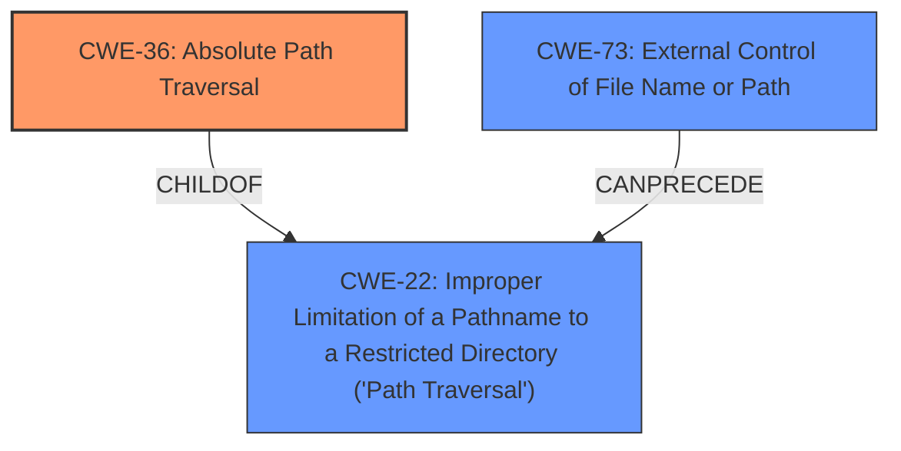

# Analysis for CVE-2022-31560

# Summary
| CWE ID | CWE Name | Confidence | CWE Abstraction Level | CWE Vulnerability Mapping Label | CWE-Vulnerability Mapping Notes |
|---|---|---|---|---|---|
| CWE-36 | Absolute Path Traversal | 1.0 | Base | Allowed | Primary CWE |
| CWE-22 | Improper Limitation of a Pathname to a Restricted Directory ('Path Traversal') | 0.75 | Base | Allowed | Secondary Candidate |
| CWE-73 | External Control of File Name or Path | 0.5 | Base | Allowed | Secondary Candidate |

## Evidence and Confidence

*   **Confidence Score:** 0.85
*   **Evidence Strength:** HIGH

## Relationship Analysis
The primary relationship influencing the CWE selection is the parent-child relationship between CWE-22 (Improper Limitation of a Pathname to a Restricted Directory) and CWE-36 (Absolute Path Traversal). CWE-36 is a specific type of CWE-22, focusing on **absolute path traversal**. The vulnerability description explicitly mentions "**absolute path traversal**", making CWE-36 a more precise fit. CWE-73 (External Control of File Name or Path) is a broader category where user input influences file operations, but it's less specific than CWE-36.

## Vulnerability Chain
The vulnerability chain starts with the **unsafe usage of the Flask `send_file` function** (the root cause), which leads to **absolute path traversal**. The application **fails to properly neutralize absolute path sequences**, enabling attackers to access files outside the intended directory.

## Summary of Analysis
The initial analysis focused on identifying the most specific CWE that accurately describes the vulnerability, based on the provided evidence. The vulnerability description explicitly mentions "**absolute path traversal**", and the CVE reference links confirm that the root cause is the **unsafe usage of the Flask `send_file` function**, allowing attackers to specify arbitrary file paths.

The relationship analysis highlights that CWE-36 is a more specific type of CWE-22, making it a better fit. While CWE-73 is also relevant, it's less specific and doesn't directly address the **absolute path traversal** aspect of the vulnerability.

The final decision is based on the explicit mention of "**absolute path traversal**" in the vulnerability description and the confirmation from the CVE reference links. CWE-36 is at the optimal level of specificity, as it accurately describes the **weakness** and its root cause.

The supporting evidence is strong:

*   "The uncleYiba/photo_tag repository through 2020-08-31 on GitHub allows **absolute path traversal** because the Flask send_file function is used unsafely."
*   "The root cause of the vulnerability across all the listed CVEs (including CVE-2022-31560) is the **unsafe usage of the Flask `send_file` function**. Specifically, the application is passing untrusted, potentially attacker-controlled input directly to the `send_file` function, which leads to an **absolute path traversal** vulnerability."
*   "**Absolute Path Traversal (CWE-22):** The primary **weakness** is that the application allows an attacker to specify an arbitrary file path on the server's filesystem."

CWE-22 was considered but not chosen as the primary because while related, it's a broader category. The same rationale applies to CWE-73.

Relevant CWE Information:

# Enhanced Context (25 CWEs)
The following CWEs were identified as potentially relevant to this vulnerability:

## CWE-36: Absolute Path Traversal
**Abstraction Level**: Base
**Similarity Score**: 0.81
**Source**: dense

**Description**:
The product uses external input to construct a pathname that should be within a restricted directory, but it does not properly neutralize absolute path sequences such as "/abs/path" that can resolve to a location that is outside of that directory.

**Mapping Guidance**:
- Usage: Allowed
- Rationale: This CWE entry is at the Base level of abstraction, which is a preferred level of abstraction for mapping to the root causes of vulnerabilities.

## CWE-22: Improper Limitation of a Pathname to a Restricted Directory ('Path Traversal')
**Abstraction Level**: Base
**Similarity Score**: 9596.45
**Source**: sparse

**Description**:
The product uses external input to construct a pathname that is intended to identify a file or directory that is located underneath a restricted parent directory, but the product does not properly neutralize special elements within the pathname that can cause the pathname to resolve to a location that is outside of the restricted directory.

**Mapping Guidance**:
- Usage: Allowed
- Rationale: This CWE entry is at the Base level of abstraction, which is a preferred level of abstraction for mapping to the root causes of vulnerabilities.

## CWE-73: External Control of File Name or Path
**Abstraction Level**: Base
**Similarity Score**: 3.21
**Source**: graph

**Description**:
The product allows user input to control or influence paths or file names that are used in filesystem operations.

**Mapping Guidance**:
- Usage: Allowed
- Rationale: This CWE entry is at the Base level of abstraction, which is a preferred level of abstraction for mapping to the root causes of vulnerabilities.