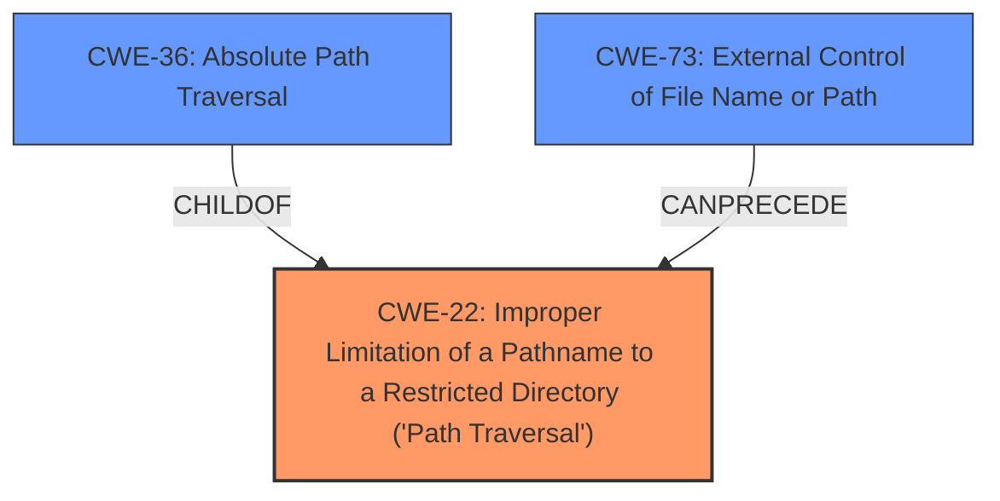

# Analysis for CVE-2022-31563

# Summary
| CWE ID  | CWE Name                                                                    | Confidence | CWE Abstraction Level | CWE Vulnerability Mapping Label | CWE-Vulnerability Mapping Notes |
| ------- | --------------------------------------------------------------------------- | ---------- | --------------------- | ------------------------------- | ----------------------------- |
| CWE-22  | Improper Limitation of a Pathname to a Restricted Directory ('Path Traversal') | 1.0        | Base                  | Primary                         | Allowed                       |
| CWE-36  | Absolute Path Traversal                                                     | 0.7        | Base                  | Secondary                       | Allowed                       |
| CWE-73  | External Control of File Name or Path                                        | 0.6        | Base                  | Secondary                       | Allowed                       |

## Evidence and Confidence

*   **Confidence Score:** 0.8
*   **Evidence Strength:** HIGH

## Relationship Analysis
The primary CWE is CWE-22, which represents the general class of path traversal vulnerabilities. CWE-36, Absolute Path Traversal, is a child of CWE-22 and represents a specific type of path traversal using absolute paths. CWE-73, External Control of File Name or Path, represents the broader issue of allowing user input to control file paths, which can lead to path traversal. The selection of CWE-22 as primary is due to its general applicability to the vulnerability, while CWE-36 and CWE-73 provide additional context about the specific type of path traversal and the source of the malicious input.



## Vulnerability Chain
The vulnerability chain starts with external control over the file path (CWE-73). The lack of proper validation of this path (CWE-22) then allows an attacker to use absolute path sequences (CWE-36) to access files outside the intended directory.

## Summary of Analysis
The initial assessment identified **absolute path traversal** as the key weakness. The provided evidence from the "CVE Reference Links Content Summary" confirms that the root cause is the unsafe use of the `flask.send_file` function, which allows attackers to perform **absolute path traversal** due to **improper limitation of pathname** to a restricted directory. This aligns well with CWE-22. The retriever results also highly suggest CWE-22, CWE-36, and CWE-73.

The selection of CWE-22 as the primary CWE is based on its general description of path traversal vulnerabilities. CWE-36 is included as a secondary CWE because the vulnerability specifically involves absolute path traversal. CWE-73 is also included because the vulnerability involves external control of the file path, which is a prerequisite for path traversal.

The CWEs selected are at the Base level of abstraction, which is considered the preferred level for mapping vulnerabilities. This provides a balance between specificity and generality, allowing for a clear understanding of the vulnerability without being overly specific.

# Relevant CWE Information:

The following CWEs were identified as potentially relevant to this vulnerability:

## CWE-37: Path Traversal: '/absolute/pathname/here'
**Abstraction Level**: Variant
**Similarity Score**: 0.77
**Source**: dense

**Description**:
The product accepts input in the form of a slash absolute path ('/absolute/pathname/here') without appropriate validation, which can allow an attacker to traverse the file system to unintended locations or access arbitrary files.

**Mapping Guidance**:
- Usage: Allowed
- Rationale: This CWE entry is at the Variant level of abstraction, which is a preferred level of abstraction for mapping to the root causes of vulnerabilities.

## CWE-24: Path Traversal: '../filedir'
**Abstraction Level**: Variant
**Similarity Score**: 0.74
**Source**: dense

**Description**:
The product uses external input to construct a pathname that should be within a restricted directory, but it does not properly neutralize "../" sequences that can resolve to a location that is outside of that directory.

**Mapping Guidance**:
- Usage: Allowed
- Rationale: This CWE entry is at the Variant level of abstraction, which is a preferred level of abstraction for mapping to the root causes of vulnerabilities.

## CWE-36: Absolute Path Traversal
**Abstraction Level**: Base
**Similarity Score**: 0.74
**Source**: dense

**Description**:
The product uses external input to construct a pathname that should be within a restricted directory, but it does not properly neutralize absolute path sequences such as "/abs/path" that can resolve to a location that is outside of that directory.

**Mapping Guidance**:
- Usage: Allowed
- Rationale: This CWE entry is at the Base level of abstraction, which is a preferred level of abstraction for mapping to the root causes of vulnerabilities.

## CWE-25: Path Traversal: '/../filedir'
**Abstraction Level**: Variant
**Similarity Score**: 0.74
**Source**: dense

**Description**:
The product uses external input to construct a pathname that should be within a restricted directory, but it does not properly neutralize "/../" sequences that can resolve to a location that is outside of that directory.

**Mapping Guidance**:
- Usage: Allowed
- Rationale: This CWE entry is at the Variant level of abstraction, which is a preferred level of abstraction for mapping to the root causes of vulnerabilities.

## CWE-35: Path Traversal: '.../...//'
**Abstraction Level**: Variant
**Similarity Score**: 0.73
**Source**: dense

**Description**:
The product uses external input to construct a pathname that should be within a restricted directory, but it does not properly neutralize '.../...//' (doubled triple dot slash) sequences that can resolve to a location that is outside of that directory.

**Mapping Guidance**:
- Usage: Allowed
- Rationale: This CWE entry is at the Variant level of abstraction, which is a preferred level of abstraction for mapping to the root causes of vulnerabilities.

## CWE-29: Path Traversal: '\..\filename'
**Abstraction Level**: Variant
**Similarity Score**: 0.73
**Source**: dense

**Description**:
The product uses external input to construct a pathname that should be within a restricted directory, but it does not properly neutralize '\..\filename' (leading backslash dot dot) sequences that can resolve to a location that is outside of that directory.

**Mapping Guidance**:
- Usage: Allowed
- Rationale: This CWE entry is at the Variant level of abstraction, which is a preferred level of abstraction for mapping to the root causes of vulnerabilities.

## CWE-38: Path Traversal: '\absolute\pathname\here'
**Abstraction Level**: Variant
**Similarity Score**: 0.73
**Source**: dense

**Description**:
The product accepts input in the form of a backslash absolute path ('\absolute\pathname\here') without appropriate validation, which can allow an attacker to traverse the file system to unintended locations or access arbitrary files.

**Mapping Guidance**:
- Usage: Allowed
- Rationale: This CWE entry is at the Variant level of abstraction, which is a preferred level of abstraction for mapping to the root causes of vulnerabilities.

## CWE-27: Path Traversal: 'dir/../../filename'
**Abstraction Level**: Variant
**Similarity Score**: 0.73
**Source**: dense

**Description**:
The product uses external input to construct a pathname that should be within a restricted directory, but it does not properly neutralize multiple internal "../" sequences that can resolve to a location that is outside of that directory.

**Mapping Guidance**:
- Usage: Allowed
- Rationale: This CWE entry is at the Variant level of abstraction, which is a preferred level of abstraction for mapping to the root causes of vulnerabilities.

## CWE-23: Relative Path Traversal
**Abstraction Level**: Base
**Similarity Score**: 0.73
**Source**: dense

**Description**:
The product uses external input to construct a pathname that should be within a restricted directory, but it does not properly neutralize sequences such as ".." that can resolve to a location that is outside of that directory.

**Mapping Guidance**:
- Usage: Allowed
- Rationale: This CWE entry is at the Base level of abstraction, which is a preferred level of abstraction for mapping to the root causes of vulnerabilities.

## CWE-26: Path Traversal: '/dir/../filename'
**Abstraction Level**: Variant
**Similarity Score**: 0.73
**Source**: dense

**Description**:
The product uses external input to construct a pathname that should be within a restricted directory, but it does not properly neutralize "/dir/../filename" sequences that can resolve to a location that is outside of that directory.

**Mapping Guidance**:
- Usage: Allowed
- Rationale: This CWE entry is at the Variant level of abstraction, which is a preferred level of

# Enhanced Query for CVE-2022-31563

## Vulnerability Description
The whmacmac/vprj repository through 2022-04-06 on GitHub allows **absolute path traversal** because the Flask send_file function is used unsafely.

### Vulnerability Description Key Phrases
- **weakness:** **absolute path traversal**
- **product:** whmacmac/vprj repository
- **version:** through 2022-04-06

## CVE Reference Links Content Summary
Here's a breakdown of the vulnerabilities based on the provided content:

**General Vulnerability Description**

*   **Root Cause:**  The primary root cause across all these CVEs is the unsafe use of the `flask.send_file` function in Flask applications. This function is used to send files to the user. However, when it's used with untrusted input for the file path, it allows an attacker to perform absolute path traversal.
*   **Weakness:** The core vulnerability is a **CWE-22: Improper Limitation of a Pathname to a Restricted Directory ('Path Traversal')**.
*   **Impact:**  Successful exploitation could allow an attacker to read arbitrary files on the server, leading to a high level of confidentiality impact. There is a low availability impact, as serving large files can be triggered multiple times potentially causing a denial of service.
*   **Attack Vector:** Network. The attacker exploits the vulnerability remotely.
*  **Required Capabilities:** No privileges are required to exploit. No user interaction is required.

**Specific CVE Details**

Below are details from the github content, grouped by CVE ID. Note that while each vulnerability has a critical severity and a 9.3 CVSS score, the descriptions indicate some differences in how and when the vulnerabilities were introduced.

*   **CVE-2022-31504 (GHSA-3vcx-qq88-36qg):**
    *   Vulnerable repository: `ChangeWeDer/BaiduWenkuSpider_flaskWeb`
    *   Vulnerable code exists up to 2021-11-29.

*   **CVE-2022-31505 (GHSA-55jw-5gmv-2f63):**
    *   Vulnerable repository: `cheo0/MercadoEnLineaBack`
    *   Vulnerable code exists up to 2022-05-04.

*   **CVE-2022-31509 (GHSA-q23g-44vv-jwh7):**
     *   Vulnerable repository: `iedadata/usap-dc-website`
     *   Vulnerable code exists up to 1.0.1

*   **CVE-2022-31510 (GHSA-2q65-c69r-5v5v):**
    *   Vulnerable repository: `sergeKashkin/Simple-RAT`
    *   Vulnerable code existed before 2022-05-03.

*   **CVE-2022-31511 (GHSA-5j9x-fgqv-7rqf):**
    *   Vulnerable repository: `AFDudley/equanimity`
    *   Vulnerable code existed up to 2014-04-23

*   **CVE-2022-31512 (GHSA-pgr9-jh2q-25mp):**
    *   Vulnerable repository: `Atom02/flask-mvc`
    *    Vulnerable code existed up to 2020-09-14

*   **CVE-2022-31513 (GHSA-xwcr-j76h-mrqq):**
    *   Vulnerable repository: `BolunHan/Krypton`
    *  Vulnerable code existed up to 2021-06-03

*   **CVE-2022-31514 (GHSA-v6m4-pjc9-xw4q):**
    *   Vulnerable repository: `Caoyongqi912/Fan_Platform`
    *   Vulnerable code existed up to 2021-04-20.

*  **CVE-2022-31515 (GHSA-mmhx-6x77-4jf4):**
     *   Vulnerable repository: `Delor4/CarceresBE`
     *   Vulnerable code exists up to 1.0

*   **CVE-2022-31516 (GHSA-ppww-x8j3-f268):**
    *   Vulnerable repository: `Harveyzyh/Python`
    *  Vulnerable code existed up to 2022-05-04

*  **CVE-2022-31518 (GHSA-pjqh-cwf4-prqq):**
    *   Vulnerable repository: `JustAnotherSoftwareDeveloper/Python-Recipe-Database`
    *   Vulnerable code exists up to 2021-03-31.

*   **CVE-2022-31520 (GHSA-g5qq-w3mh-h2p5):**
    *   Vulnerable repository: `Luxas98/logstash-management-api`
    *    Vulnerable code existed up to 2020-05-04.

*   **CVE-2022-31521 (GHSA-2jgc-hhfj-xjj5):**
    *   Vulnerable repository: `Niyaz-Mohamed/mosaic`
    *   Vulnerable code exists up to 1.0.0.

*   **CVE-2022-31526 (GHSA-6h9c-6mhg-jv2g):**
     *   Vulnerable repository: `ThundeRatz/ThunderDocs`
     *  Vulnerable code existed up to 2019-02-18

*  **CVE-2022-31527 (GHSA-vm3m-gqc9-52ch):**
    *   Vulnerable repository: `Wildog/flask-file-server`
    *  Vulnerable code existed up to 2020-02

*   **CVE-2022-31528 (GHSA-c65v-pv29-vr3p):**
    *   Vulnerable repository: `bonn-activity-maps/bam_annotation_tool`
    *    Vulnerable code exists up to 2021-08-31

*  **CVE-2022-31532 (GHSA-2gcx-r92j-2xqc):**
    *  Vulnerable repository: `dankolbman/travel_blahg`
    *   Vulnerable code existed up to 2016-01-16

*   **CVE-2022-31533 (GHSA-29m8-hp2v-37qc):**
    *   Vulnerable repository: `decentraminds/umbral`
    *   Vulnerable code existed up to 2020-01-15.

*   **CVE-2022-31534 (GHSA-r88p-4x27-mwmr):**
    *   Vulnerable repository: `echoleegroup/PythonWeb`
    *   Vulnerable code existed up to 2018-10-31

*   **CVE-2022-31535 (GHSA-496w-h6x3-rhm8):**
    *   Vulnerable repository: `freefood89/Fishtank`
    *   Vulnerable code existed up to 2015-06-24

*  **CVE-2022-31536 (GHSA-x368-6j84-gmqj):**
    *   Vulnerable repository: `jaygarza1982/ytdl-sync`
    *  Vulnerable code existed up to 2021-01-02

*   **CVE-2022-31537 (GHSA-fph4-56rm-4r3r):**
    *  Vulnerable repository: `jmcginty15/Solar-system-simulator`
    *   Vulnerable code existed up to 2021-07-26

*   **CVE-2022-31538 (GHSA-546q-322q-64p5):**
    *   Vulnerable repository: `joaopedro-fg/mp-m08-interface`
    *   Vulnerable code existed up to 2020-12-10

*   **CVE-2022-31540 (GHSA-jrw2-j933-x398):**
    *   Vulnerable repository: `kumardeepak/hin-eng-preprocessing`
     *  Vulnerable code existed up to 2019-07-16

*  **CVE-2022-31544 (GHSA-8rxw-vmr9-99m6):**
    *  Vulnerable repository: `meerstein/rbtm`
    *   Vulnerable code exists up to 1.5.

*  **CVE-2022-31545 (GHSA-5mff-87w2-454m):**
    *   Vulnerable repository: `ml-inory/ModelConverter`
    *   Vulnerable code existed up to 2021-04-26

*   **CVE-2022-31546 (GHSA-29vr-p37f-25gc):**
    *   Vulnerable repository: `nlpweb/glance`
    *  Vulnerable code existed up to 2014-06-27

*   **CVE-2022-31547 (GHSA-89cq-3459-2jc2):**
    *   Vulnerable repository: `noamezekiel/sphere`
    *   Vulnerable code existed up to 2020-05-31

*   **CVE-2022-31548 (GHSA-7j97-8xvp-r6f3):**
     *  Vulnerable repository: `nrlakin/homepage`
    *   Vulnerable code existed up to 2017-03-06

*  **CVE-2022-31551 (GHSA-7x32-hrhc-wc59):**
    *  Vulnerable repository: `pleomax00/flask-mongo-skel`
     * Vulnerable code existed up to 2012-11-01

*   **CVE-2022-31552 (GHSA-rr5x-2xmg-x2pm):**
    *   Vulnerable repository: `project-anuvaad/anuvaad-corpus`
    *  Vulnerable code existed up to 2020-11-23.

*   **CVE-2022-31553 (GHSA-pv2f-867w-w3wm):**
    *   Vulnerable repository: `rainsoupah/sleep-learner`
    *    Vulnerable code existed up to 2021-02

*   **CVE-2022-31554 (GHSA-9468-gqgp-5w48):**
    *   Vulnerable repository: `rohitnayak/movie-review-sentiment-analysis`
    *   Vulnerable code existed up to 2017-05-07

*   **CVE-2022-31555 (GHSA-g49j-8c9g-mfwc):**
    *   Vulnerable repository: `romain20100/nursequest`
    *   Vulnerable code existed up to 2018-02-22.

*   **CVE-2022-31556 (GHSA-742q-7cvg-pg5f):**
    *   Vulnerable repository: `rusyasoft/TrainEnergyServer`
    *   Vulnerable code existed up to 2017

*    **CVE-2022-31557 (GHSA-8xf2-whvm-vp6x):**
    *  Vulnerable repository: `seveas/golem`
    *  Vulnerable code existed up to 2016-05-17

*  **CVE-2022-31559 (GHSA-fmr5-qw46-rqmv):**
    *   Vulnerable repository: `tsileo/flask-yeoman`
    *   Vulnerable code existed up to 2013-09-13

*   **CVE-2022-31560 (GHSA-3pjv-vr3x-68m5):**
    *  Vulnerable repository: `uncleYiba/photo_tag`
    *  Vulnerable code existed up to 2020-08-31

*   **CVE-2022-31561 (GHSA-6wrw-vmj5-r6xp):**
    *  Vulnerable repository: `varijkapil13/Sphere_ImageBackend`
    *  Vulnerable code existed up to 2019-10-03

*   **CVE-2022-31562 (GHSA-j234-jfvv-q6rv):**
     *  Vulnerable repository: `waveyan/internshipsystem`
     *   Vulnerable code existed up to 2018-05-22

*   **CVE-2022-31563 (GHSA-chj5-j96x-q9rq):**
    *  Vulnerable repository: `whmacmac/vprj`
    *   Vulnerable code existed up to 2022-04-06

*  **CVE-2022-31564 (GHSA-4q38-756g-c8c9):**
    *   Vulnerable repository: `woduq1414/munhak-moa`
     * Vulnerable code existed up to 2019-02-18

*   **CVE-2022-31566 (GHSA-625q-87rr-w32g):**
    *   Vulnerable repository: `DSAB-local/DSAB`
    *   Vulnerable code existed up to 2019-02-18

*   **CVE-2022-31567 (GHSA-2744-2crm-9w87):**
      *   Vulnerable repository: `DSABenchmark/DSAB`
      *   Vulnerable code existed up to 2.1

*   **CVE-2022-31568 (GHSA-phc4-w94p-hgjh):**
    *   Vulnerable repository: `Rexians/rex-web`
    *   Vulnerable code existed up to 2022-06-05

*   **CVE-2022-31570 (GHSA-whqv-vqc6-m2pw):**
      *   Vulnerable repository: `adriankoczuruek/ceneo-web-scrapper`
      *   Vulnerable code existed up to 2021-03-15

*  **CVE-2022-31571 (GHSA-q9cv-2r3j-9pwh):**
     *  Vulnerable repository: `akashtalole/python-flask-restful-api`
     * Vulnerable code existed before 2022-05-03

*   **CVE-2022-31572 (GHSA-3p6x-7vmm-w6rr):**
     *   Vulnerable repository: `ceee-vip/cockybook`
     * Vulnerable code existed before 2022-05-03

*   **CVE-2022-31574 (GHSA-vqw3-39gh-6m29):**
    *   Vulnerable repository: `deepaliupadhyay/RealEstate`
    *   Vulnerable code existed up to 2018-11-30

*  **CVE-2022-31575 (GHSA-ffhw-7rh2-4x5w):**
    *   Vulnerable repository: `duducosmos/livro_python`
    *  Vulnerable code existed up to 2018-06-06

* **CVE-2022-31576 (GHSA-x368-6j84-gmqj):**
     *  Vulnerable repository: `heidi-luong1109/shackerpanel`
     *   Vulnerable code existed up to 2021.

*   **CVE-2022-31577 (GHSA-gfff-hm7p-prvf):**
    *   Vulnerable repository: `longmaoteamtf/audio_aligner_app`
    *   Vulnerable code existed up to 2020-01-10.

*   **CVE-2022-31578 (GHSA-2frx-938j-793v):**
    *   Vulnerable repository: `piaoyunsoft/bt_lnmp`
     *   Vulnerable code existed up to 2019-10-10.

*   **CVE-2022-31579 (GHSA-xchf-4r8r-m2wj):**
     *   Vulnerable repository: `ralphjzhang/iasset`
     *   Vulnerable code existed up to 2022-05-04

*   **CVE-2022-31582 (GHSA-6p6w-hgwm-9qg4):**
    *  Vulnerable repository: `shaolo1/VideoServer`
     *  Vulnerable code existed up to 2019-09-21.

*   **CVE-2022-31583 (GHSA-2fq6-rxr5-6q4h):**
    *   Vulnerable repository: `sravaniboinepelli/AutomatedQuizEval`
     *  Vulnerable code existed up to 2020-04-27

*  **CVE-2022-31585 (GHSA-gq38-75hc-xc85):**
    *  Vulnerable repository: `umeshpatil-dev/Home__internet`
    *   Vulnerable code existed up to 2020-08-28

*  **CVE-2022-31587 (GHSA-8588-w48w-jp6g):**
    *   Vulnerable repository: `yuriyouzhou/KG-fashion-chatbot`
    *    Vulnerable code existed up to 2018-05-22

*   **CVE-2022-31588 (GHSA-whrg-vww5-2f8w):**
    *  Vulnerable repository: `zippies/testplatform`
    *   Vulnerable code existed up to 2016-07-19.

**Additional Notes:**

*   The vulnerability exists across various repositories, indicating a common pattern of insecure usage of `flask.send_file`.
*   Many of the affected repositories are personal projects or student work, highlighting the importance of security education for all developers.
*   The provided content includes discussion about the validity of the CVEs, focusing on the need for a consumable software product as well as active maintainership to justify a CVE identifier.
*   The vulnerability could be fixed by preventing flow of untrusted data to the vulnerable send\_file function, using `flask.safe_join` to sanitize paths, or replace `flask.send_file` calls with `flask.send_from_directory` calls.

This detailed breakdown provides a comprehensive understanding of the common vulnerability pattern and its specific instances within the provided content.

## Retriever Results

### Top Combined Results

| Rank | CWE ID | Name | Abstraction | Usage  | Retrievers | Individual Scores |
|------|--------|------|-------------|-------|------------|-------------------|
| 1 | 22 | Improper Limitation of a Pathname to a Restricted Directory ('Path Traversal') | Base | Allowed | alternate_terms | 0.800 |
| 2 | 36 | Absolute Path Traversal | Base | Allowed | sparse | 0.341 |
| 3 | 73 | External Control of File Name or Path | Base | Allowed | sparse | 0.195 |
| 4 | 23 | Relative Path Traversal | Base | Allowed | sparse | 0.143 |
| 5 | 37 | Path Traversal: '/absolute/pathname/here' | Variant | Allowed | sparse | 0.124 |
| 6 | 24 | Path Traversal: '../filedir' | Variant | Allowed | dense | 0.563 |
| 7 | 59 | Improper Link Resolution Before File Access ('Link Following') | Base | Allowed | graph | 0.002 |
| 8 | 38 | Path Traversal: '\absolute\pathname\here' | Variant | Allowed | sparse | 0.111 |
| 9 | 39 | Path Traversal: 'C:dirname' | Variant | Allowed | sparse | 0.102 |
| 10 | 182 | Collapse of Data into Unsafe Value | Base | Allowed | sparse | 0.101 |


# Complete CWE Specifications


## CWE-22: Improper Limitation of a Pathname to a Restricted Directory ('Path Traversal')
**Abstraction:** Base
**Status:** Stable

### Description
The product uses external input to construct a pathname that is intended to identify a file or directory that is located underneath a restricted parent directory, but the product does not properly neutralize special elements within the pathname that can cause the pathname to resolve to a location that is outside of the restricted directory.

### Extended Description


Many file operations are intended to take place within a restricted directory. By using special elements such as ".." and "/" separators, attackers can escape outside of the restricted location to access files or directories that are elsewhere on the system. One of the most common special elements is the "../" sequence, which in most modern operating systems is interpreted as the parent directory of the current location. This is referred to as relative path traversal. Path traversal also covers the use of absolute pathnames such as "/usr/local/bin" to access unexpected files. This is referred to as absolute path traversal.


### Alternative Terms
Directory traversal
Path traversal: "Path traversal" is preferred over "directory traversal," but both terms are attack-focused.

### Relationships
ChildOf -> CWE-706
ChildOf -> CWE-706
ChildOf -> CWE-668

### Mapping Guidance
**Usage:** Allowed
**Rationale:** This CWE entry is at the Base level of abstraction, which is a preferred level of abstraction for mapping to the root causes of vulnerabilities.
**Comments:** Carefully read both the name and description to ensure that this mapping is an appropriate fit. Do not try to 'force' a mapping to a lower-level Base/Variant simply to comply with this preferred level of abstraction.
**Reasons:**
- Acceptable-Use


### Additional Notes
**[Other]** In many programming languages, the injection of a null byte (the 0 or NUL) may allow an attacker to truncate a generated filename to apply to a wider range of files. For example, the product may add ".txt" to any pathname, thus limiting the attacker to text files, but a null injection may effectively remove this restriction.

**[Relationship]** Pathname equivalence can be regarded as a type of canonicalization error.

**[Relationship]** Some pathname equivalence issues are not directly related to directory traversal, rather are used to bypass security-relevant checks for whether a file/directory can be accessed by the attacker (e.g. a trailing "/" on a filename could bypass access rules that don't expect a trailing /, causing a server to provide the file when it normally would not).

**[Terminology]** 

Like other weaknesses, terminology is often based on the types of manipulations used, instead of the underlying weaknesses. Some people use "directory traversal" only to refer to the injection of ".." and equivalent sequences whose specific meaning is to traverse directories.


Other variants like "absolute pathname" and "drive letter" have the *effect* of directory traversal, but some people may not call it such, since it doesn't involve ".." or equivalent.


**[Research Gap]** Many variants of path traversal attacks are probably under-studied with respect to root cause. CWE-790 and CWE-182 begin to cover part of this gap.

**[Research Gap]** 

Incomplete diagnosis or reporting of vulnerabilities can make it difficult to know which variant is affected. For example, a researcher might say that "..\" is vulnerable, but not test "../" which may also be vulnerable.


Any combination of directory separators ("/", "\", etc.) and numbers of "." (e.g. "....") can produce unique variants; for example, the "//../" variant is not listed (CVE-2004-0325). See this entry's children and lower-level descendants.


### Observed Examples
- **CVE-2024-37032:** Large language model (LLM) management tool does not validate the format of a digest value (CWE-1287) from a private, untrusted model registry, enabling relative path traversal (CWE-23), a.k.a. Probllama
- **CVE-2024-4315:** Chain: API for text generation using Large Language Models (LLMs) does not include the "\" Windows folder separator in its denylist (CWE-184) when attempting to prevent Local File Inclusion via path traversal (CWE-22), allowing deletion of arbitrary files on Windows systems.
- **CVE-2022-45918:** Chain: a learning management tool debugger uses external input to locate previous session logs (CWE-73) and does not properly validate the given path (CWE-20), allowing for filesystem path traversal using "../" sequences (CWE-24)


## CWE-36: Absolute Path Traversal
**Abstraction:** Base
**Status:** Draft

### Description
The product uses external input to construct a pathname that should be within a restricted directory, but it does not properly neutralize absolute path sequences such as "/abs/path" that can resolve to a location that is outside of that directory.

### Extended Description
This allows attackers to traverse the file system to access files or directories that are outside of the restricted directory.

### Alternative Terms
None

### Relationships
ChildOf -> CWE-22
ChildOf -> CWE-22
ChildOf -> CWE-22

### Mapping Guidance
**Usage:** Allowed
**Rationale:** This CWE entry is at the Base level of abstraction, which is a preferred level of abstraction for mapping to the root causes of vulnerabilities.
**Comments:** Carefully read both the name and description to ensure that this mapping is an appropriate fit. Do not try to 'force' a mapping to a lower-level Base/Variant simply to comply with this preferred level of abstraction.
**Reasons:**
- Acceptable-Use


### Observed Examples
- **CVE-2022-31503:** Python package constructs filenames using an unsafe os.path.join call on untrusted input, allowing absolute path traversal because os.path.join resets the pathname to an absolute path that is specified as part of the input.
- **CVE-2002-1345:** Multiple FTP clients write arbitrary files via absolute paths in server responses
- **CVE-2001-1269:** ZIP file extractor allows full path


## CWE-73: External Control of File Name or Path
**Abstraction:** Base
**Status:** Draft

### Description
The product allows user input to control or influence paths or file names that are used in filesystem operations.

### Extended Description


This could allow an attacker to access or modify system files or other files that are critical to the application.


Path manipulation errors occur when the following two conditions are met:

```
		1. An attacker can specify a path used in an operation on the filesystem.
		2. By specifying the resource, the attacker gains a capability that would not otherwise be permitted.
```
For example, the program may give the attacker the ability to overwrite the specified file or run with a configuration controlled by the attacker.

### Alternative Terms
None

### Relationships
ChildOf -> CWE-642
ChildOf -> CWE-610
ChildOf -> CWE-20
CanPrecede -> CWE-22
CanPrecede -> CWE-41
CanPrecede -> CWE-98
CanPrecede -> CWE-434
CanPrecede -> CWE-59

### Mapping Guidance
**Usage:** Allowed
**Rationale:** This CWE entry is at the Base level of abstraction, which is a preferred level of abstraction for mapping to the root causes of vulnerabilities.
**Comments:** Carefully read both the name and description to ensure that this mapping is an appropriate fit. Do not try to 'force' a mapping to a lower-level Base/Variant simply to comply with this preferred level of abstraction.
**Reasons:**
- Acceptable-Use


### Additional Notes
**[Maintenance]** CWE-114 is a Class, but it is listed a child of CWE-73 in view 1000. This suggests some abstraction problems that should be resolved in future versions.

**[Relationship]** 

The external control of filenames can be the primary link in chains with other file-related weaknesses, as seen in the CanPrecede relationships. This is because software systems use files for many different purposes: to execute programs, load code libraries, to store application data, to store configuration settings, record temporary data, act as signals or semaphores to other processes, etc.


However, those weaknesses do not always require external control. For example, link-following weaknesses (CWE-59) often involve pathnames that are not controllable by the attacker at all.


The external control can be resultant from other issues. For example, in PHP applications, the register_globals setting can allow an attacker to modify variables that the programmer thought were immutable, enabling file inclusion (CWE-98) and path traversal (CWE-22). Operating with excessive privileges (CWE-250) might allow an attacker to specify an input filename that is not directly readable by the attacker, but is accessible to the privileged program. A buffer overflow (CWE-119) might give an attacker control over nearby memory locations that are related to pathnames, but were not directly modifiable by the attacker.


### Observed Examples
- **CVE-2022-45918:** Chain: a learning management tool debugger uses external input to locate previous session logs (CWE-73) and does not properly validate the given path (CWE-20), allowing for filesystem path traversal using "../" sequences (CWE-24)
- **CVE-2008-5748:** Chain: external control of values for user's desired language and theme enables path traversal.
- **CVE-2008-5764:** Chain: external control of user's target language enables remote file inclusion.


## CWE-23: Relative Path Traversal
**Abstraction:** Base
**Status:** Draft

### Description
The product uses external input to construct a pathname that should be within a restricted directory, but it does not properly neutralize sequences such as ".." that can resolve to a location that is outside of that directory.

### Extended Description
This allows attackers to traverse the file system to access files or directories that are outside of the restricted directory.

### Alternative Terms
Zip Slip: "Zip slip" is an attack that uses file archives (e.g., ZIP, tar, rar, etc.) that contain filenames with path traversal sequences that cause the files to be written outside of the directory under which the archive is expected to be extracted [REF-1282]. It is most commonly used for relative path traversal (CWE-23) and link following (CWE-59).

### Relationships
ChildOf -> CWE-22
ChildOf -> CWE-22
ChildOf -> CWE-22

### Mapping Guidance
**Usage:** Allowed
**Rationale:** This CWE entry is at the Base level of abstraction, which is a preferred level of abstraction for mapping to the root causes of vulnerabilities.
**Comments:** Carefully read both the name and description to ensure that this mapping is an appropriate fit. Do not try to 'force' a mapping to a lower-level Base/Variant simply to comply with this preferred level of abstraction.
**Reasons:**
- Acceptable-Use


### Observed Examples
- **CVE-2024-37032:** Large language model (LLM) management tool does not validate the format of a digest value (CWE-1287) from a private, untrusted model registry, enabling relative path traversal (CWE-23), a.k.a. Probllama
- **CVE-2022-45918:** Chain: a learning management tool debugger uses external input to locate previous session logs (CWE-73) and does not properly validate the given path (CWE-20), allowing for filesystem path traversal using "../" sequences (CWE-24)
- **CVE-2019-20916:** Python package manager does not correctly restrict the filename specified in a Content-Disposition header, allowing arbitrary file read using path traversal sequences such as "../"


## CWE-37: Path Traversal: '/absolute/pathname/here'
**Abstraction:** Variant
**Status:** Draft

### Description
The product accepts input in the form of a slash absolute path ('/absolute/pathname/here') without appropriate validation, which can allow an attacker to traverse the file system to unintended locations or access arbitrary files.

### Extended Description
Not provided

### Alternative Terms
None

### Relationships
ChildOf -> CWE-36
ChildOf -> CWE-160

### Mapping Guidance
**Usage:** Allowed
**Rationale:** This CWE entry is at the Variant level of abstraction, which is a preferred level of abstraction for mapping to the root causes of vulnerabilities.
**Comments:** Carefully read both the name and description to ensure that this mapping is an appropriate fit. Do not try to 'force' a mapping to a lower-level Base/Variant simply to comply with this preferred level of abstraction.
**Reasons:**
- Acceptable-Use


### Observed Examples
- **CVE-2002-1345:** Multiple FTP clients write arbitrary files via absolute paths in server responses
- **CVE-2001-1269:** ZIP file extractor allows full path
- **CVE-2002-1818:** Path traversal using absolute pathname


## CWE-24: Path Traversal: '../filedir'
**Abstraction:** Variant
**Status:** Incomplete

### Description
The product uses external input to construct a pathname that should be within a restricted directory, but it does not properly neutralize "../" sequences that can resolve to a location that is outside of that directory.

### Extended Description


This allows attackers to traverse the file system to access files or directories that are outside of the restricted directory.


The "../" manipulation is the canonical manipulation for operating systems that use "/" as directory separators, such as UNIX- and Linux-based systems. In some cases, it is useful for bypassing protection schemes in environments for which "/" is supported but not the primary separator, such as Windows, which uses "\" but can also accept "/".


### Alternative Terms
None

### Relationships
ChildOf -> CWE-23

### Mapping Guidance
**Usage:** Allowed
**Rationale:** This CWE entry is at the Variant level of abstraction, which is a preferred level of abstraction for mapping to the root causes of vulnerabilities.
**Comments:** Carefully read both the name and description to ensure that this mapping is an appropriate fit. Do not try to 'force' a mapping to a lower-level Base/Variant simply to comply with this preferred level of abstraction.
**Reasons:**
- Acceptable-Use


### Observed Examples
- **CVE-2022-45918:** Chain: a learning management tool debugger uses external input to locate previous session logs (CWE-73) and does not properly validate the given path (CWE-20), allowing for filesystem path traversal using "../" sequences (CWE-24)


## CWE-59: Improper Link Resolution Before File Access ('Link Following')
**Abstraction:** Base
**Status:** Draft

### Description
The product attempts to access a file based on the filename, but it does not properly prevent that filename from identifying a link or shortcut that resolves to an unintended resource.

### Extended Description
Not provided

### Alternative Terms
insecure temporary file: Some people use the phrase "insecure temporary file" when referring to a link following weakness, but other weaknesses can produce insecure temporary files without any symlink involvement at all.
Zip Slip: "Zip slip" is an attack that uses file archives (e.g., ZIP, tar, rar, etc.) that contain filenames with path traversal sequences that cause the files to be written outside of the directory under which the archive is expected to be extracted [REF-1282]. It is most commonly used for relative path traversal (CWE-23) and link following (CWE-59).

### Relationships
ChildOf -> CWE-706
ChildOf -> CWE-706

### Mapping Guidance
**Usage:** Allowed
**Rationale:** This CWE entry is at the Base level of abstraction, which is a preferred level of abstraction for mapping to the root causes of vulnerabilities.
**Comments:** Carefully read both the name and description to ensure that this mapping is an appropriate fit. Do not try to 'force' a mapping to a lower-level Base/Variant simply to comply with this preferred level of abstraction.
**Reasons:**
- Acceptable-Use


### Additional Notes
**[Theoretical]** 

Link following vulnerabilities are Multi-factor Vulnerabilities (MFV). They are the combination of multiple elements: file or directory permissions, filename predictability, race conditions, and in some cases, a design limitation in which there is no mechanism for performing atomic file creation operations.


Some potential factors are race conditions, permissions, and predictability.


### Observed Examples
- **CVE-1999-1386:** Some versions of Perl follow symbolic links when running with the -e option, which allows local users to overwrite arbitrary files via a symlink attack.
- **CVE-2000-1178:** Text editor follows symbolic links when creating a rescue copy during an abnormal exit, which allows local users to overwrite the files of other users.
- **CVE-2004-0217:** Antivirus update allows local users to create or append to arbitrary files via a symlink attack on a logfile.


## CWE-38: Path Traversal: '\absolute\pathname\here'
**Abstraction:** Variant
**Status:** Draft

### Description
The product accepts input in the form of a backslash absolute path ('\absolute\pathname\here') without appropriate validation, which can allow an attacker to traverse the file system to unintended locations or access arbitrary files.

### Extended Description
Not provided

### Alternative Terms
None

### Relationships
ChildOf -> CWE-36

### Mapping Guidance
**Usage:** Allowed
**Rationale:** This CWE entry is at the Variant level of abstraction, which is a preferred level of abstraction for mapping to the root causes of vulnerabilities.
**Comments:** Carefully read both the name and description to ensure that this mapping is an appropriate fit. Do not try to 'force' a mapping to a lower-level Base/Variant simply to comply with this preferred level of abstraction.
**Reasons:**
- Acceptable-Use


### Observed Examples
- **CVE-1999-1263:** Mail client allows remote attackers to overwrite arbitrary files via an e-mail message containing a uuencoded attachment that specifies the full pathname for the file to be modified.
- **CVE-2003-0753:** Remote attackers can read arbitrary files via a full pathname to the target file in config parameter.
- **CVE-2002-1525:** Remote attackers can read arbitrary files via an absolute pathname.


## CWE-39: Path Traversal: 'C:dirname'
**Abstraction:** Variant
**Status:** Draft

### Description
The product accepts input that contains a drive letter or Windows volume letter ('C:dirname') that potentially redirects access to an unintended location or arbitrary file.

### Extended Description
Not provided

### Alternative Terms
None

### Relationships
ChildOf -> CWE-36

### Mapping Guidance
**Usage:** Allowed
**Rationale:** This CWE entry is at the Variant level of abstraction, which is a preferred level of abstraction for mapping to the root causes of vulnerabilities.
**Comments:** Carefully read both the name and description to ensure that this mapping is an appropriate fit. Do not try to 'force' a mapping to a lower-level Base/Variant simply to comply with this preferred level of abstraction.
**Reasons:**
- Acceptable-Use


### Observed Examples
- **CVE-2001-0038:** Remote attackers can read arbitrary files by specifying the drive letter in the requested URL.
- **CVE-2001-0255:** FTP server allows remote attackers to list arbitrary directories by using the "ls" command and including the drive letter name (e.g. C:) in the requested pathname.
- **CVE-2001-0687:** FTP server allows a remote attacker to retrieve privileged system information by specifying arbitrary paths.


## CWE-182: Collapse of Data into Unsafe Value
**Abstraction:** Base
**Status:** Draft

### Description
The product filters data in a way that causes it to be reduced or "collapsed" into an unsafe value that violates an expected security property.

### Extended Description
Not provided

### Alternative Terms
None

### Relationships
ChildOf -> CWE-693
CanPrecede -> CWE-33
CanPrecede -> CWE-34
CanPrecede -> CWE-35

### Mapping Guidance
**Usage:** Allowed
**Rationale:** This CWE entry is at the Base level of abstraction, which is a preferred level of abstraction for mapping to the root causes of vulnerabilities.
**Comments:** Carefully read both the name and description to ensure that this mapping is an appropriate fit. Do not try to 'force' a mapping to a lower-level Base/Variant simply to comply with this preferred level of abstraction.
**Reasons:**
- Acceptable-Use


### Additional Notes
**[Relationship]** Overlaps regular expressions, although an implementation might not necessarily use regexp's.


### Observed Examples
- **CVE-2004-0815:** "/.////" in pathname collapses to absolute path.
- **CVE-2005-3123:** "/.//..//////././" is collapsed into "/.././" after ".." and "//" sequences are removed.
- **CVE-2002-0325:** ".../...//" collapsed to "..." due to removal of "./" in web server.

