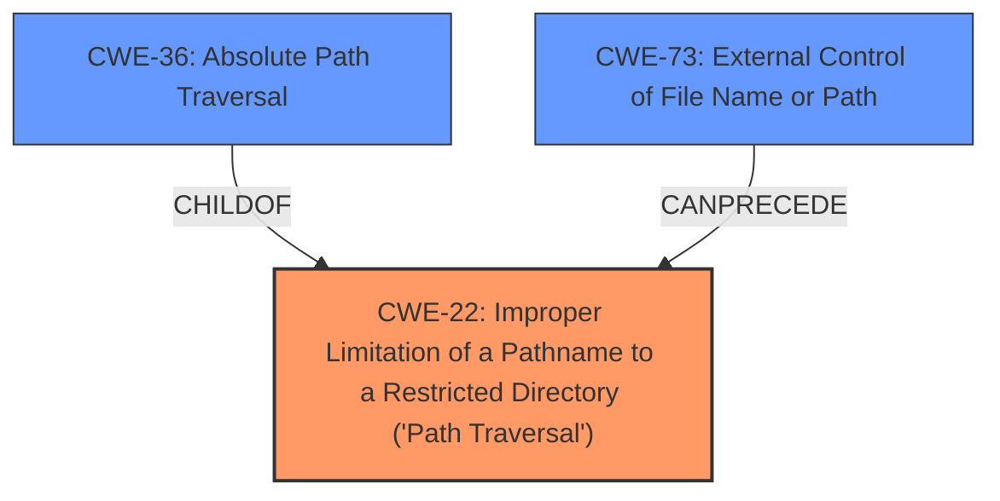

# Enhanced Analysis for CVE-2022-31564

# Summary
| CWE ID | CWE Name | Confidence | CWE Abstraction Level | CWE Vulnerability Mapping Label | CWE-Vulnerability Mapping Notes |
|---|---|---|---|---|---|
| CWE-22 | Improper Limitation of a Pathname to a Restricted Directory ('Path Traversal') | 1.0 | Base | Primary | Allowed |
| CWE-36 | Absolute Path Traversal | 0.9 | Base | Secondary | Allowed |
| CWE-73 | External Control of File Name or Path | 0.7 | Base | Secondary | Allowed |

## Evidence and Confidence

*   **Confidence Score:** 0.9
*   **Evidence Strength:** HIGH

## Relationship Analysis
The primary CWE is CWE-22, which represents the general case of path traversal. CWE-36 is a child of CWE-22 and represents the specific case of absolute path traversal. CWE-73 (External Control of File Name or Path) can precede CWE-22, indicating that external control of the file name or path can lead to path traversal. This relationship clarifies the potential chain of events leading to the vulnerability. The selection of CWE-22 as primary is based on the overall description and the ability to use absolute paths to bypass restrictions.



## Vulnerability Chain
The vulnerability chain starts with external control of the file name or path (CWE-73), which leads to improper limitation of a pathname to a restricted directory (CWE-22), specifically through absolute path traversal (CWE-36).

## Summary of Analysis
The initial analysis focused on identifying the root cause of the vulnerability, which is the **absolute path traversal** due to the unsafe use of the Flask `send_file` function.

The vulnerability description states: "The woduq1414/munhak-moa repository before 2022-05-03 on GitHub allows **absolute path traversal** because the Flask send_file function is used unsafely."

The CVE Reference Links Content Summary provides further evidence:
*   "**Root Cause of Vulnerability:** The root cause for all of these CVEs is the unsafe use of the `flask.send_file` function in the respective repositories. Specifically, the `send_file` function was used with user-controlled input without proper sanitization or validation, leading to path traversal vulnerabilities."
*   "**Weaknesses/Vulnerabilities Present**: The primary vulnerability present is a **path traversal (CWE-22)**, also known as directory traversal. This occurs because the application does not properly validate or sanitize user-supplied file paths before passing them to the `send_file` function. This function will then access the files using an absolute path specified by user."

The retriever results show that CWE-22 has the highest score, followed by CWE-36 and CWE-73. The relationship analysis confirms that CWE-36 is a specific type of CWE-22.

Based on the evidence, CWE-22 is the primary weakness, with CWE-36 and CWE-73 as contributing factors. CWE-22 is at the optimal level of specificity, covering the general case of path traversal, while CWE-36 specifies the absolute path variation. CWE-73 indicates that the file path is externally controlled.

CWEs considered but not used:
*   CWE-23: Relative Path Traversal - While relative path traversal is a common form of path traversal, the vulnerability description specifically mentions **absolute path traversal**, making CWE-36 and the general CWE-22 a better fit.
*   CWE-59: Improper Link Resolution Before File Access ('Link Following') - This CWE is not applicable because the vulnerability involves directly accessing files using absolute paths, rather than following links or shortcuts.
*   CWE-95: Improper Neutralization of Directives in Dynamically Evaluated Code ('Eval Injection') - Not relevant as the issue is path traversal, not code injection.
*   CWE-434: Unrestricted Upload of File with Dangerous Type - This CWE is not applicable because the vulnerability does not involve uploading files.


## CWE Relationship Analysis

Current CWEs represent these abstraction levels: .


### Vulnerability Chain Analysis

**Chain starting from CWE-434:**
- 434 (Unrestricted Upload of File with Dangerous Type) - ROOT


**Chain starting from CWE-36:**
- 36 (Absolute Path Traversal) - ROOT


### CWE Relationship Diagram

```mermaid
graph TD
    classDef primary fill:#f96,stroke:#333,stroke-width:2px
    classDef secondary fill:#69f,stroke:#333
    classDef tertiary fill:#9e9,stroke:#333
```