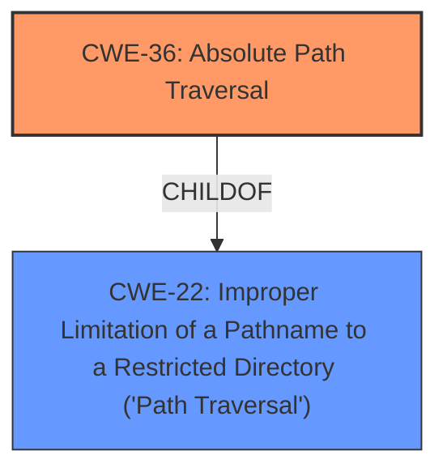

# Analysis Report for CVE-2022-31567

# Vulnerability Analysis Report: CVE-2022-31567

## Description


## Analysis (with Relationship Data)

# Summary

| CWE ID | CWE Name | Confidence | CWE Abstraction Level | CWE Vulnerability Mapping Label | CWE-Vulnerability Mapping Notes |
|---|---|---|---|---|---|
| CWE-36 | Absolute Path Traversal | 1.0 | Base | Allowed | Primary CWE |
| CWE-22 | Improper Limitation of a Pathname to a Restricted Directory ('Path Traversal') | 0.7 | Base | Allowed | Secondary CWE |

## Evidence and Confidence

*   **Confidence Score:** 0.9
*   **Evidence Strength:** HIGH

## Relationship Analysis
The primary relationship that influenced the selection was the ChildOf relationship between CWE-36 and CWE-22. Since the vulnerability is explicitly described as an **absolute path traversal**, CWE-36 is the more specific and appropriate choice as a **Base** level weakness. Although many CVEs in the reference links summarize the weakness as CWE-22, the detailed description allows for the more specific CWE-36 classification.



## Vulnerability Chain
The vulnerability chain starts with the **improper** use of the Flask `send_file` function, leading directly to an **absolute path traversal**.

## Summary of Analysis
The initial analysis focused on identifying the **root cause** of the vulnerability. The description clearly states that the vulnerability is an **absolute path traversal** due to the **unsafe** use of the Flask `send_file` function. The evidence is directly from the "Vulnerability Description" and "CVE Reference Links Content Summary" sections: "The DSABenchmark/DSAB repository through 2.1 on GitHub allows **absolute path traversal** because the Flask send_file function is used **unsafely**."

The graph relationships reinforced that CWE-36 is a more specific instance of CWE-22, thus more appropriate. The selection of CWE-36 is at the optimal level of specificity because it accurately captures the specific type of path traversal (**absolute path traversal**) present in the vulnerability.

Relevant CWE Information:

# Enhanced Context (25 CWEs)
The following CWEs were identified as potentially relevant to this vulnerability:

## CWE-36: Absolute Path Traversal
**Abstraction Level**: Base
**Similarity Score**: 0.82
**Source**: dense

**Description**:
The product uses external input to construct a pathname that should be within a restricted directory, but it does not properly neutralize absolute path sequences such as "/abs/path" that can resolve to a location that is outside of that directory.

**Mapping Guidance**:
- Usage: Allowed
- Rationale: This CWE entry is at the Base level of abstraction, which is a preferred level of abstraction for mapping to the root causes of vulnerabilities.

## CWE-22: Improper Limitation of a Pathname to a Restricted Directory ('Path Traversal')
**Abstraction Level**: Base
**Similarity Score**: 4.33
**Source**: graph

**Description**:
CWE-22: Improper Limitation of a Pathname to a Restricted Directory ('Path Traversal')

**Mapping Guidance**:
- Usage: Allowed
- Rationale: This CWE entry is at the Base level of abstraction, which is a preferred level of abstraction for mapping to the root causes of vulnerabilities.

**Relationships**:
- CANFOLLOW -> CWE-73
- PARENTOF -> CWE-36
- PARENTOF -> CWE-23
- CANFOLLOW -> CWE-20
- CANFOLLOW -> CWE-172

## CWE-73: External Control of File Name or Path
**Abstraction Level**: Base
**Similarity Score**: 4.33
**Source**: graph

**Description**:
CWE-73: External Control of File Name or Path

**Mapping Guidance**:
- Usage: Allowed
- Rationale: This CWE entry is at the Base level of abstraction, which is a preferred level of abstraction for mapping to the root causes of vulnerabilities.

## CWE-23: Relative Path Traversal
**Abstraction Level**: Base
**Similarity Score**: 4.33
**Source**: graph

**Description**:
CWE-23: Relative Path Traversal

**Mapping Guidance**:
- Usage: Allowed
- Rationale: This CWE entry is at the Base level of abstraction, which is a preferred level of abstraction for mapping to the root causes of vulnerabilities.

## CWE-37: Path Traversal: '/absolute/pathname/here'
**Abstraction Level**: Variant
**Similarity Score**: 4.33
**Source**: graph

**Description**:
CWE-37: Path Traversal: '/absolute/pathname/here'

**Mapping Guidance**:
- Usage: Allowed
- Rationale: This CWE entry is at the Variant level of abstraction, which is a preferred level of abstraction for mapping to the root causes of vulnerabilities.

### CWE Details

*   **CWE-36: Absolute Path Traversal**
    *   **Technical Explanation:** The application **fails to properly neutralize absolute path sequences**, allowing an attacker to specify an **absolute path** to access files outside the intended directory.
    *   **Security Implications:** An attacker can read or write arbitrary files on the system, leading to information disclosure, code execution, or denial of service.
    *   **Relationship:** ChildOf CWE-22.
    *   **MITRE Mapping Guidance:** Allowed, as it's a **Base** level weakness.
*   **CWE-22: Improper Limitation of a Pathname to a Restricted Directory ('Path Traversal')**
    *   **Technical Explanation:** The application **does not properly neutralize special elements within the pathname**, allowing the pathname to resolve to a location outside the restricted directory. Although CWE-22 is present in the CVE description, CWE-36 is more specific in this case.
    *   **Security Implications:** Similar to CWE-36, an attacker can read or write arbitrary files.
    *   **Relationship:** ParentOf CWE-36.
    *   **MITRE Mapping Guidance:** Allowed, as it's a **Base** level weakness.
*   **CWE-73: External Control of File Name or Path**: This CWE was considered, but it describes a broader issue where user input controls file names or paths. While this is a contributing factor, the core issue is the **absolute path traversal**, making CWE-36 a more precise fit.
*   **CWE-23: Relative Path Traversal**: This CWE was considered but does not apply as the vulnerability is specifically about **absolute path traversal**, not relative path traversal using sequences like "..".
*   **CWE-37: Path Traversal: '/absolute/pathname/here'**: This CWE is a **Variant** of CWE-36, but the description doesn't provide enough information to specify this **Variant**.


## CWE Relationship Analysis

Current CWEs represent these abstraction levels: .


### Vulnerability Chain Analysis

**Chain starting from CWE-36:**
- 36 (Absolute Path Traversal) - ROOT


**Chain starting from CWE-20:**
- 20 (Improper Input Validation) - ROOT


### CWE Relationship Diagram

```mermaid
graph TD
    classDef primary fill:#f96,stroke:#333,stroke-width:2px
    classDef secondary fill:#69f,stroke:#333
    classDef tertiary fill:#9e9,stroke:#333
```


*Report generated on 2025-03-31 11:29:26*
