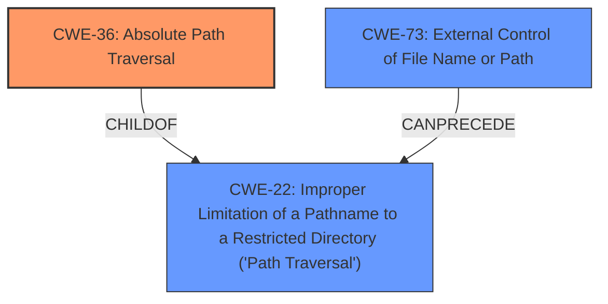

# Enhanced Analysis for CVE-2022-31575

# Summary
| CWE ID | CWE Name | Confidence | CWE Abstraction Level | CWE Vulnerability Mapping Label | CWE-Vulnerability Mapping Notes |
|---|---|---|---|---|---|
| CWE-36 | Absolute Path Traversal | 1.0 | Base | Allowed | Primary CWE |
| CWE-73 | External Control of File Name or Path | 0.7 | Base | Allowed | Secondary Candidate |
| CWE-22 | Improper Limitation of a Pathname to a Restricted Directory ('Path Traversal') | 0.6 | Base | Allowed | Secondary Candidate |

## Evidence and Confidence

*   **Confidence Score:** 0.9
*   **Evidence Strength:** HIGH

## Relationship Analysis
The primary relationship impacting the CWE selection is the parent-child relationship where CWE-36 (**Absolute Path Traversal**) is a child of CWE-22 (**Improper Limitation of a Pathname to a Restricted Directory ('Path Traversal')**). While CWE-22 is a broader category, CWE-36 directly addresses the **absolute path traversal** described in the vulnerability, making it a more precise fit. CWE-73 (**External Control of File Name or Path**) is also considered, as the vulnerability involves external input influencing the file path. The decision favors CWE-36 due to its specific focus on **absolute path traversal**, aligning directly with the vulnerability description.



## Vulnerability Chain
The vulnerability chain starts with **external control** over the file path, followed by the **improper handling** of **absolute paths**, leading to **unauthorized file access**.

`External Control of File Name or Path (CWE-73) -> Improper Limitation of a Pathname to a Restricted Directory ('Path Traversal') (CWE-22) -> Absolute Path Traversal (CWE-36)`

## Summary of Analysis
The initial assessment strongly aligns with the concept of **absolute path traversal** due to the usage of the `Flask send_file` function unsafely, as highlighted in the vulnerability description and CVE reference links. The analysis focuses on identifying the most specific CWE that captures the **root cause** of the vulnerability, which is the failure to properly handle **absolute paths**.

The evidence supporting this decision includes:

*   Vulnerability Description: "**absolute path traversal** because the Flask send_file function is used unsafely."
*   CVE Reference Links Content Summary: "The vulnerability stems from the unsafe use of the `Flask send_file` function, which allows for absolute path traversal... The primary weakness is the **lack of proper sanitization or validation** of user-provided file paths before they are used with the `send_file` function. This allows an attacker to supply an arbitrary file path, potentially leading to access of files outside of the intended directory."

CWE-36 (**Absolute Path Traversal**) is selected as the primary CWE because it directly addresses the identified vulnerability, where the application fails to neutralize **absolute path sequences**, allowing access to unauthorized files. The selection is reinforced by the high similarity scores in the Retriever Results and the CWE descriptions that align with the vulnerability's technical details.

CWE-73 (**External Control of File Name or Path**) and CWE-22 (**Improper Limitation of a Pathname to a Restricted Directory ('Path Traversal')**) are considered but classified as secondary because they represent broader categories. While external control is a contributing factor, the core issue is the specific failure to handle **absolute paths**. Similarly, path traversal encompasses both relative and absolute paths, but the vulnerability description specifically mentions **absolute path traversal**, making CWE-36 a more precise fit.

The final selection prioritizes specificity, aligning with the principle of choosing the most detailed CWE supported by the evidence. CWE-36 is at the optimal level of specificity, providing a clear and accurate representation of the vulnerability.

Relevant CWE Information:

# Enhanced Context (25 CWEs)
The following CWEs were identified as potentially relevant to this vulnerability:

## CWE-23: Relative Path Traversal
**Abstraction Level**: Base
**Similarity Score**: 0.81
**Source**: dense

**Description**:
The product uses external input to construct a pathname that should be within a restricted directory, but it does not properly neutralize sequences such as ".." that can resolve to a location that is outside of that directory.

**Mapping Guidance**:
- Usage: Allowed
- Rationale: This CWE entry is at the Base level of abstraction, which is a preferred level of abstraction for mapping to the root causes of vulnerabilities.

## CWE-36: Absolute Path Traversal
**Abstraction Level**: Base
**Similarity Score**: 0.81
**Source**: dense

**Description**:
The product uses external input to construct a pathname that should be within a restricted directory, but it does not properly neutralize absolute path sequences such as "/abs/path" that can resolve to a location that is outside of that directory.

**Mapping Guidance**:
- Usage: Allowed
- Rationale: This CWE entry is at the Base level of abstraction, which is a preferred level of abstraction for mapping to the root causes of vulnerabilities.

## CWE-37: Path Traversal: '/absolute/pathname/here'
**Abstraction Level**: Variant
**Similarity Score**: 0.79
**Source**: dense

**Description**:
The product accepts input in the form of a slash absolute path ('/absolute/pathname/here') without appropriate validation, which can allow an attacker to traverse the file system to unintended locations or access arbitrary files.

**Mapping Guidance**:
- Usage: Allowed
- Rationale: This CWE entry is at the Variant level of abstraction, which is a preferred level of abstraction for mapping to the root causes of vulnerabilities.

## CWE-24: Path Traversal: '../filedir'
**Abstraction Level**: Variant
**Similarity Score**: 0.78
**Source**: dense

**Description**:
The product uses external input to construct a pathname that should be within a restricted directory, but it does not properly neutralize "../" sequences that can resolve to a location that is outside of that directory.

**Mapping Guidance**:
- Usage: Allowed
- Rationale: This CWE entry is at the Variant level of abstraction, which is a preferred level of abstraction for mapping to the root causes of vulnerabilities.

## CWE-41: Improper Resolution of Path Equivalence
**Abstraction Level**: Base
**Similarity Score**: 0.78
**Source**: dense

**Description**:
The product is vulnerable to file system contents disclosure through path equivalence. Path equivalence involves the use of special characters in file and directory names. The associated manipulations are intended to generate multiple names for the same object.

**Mapping Guidance**:
- Usage: Allowed
- Rationale: This CWE entry is at the Base level of abstraction, which is a preferred level of abstraction for mapping to the root causes of vulnerabilities.

## CWE-59: Improper Link Resolution Before File Access ('Link Following')
**Abstraction Level**: Base
**Similarity Score**: 0.78
**Source**: dense

**Description**:
The product attempts to access a file based on the filename, but it does not properly prevent that filename from identifying a link or shortcut that resolves to an unintended resource.

**Mapping Guidance**:
- Usage: Allowed
- Rationale: This CWE entry is at the Base level of abstraction, which is a preferred level of abstraction for mapping to the root causes of vulnerabilities.

## CWE-73: External Control of File Name or Path
**Abstraction Level**: Base
**Similarity Score**: 0.77
**Source**: dense

**Description**:
The product allows user input to control or influence paths or file names that are used in filesystem operations.

**Mapping Guidance**:
- Usage: Allowed
- Rationale: This CWE entry is at the Base level of abstraction, which is a preferred level of abstraction for mapping to the root causes of vulnerabilities.

## CWE-25: Path Traversal: '/../filedir'
**Abstraction Level**: Variant
**Similarity Score**: 0.77
**Source**: dense

**Description**:
The product uses external input to construct a pathname that should be within a restricted directory, but it does not properly neutralize "/../" sequences that can resolve to a location that is outside of that directory.

**Mapping Guidance**:
- Usage: Allowed
- Rationale: This CWE entry is at the Variant level of abstraction, which is a preferred level of abstraction for mapping to the root causes of vulnerabilities.

## CWE-29: Path Traversal: '\..\filename'
**Abstraction Level**: Variant
**Similarity Score**: 0.76
**Source**: dense

**Description**:
The product uses external input to construct a pathname that should be within a restricted directory, but it does not properly neutralize '\..\filename' (leading backslash dot dot) sequences that can resolve to a location that is outside of that


## CWE Relationship Analysis

Current CWEs represent these abstraction levels: .


### Vulnerability Chain Analysis

**Chain starting from CWE-41:**
- 41 (Improper Resolution of Path Equivalence) - ROOT


**Chain starting from CWE-36:**
- 36 (Absolute Path Traversal) - ROOT


### CWE Relationship Diagram

```mermaid
graph TD
    classDef primary fill:#f96,stroke:#333,stroke-width:2px
    classDef secondary fill:#69f,stroke:#333
    classDef tertiary fill:#9e9,stroke:#333
```