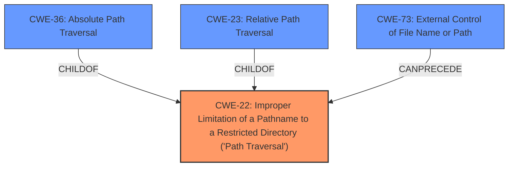

# Enhanced Analysis for CVE-2022-31576

# Summary
| CWE ID | CWE Name | Confidence | CWE Abstraction Level | CWE Vulnerability Mapping Label | CWE-Vulnerability Mapping Notes |
|---|---|---|---|---|---|
| CWE-22 | Improper Limitation of a Pathname to a Restricted Directory ('Path Traversal') | 1.0 | Base | Primary | Allowed |
| CWE-36 | Absolute Path Traversal | 0.8 | Base | Secondary | Allowed |
| CWE-73 | External Control of File Name or Path | 0.6 | Base | Secondary | Allowed |

## Evidence and Confidence

*   **Confidence Score:** 0.9
*   **Evidence Strength:** HIGH

## Relationship Analysis
The primary CWE is CWE-22, which represents the **improper limitation of a pathname** to a restricted directory. CWE-36 (Absolute Path Traversal) and CWE-23 (Relative Path Traversal) are children of CWE-22, representing specific types of path traversal. CWE-73 (External Control of File Name or Path) can precede CWE-22, as external control is a prerequisite for path traversal vulnerabilities.



## Vulnerability Chain
The chain starts with external control of the filename or path (CWE-73), leading to **improper limitation of a pathname** to a restricted directory (CWE-22), specifically an absolute path traversal (CWE-36). The **root cause** is the unsafe use of the `flask.send_file` function, leading to potential information disclosure.

## Summary of Analysis
The analysis is based on the vulnerability description and CVE reference content summary. The **root cause** is the insecure usage of the `flask.send_file` function. The vulnerability is an **absolute path traversal** issue. The primary CWE is CWE-22 because it describes the **improper limitation of a pathname** to a restricted directory. CWE-36, Absolute Path Traversal, is also applicable because the vulnerability is explicitly described as an absolute path traversal. CWE-73 is included because external control of the filename is a prerequisite for path traversal.

The evidence is taken from the CVE Reference Links Content Summary:
*   "The vulnerability stems from the insecure use of the `flask.send_file` function in the `heidi-luong1109/shackerpanel` repository. The `send_file` function, when not used carefully, can allow an attacker to traverse the file system using malicious input."
*   "The primary weakness is the usage of the `send_file` function with untrusted input, which permits absolute path traversal attacks. This is a classic CWE-22 vulnerability."

CWE-22 is at the Base level of abstraction and is the most appropriate because the description explicitly mentions a path traversal issue due to the **improper limitation of a pathname**.

CWE-37, CWE-24, CWE-23, CWE-59 and CWE-434 were considered but not used. CWE-37 and CWE-24 are too specific as they describe specific path traversal sequences, while the description only mentions **absolute path traversal**. CWE-23 is for *relative* path traversal, but the vulnerability description states *absolute* path traversal. CWE-59 is for improper link resolution, which is not the case here. CWE-434 is for unrestricted file uploads, which is also not the case.

Relevant CWE Information:

# Enhanced Context (25 CWEs)
## CWE-22: Improper Limitation of a Pathname to a Restricted Directory ('Path Traversal')
**Abstraction:** Base
**Status:** Stable

### Description
The product uses external input to construct a pathname that is intended to identify a file or directory that is located underneath a restricted parent directory, but the product does not properly neutralize special elements within the pathname that can cause the pathname to resolve to a location that is outside of the restricted directory.

### Extended Description
Many file operations are intended to take place within a restricted directory. By using special elements such as ".." and "/" separators, attackers can escape outside of the restricted location to access files or directories that are elsewhere on the system. One of the most common special elements is the "../" sequence, which in most modern operating systems is interpreted as the parent directory of the current location. This is referred to as relative path traversal. Path traversal also covers the use of absolute pathnames such as "/usr/local/bin" to access unexpected files. This is referred to as absolute path traversal.

### Mapping Guidance
**Usage:** Allowed
**Rationale:** This CWE entry is at the Base level of abstraction, which is a preferred level of abstraction for mapping to the root causes of vulnerabilities.

## CWE-36: Absolute Path Traversal
**Abstraction:** Base
**Status:** Draft

### Description
The product uses external input to construct a pathname that should be within a restricted directory, but it does not properly neutralize absolute path sequences such as "/abs/path" that can resolve to a location that is outside of that directory.

### Extended Description
This allows attackers to traverse the file system to access files or directories that are outside of the restricted directory.

### Relationships
ChildOf -> CWE-22

### Mapping Guidance
**Usage:** Allowed
**Rationale:** This CWE entry is at the Base level of abstraction, which is a preferred level of abstraction for mapping to the root causes of vulnerabilities.

## CWE-73: External Control of File Name or Path
**Abstraction:** Base
**Status:** Draft

### Description
The product allows user input to control or influence paths or file names that are used in filesystem operations.

### Extended Description
This could allow an attacker to access or modify system files or other files that are critical to the application.

Path manipulation errors occur when the following two conditions are met:
1.  An attacker can specify a path used in an operation on the filesystem.
2.  By specifying the resource, the attacker gains a capability that would not otherwise be permitted.
For example, the program may give the attacker the ability to overwrite the specified file or run with a configuration controlled by the attacker.

### Relationships
CanPrecede -> CWE-22

### Mapping Guidance
**Usage:** Allowed
**Rationale:** This CWE entry is at the Base level of abstraction, which is a preferred level of abstraction for mapping to the root causes of vulnerabilities.


## CWE Relationship Analysis

Current CWEs represent these abstraction levels: .


### Vulnerability Chain Analysis

**Chain starting from CWE-434:**
- 434 (Unrestricted Upload of File with Dangerous Type) - ROOT


**Chain starting from CWE-36:**
- 36 (Absolute Path Traversal) - ROOT


### CWE Relationship Diagram

```mermaid
graph TD
    classDef primary fill:#f96,stroke:#333,stroke-width:2px
    classDef secondary fill:#69f,stroke:#333
    classDef tertiary fill:#9e9,stroke:#333
```