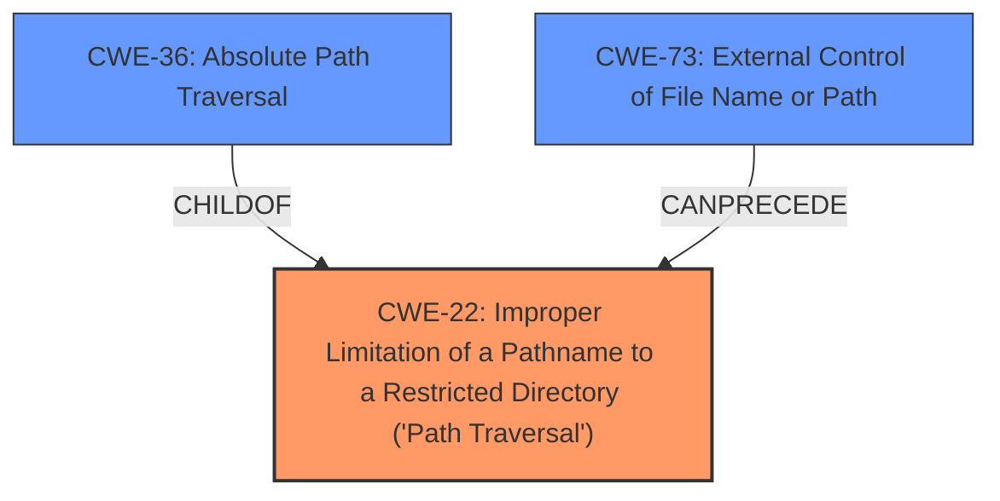

# Raw Analyzer Response for CVE-2022-31579

```markdown
# Summary 
| CWE ID    | CWE Name                                                                                     | Confidence | CWE Abstraction Level | CWE Vulnerability Mapping Label | CWE-Vulnerability Mapping Notes |
| --------- | -------------------------------------------------------------------------------------------- | ---------- | --------------------- | ------------------------------- | ------------------------------- |
| CWE-22    | Improper Limitation of a Pathname to a Restricted Directory ('Path Traversal')               | 1          | Base                  | Primary                         | Allowed                        |
| CWE-36    | Absolute Path Traversal                                                                      | 0.9        | Base                  | Secondary                       | Allowed                        |
| CWE-73    | External Control of File Name or Path                                                        | 0.8        | Base                  | Secondary                       | Allowed                        |

## Evidence and Confidence

*   **Confidence Score:** 0.9
*   **Evidence Strength:** HIGH

## Relationship Analysis
The primary CWE is CWE-22, with CWE-36 and CWE-73 as related weaknesses. CWE-22 is the parent of CWE-36, indicating that absolute path traversal is a specific type of path traversal. CWE-73 can precede CWE-22, suggesting that external control of the file path makes path traversal possible. The abstraction levels are all Base, indicating a good level of specificity.



## Vulnerability Chain
The vulnerability chain starts with the external control of the file name or path (CWE-73), which leads to improper limitation of a pathname to a restricted directory, resulting in path traversal (CWE-22). The absolute path traversal (CWE-36) is a specific type of path traversal in this case.

## Summary of Analysis
The initial analysis focused on **absolute path traversal** as the main **weakness**, as highlighted in the vulnerability description. The retriever results strongly suggested CWE-22, CWE-36, and CWE-73. After reviewing the vulnerability description and the supporting evidence from the CVE reference links, it's clear that the application **does not properly** validate the file path, allowing attackers to use **absolute paths** to access files outside the intended web root.

The evidence from the "CVE Reference Links Content Summary" section explicitly states: "The vulnerability stems from the unsafe usage of the `flask.send_file` function in Flask-based Python web applications," and "when the filename parameter is directly controlled by the attacker, it allows for absolute path traversal, enabling the attacker to access files and directories outside of the intended web root." This aligns perfectly with the description of CWE-22 and CWE-36.

CWE-73 is also relevant because the file path is externally controlled. The chain relationship where CWE-73 can precede CWE-22 further strengthens this mapping.

The final decision is based on the provided evidence, the retriever results, and the relationship analysis, leading to the selection of CWE-22 as the primary weakness, with CWE-36 and CWE-73 as secondary contributing factors. The selected CWEs are at the optimal level of specificity, with Base level abstractions providing a clear and accurate representation of the vulnerability.

Relevant CWE Information:

# Enhanced Context (25 CWEs)

## CWE-22: Improper Limitation of a Pathname to a Restricted Directory ('Path Traversal')
**Abstraction Level**: Base
**Similarity Score**: 4.33
**Source**: graph

**Description**:
The product uses external input to construct a pathname that is intended to identify a file or directory that is located underneath a restricted parent directory, but the product **does not properly neutralize** special elements within the pathname that can cause the pathname to resolve to a location that is outside of the restricted directory.

**Mapping Guidance**:
- Usage: Allowed
- Rationale: This CWE entry is at the Base level of abstraction, which is a preferred level of abstraction for mapping to the root causes of vulnerabilities.

**Relationships**:
- CANFOLLOW -> CWE-73
- PARENTOF -> CWE-36
- PARENTOF -> CWE-23
- CANFOLLOW -> CWE-20
- CANFOLLOW -> CWE-172

**Justification:** This CWE accurately describes the core issue: the application **fails to restrict** the pathname to a specific directory, allowing traversal.

## CWE-36: Absolute Path Traversal
**Abstraction Level**: Base
**Similarity Score**: 9986.66
**Source**: sparse

**Description**:
The product uses external input to construct a pathname that should be within a restricted directory, but it **does not properly neutralize absolute path sequences** such as "/abs/path" that can resolve to a location that is outside of that directory.

**Mapping Guidance**:
- Usage: Allowed
- Rationale: This CWE entry is at the Base level of abstraction, which is a preferred level of abstraction for mapping to the root causes of vulnerabilities.

**Justification:** This CWE is relevant as the vulnerability description mentions **absolute path traversal**. It is a child of CWE-22, making it a more specific instance of path traversal.

## CWE-73: External Control of File Name or Path
**Abstraction Level**: Base
**Similarity Score**: 9315.28
**Source**: sparse

**Description**:
The product allows user input to control or influence paths or file names that are used in filesystem operations.

**Mapping Guidance**:
- Usage: Allowed
- Rationale: This CWE entry is at the Base level of abstraction, which is a preferred level of abstraction for mapping to the root causes of vulnerabilities.

**Relationships**:
- PARENTOF -> CWE-114
- CANPRECEDE -> CWE-59
- CANPRECEDE -> CWE-434
- CANPRECEDE -> CWE-98
- CANPRECEDE -> CWE-41

**Justification:** The vulnerability involves the `filename` parameter being directly controlled by the attacker. This external control is a prerequisite for the path traversal vulnerability.

## Other CWEs Considered:
- CWE-23: Relative Path Traversal: While relative path traversal is a common type of path traversal, the vulnerability description specifically mentions **absolute path traversal**, making CWE-36 a more appropriate fit.
- CWE-59: Improper Link Resolution Before File Access ('Link Following'): This CWE is not directly relevant as the vulnerability does not involve symbolic links.
```