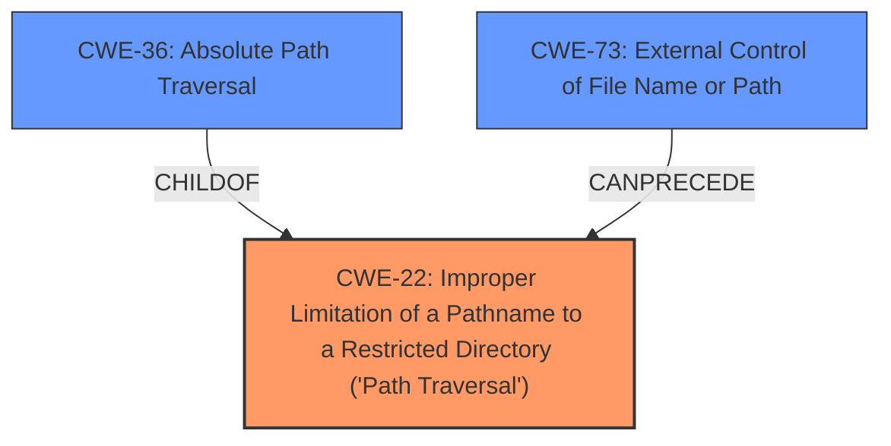

# Analysis for CVE-2022-31579

```markdown
# Summary 
| CWE ID    | CWE Name                                                                                     | Confidence | CWE Abstraction Level | CWE Vulnerability Mapping Label | CWE-Vulnerability Mapping Notes |
| --------- | -------------------------------------------------------------------------------------------- | ---------- | --------------------- | ------------------------------- | ------------------------------- |
| CWE-22    | Improper Limitation of a Pathname to a Restricted Directory ('Path Traversal')               | 1          | Base                  | Primary                         | Allowed                        |
| CWE-36    | Absolute Path Traversal                                                                      | 0.9        | Base                  | Secondary                       | Allowed                        |
| CWE-73    | External Control of File Name or Path                                                        | 0.8        | Base                  | Secondary                       | Allowed                        |

## Evidence and Confidence

*   **Confidence Score:** 0.9
*   **Evidence Strength:** HIGH

## Relationship Analysis
The primary CWE is CWE-22, with CWE-36 and CWE-73 as related weaknesses. CWE-22 is the parent of CWE-36, indicating that absolute path traversal is a specific type of path traversal. CWE-73 can precede CWE-22, suggesting that external control of the file path makes path traversal possible. The abstraction levels are all Base, indicating a good level of specificity.



## Vulnerability Chain
The vulnerability chain starts with the external control of the file name or path (CWE-73), which leads to improper limitation of a pathname to a restricted directory, resulting in path traversal (CWE-22). The absolute path traversal (CWE-36) is a specific type of path traversal in this case.

## Summary of Analysis
The initial analysis focused on **absolute path traversal** as the main **weakness**, as highlighted in the vulnerability description. The retriever results strongly suggested CWE-22, CWE-36, and CWE-73. After reviewing the vulnerability description and the supporting evidence from the CVE reference links, it's clear that the application **does not properly** validate the file path, allowing attackers to use **absolute paths** to access files outside the intended web root.

The evidence from the "CVE Reference Links Content Summary" section explicitly states: "The vulnerability stems from the unsafe usage of the `flask.send_file` function in Flask-based Python web applications," and "when the filename parameter is directly controlled by the attacker, it allows for absolute path traversal, enabling the attacker to access files and directories outside of the intended web root." This aligns perfectly with the description of CWE-22 and CWE-36.

CWE-73 is also relevant because the file path is externally controlled. The chain relationship where CWE-73 can precede CWE-22 further strengthens this mapping.

The final decision is based on the provided evidence, the retriever results, and the relationship analysis, leading to the selection of CWE-22 as the primary weakness, with CWE-36 and CWE-73 as secondary contributing factors. The selected CWEs are at the optimal level of specificity, with Base level abstractions providing a clear and accurate representation of the vulnerability.

Relevant CWE Information:

# Enhanced Context (25 CWEs)

## CWE-22: Improper Limitation of a Pathname to a Restricted Directory ('Path Traversal')
**Abstraction Level**: Base
**Similarity Score**: 4.33
**Source**: graph

**Description**:
The product uses external input to construct a pathname that is intended to identify a file or directory that is located underneath a restricted parent directory, but the product **does not properly neutralize** special elements within the pathname that can cause the pathname to resolve to a location that is outside of the restricted directory.

**Mapping Guidance**:
- Usage: Allowed
- Rationale: This CWE entry is at the Base level of abstraction, which is a preferred level of abstraction for mapping to the root causes of vulnerabilities.

**Relationships**:
- CANFOLLOW -> CWE-73
- PARENTOF -> CWE-36
- PARENTOF -> CWE-23
- CANFOLLOW -> CWE-20
- CANFOLLOW -> CWE-172

**Justification:** This CWE accurately describes the core issue: the application **fails to restrict** the pathname to a specific directory, allowing traversal.

## CWE-36: Absolute Path Traversal
**Abstraction Level**: Base
**Similarity Score**: 9986.66
**Source**: sparse

**Description**:
The product uses external input to construct a pathname that should be within a restricted directory, but it **does not properly neutralize absolute path sequences** such as "/abs/path" that can resolve to a location that is outside of that directory.

**Mapping Guidance**:
- Usage: Allowed
- Rationale: This CWE entry is at the Base level of abstraction, which is a preferred level of abstraction for mapping to the root causes of vulnerabilities.

**Justification:** This CWE is relevant as the vulnerability description mentions **absolute path traversal**. It is a child of CWE-22, making it a more specific instance of path traversal.

## CWE-73: External Control of File Name or Path
**Abstraction Level**: Base
**Similarity Score**: 9315.28
**Source**: sparse

**Description**:
The product allows user input to control or influence paths or file names that are used in filesystem operations.

**Mapping Guidance**:
- Usage: Allowed
- Rationale: This CWE entry is at the Base level of abstraction, which is a preferred level of abstraction for mapping to the root causes of vulnerabilities.

**Relationships**:
- PARENTOF -> CWE-114
- CANPRECEDE -> CWE-59
- CANPRECEDE -> CWE-434
- CANPRECEDE -> CWE-98
- CANPRECEDE -> CWE-41

**Justification:** The vulnerability involves the `filename` parameter being directly controlled by the attacker. This external control is a prerequisite for the path traversal vulnerability.

## Other CWEs Considered:
- CWE-23: Relative Path Traversal: While relative path traversal is a common type of path traversal, the vulnerability description specifically mentions **absolute path traversal**, making CWE-36 a more appropriate fit.
- CWE-59: Improper Link Resolution Before File Access ('Link Following'): This CWE is not directly relevant as the vulnerability does not involve symbolic links.
```

# Enhanced Query for CVE-2022-31579

## Vulnerability Description
The ralphjzhang/iasset repository through 2022-05-04 on GitHub allows **absolute path traversal** because the Flask send_file function is used unsafely.

### Vulnerability Description Key Phrases
- **weakness:** **absolute path traversal**
- **product:** ralphjzhang/iasset
- **version:** through 2022-05-04

## CVE Reference Links Content Summary
Based on the provided content, here's a breakdown of the identified vulnerability (CVE-2022-315XX), which is present across multiple repositories:

**Root Cause of Vulnerability:**

*   The vulnerability stems from the unsafe usage of the `flask.send_file` function in Flask-based Python web applications.
*   The `send_file` function is used to send a file to the client, but when the filename parameter is directly controlled by the attacker, it allows for absolute path traversal, enabling the attacker to access files and directories outside of the intended web root.
*   The use of  `os.path.join` with untrusted input. When the `os.path.join` call encounters an absolute path, it ignores all parameters before the absolute path, leading to unsafe usage of the `send_file` function

**Weaknesses/Vulnerabilities Present:**

*   **CWE-22: Improper Limitation of a Pathname to a Restricted Directory ('Path Traversal')**: The core vulnerability is a classic path traversal issue. The application does not validate or sanitize the file path provided by the user, allowing the attacker to navigate the file system using absolute paths or `../` sequences.
*   The main weakness lies in the use of `send_file` with user-controlled input without proper sanitization or validation

**Impact of Exploitation:**

*   **Confidentiality**:  An attacker could read arbitrary files on the server's file system. This could include sensitive configuration files, application source code, or database credentials.
*   **Availability**: An attacker might make multiple requests for large files, potentially leading to a partial denial of service.
*   **Integrity**: Directly modifying files is not a primary impact, however, once a file is read it may expose credentials needed to modify server files.

**Attack Vectors:**

*   The attack vector is through a network request to the vulnerable Flask application.
*   Attackers can manipulate the `filename` (or similar) parameter in the HTTP request to include absolute path or directory traversal sequences to access arbitrary files.

**Required Attacker Capabilities/Position:**

*   The attacker only needs network access to the vulnerable Flask application.
*   No authentication is required to exploit the vulnerability.
*   No user interaction is required.
*   The attacker is required to know the name and location of the files on the server they wish to access.

**Additional Notes:**

*   The vulnerability has a **Critical** severity rating with a CVSS score of 9.3 (or 9.8 in the case of CVE-2022-31570)
*   The `send_file` function is not intended to be used directly with user input without validation, `flask.safe_join` or `flask.send_from_directory` should be used instead
*   Many of the repositories listed are personal or hobby projects, or projects without a clear vendor or release, indicating that they were likely identified via automated scanning.

Here's a summary table based on the provided information:

| CVE ID        | Repository                                                              | Affected Versions      | Root Cause                          | Impact                   | Attack Vector |
| ------------- | ----------------------------------------------------------------------- | --------------------- | ----------------------------------- | ------------------------- | --------------- |
| CVE-2022-31504 | ChangeWeDer/BaiduWenkuSpider\_flaskWeb                       | Unknown               | Unsafe `flask.send_file` with attacker controlled path param | Read arbitrary files, DOS | Network         |
| CVE-2022-31505 | cheo0/MercadoEnLineaBack                                                 | Unknown               | Unsafe `flask.send_file` with attacker controlled path param       | Read arbitrary files, DOS | Network         |
| CVE-2022-31509 | iedadata/usap-dc-website                                                 | Unknown               | Unsafe `flask.send_file` with attacker controlled path param       | Read arbitrary files, DOS | Network         |
| CVE-2022-31510 | sergeKashkin/Simple-RAT                                                 | Before 2022-05-03       | Unsafe `flask.send_file` with attacker controlled path param | Read arbitrary files, DOS | Network         |
| CVE-2022-31511 | AFDudley/equanimity                                                    | Before 2014-04-23       | Unsafe `flask.send_file` with attacker controlled path param | Read arbitrary files, DOS | Network         |
| CVE-2022-31512 | Atom02/flask-mvc                                                         | Unknown               | Unsafe `flask.send_file` with attacker controlled path param | Read arbitrary files, DOS | Network         |
| CVE-2022-31513 | BolunHan/Krypton                                                        | Before 2021-06-03       | Unsafe `flask.send_file` with attacker controlled path param | Read arbitrary files, DOS | Network         |
| CVE-2022-31514 | Caoyongqi912/Fan\_Platform                                                 | Before 2021-04-20       | Unsafe `flask.send_file` with attacker controlled path param | Read arbitrary files, DOS | Network         |
| CVE-2022-31515 | Delor4/CarceresBE                                                        | Before 1.0        | Unsafe `flask.send_file` with attacker controlled path param | Read arbitrary files, DOS | Network         |
| CVE-2022-31516 | Harveyzyh/Python                                                      | Before 2022-05-04       | Unsafe `flask.send_file` with attacker controlled path param | Read arbitrary files, DOS | Network         |
| CVE-2022-31518 | JustAnotherSoftwareDeveloper/Python-Recipe-Database                | Unknown               | Unsafe `flask.send_file` with attacker controlled path param       | Read arbitrary files, DOS | Network         |
| CVE-2022-31520 | Luxas98/logstash-management-api                                             | Unknown               | Unsafe `flask.send_file` with attacker controlled path param       | Read arbitrary files, DOS | Network         |
| CVE-2022-31521 | Niyaz-Mohamed/mosaic                                                  | Through 1.0.0       | Unsafe `flask.send_file` with attacker controlled path param       | Read arbitrary files, DOS | Network         |
| CVE-2022-31526 | ThundeRatz/ThunderDocs                                                 | Before 2022-05-03       | Unsafe `flask.send_file` with attacker controlled path param       | Read arbitrary files, DOS | Network         |
| CVE-2022-31527 | Wildog/flask-file-server                                             | Before 2020-02-20       | Unsafe `flask.send_file` with attacker controlled path param        | Read arbitrary files, DOS | Network         |
| CVE-2022-31528 | bonn-activity-maps/bam\_annotation\_tool                             | Before 2021-08-31       | Unsafe `flask.send_file` with attacker controlled path param        | Read arbitrary files, DOS | Network         |
| CVE-2022-31532 | dankolbman/travel\_blahg                                                  | Through 2016-01-16      | Unsafe `flask.send_file` with attacker controlled path param        | Read arbitrary files, DOS | Network         |
| CVE-2022-31533 | decentraminds/umbral                                                | Before 2020-01-15       | Unsafe `flask.send_file` with attacker controlled path param        | Read arbitrary files, DOS | Network         |
| CVE-2022-31534 | echoleegroup/PythonWeb                                                | Before 2018-10-31       | Unsafe `flask.send_file` with attacker controlled path param        | Read arbitrary files, DOS | Network         |
| CVE-2022-31535 | freefood89/Fishtank                                                    | Before 2015-06-24       | Unsafe `flask.send_file` with attacker controlled path param        | Read arbitrary files, DOS | Network         |
| CVE-2022-31536 | jaygarza1982/ytdl-sync                                              | Before 2021-01-02       | Unsafe `flask.send_file` with attacker controlled path param        | Read arbitrary files, DOS | Network         |
| CVE-2022-31537 | jmcginty15/Solar-system-simulator                                  | Before 2021-07-26       | Unsafe `flask.send_file` with attacker controlled path param        | Read arbitrary files, DOS | Network         |
| CVE-2022-31538 | joaopedro-fg/mp-m08-interface                                     | Before 2020-12-10       | Unsafe `flask.send_file` with attacker controlled path param        | Read arbitrary files, DOS | Network         |
| CVE-2022-31540 | kumardeepak/hin-eng-preprocessing                                   | Before 2019-07-16       | Unsafe `flask.send_file` with attacker controlled path param        | Read arbitrary files, DOS | Network         |
| CVE-2022-31544 | meerstein/rbtm                                                          | Through 1.5    | Unsafe `flask.send_file` with attacker controlled path param        | Read arbitrary files, DOS | Network         |
| CVE-2022-31545 | ml-inory/ModelConverter                                               | Before 2021-04-26       | Unsafe `flask.send_file` with attacker controlled path param       | Read arbitrary files, DOS | Network         |
| CVE-2022-31546 | nlpweb/glance                                                          | Before 2014-06-27       | Unsafe `flask.send_file` with attacker controlled path param        | Read arbitrary files, DOS | Network         |
| CVE-2022-31547 | noamezekiel/sphere                                                     | Before 2021-02-21       | Unsafe `flask.send_file` with attacker controlled path param        | Read arbitrary files, DOS | Network         |
| CVE-2022-31548 | nrlakin/homepage                                                      | Before 2017-03-06       | Unsafe `flask.send_file` with attacker controlled path param        | Read arbitrary files, DOS | Network         |
| CVE-2022-31551 | pleomax00/flask-mongo-skel                                            | Before 2021-11-01      | Unsafe `flask.send_file` with attacker controlled path param        | Read arbitrary files, DOS | Network         |
| CVE-2022-31552 | project-anuvaad/anuvaad-corpus                                       | Before 2020-11-23       | Unsafe `flask.send_file` with attacker controlled path param        | Read arbitrary files, DOS | Network         |
| CVE-2022-31553 | rainsoupah/sleep-learner                                               | Before 2021-02-21       | Unsafe `flask.send_file` with attacker controlled path param        | Read arbitrary files, DOS | Network         |
| CVE-2022-31554 | rohitnayak/movie-review-sentiment-analysis                         | Before 2017-05-07       | Unsafe `flask.send_file` with attacker controlled path param        | Read arbitrary files, DOS | Network         |
| CVE-2022-31555 | romain20100/nursequest                                                 | Before 2018-02-22       | Unsafe `flask.send_file` with attacker controlled path param        | Read arbitrary files, DOS | Network         |
| CVE-2022-31556 | rusyasoft/TrainEnergyServer                                         | Before 2017-08-03       | Unsafe `flask.send_file` with attacker controlled path param        | Read arbitrary files, DOS | Network         |
| CVE-2022-31557 | seveas/golem                                                            | Before 2016-05-17       | Unsafe `flask.send_file` with attacker controlled path param        | Read arbitrary files, DOS | Network         |
| CVE-2022-31559 | tsileo/flask-yeoman                                                  | Before 2013-09-13       | Unsafe `flask.send_file` with attacker controlled path param        | Read arbitrary files, DOS | Network         |
| CVE-2022-31560 | uncleYiba/photo\_tag                                               | Before 2020-08-31       | Unsafe `flask.send_file` with attacker controlled path param        | Read arbitrary files, DOS | Network         |
| CVE-2022-31561 | varijkapil13/Sphere\_ImageBackend                                   | Before 2019-10-03       | Unsafe `flask.send_file` with attacker controlled path param        | Read arbitrary files, DOS | Network         |
| CVE-2022-31562 | waveyan/internshipsystem                                                | Before 2018-05-22       | Unsafe `flask.send_file` with attacker controlled path param        | Read arbitrary files, DOS | Network         |
| CVE-2022-31563 | whmacmac/vprj                                                            | Before 2022-04-06       | Unsafe `flask.send_file` with attacker controlled path param        | Read arbitrary files, DOS | Network         |
| CVE-2022-31564 | woduq1414/munhak-moa                                                 | Before 2022-05-03       | Unsafe `flask.send_file` with attacker controlled path param        | Read arbitrary files, DOS | Network         |
| CVE-2022-31565 | yogson/syrabond                                                        | Before 2020-05-25       | Unsafe `flask.send_file` with attacker controlled path param        | Read arbitrary files, DOS | Network         |
| CVE-2022-31566 | DSAB-local/DSAB                                                        | Before 2016-07-19       | Unsafe `flask.send_file` with attacker controlled path param        | Read arbitrary files, DOS | Network         |
| CVE-2022-31567 | DSABenchmark/DSAB                                                      | Before 2017-08-03        | Unsafe `flask.send_file` with attacker controlled path param        | Read arbitrary files, DOS | Network         |
| CVE-2022-31568 | Rexians/rex-web                                                         | Before 2022-06-05       | Unsafe `flask.send_file` with attacker controlled path param        | Read arbitrary files, DOS | Network         |
| CVE-2022-31570 | adriankoczuruek/ceneo-web-scrapper                                       | Before 2021-03-15       | Unsafe `flask.send_file` with attacker controlled path param        | Read arbitrary files, DOS | Network         |
| CVE-2022-31571 | akashtalole/python-flask-restful-api                                | Before 2019-09-16       | Unsafe `flask.send_file` with attacker controlled path param        | Read arbitrary files, DOS | Network         |
| CVE-2022-31572 | ceee-vip/cockybook                                                     | Before 2015-04-16       | Unsafe `flask.send_file` with attacker controlled path param        | Read arbitrary files, DOS | Network         |
| CVE-2022-31574 | deepaliupadhyay/RealEstate                                            | Before 2018-11-30      | Unsafe `flask.send_file` with attacker controlled path param        | Read arbitrary files, DOS | Network         |
| CVE-2022-31575 | duducosmos/livro\_python                                                | Before 2018-06-06       | Unsafe `flask.send_file` with attacker controlled path param        | Read arbitrary files, DOS | Network         |
| CVE-2022-31576 | heidi-luong1109/shackerpanel                                            | Before 2021-05-25       | Unsafe `flask.send_file` with attacker controlled path param        | Read arbitrary files, DOS | Network         |
| CVE-2022-31577 | longmaoteamtf/audio\_aligner\_app                                    | Before 2019-10-10        | Unsafe `flask.send_file` with attacker controlled path param        | Read arbitrary files, DOS | Network         |
| CVE-2022-31578 | piaoyunsoft/bt\_lnmp                                                | Before 2019-10-10        | Unsafe `flask.send_file` with attacker controlled path param        | Read arbitrary files, DOS | Network         |
| CVE-2022-31579 | ralphjzhang/iasset                                                       | Before 2022-05-04      | Unsafe `flask.send_file` with attacker controlled path param        | Read arbitrary files, DOS | Network         |
| CVE-2022-31582 | shaolo1/VideoServer                                                       | Before 2019-09-21       | Unsafe `flask.send_file` with attacker controlled path param       | Read arbitrary files, DOS | Network         |
| CVE-2022-31583 | sravaniboinepelli/AutomatedQuizEval                                 | Before 2020-04-27       | Unsafe `flask.send_file` with attacker controlled path param        | Read arbitrary files, DOS | Network         |
| CVE-2022-31585 | umeshpatil-dev/Home\_\_internet                                          | Before 2020-08-28       | Unsafe `flask.send_file` with attacker controlled path param        | Read arbitrary files, DOS | Network         |
| CVE-2022-31587 | yuriyouzhou/KG-fashion-chatbot                                         | Before 2018-05-22       | Unsafe `flask.send_file` with attacker controlled path param        | Read arbitrary files, DOS | Network         |
| CVE-2022-31588 | zippies/testplatform                                                 | Through 2016-07-19       | Unsafe `flask.send_file` with attacker controlled path param        | Read arbitrary files, DOS | Network         |

It's worth noting that this vulnerability can be addressed by using `flask.safe_join` or `flask.send_from_directory` instead of directly using `flask.send_file` with user-provided input.

## Retriever Results

### Top Combined Results

| Rank | CWE ID | Name | Abstraction | Usage  | Retrievers | Individual Scores |
|------|--------|------|-------------|-------|------------|-------------------|
| 1 | 22 | Improper Limitation of a Pathname to a Restricted Directory ('Path Traversal') | Base | Allowed | alternate_terms | 0.800 |
| 2 | 36 | Absolute Path Traversal | Base | Allowed | sparse | 0.343 |
| 3 | 73 | External Control of File Name or Path | Base | Allowed | sparse | 0.195 |
| 4 | 23 | Relative Path Traversal | Base | Allowed | sparse | 0.140 |
| 5 | 37 | Path Traversal: '/absolute/pathname/here' | Variant | Allowed | sparse | 0.124 |
| 6 | 24 | Path Traversal: '../filedir' | Variant | Allowed | dense | 0.563 |
| 7 | 59 | Improper Link Resolution Before File Access ('Link Following') | Base | Allowed | graph | 0.002 |
| 8 | 38 | Path Traversal: '\absolute\pathname\here' | Variant | Allowed | sparse | 0.111 |
| 9 | 39 | Path Traversal: 'C:dirname' | Variant | Allowed | sparse | 0.102 |
| 10 | 182 | Collapse of Data into Unsafe Value | Base | Allowed | sparse | 0.101 |


# Complete CWE Specifications


## CWE-22: Improper Limitation of a Pathname to a Restricted Directory ('Path Traversal')
**Abstraction:** Base
**Status:** Stable

### Description
The product uses external input to construct a pathname that is intended to identify a file or directory that is located underneath a restricted parent directory, but the product does not properly neutralize special elements within the pathname that can cause the pathname to resolve to a location that is outside of the restricted directory.

### Extended Description


Many file operations are intended to take place within a restricted directory. By using special elements such as ".." and "/" separators, attackers can escape outside of the restricted location to access files or directories that are elsewhere on the system. One of the most common special elements is the "../" sequence, which in most modern operating systems is interpreted as the parent directory of the current location. This is referred to as relative path traversal. Path traversal also covers the use of absolute pathnames such as "/usr/local/bin" to access unexpected files. This is referred to as absolute path traversal.


### Alternative Terms
Directory traversal
Path traversal: "Path traversal" is preferred over "directory traversal," but both terms are attack-focused.

### Relationships
ChildOf -> CWE-706
ChildOf -> CWE-706
ChildOf -> CWE-668

### Mapping Guidance
**Usage:** Allowed
**Rationale:** This CWE entry is at the Base level of abstraction, which is a preferred level of abstraction for mapping to the root causes of vulnerabilities.
**Comments:** Carefully read both the name and description to ensure that this mapping is an appropriate fit. Do not try to 'force' a mapping to a lower-level Base/Variant simply to comply with this preferred level of abstraction.
**Reasons:**
- Acceptable-Use


### Additional Notes
**[Other]** In many programming languages, the injection of a null byte (the 0 or NUL) may allow an attacker to truncate a generated filename to apply to a wider range of files. For example, the product may add ".txt" to any pathname, thus limiting the attacker to text files, but a null injection may effectively remove this restriction.

**[Relationship]** Pathname equivalence can be regarded as a type of canonicalization error.

**[Relationship]** Some pathname equivalence issues are not directly related to directory traversal, rather are used to bypass security-relevant checks for whether a file/directory can be accessed by the attacker (e.g. a trailing "/" on a filename could bypass access rules that don't expect a trailing /, causing a server to provide the file when it normally would not).

**[Terminology]** 

Like other weaknesses, terminology is often based on the types of manipulations used, instead of the underlying weaknesses. Some people use "directory traversal" only to refer to the injection of ".." and equivalent sequences whose specific meaning is to traverse directories.


Other variants like "absolute pathname" and "drive letter" have the *effect* of directory traversal, but some people may not call it such, since it doesn't involve ".." or equivalent.


**[Research Gap]** Many variants of path traversal attacks are probably under-studied with respect to root cause. CWE-790 and CWE-182 begin to cover part of this gap.

**[Research Gap]** 

Incomplete diagnosis or reporting of vulnerabilities can make it difficult to know which variant is affected. For example, a researcher might say that "..\" is vulnerable, but not test "../" which may also be vulnerable.


Any combination of directory separators ("/", "\", etc.) and numbers of "." (e.g. "....") can produce unique variants; for example, the "//../" variant is not listed (CVE-2004-0325). See this entry's children and lower-level descendants.


### Observed Examples
- **CVE-2024-37032:** Large language model (LLM) management tool does not validate the format of a digest value (CWE-1287) from a private, untrusted model registry, enabling relative path traversal (CWE-23), a.k.a. Probllama
- **CVE-2024-4315:** Chain: API for text generation using Large Language Models (LLMs) does not include the "\" Windows folder separator in its denylist (CWE-184) when attempting to prevent Local File Inclusion via path traversal (CWE-22), allowing deletion of arbitrary files on Windows systems.
- **CVE-2022-45918:** Chain: a learning management tool debugger uses external input to locate previous session logs (CWE-73) and does not properly validate the given path (CWE-20), allowing for filesystem path traversal using "../" sequences (CWE-24)


## CWE-36: Absolute Path Traversal
**Abstraction:** Base
**Status:** Draft

### Description
The product uses external input to construct a pathname that should be within a restricted directory, but it does not properly neutralize absolute path sequences such as "/abs/path" that can resolve to a location that is outside of that directory.

### Extended Description
This allows attackers to traverse the file system to access files or directories that are outside of the restricted directory.

### Alternative Terms
None

### Relationships
ChildOf -> CWE-22
ChildOf -> CWE-22
ChildOf -> CWE-22

### Mapping Guidance
**Usage:** Allowed
**Rationale:** This CWE entry is at the Base level of abstraction, which is a preferred level of abstraction for mapping to the root causes of vulnerabilities.
**Comments:** Carefully read both the name and description to ensure that this mapping is an appropriate fit. Do not try to 'force' a mapping to a lower-level Base/Variant simply to comply with this preferred level of abstraction.
**Reasons:**
- Acceptable-Use


### Observed Examples
- **CVE-2022-31503:** Python package constructs filenames using an unsafe os.path.join call on untrusted input, allowing absolute path traversal because os.path.join resets the pathname to an absolute path that is specified as part of the input.
- **CVE-2002-1345:** Multiple FTP clients write arbitrary files via absolute paths in server responses
- **CVE-2001-1269:** ZIP file extractor allows full path


## CWE-73: External Control of File Name or Path
**Abstraction:** Base
**Status:** Draft

### Description
The product allows user input to control or influence paths or file names that are used in filesystem operations.

### Extended Description


This could allow an attacker to access or modify system files or other files that are critical to the application.


Path manipulation errors occur when the following two conditions are met:

```
		1. An attacker can specify a path used in an operation on the filesystem.
		2. By specifying the resource, the attacker gains a capability that would not otherwise be permitted.
```
For example, the program may give the attacker the ability to overwrite the specified file or run with a configuration controlled by the attacker.

### Alternative Terms
None

### Relationships
ChildOf -> CWE-642
ChildOf -> CWE-610
ChildOf -> CWE-20
CanPrecede -> CWE-22
CanPrecede -> CWE-41
CanPrecede -> CWE-98
CanPrecede -> CWE-434
CanPrecede -> CWE-59

### Mapping Guidance
**Usage:** Allowed
**Rationale:** This CWE entry is at the Base level of abstraction, which is a preferred level of abstraction for mapping to the root causes of vulnerabilities.
**Comments:** Carefully read both the name and description to ensure that this mapping is an appropriate fit. Do not try to 'force' a mapping to a lower-level Base/Variant simply to comply with this preferred level of abstraction.
**Reasons:**
- Acceptable-Use


### Additional Notes
**[Maintenance]** CWE-114 is a Class, but it is listed a child of CWE-73 in view 1000. This suggests some abstraction problems that should be resolved in future versions.

**[Relationship]** 

The external control of filenames can be the primary link in chains with other file-related weaknesses, as seen in the CanPrecede relationships. This is because software systems use files for many different purposes: to execute programs, load code libraries, to store application data, to store configuration settings, record temporary data, act as signals or semaphores to other processes, etc.


However, those weaknesses do not always require external control. For example, link-following weaknesses (CWE-59) often involve pathnames that are not controllable by the attacker at all.


The external control can be resultant from other issues. For example, in PHP applications, the register_globals setting can allow an attacker to modify variables that the programmer thought were immutable, enabling file inclusion (CWE-98) and path traversal (CWE-22). Operating with excessive privileges (CWE-250) might allow an attacker to specify an input filename that is not directly readable by the attacker, but is accessible to the privileged program. A buffer overflow (CWE-119) might give an attacker control over nearby memory locations that are related to pathnames, but were not directly modifiable by the attacker.


### Observed Examples
- **CVE-2022-45918:** Chain: a learning management tool debugger uses external input to locate previous session logs (CWE-73) and does not properly validate the given path (CWE-20), allowing for filesystem path traversal using "../" sequences (CWE-24)
- **CVE-2008-5748:** Chain: external control of values for user's desired language and theme enables path traversal.
- **CVE-2008-5764:** Chain: external control of user's target language enables remote file inclusion.


## CWE-23: Relative Path Traversal
**Abstraction:** Base
**Status:** Draft

### Description
The product uses external input to construct a pathname that should be within a restricted directory, but it does not properly neutralize sequences such as ".." that can resolve to a location that is outside of that directory.

### Extended Description
This allows attackers to traverse the file system to access files or directories that are outside of the restricted directory.

### Alternative Terms
Zip Slip: "Zip slip" is an attack that uses file archives (e.g., ZIP, tar, rar, etc.) that contain filenames with path traversal sequences that cause the files to be written outside of the directory under which the archive is expected to be extracted [REF-1282]. It is most commonly used for relative path traversal (CWE-23) and link following (CWE-59).

### Relationships
ChildOf -> CWE-22
ChildOf -> CWE-22
ChildOf -> CWE-22

### Mapping Guidance
**Usage:** Allowed
**Rationale:** This CWE entry is at the Base level of abstraction, which is a preferred level of abstraction for mapping to the root causes of vulnerabilities.
**Comments:** Carefully read both the name and description to ensure that this mapping is an appropriate fit. Do not try to 'force' a mapping to a lower-level Base/Variant simply to comply with this preferred level of abstraction.
**Reasons:**
- Acceptable-Use


### Observed Examples
- **CVE-2024-37032:** Large language model (LLM) management tool does not validate the format of a digest value (CWE-1287) from a private, untrusted model registry, enabling relative path traversal (CWE-23), a.k.a. Probllama
- **CVE-2022-45918:** Chain: a learning management tool debugger uses external input to locate previous session logs (CWE-73) and does not properly validate the given path (CWE-20), allowing for filesystem path traversal using "../" sequences (CWE-24)
- **CVE-2019-20916:** Python package manager does not correctly restrict the filename specified in a Content-Disposition header, allowing arbitrary file read using path traversal sequences such as "../"


## CWE-37: Path Traversal: '/absolute/pathname/here'
**Abstraction:** Variant
**Status:** Draft

### Description
The product accepts input in the form of a slash absolute path ('/absolute/pathname/here') without appropriate validation, which can allow an attacker to traverse the file system to unintended locations or access arbitrary files.

### Extended Description
Not provided

### Alternative Terms
None

### Relationships
ChildOf -> CWE-36
ChildOf -> CWE-160

### Mapping Guidance
**Usage:** Allowed
**Rationale:** This CWE entry is at the Variant level of abstraction, which is a preferred level of abstraction for mapping to the root causes of vulnerabilities.
**Comments:** Carefully read both the name and description to ensure that this mapping is an appropriate fit. Do not try to 'force' a mapping to a lower-level Base/Variant simply to comply with this preferred level of abstraction.
**Reasons:**
- Acceptable-Use


### Observed Examples
- **CVE-2002-1345:** Multiple FTP clients write arbitrary files via absolute paths in server responses
- **CVE-2001-1269:** ZIP file extractor allows full path
- **CVE-2002-1818:** Path traversal using absolute pathname


## CWE-24: Path Traversal: '../filedir'
**Abstraction:** Variant
**Status:** Incomplete

### Description
The product uses external input to construct a pathname that should be within a restricted directory, but it does not properly neutralize "../" sequences that can resolve to a location that is outside of that directory.

### Extended Description


This allows attackers to traverse the file system to access files or directories that are outside of the restricted directory.


The "../" manipulation is the canonical manipulation for operating systems that use "/" as directory separators, such as UNIX- and Linux-based systems. In some cases, it is useful for bypassing protection schemes in environments for which "/" is supported but not the primary separator, such as Windows, which uses "\" but can also accept "/".


### Alternative Terms
None

### Relationships
ChildOf -> CWE-23

### Mapping Guidance
**Usage:** Allowed
**Rationale:** This CWE entry is at the Variant level of abstraction, which is a preferred level of abstraction for mapping to the root causes of vulnerabilities.
**Comments:** Carefully read both the name and description to ensure that this mapping is an appropriate fit. Do not try to 'force' a mapping to a lower-level Base/Variant simply to comply with this preferred level of abstraction.
**Reasons:**
- Acceptable-Use


### Observed Examples
- **CVE-2022-45918:** Chain: a learning management tool debugger uses external input to locate previous session logs (CWE-73) and does not properly validate the given path (CWE-20), allowing for filesystem path traversal using "../" sequences (CWE-24)


## CWE-59: Improper Link Resolution Before File Access ('Link Following')
**Abstraction:** Base
**Status:** Draft

### Description
The product attempts to access a file based on the filename, but it does not properly prevent that filename from identifying a link or shortcut that resolves to an unintended resource.

### Extended Description
Not provided

### Alternative Terms
insecure temporary file: Some people use the phrase "insecure temporary file" when referring to a link following weakness, but other weaknesses can produce insecure temporary files without any symlink involvement at all.
Zip Slip: "Zip slip" is an attack that uses file archives (e.g., ZIP, tar, rar, etc.) that contain filenames with path traversal sequences that cause the files to be written outside of the directory under which the archive is expected to be extracted [REF-1282]. It is most commonly used for relative path traversal (CWE-23) and link following (CWE-59).

### Relationships
ChildOf -> CWE-706
ChildOf -> CWE-706

### Mapping Guidance
**Usage:** Allowed
**Rationale:** This CWE entry is at the Base level of abstraction, which is a preferred level of abstraction for mapping to the root causes of vulnerabilities.
**Comments:** Carefully read both the name and description to ensure that this mapping is an appropriate fit. Do not try to 'force' a mapping to a lower-level Base/Variant simply to comply with this preferred level of abstraction.
**Reasons:**
- Acceptable-Use


### Additional Notes
**[Theoretical]** 

Link following vulnerabilities are Multi-factor Vulnerabilities (MFV). They are the combination of multiple elements: file or directory permissions, filename predictability, race conditions, and in some cases, a design limitation in which there is no mechanism for performing atomic file creation operations.


Some potential factors are race conditions, permissions, and predictability.


### Observed Examples
- **CVE-1999-1386:** Some versions of Perl follow symbolic links when running with the -e option, which allows local users to overwrite arbitrary files via a symlink attack.
- **CVE-2000-1178:** Text editor follows symbolic links when creating a rescue copy during an abnormal exit, which allows local users to overwrite the files of other users.
- **CVE-2004-0217:** Antivirus update allows local users to create or append to arbitrary files via a symlink attack on a logfile.


## CWE-38: Path Traversal: '\absolute\pathname\here'
**Abstraction:** Variant
**Status:** Draft

### Description
The product accepts input in the form of a backslash absolute path ('\absolute\pathname\here') without appropriate validation, which can allow an attacker to traverse the file system to unintended locations or access arbitrary files.

### Extended Description
Not provided

### Alternative Terms
None

### Relationships
ChildOf -> CWE-36

### Mapping Guidance
**Usage:** Allowed
**Rationale:** This CWE entry is at the Variant level of abstraction, which is a preferred level of abstraction for mapping to the root causes of vulnerabilities.
**Comments:** Carefully read both the name and description to ensure that this mapping is an appropriate fit. Do not try to 'force' a mapping to a lower-level Base/Variant simply to comply with this preferred level of abstraction.
**Reasons:**
- Acceptable-Use


### Observed Examples
- **CVE-1999-1263:** Mail client allows remote attackers to overwrite arbitrary files via an e-mail message containing a uuencoded attachment that specifies the full pathname for the file to be modified.
- **CVE-2003-0753:** Remote attackers can read arbitrary files via a full pathname to the target file in config parameter.
- **CVE-2002-1525:** Remote attackers can read arbitrary files via an absolute pathname.


## CWE-39: Path Traversal: 'C:dirname'
**Abstraction:** Variant
**Status:** Draft

### Description
The product accepts input that contains a drive letter or Windows volume letter ('C:dirname') that potentially redirects access to an unintended location or arbitrary file.

### Extended Description
Not provided

### Alternative Terms
None

### Relationships
ChildOf -> CWE-36

### Mapping Guidance
**Usage:** Allowed
**Rationale:** This CWE entry is at the Variant level of abstraction, which is a preferred level of abstraction for mapping to the root causes of vulnerabilities.
**Comments:** Carefully read both the name and description to ensure that this mapping is an appropriate fit. Do not try to 'force' a mapping to a lower-level Base/Variant simply to comply with this preferred level of abstraction.
**Reasons:**
- Acceptable-Use


### Observed Examples
- **CVE-2001-0038:** Remote attackers can read arbitrary files by specifying the drive letter in the requested URL.
- **CVE-2001-0255:** FTP server allows remote attackers to list arbitrary directories by using the "ls" command and including the drive letter name (e.g. C:) in the requested pathname.
- **CVE-2001-0687:** FTP server allows a remote attacker to retrieve privileged system information by specifying arbitrary paths.


## CWE-182: Collapse of Data into Unsafe Value
**Abstraction:** Base
**Status:** Draft

### Description
The product filters data in a way that causes it to be reduced or "collapsed" into an unsafe value that violates an expected security property.

### Extended Description
Not provided

### Alternative Terms
None

### Relationships
ChildOf -> CWE-693
CanPrecede -> CWE-33
CanPrecede -> CWE-34
CanPrecede -> CWE-35

### Mapping Guidance
**Usage:** Allowed
**Rationale:** This CWE entry is at the Base level of abstraction, which is a preferred level of abstraction for mapping to the root causes of vulnerabilities.
**Comments:** Carefully read both the name and description to ensure that this mapping is an appropriate fit. Do not try to 'force' a mapping to a lower-level Base/Variant simply to comply with this preferred level of abstraction.
**Reasons:**
- Acceptable-Use


### Additional Notes
**[Relationship]** Overlaps regular expressions, although an implementation might not necessarily use regexp's.


### Observed Examples
- **CVE-2004-0815:** "/.////" in pathname collapses to absolute path.
- **CVE-2005-3123:** "/.//..//////././" is collapsed into "/.././" after ".." and "//" sequences are removed.
- **CVE-2002-0325:** ".../...//" collapsed to "..." due to removal of "./" in web server.

