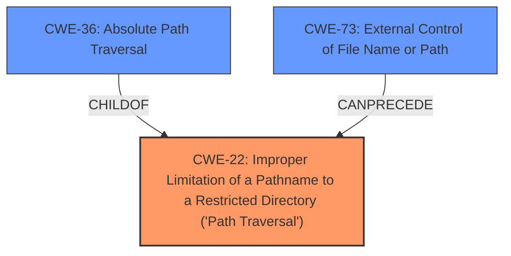

# Analysis for CVE-2022-31583

# Summary
| CWE ID | CWE Name | Confidence | CWE Abstraction Level | CWE Vulnerability Mapping Label | CWE-Vulnerability Mapping Notes |
|---|---|---|---|---|---|
| CWE-22 | Improper Limitation of a Pathname to a Restricted Directory ('Path Traversal') | 1.0 | Base | Allowed | Primary CWE |
| CWE-36 | Absolute Path Traversal | 0.7 | Base | Allowed | Secondary CWE |
| CWE-73 | External Control of File Name or Path | 0.6 | Base | Allowed | Secondary CWE |

## Evidence and Confidence

*   **Confidence Score:** 0.9
*   **Evidence Strength:** HIGH

## Relationship Analysis
The primary CWE is CWE-22, which is a base-level CWE describing the **improper limitation of a pathname to a restricted directory**, which aligns with the **absolute path traversal** vulnerability described. CWE-36, **Absolute Path Traversal**, is a child of CWE-22, representing a more specific case. CWE-73, **External Control of File Name or Path**, represents the broader issue of user-controlled file paths, which can lead to path traversal. The relationships show a progression from a general issue (CWE-73) to a specific type of path traversal (CWE-36) within the broader category of **improper path limitation** (CWE-22).

## Vulnerability Chain
The vulnerability chain starts with **external control of the filename or path** (CWE-73), which is then followed by the **improper limitation of a pathname to a restricted directory ('Path Traversal')** (CWE-22), specifically manifested as **absolute path traversal** (CWE-36). This leads to the impact of arbitrary file access.

## Summary of Analysis
The initial assessment identified the **absolute path traversal** vulnerability due to the unsafe use of the Flask `send_file` function. The root cause is the **improper handling of user-supplied paths**, allowing attackers to access files outside the intended directory. The evidence supporting this assessment is:

*   "The sravaniboinepelli/AutomatedQuizEval repository through 2020-04-27 on GitHub allows **absolute path traversal** because the Flask send_file function is used unsafely."
*   "All of the listed CVEs stem from the same root cause: **unsafe usage of the `Flask` framework's `send_file` function.** Specifically, the applications pass user-controlled input directly to the `send_file` function without proper sanitization or validation. This allows for **absolute path traversal**."
*   "**Absolute Path Traversal (CWE-22):** The core vulnerability is that an attacker can manipulate the filename or path parameters to access files outside of the intended directory. This is possible because the application directly uses user-provided paths in the `send_file` function call without validating the path for unsafe characters like `..`."

Based on the provided evidence and the CWE specifications, the optimal level of specificity is achieved by mapping the vulnerability to CWE-22, which represents the **improper limitation of a pathname to a restricted directory ('Path Traversal')**. CWE-36 (**Absolute Path Traversal**) is also considered since it is a child of CWE-22 and it describes the specific vulnerability, but CWE-22 is a better fit because of the description. CWE-73 (**External Control of File Name or Path**) is also relevant because the vulnerability involves user-controlled input influencing file paths, but it is a broader category than CWE-22.

CWE-23 (**Relative Path Traversal**) was considered but not chosen because the vulnerability is specifically related to **absolute path traversal**, not relative path traversal. Other CWEs like CWE-59 (**Improper Link Resolution Before File Access ('Link Following')**) and CWE-41 (**Improper Resolution of Path Equivalence**) were also considered but deemed less relevant as they do not directly address the root cause of **improper path limitation**.