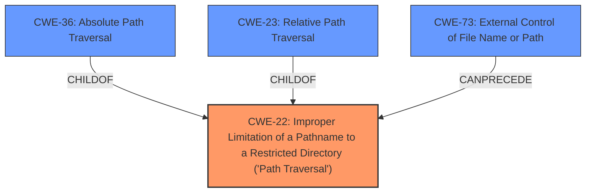

# Enhanced Analysis for CVE-2022-31585

# Summary
| CWE ID | CWE Name | Confidence | CWE Abstraction Level | CWE Vulnerability Mapping Label | CWE-Vulnerability Mapping Notes |
|---|---|---|---|---|---|
| CWE-22 | Improper Limitation of a Pathname to a Restricted Directory ('Path Traversal') | 1.0 | Base | Allowed | Primary CWE |
| CWE-36 | Absolute Path Traversal | 0.8 | Base | Allowed | Secondary Candidate |
| CWE-73 | External Control of File Name or Path | 0.6 | Base | Allowed | Secondary Candidate |

## Evidence and Confidence

*   **Confidence Score:** 0.9
*   **Evidence Strength:** HIGH

## Relationship Analysis
The primary CWE is CWE-22, which is the most general **Path Traversal** issue. CWE-36, **Absolute Path Traversal**, and CWE-23, **Relative Path Traversal**, are both children of CWE-22, representing specific types of path traversal. CWE-73, **External Control of File Name or Path**, can precede CWE-22, as external control of the file name or path is often a prerequisite for path traversal vulnerabilities.



## Vulnerability Chain
The vulnerability chain starts with the **unsafe usage of Flask's `send_file` function**. This leads to **Absolute Path Traversal (CWE-22)**, allowing attackers to access arbitrary files and directories on the server. The external control of the file path (CWE-73) is a prerequisite for the path traversal.

## Summary of Analysis
The primary **weakness** is **absolute path traversal** due to the unsafe use of Flask's `send_file` function. This aligns with CWE-22, which describes the improper limitation of a pathname to a restricted directory. The provided evidence from the CVE Reference Links Content Summary consistently points to this **root cause** and **weakness**.

The decision to select CWE-22 is based on the following evidence:

*   The vulnerability description explicitly mentions **absolute path traversal**.
*   The CVE Reference Links Content Summary confirms that the **root cause of the vulnerability** is the unsafe usage of Flask's `send_file` function, leading to **absolute path traversal (CWE-22)**. For example, CVE-2022-31504 states: "**Root cause of vulnerability:** Unsafe usage of Flask's `send_file` function, allowing for absolute path traversal. **Weaknesses/vulnerabilities present:** Absolute Path Traversal (CWE-22) via the `send_file` function."

CWE-22 is selected because it is a base level CWE that directly addresses the **improper limitation of a pathname to a restricted directory**. While CWE-36 (Absolute Path Traversal) is also relevant, CWE-22 is more general and encompasses both relative and absolute path traversal, making it a more appropriate primary mapping. However, CWE-36 is included as a secondary candidate since the vulnerability is explicitly about absolute path traversal.

CWE-73 (External Control of File Name or Path) is considered as a potential prerequisite, as the attacker needs to control the file name or path to perform the traversal.

Other CWEs considered but not used:

*   CWE-23: Relative Path Traversal: This is a child of CWE-22, but the vulnerability is specifically about absolute path traversal, making CWE-22 a better fit.
*   CWE-59: Improper Link Resolution Before File Access ('Link Following'): This CWE is not relevant as the vulnerability is not about following symbolic links.
*   CWE-95: Improper Neutralization of Directives in Dynamically Evaluated Code ('Eval Injection'): This CWE is not relevant as the vulnerability is not about code injection.

The final selection is based on the provided evidence and the relationships between the CWEs, ensuring that the selected CWEs accurately represent the **root cause** and **weakness** of the vulnerability at the optimal level of specificity.


## CWE Relationship Analysis

Current CWEs represent these abstraction levels: .


### Vulnerability Chain Analysis

**Chain starting from CWE-36:**
- 36 (Absolute Path Traversal) - ROOT


**Chain starting from CWE-73:**
- 73 (External Control of File Name or Path) - ROOT


### CWE Relationship Diagram

```mermaid
graph TD
    classDef primary fill:#f96,stroke:#333,stroke-width:2px
    classDef secondary fill:#69f,stroke:#333
    classDef tertiary fill:#9e9,stroke:#333
```