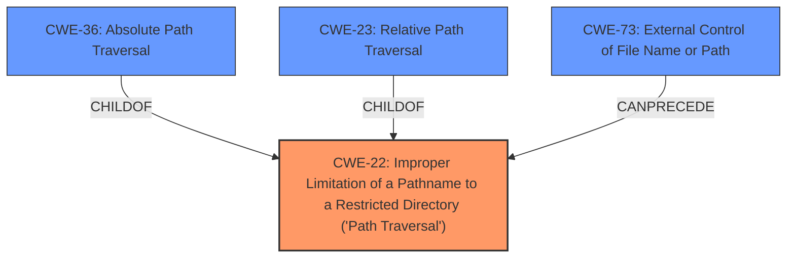

# Analysis for CVE-2022-31585

# Summary
| CWE ID | CWE Name | Confidence | CWE Abstraction Level | CWE Vulnerability Mapping Label | CWE-Vulnerability Mapping Notes |
|---|---|---|---|---|---|
| CWE-22 | Improper Limitation of a Pathname to a Restricted Directory ('Path Traversal') | 1.0 | Base | Allowed | Primary CWE |
| CWE-36 | Absolute Path Traversal | 0.8 | Base | Allowed | Secondary Candidate |
| CWE-73 | External Control of File Name or Path | 0.6 | Base | Allowed | Secondary Candidate |

## Evidence and Confidence

*   **Confidence Score:** 0.9
*   **Evidence Strength:** HIGH

## Relationship Analysis
The primary CWE is CWE-22, which is the most general **Path Traversal** issue. CWE-36, **Absolute Path Traversal**, and CWE-23, **Relative Path Traversal**, are both children of CWE-22, representing specific types of path traversal. CWE-73, **External Control of File Name or Path**, can precede CWE-22, as external control of the file name or path is often a prerequisite for path traversal vulnerabilities.



## Vulnerability Chain
The vulnerability chain starts with the **unsafe usage of Flask's `send_file` function**. This leads to **Absolute Path Traversal (CWE-22)**, allowing attackers to access arbitrary files and directories on the server. The external control of the file path (CWE-73) is a prerequisite for the path traversal.

## Summary of Analysis
The primary **weakness** is **absolute path traversal** due to the unsafe use of Flask's `send_file` function. This aligns with CWE-22, which describes the improper limitation of a pathname to a restricted directory. The provided evidence from the CVE Reference Links Content Summary consistently points to this **root cause** and **weakness**.

The decision to select CWE-22 is based on the following evidence:

*   The vulnerability description explicitly mentions **absolute path traversal**.
*   The CVE Reference Links Content Summary confirms that the **root cause of the vulnerability** is the unsafe usage of Flask's `send_file` function, leading to **absolute path traversal (CWE-22)**. For example, CVE-2022-31504 states: "**Root cause of vulnerability:** Unsafe usage of Flask's `send_file` function, allowing for absolute path traversal. **Weaknesses/vulnerabilities present:** Absolute Path Traversal (CWE-22) via the `send_file` function."

CWE-22 is selected because it is a base level CWE that directly addresses the **improper limitation of a pathname to a restricted directory**. While CWE-36 (Absolute Path Traversal) is also relevant, CWE-22 is more general and encompasses both relative and absolute path traversal, making it a more appropriate primary mapping. However, CWE-36 is included as a secondary candidate since the vulnerability is explicitly about absolute path traversal.

CWE-73 (External Control of File Name or Path) is considered as a potential prerequisite, as the attacker needs to control the file name or path to perform the traversal.

Other CWEs considered but not used:

*   CWE-23: Relative Path Traversal: This is a child of CWE-22, but the vulnerability is specifically about absolute path traversal, making CWE-22 a better fit.
*   CWE-59: Improper Link Resolution Before File Access ('Link Following'): This CWE is not relevant as the vulnerability is not about following symbolic links.
*   CWE-95: Improper Neutralization of Directives in Dynamically Evaluated Code ('Eval Injection'): This CWE is not relevant as the vulnerability is not about code injection.

The final selection is based on the provided evidence and the relationships between the CWEs, ensuring that the selected CWEs accurately represent the **root cause** and **weakness** of the vulnerability at the optimal level of specificity.

# Enhanced Query for CVE-2022-31585

## Vulnerability Description
The umeshpatil-dev/Home__internet repository through 2020-08-28 on GitHub allows **absolute path traversal** because the Flask send_file function is used unsafely.

### Vulnerability Description Key Phrases
- **weakness:** **absolute path traversal**
- **product:** umeshpatil-dev/Home__internet repository
- **version:** through 2020-08-28

## CVE Reference Links Content Summary
Based on the provided content, here's an analysis of the vulnerabilities related to the listed CVEs. All of them share the same root cause and exploit the same weakness:

**CVE-2022-31504**
*   **Root cause of vulnerability:** Unsafe usage of Flask's `send_file` function, allowing for absolute path traversal.
*   **Weaknesses/vulnerabilities present:** Absolute Path Traversal (CWE-22) via the `send_file` function.
*   **Impact of exploitation:** An attacker can gain access to arbitrary files and directories stored on the filesystem, including application source code, configuration files, and other sensitive data.
*   **Attack vectors:** The vulnerability is network-based, where the attacker sends a crafted request with a manipulated path.
*   **Required attacker capabilities/position:** No special privileges or user interaction is required. The attacker can exploit this vulnerability remotely over the network.

**CVE-2022-31505**
*   **Root cause of vulnerability:** Unsafe usage of Flask's `send_file` function.
*   **Weaknesses/vulnerabilities present:** Absolute Path Traversal (CWE-22).
*  **Impact of exploitation:**  An attacker can gain access to arbitrary files and directories stored on the filesystem.
*   **Attack vectors:** The vulnerability is network-based, where the attacker sends a crafted request with a manipulated path.
*   **Required attacker capabilities/position:** No special privileges or user interaction is required. The attacker can exploit this vulnerability remotely over the network.

**CVE-2022-31509**
*   **Root cause of vulnerability:** Unsafe usage of Flask's `send_file` function, allowing for absolute path traversal.
*   **Weaknesses/vulnerabilities present:** Absolute Path Traversal (CWE-22) via the `send_file` function.
*   **Impact of exploitation:** An attacker can gain access to arbitrary files and directories stored on the filesystem, including application source code, configuration files, and other sensitive data.
*   **Attack vectors:** The vulnerability is network-based, where the attacker sends a crafted request with a manipulated path.
*   **Required attacker capabilities/position:** No special privileges or user interaction is required. The attacker can exploit this vulnerability remotely over the network.

**CVE-2022-31510**
*   **Root cause of vulnerability:** Unsafe usage of Flask's `send_file` function, leading to absolute path traversal.
*   **Weaknesses/vulnerabilities present:** Absolute Path Traversal (CWE-22).
*   **Impact of exploitation:** Potential access to sensitive files and directories outside of the intended scope.
*   **Attack vectors:** Network-based attacks with crafted requests.
*   **Required attacker capabilities/position:** No special privileges or user interaction are required; remote exploitation is possible.

**CVE-2022-31511**
*   **Root cause of vulnerability:** Unsafe usage of Flask's `send_file` function, allowing for absolute path traversal.
*   **Weaknesses/vulnerabilities present:** Absolute Path Traversal (CWE-22).
*   **Impact of exploitation:** Access to arbitrary files and directories on the server.
*   **Attack vectors:** Network-based attacks.
*   **Required attacker capabilities/position:** No specific privileges or interaction needed, remote exploit.

**CVE-2022-31512**
*   **Root cause of vulnerability:** Unsafe usage of Flask's `send_file` function, leading to absolute path traversal.
*   **Weaknesses/vulnerabilities present:** Absolute Path Traversal (CWE-22).
*   **Impact of exploitation:** An attacker can gain access to arbitrary files and directories on the server's filesystem.
*   **Attack vectors:** The vulnerability is network based.
*   **Required attacker capabilities/position:** No special privileges are required. The attacker can exploit this vulnerability remotely over the network.

**CVE-2022-31513**
*   **Root cause of vulnerability:** Unsafe usage of Flask's `send_file` function, enabling absolute path traversal.
*   **Weaknesses/vulnerabilities present:** Absolute Path Traversal (CWE-22).
*   **Impact of exploitation:** Unauthorized access to files and directories, exposing sensitive information.
*   **Attack vectors:** Network-based attacks.
*   **Required attacker capabilities/position:** No user interaction, remote exploit possible.

**CVE-2022-31514**
*   **Root cause of vulnerability:** Unsafe use of Flask's `send_file` function, allowing absolute path traversal.
*  **Weaknesses/vulnerabilities present:** Absolute Path Traversal (CWE-22).
*  **Impact of exploitation:** An attacker can access sensitive files and directories.
*   **Attack vectors:** Network-based attacks with crafted requests.
*  **Required attacker capabilities/position:** No special privileges, and the vulnerability is remotely exploitable.

**CVE-2022-31515**
*   **Root cause of vulnerability:** Unsafe usage of Flask's `send_file` function leading to path traversal.
*   **Weaknesses/vulnerabilities present:** Absolute Path Traversal (CWE-22).
*   **Impact of exploitation:**  Access to sensitive information outside the intended scope.
*   **Attack vectors:** The attack can be performed remotely through the network by crafting special requests.
*   **Required attacker capabilities/position:** No special user interaction needed.

**CVE-2022-31516**
*   **Root cause of vulnerability:** The application is using Flask's `send_file` function unsafely, which results in absolute path traversal.
*   **Weaknesses/vulnerabilities present:**  Absolute Path Traversal (CWE-22).
*   **Impact of exploitation:** Attackers can access sensitive files and directories outside of the intended scope.
*  **Attack vectors:** This vulnerability is network-based.
*   **Required attacker capabilities/position:** The attacker can send remote crafted requests. No user interaction is required.

**CVE-2022-31518**
*   **Root cause of vulnerability:** Unsafe usage of Flask's `send_file` function.
*   **Weaknesses/vulnerabilities present:** Absolute path traversal (CWE-22) via the `send_file` function.
*   **Impact of exploitation:** Attackers can access sensitive files and directories on the server's filesystem, bypassing intended restrictions.
*   **Attack vectors:** By sending a crafted network request
*  **Required attacker capabilities/position:** The vulnerability does not require any user interaction to exploit.

**CVE-2022-31520**
*  **Root cause of vulnerability:** The code uses the Flask `send_file` function in an unsafe manner leading to path traversal.
*   **Weaknesses/vulnerabilities present:** Absolute Path Traversal (CWE-22)
*   **Impact of exploitation:** An attacker can access sensitive data outside of the intended scope, gaining potential access to application configuration, source code, and other files.
*  **Attack vectors:** Network-based attacks with a maliciously crafted file path.
*  **Required attacker capabilities/position:** No user interaction required. This vulnerability can be exploited remotely.

**CVE-2022-31521**
*   **Root cause of vulnerability:** Unsafe usage of Flask's `send_file` function allows for absolute path traversal.
*   **Weaknesses/vulnerabilities present:** Absolute Path Traversal (CWE-22)
*   **Impact of exploitation:** Access to arbitrary files and directories on the server.
*   **Attack vectors:** Network-based attacks with manipulated paths.
*  **Required attacker capabilities/position:** No user interaction needed, remote exploit.

**CVE-2022-31526**
*   **Root cause of vulnerability:** Unsafe usage of Flask's `send_file` function, enabling absolute path traversal.
*   **Weaknesses/vulnerabilities present:** Path Traversal (CWE-22).
*   **Impact of exploitation:** Access to arbitrary files and directories outside of the web root.
*   **Attack vectors:** Network-based attacks.
*   **Required attacker capabilities/position:** No privileges, and can be exploited remotely.

**CVE-2022-31527**
*   **Root cause of vulnerability:** Unsafe usage of the Flask `send_file` function allows absolute path traversal.
*   **Weaknesses/vulnerabilities present:** Absolute path traversal (CWE-22).
*   **Impact of exploitation:** An attacker can access arbitrary files and directories outside of the intended scope.
*   **Attack vectors:** The attack is network-based by crafting specific requests.
*   **Required attacker capabilities/position:** No user interaction is required. This vulnerability is remotely exploitable.

**CVE-2022-31528**
*   **Root cause of vulnerability:** The Flask `send_file` function is used unsafely, leading to absolute path traversal.
*   **Weaknesses/vulnerabilities present:** Absolute Path Traversal (CWE-22).
*   **Impact of exploitation:** Unauthorized access to server files and directories.
*   **Attack vectors:** Network-based attacks using manipulated paths.
*  **Required attacker capabilities/position:** No privileges needed, remotely exploitable.

**CVE-2022-31532**
*   **Root cause of vulnerability:** Unsafe use of Flask's `send_file` function.
*   **Weaknesses/vulnerabilities present:** Absolute Path Traversal (CWE-22).
*  **Impact of exploitation:**  An attacker can access sensitive files and directories outside of the intended webroot scope.
*  **Attack vectors:**  This is a network-based vulnerability.
*  **Required attacker capabilities/position:** Remote exploitation, no user interaction.

**CVE-2022-31533**
*  **Root cause of vulnerability:** Unsafe use of Flask `send_file` function, leading to absolute path traversal
*   **Weaknesses/vulnerabilities present:** Absolute Path Traversal (CWE-22).
*   **Impact of exploitation:**  Allows for potential access to files and directories beyond the web root.
*   **Attack vectors:** Network-based, using crafted requests.
*   **Required attacker capabilities/position:** No special privileges or user interaction are required. The vulnerability can be exploited remotely.

**CVE-2022-31534**
*   **Root cause of vulnerability:** Unsafe usage of Flask's `send_file` function allows absolute path traversal.
*  **Weaknesses/vulnerabilities present:**  Absolute Path Traversal (CWE-22).
*   **Impact of exploitation:** An attacker can access arbitrary files and directories from the server.
*   **Attack vectors:**  Network-based attacks, where malicious path can be included in requests.
*  **Required attacker capabilities/position:** No user interaction, remote exploit.

**CVE-2022-31535**
*  **Root cause of vulnerability:**  Unsafe usage of Flask's `send_file` function leading to absolute path traversal.
*  **Weaknesses/vulnerabilities present:**  Absolute Path Traversal (CWE-22)
*   **Impact of exploitation:**  Attackers can access files and directories beyond the intended path.
*   **Attack vectors:** Network-based attacks with malicious requests.
*  **Required attacker capabilities/position:** This vulnerability can be exploited remotely, no user interaction required.

**CVE-2022-31536**
*   **Root cause of vulnerability:** The Flask `send_file` function is used without proper validation, leading to absolute path traversal.
*   **Weaknesses/vulnerabilities present:** Path Traversal (CWE-22).
*   **Impact of exploitation:** Unauthorized access to arbitrary files and directories.
*   **Attack vectors:**  Network-based attack with a specifically crafted path.
*   **Required attacker capabilities/position:** The vulnerability can be exploited without any privileges or user interaction, remotely over the network.

**CVE-2022-31537**
*   **Root cause of vulnerability:** Unsafe use of Flask's `send_file` function.
*   **Weaknesses/vulnerabilities present:** Absolute path traversal (CWE-22).
*   **Impact of exploitation:** Unauthorized access to arbitrary files and directories on the server's filesystem.
*   **Attack vectors:** This vulnerability is network-based.
*  **Required attacker capabilities/position:** This can be remotely exploited without any special privileges or interaction with the user.

**CVE-2022-31538**
*   **Root cause of vulnerability:** Unsafe usage of Flask's `send_file` function, leading to absolute path traversal.
*   **Weaknesses/vulnerabilities present:** Absolute path traversal (CWE-22).
*   **Impact of exploitation:** An attacker can gain unauthorized access to arbitrary files and directories stored on the server.
*   **Attack vectors:** By making network requests with crafted path parameters.
*   **Required attacker capabilities/position:** No user interaction needed; remote exploitation is possible.

**CVE-2022-31540**
*   **Root cause of vulnerability:** The Flask `send_file` function is used in a manner that allows absolute path traversal.
*  **Weaknesses/vulnerabilities present:** Absolute Path Traversal (CWE-22).
*   **Impact of exploitation:**  An attacker can access files and directories outside the intended directory.
*   **Attack vectors:** This is a network based vulnerability.
*  **Required attacker capabilities/position:** No special user interaction needed and can be exploited remotely.

**CVE-2022-31544**
*   **Root cause of vulnerability:** Unsafe usage of Flask's `send_file` function, enabling absolute path traversal.
*   **Weaknesses/vulnerabilities present:** Absolute Path Traversal (CWE-22).
*   **Impact of exploitation:** Access to sensitive files and directories, compromising data confidentiality.
*  **Attack vectors:** Network based attacks.
*  **Required attacker capabilities/position:**  No privileges needed, remotely exploitable.

**CVE-2022-31545**
*   **Root cause of vulnerability:** Unsafe use of the Flask `send_file` function allows for absolute path traversal
*   **Weaknesses/vulnerabilities present:**  Absolute Path Traversal (CWE-22).
*   **Impact of exploitation:**  Attackers can access arbitrary files and directories on the server.
*   **Attack vectors:** The attack vector is network-based.
*  **Required attacker capabilities/position:** The attacker can exploit this vulnerability remotely with no privileges required.

**CVE-2022-31546**
*   **Root cause of vulnerability:**  Unsafe usage of Flask's `send_file` function.
*   **Weaknesses/vulnerabilities present:** Absolute Path Traversal (CWE-22).
*   **Impact of exploitation:** An attacker can access sensitive files and directories.
*   **Attack vectors:**  The vulnerability is network-based.
*  **Required attacker capabilities/position:** No specific privileges are needed, and the vulnerability can be exploited remotely.

**CVE-2022-31547**
*  **Root cause of vulnerability:** Unsafe usage of the `flask.send_file` function allowing for absolute path traversal.
*   **Weaknesses/vulnerabilities present:** Path Traversal (CWE-22).
*   **Impact of exploitation:**  An attacker can access arbitrary files on the server.
*   **Attack vectors:** This vulnerability can be exploited remotely with a crafted network request.
*   **Required attacker capabilities/position:**  No specific privileges or user interaction are required for remote exploitation.

**CVE-2022-31548**
*  **Root cause of vulnerability:** The `send_file` function is used unsafely in the Flask application, causing absolute path traversal.
*   **Weaknesses/vulnerabilities present:** Absolute Path Traversal (CWE-22).
*  **Impact of exploitation:** An attacker can gain access to sensitive files outside of the intended scope.
*   **Attack vectors:** By sending crafted requests over the network.
*  **Required attacker capabilities/position:**  The vulnerability is remotely exploitable, requiring no special privileges or user interaction.

**CVE-2022-31551**
*   **Root cause of vulnerability:** Unsafe use of Flask's `send_file` function, allowing absolute path traversal.
*  **Weaknesses/vulnerabilities present:** Absolute path traversal (CWE-22).
*   **Impact of exploitation:** Unauthorized access to arbitrary files and directories on the server.
*   **Attack vectors:** The attack is network-based through crafted requests.
*   **Required attacker capabilities/position:**  No special privileges needed, and the vulnerability is exploitable remotely.

**CVE-2022-31552**
*   **Root cause of vulnerability:** Unsafe usage of Flask's `send_file` function, leading to absolute path traversal.
*   **Weaknesses/vulnerabilities present:**  Absolute Path Traversal (CWE-22)
*   **Impact of exploitation:** Attackers can access unauthorized files and directories on the server.
*  **Attack vectors:** The vulnerability can be exploited by sending a network request.
*   **Required attacker capabilities/position:**  No special privileges, and the vulnerability is remotely exploitable.

**CVE-2022-31553**
*   **Root cause of vulnerability:** Unsafe usage of Flask's `send_file` function results in absolute path traversal.
*   **Weaknesses/vulnerabilities present:** Absolute Path Traversal (CWE-22).
*   **Impact of exploitation:** Attackers can access arbitrary files and directories on the server.
*  **Attack vectors:** The attack vector is network-based with crafted request.
*   **Required attacker capabilities/position:** No special privileges needed, remotely exploitable.

**CVE-2022-31554**
*   **Root cause of vulnerability:** Unsafe usage of Flask's `send_file` function, leading to absolute path traversal.
*   **Weaknesses/vulnerabilities present:**  Absolute path traversal (CWE-22).
*   **Impact of exploitation:** Arbitrary files and directories outside the application's web root can be accessed.
*   **Attack vectors:** The attack vector is network-based.
*  **Required attacker capabilities/position:** No special user interaction or privileges needed and can be exploited remotely.

**CVE-2022-31555**
*   **Root cause of vulnerability:**  Unsafe usage of Flask's `send_file` function, resulting in absolute path traversal.
*  **Weaknesses/vulnerabilities present:** Path Traversal (CWE-22) vulnerability due to improper use of `send_file`.
*   **Impact of exploitation:**  Attackers can access sensitive files and directories beyond the application's web root.
*  **Attack vectors:** Network-based attack using specifically crafted request.
*   **Required attacker capabilities/position:** This vulnerability can be exploited remotely.

**CVE-2022-31556**
*  **Root cause of vulnerability:** Unsafe usage of Flask's `send_file` function.
*   **Weaknesses/vulnerabilities present:** Absolute Path Traversal (CWE-22)
*   **Impact of exploitation:** An attacker can access sensitive files and directories outside of the intended scope.
*  **Attack vectors:** This is a network based vulnerability where crafted request with malicious file path.
*   **Required attacker capabilities/position:** Requires no user interaction and the vulnerability can be exploited remotely.

**CVE-2022-31557**
*   **Root cause of vulnerability:** Insecure usage of Flask's `send_file` function allows for absolute path traversal.
*   **Weaknesses/vulnerabilities present:** Absolute path traversal (CWE-22)
*   **Impact of exploitation:** Can lead to unauthorized access to files outside the intended directory.
*   **Attack vectors:** The vulnerability can be exploited remotely.
*   **Required attacker capabilities/position:** No privileges or special interaction are required.

**CVE-2022-31559**
*  **Root cause of vulnerability:** Unsafe usage of Flask's `send_file` function, leading to absolute path traversal.
*  **Weaknesses/vulnerabilities present:**  Absolute Path Traversal (CWE-22).
*  **Impact of exploitation:** Access to sensitive files and directories outside of the webroot.
*   **Attack vectors:** Malicious requests over the network.
*   **Required attacker capabilities/position:** No user interaction needed and remotely exploitable.

**CVE-2022-31560**
*   **Root cause of vulnerability:** The Flask `send_file` function is used in an unsafe manner, allowing absolute path traversal.
*  **Weaknesses/vulnerabilities present:**  Path Traversal (CWE-22) vulnerability.
*   **Impact of exploitation:** Unauthorized access to arbitrary files and directories on the server.
*  **Attack vectors:** This is a network based vulnerability and can be exploited remotely.
*   **Required attacker capabilities/position:** No user interaction required and can be exploited with crafted requests.

**CVE-2022-31561**
*   **Root cause of vulnerability:** Unsafe usage of Flask's `send_file` function.
*  **Weaknesses/vulnerabilities present:** Absolute Path Traversal (CWE-22) via `send_file`.
*   **Impact of exploitation:** Attacker can access sensitive files and directories outside of the intended scope.
*   **Attack vectors:** Network-based attacks using malicious paths in the requests.
*  **Required attacker capabilities/position:** The attacker can exploit this vulnerability remotely with no specific privileges needed.

**CVE-2022-31562**
*   **Root cause of vulnerability:** Unsafe use of Flask's `send_file` function.
*   **Weaknesses/vulnerabilities present:** Path traversal vulnerability (CWE-22).
*   **Impact of exploitation:**  Attackers can access files and directories outside of the intended scope.
*   **Attack vectors:** The attack can be executed over the network using malicious file paths.
*   **Required attacker capabilities/position:** The attacker does not require any privileges or user interaction for exploitation.

**CVE-2022-31563**
*   **Root cause of vulnerability:**  The `send_file` function in Flask is used without proper validation leading to absolute path traversal.
*   **Weaknesses/vulnerabilities present:**  Absolute Path Traversal (CWE-22)
*   **Impact of exploitation:** Unauthorized access to server's sensitive files and directories
*   **Attack vectors:** This vulnerability can be exploited over network by crafting malicious requests.
*   **Required attacker capabilities/position:** No privileges or user interaction required for exploitation.

**CVE-2022-31564**
*   **Root cause of vulnerability:** Unsafe usage of Flask's `send_file` function results in absolute path traversal.
*   **Weaknesses/vulnerabilities present:**  Absolute Path Traversal (CWE-22).
*   **Impact of exploitation:**  Attackers can access arbitrary files and directories on the server.
*   **Attack vectors:** This vulnerability can be exploited remotely with a crafted request.
*  **Required attacker capabilities/position:**  No user interaction needed, and is remotely exploitable.

**CVE-2022-31565**
*   **Root cause of vulnerability:** Unsafe usage of Flask's `send_file` function that leads to absolute path traversal.
*  **Weaknesses/vulnerabilities present:** Absolute Path Traversal (CWE-22).
*  **Impact of exploitation:**  Potential for unauthorized access to sensitive files and directories.
*   **Attack vectors:** Crafted network requests with path manipulation.
*   **Required attacker capabilities/position:** Remote exploit is possible without specific privileges or user interaction

**CVE-2022-31566**
*   **Root cause of vulnerability:** The Flask `send_file` function is used improperly, allowing for absolute path traversal.
*   **Weaknesses/vulnerabilities present:** Absolute Path Traversal (CWE-22)
*   **Impact of exploitation:**  An attacker can read files from anywhere in the file system of the server.
*  **Attack vectors:**  This is a network-based vulnerability with crafted requests.
*   **Required attacker capabilities/position:** No user interaction is required for a remote attacker to trigger this.

**CVE-2022-31567**
*  **Root cause of vulnerability:** The Flask `send_file` function allows for absolute path traversal due to its unsafe usage.
*   **Weaknesses/vulnerabilities present:**  Path traversal vulnerability (CWE-22) due to insecure use of send_file.
*   **Impact of exploitation:**  Attackers can read files outside of the intended webroot.
*   **Attack vectors:** This is a network-based vulnerability where crafted request containing the malicious file path.
*   **Required attacker capabilities/position:** The attacker does not require any privileges or user interaction and can be exploited remotely.

**CVE-2022-31568**
*  **Root cause of vulnerability:** Unsafe usage of Flask's `send_file` function, enabling absolute path traversal.
*   **Weaknesses/vulnerabilities present:** Absolute Path Traversal (CWE-22) via the `send_file` function.
*   **Impact of exploitation:** An attacker can gain unauthorized access to arbitrary files and directories.
*   **Attack vectors:** Remote attacks are possible using network requests.
*   **Required attacker capabilities/position:** No special privileges needed for remote exploitation.

**CVE-2022-31570**
*  **Root cause of vulnerability:** Unsafe use of `send_file` in Flask leads to absolute path traversal.
*   **Weaknesses/vulnerabilities present:** Absolute Path Traversal (CWE-22).
*   **Impact of exploitation:**  Attackers can access arbitrary files on the server.
*   **Attack vectors:** A malicious request with a manipulated file path.
*   **Required attacker capabilities/position:** The vulnerability is remotely exploitable without any privileges.

**CVE-2022-31571**
*  **Root cause of vulnerability:**  Unsafe usage of Flask's `send_file` function enables absolute path traversal.
*  **Weaknesses/vulnerabilities present:** Absolute path traversal (CWE-22).
*  **Impact of exploitation:**  An attacker could access files outside of the intended webroot.
*   **Attack vectors:**  A network-based attack using a crafted URL.
*  **Required attacker capabilities/position:** No user interaction or special privileges are required to execute this attack.

**CVE-2022-31572**
*   **Root cause of vulnerability:**  Unsafe usage of Flask's `send_file` function allows absolute path traversal.
*  **Weaknesses/vulnerabilities present:** Absolute path traversal (CWE-22) using `send_file`.
*   **Impact of exploitation:**  Attackers can access sensitive data outside of the intended directory.
*   **Attack vectors:** Remote access via network request with malicious file paths.
*   **Required attacker capabilities/position:** No special permissions or interactions required; the vulnerability can be exploited remotely.

**CVE-2022-31574**
*   **Root cause of vulnerability:** Unsafe usage of Flask's `send_file` function.
*   **Weaknesses/vulnerabilities present:**  Absolute Path Traversal (CWE-22) via `send_file`.
*   **Impact of exploitation:** An attacker can access arbitrary files and directories beyond the intended scope, causing potential information disclosure.
*  **Attack vectors:** Network-based attacks.
*   **Required attacker capabilities/position:** The attacker can exploit this remotely without user interaction or special privileges.

**CVE-2022-31575**
*  **Root cause of vulnerability:** Unsafe usage of Flask's `send_file` function, which leads to absolute path traversal.
*  **Weaknesses/vulnerabilities present:** Absolute path traversal (CWE-22).
*  **Impact of exploitation:** Attackers can read arbitrary files from the server.
*   **Attack vectors:** Crafted network requests containing an manipulated path.
*  **Required attacker capabilities/position:** No privileges needed, vulnerability is exploitable remotely.

**CVE-2022-31576**
*   **Root cause of vulnerability:** The Flask `send_file` function is used in an unsafe manner, causing absolute path traversal.
*   **Weaknesses/vulnerabilities present:**  Absolute Path Traversal (CWE-22)
*  **Impact of exploitation:**  Attackers can access sensitive files and directories outside of the intended scope.
*  **Attack vectors:** This vulnerability is network based.
*   **Required attacker capabilities/position:**  No user interaction and can be triggered remotely.

**CVE-2022-31577**
*  **Root cause of vulnerability:** The Flask `send_file` function is used unsafely, allowing absolute path traversal.
*   **Weaknesses/vulnerabilities present:** Path Traversal (CWE-22).
*   **Impact of exploitation:** Attackers can gain access to sensitive files outside of the intended web root, potentially compromising confidentiality.
*   **Attack vectors:** Crafted network requests, where attacker controlled filepath.
*   **Required attacker capabilities/position:** The vulnerability can be exploited remotely, no user interaction is required.

**CVE-2022-31578**
*   **Root cause of vulnerability:** Flask's `send_file` function is used unsafely, allowing absolute path traversal.
*   **Weaknesses/vulnerabilities present:** Absolute path traversal (CWE-22).
*   **Impact of exploitation:** An attacker can read arbitrary files from the server.
*   **Attack vectors:** This vulnerability is remotely exploitable using crafted HTTP requests.
*  **Required attacker capabilities/position:** No user interaction needed.

**CVE-2022-31579**
*  **Root cause of vulnerability:**  Insecure use of Flask's `send_file` function, resulting in absolute path traversal.
*   **Weaknesses/vulnerabilities present:**  Absolute Path Traversal (CWE-22) via `send_file`.
*   **Impact of exploitation:** Attackers can access sensitive files and directories outside the scope of the application.
*   **Attack vectors:**  Network-based attacks, with a crafted malicious file path in the requests.
*   **Required attacker capabilities/position:**  No specific privileges and remote exploitation.

**CVE-2022-31582**
*  **Root cause of vulnerability:** Flask's `send_file` function is used improperly, leading to absolute path traversal.
*   **Weaknesses/vulnerabilities present:** Absolute Path Traversal (CWE-22)
*  **Impact of exploitation:**  Attackers can read files outside of the scope of the app.
*   **Attack vectors:**  Network-based attacks with crafted file paths.
*   **Required attacker capabilities/position:** Requires no user interaction or privileges, and is remotely exploitable.

**CVE-2022-31583**
*   **Root cause of vulnerability:** Unsafe usage of Flask's `send_file` function allows for absolute path traversal.
*  **Weaknesses/vulnerabilities present:** Absolute path traversal (CWE-22).
*   **Impact of exploitation:** Attackers can access sensitive files and directories beyond intended scope.
*  **Attack vectors:** A network based attack using a crafted filepath.
*  **Required attacker capabilities/position:** No privileges or user interaction is required. The attack is remotely exploitable.

**CVE-2022-31585**
*  **Root cause of vulnerability:** Unsafe usage of Flask's `send_file` function leading to absolute path traversal.
*   **Weaknesses/vulnerabilities present:**  Path traversal (CWE-22).
*  **Impact of exploitation:** The attacker could read files from anywhere in the filesystem on the server.
*  **Attack vectors:** The vulnerability is network-based, by crafting requests that include manipulated file paths.
*  **Required attacker capabilities/position:** Exploitation is possible remotely, without any user interaction

**CVE-2022-31587**
*   **Root cause of vulnerability:** Unsafe usage of Flask's `send_file` function, which allows absolute path traversal.
*  **Weaknesses/vulnerabilities present:** Absolute Path Traversal (CWE-22).
*   **Impact of exploitation:**  Attackers can access sensitive files and directories beyond the intended scope.
*   **Attack vectors:** Through crafted requests over the network.
*   **Required attacker capabilities/position:** Remote exploit, no privileges or interaction needed.

**CVE-2022-31588**
*   **Root cause of vulnerability:** The Flask `send_file` function is used improperly, leading to absolute path traversal.
*   **Weaknesses/vulnerabilities present:** Path Traversal (CWE-22).
*   **Impact of exploitation:** Attackers can access sensitive files and directories.
*   **Attack vectors:** Network-based attacks.
*   **Required attacker capabilities/position:** Remotely exploitable and no user interaction is required.

**Summary:**

All the listed CVEs describe a vulnerability where the Flask framework's `send_file` function is used without proper validation, enabling attackers to perform absolute path traversal. This results in the exposure of sensitive information and potentially compromised availability. All the vulnerabilities are remotely exploitable, without requiring special privileges or user interaction. The common weakness being exploited here is CWE-22. The primary remediation is to avoid using user-controlled inputs directly into send_file, and instead use safer alternatives like `flask.safe_join` or `flask.send_from_directory`.

## Retriever Results

### Top Combined Results

| Rank | CWE ID | Name | Abstraction | Usage  | Retrievers | Individual Scores |
|------|--------|------|-------------|-------|------------|-------------------|
| 1 | 22 | Improper Limitation of a Pathname to a Restricted Directory ('Path Traversal') | Base | Allowed | alternate_terms | 0.800 |
| 2 | 36 | Absolute Path Traversal | Base | Allowed | sparse | 0.339 |
| 3 | 73 | External Control of File Name or Path | Base | Allowed | sparse | 0.197 |
| 4 | 23 | Relative Path Traversal | Base | Allowed | sparse | 0.148 |
| 5 | 37 | Path Traversal: '/absolute/pathname/here' | Variant | Allowed | sparse | 0.124 |
| 6 | 24 | Path Traversal: '../filedir' | Variant | Allowed | dense | 0.546 |
| 7 | 59 | Improper Link Resolution Before File Access ('Link Following') | Base | Allowed | graph | 0.002 |
| 8 | 38 | Path Traversal: '\absolute\pathname\here' | Variant | Allowed | sparse | 0.111 |
| 9 | 95 | Improper Neutralization of Directives in Dynamically Evaluated Code ('Eval Injection') | Variant | Allowed | sparse | 0.106 |
| 10 | 182 | Collapse of Data into Unsafe Value | Base | Allowed | sparse | 0.101 |


# Complete CWE Specifications


## CWE-22: Improper Limitation of a Pathname to a Restricted Directory ('Path Traversal')
**Abstraction:** Base
**Status:** Stable

### Description
The product uses external input to construct a pathname that is intended to identify a file or directory that is located underneath a restricted parent directory, but the product does not properly neutralize special elements within the pathname that can cause the pathname to resolve to a location that is outside of the restricted directory.

### Extended Description


Many file operations are intended to take place within a restricted directory. By using special elements such as ".." and "/" separators, attackers can escape outside of the restricted location to access files or directories that are elsewhere on the system. One of the most common special elements is the "../" sequence, which in most modern operating systems is interpreted as the parent directory of the current location. This is referred to as relative path traversal. Path traversal also covers the use of absolute pathnames such as "/usr/local/bin" to access unexpected files. This is referred to as absolute path traversal.


### Alternative Terms
Directory traversal
Path traversal: "Path traversal" is preferred over "directory traversal," but both terms are attack-focused.

### Relationships
ChildOf -> CWE-706
ChildOf -> CWE-706
ChildOf -> CWE-668

### Mapping Guidance
**Usage:** Allowed
**Rationale:** This CWE entry is at the Base level of abstraction, which is a preferred level of abstraction for mapping to the root causes of vulnerabilities.
**Comments:** Carefully read both the name and description to ensure that this mapping is an appropriate fit. Do not try to 'force' a mapping to a lower-level Base/Variant simply to comply with this preferred level of abstraction.
**Reasons:**
- Acceptable-Use


### Additional Notes
**[Other]** In many programming languages, the injection of a null byte (the 0 or NUL) may allow an attacker to truncate a generated filename to apply to a wider range of files. For example, the product may add ".txt" to any pathname, thus limiting the attacker to text files, but a null injection may effectively remove this restriction.

**[Relationship]** Pathname equivalence can be regarded as a type of canonicalization error.

**[Relationship]** Some pathname equivalence issues are not directly related to directory traversal, rather are used to bypass security-relevant checks for whether a file/directory can be accessed by the attacker (e.g. a trailing "/" on a filename could bypass access rules that don't expect a trailing /, causing a server to provide the file when it normally would not).

**[Terminology]** 

Like other weaknesses, terminology is often based on the types of manipulations used, instead of the underlying weaknesses. Some people use "directory traversal" only to refer to the injection of ".." and equivalent sequences whose specific meaning is to traverse directories.


Other variants like "absolute pathname" and "drive letter" have the *effect* of directory traversal, but some people may not call it such, since it doesn't involve ".." or equivalent.


**[Research Gap]** Many variants of path traversal attacks are probably under-studied with respect to root cause. CWE-790 and CWE-182 begin to cover part of this gap.

**[Research Gap]** 

Incomplete diagnosis or reporting of vulnerabilities can make it difficult to know which variant is affected. For example, a researcher might say that "..\" is vulnerable, but not test "../" which may also be vulnerable.


Any combination of directory separators ("/", "\", etc.) and numbers of "." (e.g. "....") can produce unique variants; for example, the "//../" variant is not listed (CVE-2004-0325). See this entry's children and lower-level descendants.


### Observed Examples
- **CVE-2024-37032:** Large language model (LLM) management tool does not validate the format of a digest value (CWE-1287) from a private, untrusted model registry, enabling relative path traversal (CWE-23), a.k.a. Probllama
- **CVE-2024-4315:** Chain: API for text generation using Large Language Models (LLMs) does not include the "\" Windows folder separator in its denylist (CWE-184) when attempting to prevent Local File Inclusion via path traversal (CWE-22), allowing deletion of arbitrary files on Windows systems.
- **CVE-2022-45918:** Chain: a learning management tool debugger uses external input to locate previous session logs (CWE-73) and does not properly validate the given path (CWE-20), allowing for filesystem path traversal using "../" sequences (CWE-24)


## CWE-36: Absolute Path Traversal
**Abstraction:** Base
**Status:** Draft

### Description
The product uses external input to construct a pathname that should be within a restricted directory, but it does not properly neutralize absolute path sequences such as "/abs/path" that can resolve to a location that is outside of that directory.

### Extended Description
This allows attackers to traverse the file system to access files or directories that are outside of the restricted directory.

### Alternative Terms
None

### Relationships
ChildOf -> CWE-22
ChildOf -> CWE-22
ChildOf -> CWE-22

### Mapping Guidance
**Usage:** Allowed
**Rationale:** This CWE entry is at the Base level of abstraction, which is a preferred level of abstraction for mapping to the root causes of vulnerabilities.
**Comments:** Carefully read both the name and description to ensure that this mapping is an appropriate fit. Do not try to 'force' a mapping to a lower-level Base/Variant simply to comply with this preferred level of abstraction.
**Reasons:**
- Acceptable-Use


### Observed Examples
- **CVE-2022-31503:** Python package constructs filenames using an unsafe os.path.join call on untrusted input, allowing absolute path traversal because os.path.join resets the pathname to an absolute path that is specified as part of the input.
- **CVE-2002-1345:** Multiple FTP clients write arbitrary files via absolute paths in server responses
- **CVE-2001-1269:** ZIP file extractor allows full path


## CWE-73: External Control of File Name or Path
**Abstraction:** Base
**Status:** Draft

### Description
The product allows user input to control or influence paths or file names that are used in filesystem operations.

### Extended Description


This could allow an attacker to access or modify system files or other files that are critical to the application.


Path manipulation errors occur when the following two conditions are met:

```
		1. An attacker can specify a path used in an operation on the filesystem.
		2. By specifying the resource, the attacker gains a capability that would not otherwise be permitted.
```
For example, the program may give the attacker the ability to overwrite the specified file or run with a configuration controlled by the attacker.

### Alternative Terms
None

### Relationships
ChildOf -> CWE-642
ChildOf -> CWE-610
ChildOf -> CWE-20
CanPrecede -> CWE-22
CanPrecede -> CWE-41
CanPrecede -> CWE-98
CanPrecede -> CWE-434
CanPrecede -> CWE-59

### Mapping Guidance
**Usage:** Allowed
**Rationale:** This CWE entry is at the Base level of abstraction, which is a preferred level of abstraction for mapping to the root causes of vulnerabilities.
**Comments:** Carefully read both the name and description to ensure that this mapping is an appropriate fit. Do not try to 'force' a mapping to a lower-level Base/Variant simply to comply with this preferred level of abstraction.
**Reasons:**
- Acceptable-Use


### Additional Notes
**[Maintenance]** CWE-114 is a Class, but it is listed a child of CWE-73 in view 1000. This suggests some abstraction problems that should be resolved in future versions.

**[Relationship]** 

The external control of filenames can be the primary link in chains with other file-related weaknesses, as seen in the CanPrecede relationships. This is because software systems use files for many different purposes: to execute programs, load code libraries, to store application data, to store configuration settings, record temporary data, act as signals or semaphores to other processes, etc.


However, those weaknesses do not always require external control. For example, link-following weaknesses (CWE-59) often involve pathnames that are not controllable by the attacker at all.


The external control can be resultant from other issues. For example, in PHP applications, the register_globals setting can allow an attacker to modify variables that the programmer thought were immutable, enabling file inclusion (CWE-98) and path traversal (CWE-22). Operating with excessive privileges (CWE-250) might allow an attacker to specify an input filename that is not directly readable by the attacker, but is accessible to the privileged program. A buffer overflow (CWE-119) might give an attacker control over nearby memory locations that are related to pathnames, but were not directly modifiable by the attacker.


### Observed Examples
- **CVE-2022-45918:** Chain: a learning management tool debugger uses external input to locate previous session logs (CWE-73) and does not properly validate the given path (CWE-20), allowing for filesystem path traversal using "../" sequences (CWE-24)
- **CVE-2008-5748:** Chain: external control of values for user's desired language and theme enables path traversal.
- **CVE-2008-5764:** Chain: external control of user's target language enables remote file inclusion.


## CWE-23: Relative Path Traversal
**Abstraction:** Base
**Status:** Draft

### Description
The product uses external input to construct a pathname that should be within a restricted directory, but it does not properly neutralize sequences such as ".." that can resolve to a location that is outside of that directory.

### Extended Description
This allows attackers to traverse the file system to access files or directories that are outside of the restricted directory.

### Alternative Terms
Zip Slip: "Zip slip" is an attack that uses file archives (e.g., ZIP, tar, rar, etc.) that contain filenames with path traversal sequences that cause the files to be written outside of the directory under which the archive is expected to be extracted [REF-1282]. It is most commonly used for relative path traversal (CWE-23) and link following (CWE-59).

### Relationships
ChildOf -> CWE-22
ChildOf -> CWE-22
ChildOf -> CWE-22

### Mapping Guidance
**Usage:** Allowed
**Rationale:** This CWE entry is at the Base level of abstraction, which is a preferred level of abstraction for mapping to the root causes of vulnerabilities.
**Comments:** Carefully read both the name and description to ensure that this mapping is an appropriate fit. Do not try to 'force' a mapping to a lower-level Base/Variant simply to comply with this preferred level of abstraction.
**Reasons:**
- Acceptable-Use


### Observed Examples
- **CVE-2024-37032:** Large language model (LLM) management tool does not validate the format of a digest value (CWE-1287) from a private, untrusted model registry, enabling relative path traversal (CWE-23), a.k.a. Probllama
- **CVE-2022-45918:** Chain: a learning management tool debugger uses external input to locate previous session logs (CWE-73) and does not properly validate the given path (CWE-20), allowing for filesystem path traversal using "../" sequences (CWE-24)
- **CVE-2019-20916:** Python package manager does not correctly restrict the filename specified in a Content-Disposition header, allowing arbitrary file read using path traversal sequences such as "../"


## CWE-37: Path Traversal: '/absolute/pathname/here'
**Abstraction:** Variant
**Status:** Draft

### Description
The product accepts input in the form of a slash absolute path ('/absolute/pathname/here') without appropriate validation, which can allow an attacker to traverse the file system to unintended locations or access arbitrary files.

### Extended Description
Not provided

### Alternative Terms
None

### Relationships
ChildOf -> CWE-36
ChildOf -> CWE-160

### Mapping Guidance
**Usage:** Allowed
**Rationale:** This CWE entry is at the Variant level of abstraction, which is a preferred level of abstraction for mapping to the root causes of vulnerabilities.
**Comments:** Carefully read both the name and description to ensure that this mapping is an appropriate fit. Do not try to 'force' a mapping to a lower-level Base/Variant simply to comply with this preferred level of abstraction.
**Reasons:**
- Acceptable-Use


### Observed Examples
- **CVE-2002-1345:** Multiple FTP clients write arbitrary files via absolute paths in server responses
- **CVE-2001-1269:** ZIP file extractor allows full path
- **CVE-2002-1818:** Path traversal using absolute pathname


## CWE-24: Path Traversal: '../filedir'
**Abstraction:** Variant
**Status:** Incomplete

### Description
The product uses external input to construct a pathname that should be within a restricted directory, but it does not properly neutralize "../" sequences that can resolve to a location that is outside of that directory.

### Extended Description


This allows attackers to traverse the file system to access files or directories that are outside of the restricted directory.


The "../" manipulation is the canonical manipulation for operating systems that use "/" as directory separators, such as UNIX- and Linux-based systems. In some cases, it is useful for bypassing protection schemes in environments for which "/" is supported but not the primary separator, such as Windows, which uses "\" but can also accept "/".


### Alternative Terms
None

### Relationships
ChildOf -> CWE-23

### Mapping Guidance
**Usage:** Allowed
**Rationale:** This CWE entry is at the Variant level of abstraction, which is a preferred level of abstraction for mapping to the root causes of vulnerabilities.
**Comments:** Carefully read both the name and description to ensure that this mapping is an appropriate fit. Do not try to 'force' a mapping to a lower-level Base/Variant simply to comply with this preferred level of abstraction.
**Reasons:**
- Acceptable-Use


### Observed Examples
- **CVE-2022-45918:** Chain: a learning management tool debugger uses external input to locate previous session logs (CWE-73) and does not properly validate the given path (CWE-20), allowing for filesystem path traversal using "../" sequences (CWE-24)


## CWE-59: Improper Link Resolution Before File Access ('Link Following')
**Abstraction:** Base
**Status:** Draft

### Description
The product attempts to access a file based on the filename, but it does not properly prevent that filename from identifying a link or shortcut that resolves to an unintended resource.

### Extended Description
Not provided

### Alternative Terms
insecure temporary file: Some people use the phrase "insecure temporary file" when referring to a link following weakness, but other weaknesses can produce insecure temporary files without any symlink involvement at all.
Zip Slip: "Zip slip" is an attack that uses file archives (e.g., ZIP, tar, rar, etc.) that contain filenames with path traversal sequences that cause the files to be written outside of the directory under which the archive is expected to be extracted [REF-1282]. It is most commonly used for relative path traversal (CWE-23) and link following (CWE-59).

### Relationships
ChildOf -> CWE-706
ChildOf -> CWE-706

### Mapping Guidance
**Usage:** Allowed
**Rationale:** This CWE entry is at the Base level of abstraction, which is a preferred level of abstraction for mapping to the root causes of vulnerabilities.
**Comments:** Carefully read both the name and description to ensure that this mapping is an appropriate fit. Do not try to 'force' a mapping to a lower-level Base/Variant simply to comply with this preferred level of abstraction.
**Reasons:**
- Acceptable-Use


### Additional Notes
**[Theoretical]** 

Link following vulnerabilities are Multi-factor Vulnerabilities (MFV). They are the combination of multiple elements: file or directory permissions, filename predictability, race conditions, and in some cases, a design limitation in which there is no mechanism for performing atomic file creation operations.


Some potential factors are race conditions, permissions, and predictability.


### Observed Examples
- **CVE-1999-1386:** Some versions of Perl follow symbolic links when running with the -e option, which allows local users to overwrite arbitrary files via a symlink attack.
- **CVE-2000-1178:** Text editor follows symbolic links when creating a rescue copy during an abnormal exit, which allows local users to overwrite the files of other users.
- **CVE-2004-0217:** Antivirus update allows local users to create or append to arbitrary files via a symlink attack on a logfile.


## CWE-38: Path Traversal: '\absolute\pathname\here'
**Abstraction:** Variant
**Status:** Draft

### Description
The product accepts input in the form of a backslash absolute path ('\absolute\pathname\here') without appropriate validation, which can allow an attacker to traverse the file system to unintended locations or access arbitrary files.

### Extended Description
Not provided

### Alternative Terms
None

### Relationships
ChildOf -> CWE-36

### Mapping Guidance
**Usage:** Allowed
**Rationale:** This CWE entry is at the Variant level of abstraction, which is a preferred level of abstraction for mapping to the root causes of vulnerabilities.
**Comments:** Carefully read both the name and description to ensure that this mapping is an appropriate fit. Do not try to 'force' a mapping to a lower-level Base/Variant simply to comply with this preferred level of abstraction.
**Reasons:**
- Acceptable-Use


### Observed Examples
- **CVE-1999-1263:** Mail client allows remote attackers to overwrite arbitrary files via an e-mail message containing a uuencoded attachment that specifies the full pathname for the file to be modified.
- **CVE-2003-0753:** Remote attackers can read arbitrary files via a full pathname to the target file in config parameter.
- **CVE-2002-1525:** Remote attackers can read arbitrary files via an absolute pathname.


## CWE-95: Improper Neutralization of Directives in Dynamically Evaluated Code ('Eval Injection')
**Abstraction:** Variant
**Status:** Incomplete

### Description
The product receives input from an upstream component, but it does not neutralize or incorrectly neutralizes code syntax before using the input in a dynamic evaluation call (e.g. "eval").

### Extended Description
This may allow an attacker to execute arbitrary code, or at least modify what code can be executed.

### Alternative Terms
None

### Relationships
ChildOf -> CWE-94

### Mapping Guidance
**Usage:** Allowed
**Rationale:** This CWE entry is at the Variant level of abstraction, which is a preferred level of abstraction for mapping to the root causes of vulnerabilities.
**Comments:** Carefully read both the name and description to ensure that this mapping is an appropriate fit. Do not try to 'force' a mapping to a lower-level Base/Variant simply to comply with this preferred level of abstraction.
**Reasons:**
- Acceptable-Use


### Additional Notes
**[Other]** Factors: special character errors can play a role in increasing the variety of code that can be injected, although some vulnerabilities do not require special characters at all, e.g. when a single function without arguments can be referenced and a terminator character is not necessary.


### Observed Examples
- **CVE-2024-4181:** Framework for LLM applications allows eval injection via a crafted response from a hosting provider.
- **CVE-2022-2054:** Python compiler uses eval() to execute malicious strings as Python code.
- **CVE-2021-22204:** Chain: regex in EXIF processor code does not correctly determine where a string ends (CWE-625), enabling eval injection (CWE-95), as exploited in the wild per CISA KEV.


## CWE-182: Collapse of Data into Unsafe Value
**Abstraction:** Base
**Status:** Draft

### Description
The product filters data in a way that causes it to be reduced or "collapsed" into an unsafe value that violates an expected security property.

### Extended Description
Not provided

### Alternative Terms
None

### Relationships
ChildOf -> CWE-693
CanPrecede -> CWE-33
CanPrecede -> CWE-34
CanPrecede -> CWE-35

### Mapping Guidance
**Usage:** Allowed
**Rationale:** This CWE entry is at the Base level of abstraction, which is a preferred level of abstraction for mapping to the root causes of vulnerabilities.
**Comments:** Carefully read both the name and description to ensure that this mapping is an appropriate fit. Do not try to 'force' a mapping to a lower-level Base/Variant simply to comply with this preferred level of abstraction.
**Reasons:**
- Acceptable-Use


### Additional Notes
**[Relationship]** Overlaps regular expressions, although an implementation might not necessarily use regexp's.


### Observed Examples
- **CVE-2004-0815:** "/.////" in pathname collapses to absolute path.
- **CVE-2005-3123:** "/.//..//////././" is collapsed into "/.././" after ".." and "//" sequences are removed.
- **CVE-2002-0325:** ".../...//" collapsed to "..." due to removal of "./" in web server.

