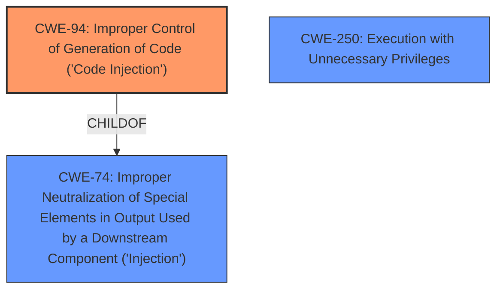

# Analysis Report for CVE-2022-31593

# Vulnerability Analysis Report: CVE-2022-31593

## Description


## Analysis (with Relationship Data)

# Summary
| CWE ID | CWE Name | Confidence | CWE Abstraction Level | CWE Vulnerability Mapping Label | CWE-Vulnerability Mapping Notes |
|---|---|---|---|---|---|
| CWE-94 | Improper Control of Generation of Code ('Code Injection') | 0.8 | Base | Allowed-with-Review | Primary CWE |
| CWE-250 | Execution with Unnecessary Privileges | 0.5 | Base | Allowed | Secondary Candidate |

## Evidence and Confidence

*   **Confidence Score:** 0.8
*   **Evidence Strength:** MEDIUM

## Relationship Analysis
The primary CWE is CWE-94, which is a Base level weakness and a child of CWE-74. CWE-94 focuses on the improper control of code generation, which aligns well with the vulnerability description of **code injection**. CWE-74 is a more general class related to improper neutralization in output used by a downstream component, while CWE-94 is a more specific case of **code injection**, making it a better fit. CWE-250 (Execution with Unnecessary Privileges) is considered as a secondary candidate due to the "low privileges" aspect of the attacker, but the evidence is not strong enough to confirm this, as it is not clear if the application runs with unnecessary privileges by default.



## Vulnerability Chain
The vulnerability chain starts with the attacker having low privileges, then exploiting a **code injection** **weakness**, which leads to the attacker controlling the behavior of the application.

## Summary of Analysis
The primary weakness is **code injection**, allowing the attacker to control the application's behavior. The selection of CWE-94 is based on the vulnerability description's explicit mention of **code injection**. The description states: "SAP Business One client - version 10.0 allows an attacker with low privileges, to inject code that can be executed by the application. An attacker could thereby control the behavior of the application." This aligns directly with CWE-94's description: "The product constructs all or part of a code segment using externally-influenced input from an upstream component, but it does not neutralize or incorrectly neutralizes special elements that could modify the syntax or behavior of the intended code segment."

CWE-74 was considered but deemed too general. While the vulnerability involves injection, CWE-94's focus on **code injection** makes it more specific and relevant. CWE-20 was also considered, but this vulnerability is less about input validation and more about direct **code injection**.

CWE-250 was considered because the attacker has "low privileges". If the application requires higher privileges to run or perform specific actions, and the **code injection** allows bypassing these privilege checks, then CWE-250 might be relevant. However, without further information, this remains speculative.

CWE-94 is at the optimal level of specificity because it directly addresses the root cause of the vulnerability: the ability to inject and execute arbitrary code.

Relevant CWE Information:

# Enhanced Context (25 CWEs)

## CWE-94: Improper Control of Generation of Code ('Code Injection')
**Abstraction:** Base
**Similarity Score**: 0.230
**Source**: sparse

**Description**:
The product constructs all or part of a code segment using externally-influenced input from an upstream component, but it does not neutralize or incorrectly neutralizes special elements that could modify the syntax or behavior of the intended code segment.

**Mapping Guidance:**
**Usage:** Allowed-with-Review
**Rationale:** This entry is frequently misused for vulnerabilities with a technical impact of "code execution," which does not by itself indicate a root cause weakness, since dozens of weaknesses can enable code execution.
**Comments:** This weakness only applies when the product's functionality intentionally constructs all or part of a code segment. It could be that executing code could be the result of other weaknesses that do not involve the construction of code segments.

## CWE-250: Execution with Unnecessary Privileges
**Abstraction:** Base
**Similarity Score**: 0.198
**Source**: sparse

**Description**:
The product performs an operation at a privilege level that is higher than the minimum level required, which creates new weaknesses or amplifies the consequences of other weaknesses.

**Mapping Guidance:**
**Usage:** Allowed
**Rationale:** This CWE entry is at the Base level of abstraction, which is a preferred level of abstraction for mapping to the root causes of vulnerabilities.
**Comments:** Carefully read both the name and description to ensure that this mapping is an appropriate fit. Do not try to 'force' a mapping to a lower-level Base/Variant simply to comply with this preferred level of abstraction.


## CWE Relationship Analysis

Current CWEs represent these abstraction levels: .


### Vulnerability Chain Analysis

**Chain starting from CWE-94:**
- 94 (Improper Control of Generation of Code ('Code Injection')) - ROOT


**Chain starting from CWE-250:**
- 250 (Execution with Unnecessary Privileges) - ROOT


### CWE Relationship Diagram

```mermaid
graph TD
    classDef primary fill:#f96,stroke:#333,stroke-width:2px
    classDef secondary fill:#69f,stroke:#333
    classDef tertiary fill:#9e9,stroke:#333
```


*Report generated on 2025-03-30 18:15:04*
