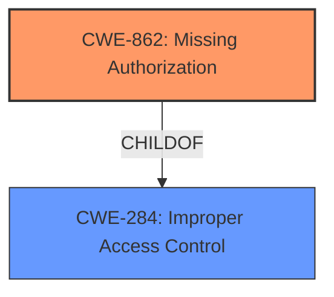

# Raw Analyzer Response for CVE-2022-31597

# Summary
| CWE ID | CWE Name | Confidence | CWE Abstraction Level | CWE Vulnerability Mapping Label | CWE-Vulnerability Mapping Notes |
|---|---|---|---|---|---|
| CWE-862 | Missing Authorization | 0.9 | Class | Allowed-with-Review | Primary CWE. The application **does not perform necessary authorization checks** for a low privileged authenticated user. |
| CWE-284 | Improper Access Control | 0.6 | Pillar | Discouraged | Secondary candidate. A high-level CWE that could apply but is less specific than CWE-862. |

## Evidence and Confidence

*   **Confidence Score:** 0.9
*   **Evidence Strength:** HIGH

## Relationship Analysis
The primary relationship that influenced the decision was the ChildOf relationship between CWE-862 (Missing Authorization) and CWE-284 (Improper Access Control). CWE-862 is a child of CWE-284, making it a more specific classification when authorization checks are missing. The high-level nature of CWE-284 makes it a less precise fit than CWE-862.

## Vulnerability Chain
The vulnerability chain starts with the **missing authorization check**, leading to **privilege escalation**.

## Summary of Analysis
The initial assessment identified CWE-862 as the primary weakness due to the explicit mention of **missing authorization checks** in the vulnerability description. The description clearly states that the application **does not perform necessary authorization checks**.

This assessment is strongly based on the provided evidence, specifically the "Vulnerability Description Key Phrases" section, which highlights "**rootcause:** **does not perform necessary authorization checks**".

The graph relationships influenced the selection by emphasizing the hierarchical structure. CWE-862 is a child of CWE-284, which means it's a more specific instance of access control issues.

The selected CWE, CWE-862, is at the optimal level of specificity because it directly addresses the root cause of the vulnerability - the absence of authorization checks.

Relevant CWE Information:

# Enhanced Context (25 CWEs)

## CWE-1289: Improper Validation of Unsafe Equivalence in Input
Not selected. While this CWE relates to input validation, the primary issue is the **absence of authorization**, not the improper validation of input.

## CWE-807: Reliance on Untrusted Inputs in a Security Decision
Not selected. Similar to CWE-1289, the root cause is the **missing authorization**, not the reliance on untrusted inputs.

## CWE-274: Improper Handling of Insufficient Privileges
Not selected. This CWE is about the improper handling of *insufficient* privileges, while the core issue is the *lack* of authorization checks.

## CWE-297: Improper Validation of Certificate with Host Mismatch
Not selected. This is specific to certificate validation, and the vulnerability does not involve certificates.

## CWE-295: Improper Certificate Validation
Not selected. This is specific to certificate validation, and the vulnerability does not involve certificates.

## CWE-691: Insufficient Control Flow Management
Not selected. This is a very high-level CWE, and the root cause is more specific: a **missing authorization check**.

## CWE-345: Insufficient Verification of Data Authenticity
Not selected. The vulnerability isn't related to data authenticity.

## CWE-657: Violation of Secure Design Principles
Not selected. This is a very general CWE and not as descriptive as the specific **missing authorization**.

## CWE-183: Permissive List of Allowed Inputs
Not selected. This relates to overly permissive lists, but the vulnerability doesn't mention such lists.

## CWE-280: Improper Handling of Insufficient Permissions or Privileges
Not selected. The issue is a **lack of authorization checks**, not how the system handles insufficient privileges.

## CWE-863: Incorrect Authorization
Not selected. The vulnerability description indicates authorization checks are missing, not that they are performed incorrectly.

## CWE-285: Improper Authorization
Not selected. The vulnerability description indicates authorization checks are missing, not improperly performed.

## CWE-639: Authorization Bypass Through User-Controlled Key
Not selected. The vulnerability is about a **missing authorization check**, not the manipulation of user-controlled keys.

## CWE-287: Improper Authentication
Not selected. The vulnerability description focuses on authorization, not authentication.

## CWE-322: Key Exchange without Entity Authentication
Not selected. This is relevant to key exchange scenarios, which are not mentioned in the vulnerability description.

## CWE-41: Improper Resolution of Path Equivalence
Not selected. The vulnerability doesn't involve path resolution.

## CWE-190: Integer Overflow or Wraparound
Not selected. The vulnerability does not involve integer overflows.

## CWE-73: External Control of File Name or Path
Not selected. The vulnerability doesn't involve file names or paths.

## CWE-22: Improper Limitation of a Pathname to a Restricted Directory ('Path Traversal')
Not selected. The vulnerability doesn't involve path traversal.

## CWE-770: Allocation of Resources Without Limits or Throttling
Not selected. The vulnerability doesn't involve resource allocation.

## CWE-178: Improper Handling of Case Sensitivity
Not selected. The vulnerability doesn't involve case sensitivity.

## CWE-266: Incorrect Privilege Assignment
Not selected. The vulnerability isn't about incorrect privilege assignments.

## CWE-843: Access of Resource Using Incompatible Type ('Type Confusion')
Not selected. The vulnerability doesn't involve type confusion.

## CWE-1284: Improper Validation of Specified Quantity in Input
Not selected. The vulnerability doesn't involve validating quantities in input.