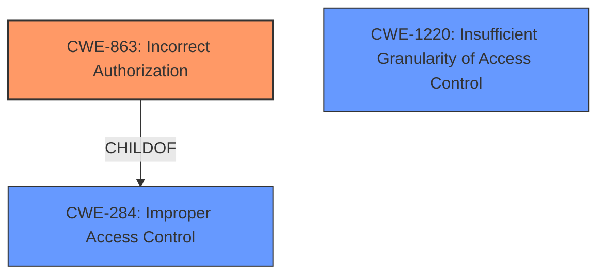

# Analysis for CVE-2022-31609

# Summary
| CWE ID    | CWE Name                                                | Confidence | CWE Abstraction Level | CWE Vulnerability Mapping Label | CWE-Vulnerability Mapping Notes |
| :-------- | :------------------------------------------------------ | :--------- | :-------------------- | :------------------------------ | :------------------------------ |
| CWE-863   | Incorrect Authorization                                   | 0.9        | Class                 | Primary                         | Allowed-with-Review           |
| CWE-1220  | Insufficient Granularity of Access Control             | 0.7        | Base                  | Secondary                       | Allowed                       |

## Evidence and Confidence

*   **Confidence Score:** 0.8
*   **Evidence Strength:** HIGH

## Relationship Analysis
The primary CWE is CWE-863, which is a Class-level CWE. CWE-863 is a child of CWE-284 (Improper Access Control), but CWE-284 is a Pillar-level CWE and is discouraged. CWE-863 is the best fit because the vulnerability lies in performing an authorization check, but doing it incorrectly. CWE-1220 is a Base-level CWE and is a good candidate to be a secondary CWE because it describes access controls lacking required granularity, which renders the control policy too broad.

## Vulnerability Chain
The chain of events is as follows:
1.  The Virtual GPU Manager (vGPU plugin) in NVIDIA vGPU software has an authorization **weakness**.
2.  A guest VM is able to allocate resources for which it is not authorized (CWE-863).
3.  This leads to loss of data integrity and confidentiality, denial of service, or information disclosure.

## Summary of Analysis
The initial assessment identified **improper authorization** as the root cause, aligning with the description of CWE-863 (Incorrect Authorization). The vulnerability description indicates that the Virtual GPU Manager allows a guest VM to allocate resources for which it is not authorized. This directly matches the concept of performing an authorization check incorrectly. The CVE Reference Links Content Summary supports this by stating that the vGPU plugin fails to properly enforce authorization when guest VMs request resources.

The selection of CWE-863 is based on the evidence: "The issue stems from the plugin allowing a guest VM to allocate resources for which it is not authorized." which indicates an authorization mechanism is present, but not functioning correctly.

CWE-863 is at the Class level of abstraction, however, it's the best fit because it directly addresses the **incorrect authorization** mechanism.

I am also adding CWE-1220 because the description states that "it allows the guest VM to allocate resources for which the guest is not authorized". This could be because the access controls are not granular enough.

Relevant CWE Information:

# Enhanced Context (25 CWEs)

## CWE-1220: Insufficient Granularity of Access Control
**Abstraction Level**: Base
**Similarity Score**: 0.77
**Source**: dense

**Description**:
The product implements access controls via a policy or other feature with the intention to disable or restrict accesses (reads and/or writes) to assets in a system from untrusted agents. However, implemented access controls lack required granularity, which renders the control policy too broad because it allows accesses from unauthorized agents to the security-sensitive assets.

**Mapping Guidance**:
- Usage: Allowed
- Rationale: This CWE entry is at the Base level of abstraction, which is a preferred level of abstraction for mapping to the root causes of vulnerabilities.

## CWE-863: Incorrect Authorization
**Abstraction Level**: Class
**Similarity Score**: 5926.40
**Source**: sparse

**Description**:
The product performs an authorization check when an actor attempts to access a resource or perform an action, but it does not correctly perform the check.

**Mapping Guidance**:
- Usage: Allowed-with-Review
- Rationale: This CWE entry is a Class and might have Base-level children that would be more appropriate