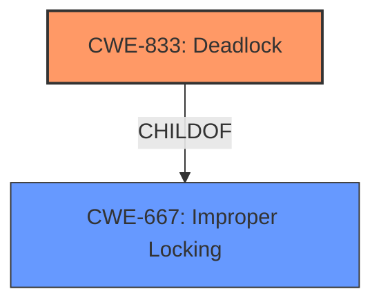

# Enhanced Analysis for CVE-2022-31621

# Summary
| CWE ID | CWE Name | Confidence | CWE Abstraction Level | CWE Vulnerability Mapping Label | CWE-Vulnerability Mapping Notes |
|---|---|---|---|---|---|
| CWE-833 | Deadlock | 1.0 | Base | Allowed | Primary CWE |
| CWE-667 | Improper Locking | 0.7 | Class | Allowed-with-Review | Secondary Candidate |

## Evidence and Confidence

*   **Confidence Score:** 0.9
*   **Evidence Strength:** HIGH

## Relationship Analysis
The primary relationship that influenced the decision was the ChildOf relationship between CWE-833 (Deadlock) and CWE-667 (Improper Locking). Since the vulnerability description explicitly mentions a deadlock caused by improper locking, CWE-833 was selected as the primary CWE, being more specific than its parent. CWE-667 was considered as a secondary candidate to represent the underlying cause, the **improper locking**.



## Vulnerability Chain
The chain of events for this vulnerability is:
1.  **Improper Locking** (CWE-667): A mutex lock is not released under specific error conditions.
2.  **Deadlock** (CWE-833): Subsequent threads attempting to acquire the same lock are blocked indefinitely.
3.  **Denial of Service**: The deadlock condition renders the service unresponsive.

## Summary of Analysis
The initial analysis focused on identifying the root cause and the resulting impact. The vulnerability description explicitly states that the vulnerability is due to **improper locking** which leads to a deadlock and denial of service.

The "CVE Reference Links Content Summary" section confirms this, stating "The root cause of CVE-2022-31621 lies in an **improper locking** mechanism within the `ds_xbstream.cc` file of MariaDB. Specifically, the mutex lock `stream_ctxt->mutex` is not released under certain conditions within the `xbstream_open` function... This unreleased lock can lead to a deadlock if other threads attempt to acquire the same lock, causing a denial of service."

Based on this information, CWE-833 (Deadlock) was selected as the primary CWE because the deadlock is the direct result of the unreleased lock, and the deadlock leads to the denial of service. CWE-667 (Improper Locking) was considered as a secondary CWE because it is the root cause of the deadlock.

The graph relationships reinforced this decision, as CWE-833 is a child of CWE-667, indicating a specific type of improper locking. The selected CWEs are at the optimal level of specificity, with CWE-833 being a Base level CWE and CWE-667 being a Class level CWE.

Other CWEs Considered but Not Used:

*   CWE-770 (Allocation of Resources Without Limits or Throttling): While a deadlock can be considered a form of resource exhaustion, this CWE doesn't directly capture the locking issue.
*   CWE-404 (Improper Resource Shutdown or Release): Similar to CWE-770, while related, it doesn't specifically address the locking aspect.
*   CWE-476 (NULL Pointer Dereference): This was considered because the condition `stream_ctxt->dest_file == NULL` is mentioned, however there is no evidence that the code attempts to dereference `stream_ctxt->dest_file` while it is `NULL`.
*   CWE-1284 (Improper Validation of Specified Quantity in Input): Irrelevant to the described vulnerability.
* CWE-755 (Improper Handling of Exceptional Conditions): While an error condition triggers the unreleased lock, the core issue is the locking itself, not the handling of the exception.


## CWE Relationship Analysis

Current CWEs represent these abstraction levels: .


### Vulnerability Chain Analysis

**Chain starting from CWE-476:**
- 476 (NULL Pointer Dereference) - ROOT


**Chain starting from CWE-833:**
- 833 (Deadlock) - ROOT


### CWE Relationship Diagram

```mermaid
graph TD
    classDef primary fill:#f96,stroke:#333,stroke-width:2px
    classDef secondary fill:#69f,stroke:#333
    classDef tertiary fill:#9e9,stroke:#333
```