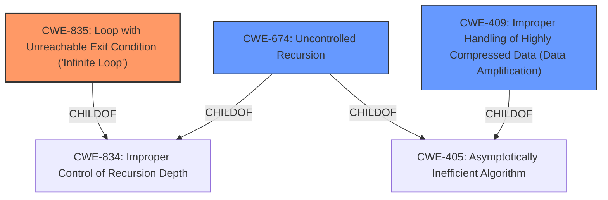

# Analysis Report for CVE-2022-31628

# Vulnerability Analysis Report: CVE-2022-31628

## Description


## Analysis (with Relationship Data)

# Summary
| CWE ID | CWE Name | Confidence | CWE Abstraction Level | CWE Vulnerability Mapping Label | CWE-Vulnerability Mapping Notes |
|---|---|---|---|---|---|
| CWE-835 | Loop with Unreachable Exit Condition ('Infinite Loop') | 1.0 | Base | Allowed | Primary CWE |
| CWE-409 | Improper Handling of Highly Compressed Data (Data Amplification) | 0.7 | Base | Allowed | Secondary Candidate |
| CWE-674 | Uncontrolled Recursion | 0.6 | Class | Allowed-with-Review | Secondary Candidate |

## Evidence and Confidence

*   **Confidence Score:** 0.9
*   **Evidence Strength:** HIGH

## Relationship Analysis
The primary CWE selected is CWE-835, which describes an infinite loop due to an unreachable exit condition. This is a base-level CWE that directly matches the vulnerability description. CWE-674 (Uncontrolled Recursion) and CWE-409 (Improper Handling of Highly Compressed Data) were considered as secondary candidates due to the recursive nature of the decompression and the data amplification aspect, respectively. However, CWE-835 is the most specific and accurate representation of the core weakness. The relationship between CWE-674 as a parent of CWE-834 (which in turn is a parent to CWE-835) highlights the broader category of control flow issues that can lead to infinite loops.



## Vulnerability Chain
The vulnerability chain starts with the **improper** handling of gzipped files by the phar uncompressor. Specifically, the application **fails to** limit recursion when decompressing files. A crafted "quine" gzip file (a file that contains itself in compressed form) triggers recursive decompression, leading to an **infinite loop** and denial of service.
  - Root Cause: **Improper** handling of compressed data and **missing** recursion limit.
  - Weakness: Infinite recursion.
  - Impact: Denial of service.

## Summary of Analysis
The initial assessment focused on identifying the root cause of the denial-of-service vulnerability in the PHP phar uncompressor. The evidence strongly suggests that the application's **failure to** limit recursion depth when decompressing gzipped files is the core issue.

The "CVE Reference Links Content Summary" explicitly states the "**root_cause**" as: "The vulnerability arises from the phar wrapper's behavior when processing gzipped files...the wrapper will recursively try to decompress it again. This can lead to an **infinite loop** and subsequent denial-of-service condition."

The "Vulnerability Description Key Phrases" also highlights the "**impact:** infinite loop" and "**vector:** recursively uncompress quines gzip files".

Based on the evidence, CWE-835 (Loop with Unreachable Exit Condition ('Infinite Loop')) is the most accurate and specific CWE. It directly addresses the core weakness of the vulnerability.

CWE-674 (Uncontrolled Recursion) was considered because the vulnerability involves recursive decompression. However, CWE-835 is more precise because it specifies the "infinite loop" condition, which is the actual symptom of the vulnerability.

CWE-409 (Improper Handling of Highly Compressed Data) was also considered, as the "quine" gzip file can be seen as a form of data amplification. However, the core issue is not the size of the decompressed data but the infinite loop caused by recursive decompression.

The relationships between these CWEs helped refine the selection. CWE-674 is a parent of CWE-834, which in turn is a parent of CWE-835, indicating a hierarchical relationship from general recursion issues to specific infinite loop conditions.

The selection of CWE-835 is at the optimal level of specificity because it directly matches the vulnerability's core weakness and impact, and it is a base-level CWE, which is preferred for root cause analysis.

Other CWEs Considered:
- CWE-22, CWE-23, CWE-73: These CWEs relate to path traversal, which is not relevant to this vulnerability. The issue is with file decompression, not file path handling.
- CWE-502: This CWE relates to deserialization, which is not applicable here. The vulnerability is about decompression, not object deserialization.
- CWE-434: This CWE relates to unrestricted file uploads, which is not directly relevant. The vulnerability lies in how uploaded files are processed, not the upload itself.
- CWE-776: This CWE relates to XML entity expansion, which is specific to XML processing and not relevant to gzip decompression.


## CWE Relationship Analysis

Current CWEs represent these abstraction levels: .


### Vulnerability Chain Analysis

**Chain starting from CWE-834:**
- 834 (Excessive Iteration) - ROOT


**Chain starting from CWE-434:**
- 434 (Unrestricted Upload of File with Dangerous Type) - ROOT


### CWE Relationship Diagram

```mermaid
graph TD
    classDef primary fill:#f96,stroke:#333,stroke-width:2px
    classDef secondary fill:#69f,stroke:#333
    classDef tertiary fill:#9e9,stroke:#333
```


*Report generated on 2025-03-31 09:21:45*
