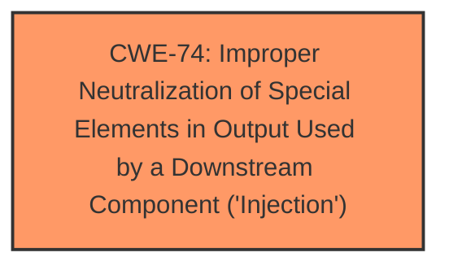

# Analysis for CVE-2022-31658

# Summary
| CWE ID  | CWE Name                                                                                      | Confidence | CWE Abstraction Level | CWE Vulnerability Mapping Label | CWE-Vulnerability Mapping Notes |
| :-------- | :--------------------------------------------------------------------------------------------- | :---------- | :---------------------- | :------------------------------ | :------------------------------ |
| CWE-74 | Improper Neutralization of Special Elements in Output Used by a Downstream Component ('Injection') | 0.8 | Class | Primary CWE | Discouraged |

## Evidence and Confidence

*   **Confidence Score:** 0.8
*   **Evidence Strength:** HIGH

## Relationship Analysis
The primary identified weakness is CWE-74, which is a Class-level CWE. Although it's preferable to map to Base or Variant level CWEs, the provided information doesn't give enough evidence to pinpoint the specific type of injection. CWE-74 is the parent of more specific injection types, making it a reasonable, though not ideal, fit.

## Vulnerability Chain
The vulnerability chain starts with unsanitized input being passed to JDBC queries, leading to remote code execution. The chain is:
1.  **Unsanitized Input**: Input is not properly validated or sanitized.
2.  **JDBC Injection (CWE-74)**: The unsanitized input is used in a JDBC query.
3.  **Remote Code Execution**: The injection leads to arbitrary code execution on the system.

## Summary of Analysis
The analysis indicates that the root cause of the vulnerability is the **improper neutralization of special elements** in output used by a downstream component, specifically a JDBC query. This leads to a **JDBC Injection vulnerability**, which enables remote code execution.

The primary CWE match from similar CVE descriptions is CWE-74. The retriever results also list CWE-74 as a relevant CWE.

The evidence supporting this decision comes from the "CVE Reference Links Content Summary," which states:

*   "Root cause: JDBC Injection vulnerability"
*   "Weaknesses: Remote code execution due to unsanitized input to JDBC queries"

Given this evidence, CWE-74 is the most appropriate CWE, even though it is discouraged due to its high-level nature. Without further information, a more specific CWE cannot be determined.

CWE-20 ("Improper Input Validation") was considered but not selected because the description specifically mentions "unsanitized input to JDBC queries," indicating that the input is being used in a downstream component without proper neutralization, which aligns more directly with CWE-74.
CWE-89 ("Improper Neutralization of Special Elements used in an SQL Command ('SQL Injection')") was considered, but the description refers to JDBC Injection and not specifically SQL injection.
CWE-502 ("Deserialization of Untrusted Data") was considered but not selected, as the vulnerability involves JDBC injection and not deserialization of untrusted data.
CWE-269 ("Improper Privilege Management") was considered but the **root cause** is related to **unsanitized input** leading to injection, not directly to privilege management issues.