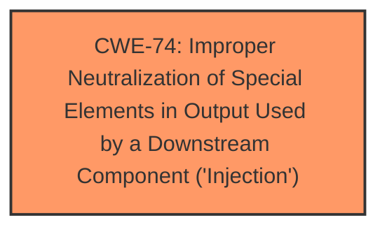

# Analysis for CVE-2022-31665

# Summary
| CWE ID | CWE Name | Confidence | CWE Abstraction Level | CWE Vulnerability Mapping Label | CWE-Vulnerability Mapping Notes |
|---|---|---|---|---|---|
| CWE-74 | Improper Neutralization of Special Elements in Output Used by a Downstream Component ('Injection') | 0.9 | Class | Primary | Discouraged |

## Evidence and Confidence

*   **Confidence Score:** 0.9
*   **Evidence Strength:** HIGH

## Relationship Analysis
The primary relationship considered was the parent-child relationship between CWE-74 and its potential children, which represent more specific injection types. While the description mentions JDBC injection, there isn't enough detail to pinpoint the exact variant. Thus, the higher-level CWE-74 is chosen.

## Vulnerability Chain
The vulnerability chain starts with the **improper neutralization** of special elements, leading to **JDBC injection**, and culminating in **remote code execution**. The root cause is the **improper neutralization**, and the impact is **remote code execution**.

## Summary of Analysis
The initial assessment and the final conclusion both point towards CWE-74 as the most appropriate classification, given the available evidence.

The description clearly indicates a remote code execution vulnerability that is caused by **JDBC injection**. The "CWE for similar CVE Descriptions" section lists CWE-74 as the primary match and the top CWE. The CVE Reference Links Content Summary confirms that the root cause is a **JDBC injection flaw** leading to remote code execution.

While CWE-74 is a Class-level CWE and is generally discouraged, the provided information does not offer enough specificity to select a more granular Base or Variant CWE related to JDBC injection. Therefore, CWE-74 is selected as the most accurate representation of the vulnerability based on the available evidence.

Relevant CWE Information:

# Enhanced Context (25 CWEs)
The following CWEs were identified as potentially relevant to this vulnerability:

## CWE-74: Improper Neutralization of Special Elements in Output Used by a Downstream Component ('Injection')
**Abstraction Level**: Class
**Similarity Score**: 0.80
**Source**: dense

**Description**:
The product constructs all or part of a command, data structure, or record using externally-influenced input from an upstream component, but it does not neutralize or incorrectly neutralizes special elements that could modify how it is parsed or interpreted when it is sent to a downstream component.

**Mapping Guidance**:
- Usage: Discouraged
- Rationale: CWE-74 is high-level and often misused when lower-level weaknesses are more appropriate.