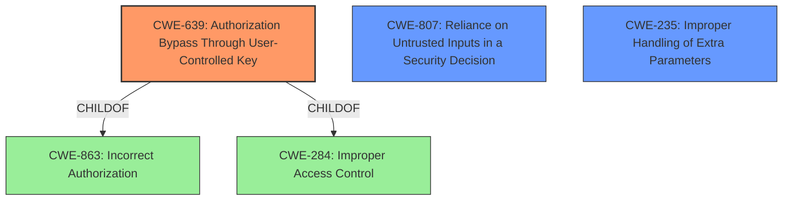

# Enhanced Analysis for CVE-2022-31683

# Summary
| CWE ID | CWE Name | Confidence | CWE Abstraction Level | CWE Vulnerability Mapping Label | CWE-Vulnerability Mapping Notes |
|---|---|---|---|---|---|
| CWE-639 | Authorization Bypass Through User-Controlled Key | 0.9 | Base | Allowed | Primary CWE |
| CWE-807 | Reliance on Untrusted Inputs in a Security Decision | 0.7 | Base | Allowed | Secondary Candidate |
| CWE-235 | Improper Handling of Extra Parameters | 0.6 | Variant | Allowed | Secondary Candidate |

## Evidence and Confidence

*   **Confidence Score:** 0.9
*   **Evidence Strength:** HIGH

## Relationship Analysis
The primary CWE selected is CWE-639 (Authorization Bypass Through User-Controlled Key), which is a child of CWE-863 (Incorrect Authorization) and CWE-284 (Improper Access Control). CWE-807 (Reliance on Untrusted Inputs in a Security Decision) is considered because the bypass relies on the application trusting the `team_name` from the request body. CWE-235 (Improper Handling of Extra Parameters) is considered since HTTP parameter pollution is part of the attack. The relationship to the parent classes influenced the decision to select a more specific Base CWE for the primary mapping.



## Vulnerability Chain
The vulnerability chain starts with the **improper parsing** of the `team_name` parameter due to the use of `FormValue`, leading to **HTTP parameter pollution**. This leads to the **authorization bypass**, ultimately allowing **unauthorized access to resources** belonging to other teams.

## Summary of Analysis
The initial analysis identified an **authorization bypass issue**. The vulnerability description and the CVE Reference Links Content Summary provided sufficient evidence to support the selection of CWE-639 (Authorization Bypass Through User-Controlled Key) as the primary CWE. The key evidence is that the application uses a user-controlled key (`team_name`) to retrieve user records and fails to properly authorize the data access operation, allowing users to access resources belonging to other teams. The use of `FormValue` leads to HTTP parameter pollution which is the mechanism for the **authorization bypass issue**.

The retriever results and graph relationships were used to refine the selection. CWE-639 is a Base level CWE, which is the preferred level of abstraction. The mitigation involves using `URL.Query().Get()` to retrieve parameters only from the URL, preventing the body from overriding URL parameters, thus further supporting the chosen CWE. The evidence provided directly supports the identification of an **authorization bypass vulnerability** due to **improper handling of a user-controlled key**.

The other CWEs considered such as CWE-284 and CWE-285 are too high-level and abstract, whereas CWE-639 is a more specific and accurate representation of the vulnerability.

Relevant CWE Information:

# Enhanced Context (25 CWEs)
The following CWEs were identified as potentially relevant to this vulnerability:

## CWE-639: Authorization Bypass Through User-Controlled Key
**Abstraction Level**: Base
**Similarity Score**: 0.77
**Source**: dense

**Description**:
The system's authorization functionality does not prevent one user from gaining access to another user's data or record by modifying the key value identifying the data.

**Mapping Guidance**:
- Usage: Allowed
- Rationale: This CWE entry is at the Base level of abstraction, which is a preferred level of abstraction for mapping to the root causes of vulnerabilities.

## CWE-807: Reliance on Untrusted Inputs in a Security Decision
**Abstraction Level**: Base
**Similarity Score**: 0.75
**Source**: dense

**Description**:
The product uses a protection mechanism that relies on the existence or values of an input, but the input can be modified by an untrusted actor in a way that bypasses the protection mechanism.

**Mapping Guidance**:
- Usage: Allowed
- Rationale: This CWE entry is at the Base level of abstraction, which is a preferred level of abstraction for mapping to the root causes of vulnerabilities.

## CWE-235: Improper Handling of Extra Parameters
**Abstraction Level**: Variant
**Status:** Draft

### Description
The product does not handle or incorrectly handles when the number of parameters, fields, or arguments with the same name exceeds the expected amount.

### Extended Description
Not provided

### Alternative Terms
None

### Relationships
ChildOf -> CWE-233

### Mapping Guidance
**Usage:** Allowed
**Rationale:** This CWE entry is at the Variant level of abstraction, which is a preferred level of abstraction for mapping to the root causes of vulnerabilities.
**Comments:** Carefully read both the name and description to ensure that this mapping is an appropriate fit. Do not try to 'force' a mapping to a lower-level Base/Variant simply to comply with this preferred level of abstraction.
**Reasons:**
- Acceptable-Use

### Additional Notes
**[Relationship]** This type of problem has a big role in multiple interpretation vulnerabilities and various HTTP attacks.

### Observed Examples
- **CVE-2003-1014:** MIE. multiple gateway/security products allow restriction bypass using multiple MIME fields with the same name, which are interpreted differently by clients.

## CWE-639: Authorization Bypass Through User-Controlled Key
**Abstraction Level**: Base
**Similarity Score**: 6382.97
**Source**: sparse

**Description**:
The system's authorization functionality does not prevent one user from gaining access to another user's data or record by modifying the key value identifying the data.

**Mapping Guidance**:
- Usage: Allowed
- Rationale: This CWE entry is at the Base level of abstraction, which is a preferred level of abstraction for mapping to the root causes of vulnerabilities.

## CWE-284: Improper Access Control
**Abstraction:** Pillar
**Status:** Incomplete

### Description
The product does not restrict or incorrectly restricts access to a resource from an unauthorized actor.

### Extended Description
Access control involves the use of several protection mechanisms such as:
- Authentication (proving the identity of an actor)
- Authorization (ensuring that a given actor can access a resource), and
- Accountability (tracking of activities that were performed)
When any mechanism is not applied or otherwise fails, attackers can compromise the security of the product by gaining privileges, reading sensitive information, executing commands, evading detection, etc.
There are two distinct behaviors that can introduce access control weaknesses:
- Specification: incorrect privileges, permissions, ownership, etc. are explicitly specified for either the user or the resource (for example, setting a password file to be world-writable, or giving administrator capabilities to a guest user). This action could be performed by the program or the administrator.
- Enforcement: the mechanism contains errors that prevent it from properly enforcing the specified access control requirements (e.g., allowing the user to specify their own privileges, or allowing a syntactically-incorrect ACL to produce insecure settings). This problem occurs within the program itself, in that it does not actually enforce the intended security policy that the administrator specifies.

### Alternative Terms
Authorization: The terms "access control" and "authorization" are often used interchangeably, although many people have distinct definitions. The CWE usage of "access control" is intended as a general term for the various mechanisms that restrict which users can access which resources, and "authorization" is more narrowly defined. It is unlikely that there will be community consensus on the use of these terms.

### Relationships
None

### Mapping Guidance
**Usage:** Discouraged
**Rationale:** CWE-284 is extremely high-level, a Pillar. Its name, "Improper Access Control," is often misused in low-information vulnerability reports [REF-1287] or by active use of the OWASP Top Ten, such as "A01:2021-Broken Access Control". It is not useful for trend analysis.
**Comments:** Consider using descendants of CWE-284 that are more specific to the kind of access control involved, such as those involving authorization (Missing Authorization (CWE-862), Incorrect Authorization (CWE-863), Incorrect Permission Assignment for Critical Resource (CWE-732), etc.); authentication (Missing Authentication (CWE-306) or Weak Authentication (CWE-1390)); Incorrect User Management (CWE-286); Improper Restriction of Communication Channel to Intended Endpoints (CWE-


## CWE Relationship Analysis

Current CWEs represent these abstraction levels: .


### Vulnerability Chain Analysis

**Chain starting from CWE-862:**
- 862 (Missing Authorization) - ROOT


**Chain starting from CWE-306:**
- 306 (Missing Authentication for Critical Function) - ROOT


### CWE Relationship Diagram

```mermaid
graph TD
    classDef primary fill:#f96,stroke:#333,stroke-width:2px
    classDef secondary fill:#69f,stroke:#333
    classDef tertiary fill:#9e9,stroke:#333
```