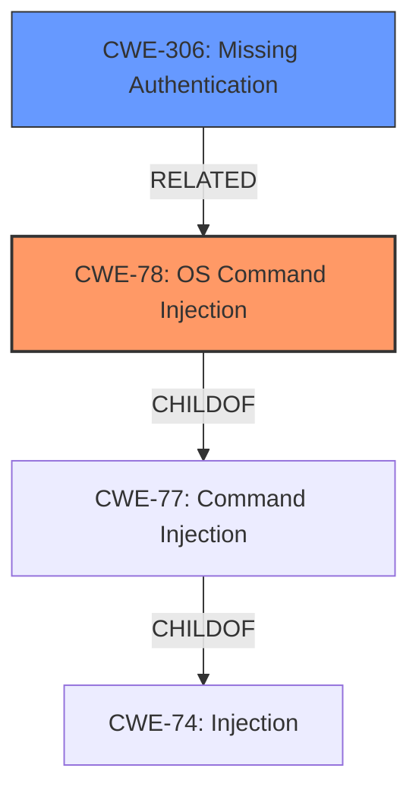

# Analysis Report for CVE-2022-31702

# Vulnerability Analysis Report: CVE-2022-31702

## Description


## Analysis (with Relationship Data)

# Summary
| CWE ID | CWE Name | Confidence | CWE Abstraction Level | CWE Vulnerability Mapping Label | CWE-Vulnerability Mapping Notes |
|---|---|---|---|---|---|
| CWE-78 | Improper Neutralization of Special Elements used in an OS Command ('OS Command Injection') | 1.0 | Base | Allowed | Primary CWE. The product constructs an OS command using externally-influenced input, but it does not neutralize special elements that could modify the intended OS command. |
| CWE-306 | Missing Authentication for Critical Function | 0.7 | Base | Allowed | Secondary CWE. The vulnerability allows execution of commands without authentication. |

## Evidence and Confidence

*   **Confidence Score:** 0.9
*   **Evidence Strength:** HIGH

## Relationship Analysis
The primary relationship that influenced the decision was the hierarchical relationship between CWE-77 (Improper Neutralization of Special Elements used in a Command) and CWE-78 (Improper Neutralization of Special Elements used in an OS Command). Since the vulnerability specifically involves OS commands, CWE-78 was selected as the more specific and appropriate choice. Additionally, the lack of authentication (CWE-306) is a separate but related issue, indicating a compound weakness.



## Vulnerability Chain
The vulnerability chain starts with **command injection** in the vRNI REST API (CWE-78). This leads to the ability to execute commands without authentication (CWE-306), ultimately resulting in a malicious actor being able to execute commands on the system.
- **Root Cause**: Improper neutralization of special elements used in an OS command (CWE-78)
- **Missing Step**: Missing authentication (CWE-306)
- **Impact**: Execution of commands by a malicious actor

## Summary of Analysis
The initial assessment identified the **command injection** vulnerability as the primary issue. The Retriever Results and graph-based analysis both highlighted CWE-78 and CWE-77 as potential candidates. However, the description explicitly mentions OS commands, making CWE-78 the more accurate choice.

The provided evidence from the "Vulnerability Description" and "CVE Reference Links Content Summary" sections clearly indicates a **command injection** vulnerability in the vRNI REST API, where a malicious actor can execute commands without authentication.

The selection of CWE-78 is based on the following evidence:
- Vulnerability Description Key Phrases: "**weakness:** **command injection**", "**impact:** execute commands"
- CVE Reference Links Content Summary: "**Root cause of vulnerability**: Command injection vulnerability in the vRNI REST API.", "**Weaknesses/vulnerabilities present**: Command injection", "**Impact of exploitation**: A malicious actor with network access to the vRNI REST API can execute commands without authentication."

CWE-306 was also chosen because the actor could execute commands without authentication.

The final selection of CWE-78 and CWE-306 is at the optimal level of specificity, providing a clear and accurate representation of the vulnerability.

Relevant CWE Information:
- CWE-78: Improper Neutralization of Special Elements used in an OS Command ('OS Command Injection')
- CWE-306: Missing Authentication for Critical Function


## CWE Relationship Analysis

Current CWEs represent these abstraction levels: .


### Vulnerability Chain Analysis

**Chain starting from CWE-78:**
- 78 (Improper Neutralization of Special Elements used in an OS Command ('OS Command Injection')) - ROOT


**Chain starting from CWE-306:**
- 306 (Missing Authentication for Critical Function) - ROOT


### CWE Relationship Diagram

```mermaid
graph TD
    classDef primary fill:#f96,stroke:#333,stroke-width:2px
    classDef secondary fill:#69f,stroke:#333
    classDef tertiary fill:#9e9,stroke:#333
```


*Report generated on 2025-03-30 23:31:47*
