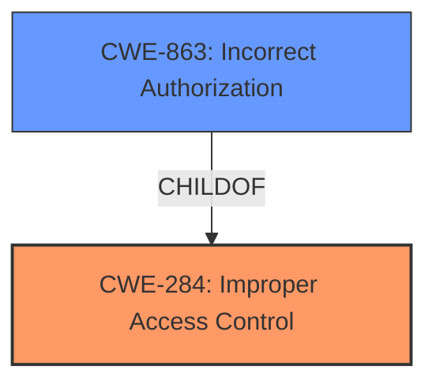

# Enhanced Analysis for CVE-2022-31708

# Summary
| CWE ID | CWE Name | Confidence | CWE Abstraction Level | CWE Vulnerability Mapping Label | CWE-Vulnerability Mapping Notes |
|---|---|---|---|---|---|
| CWE-284 | Improper Access Control | 0.75 | Pillar | Primary | Discouraged |
| CWE-863 | Incorrect Authorization | 0.60 | Class | Secondary | Allowed-with-Review |

## Evidence and Confidence

*   **Confidence Score:** 0.70
*   **Evidence Strength:** MEDIUM

## Relationship Analysis
The primary relationship impacting the decision is the hierarchical structure. CWE-284 is a high-level Pillar, while CWE-863 is a Class and a child of CWE-284. While the description points to a generic access control issue (CWE-284), the nature of the **broken access control** is leaning toward incorrect authorization.



## Vulnerability Chain
The chain involves a **broken access control** vulnerability. The provided information does not detail further weaknesses that followed for the Vulnerability Description.

## Summary of Analysis
Initially, the vulnerability description states a **broken access control** issue in vRealize Operations (vROps). The key phrase reinforces this root cause.

Based on the provided evidence: "vRealize Operations (vROps) contains a **broken access control** vulnerability."

CWE-284 (Improper Access Control) is the first consideration because the description clearly mentions "access control." However, the MITRE mapping guidance discourages its use due to its high-level nature and suggests considering more specific descendants.

CWE-863 (Incorrect Authorization) is a child of CWE-284 and represents a more specific form of access control. The term "authorization" better aligns with the vulnerability compared to just "access control" so it's a good secondary candidate.

The selection of CWE-284 is primarily influenced by the explicit mention of "access control" in the vulnerability description. However, its discouraged usage prompts the consideration of more specific alternatives. The relatively weak evidence supports the higher-level CWE-284.

Relevant CWE Information:

# Enhanced Context (25 CWEs)

## CWE-284: Improper Access Control
**Abstraction Level**: Pillar
**Similarity Score**: 0.214

**Description**:
The product does not restrict or incorrectly restricts access to a resource from an unauthorized actor.

**Mapping Guidance**:
- Usage: Discouraged
- Rationale: CWE-284 is extremely high-level, a Pillar. Its name, "Improper Access Control," is often misused in low-information vulnerability reports. It is not useful for trend analysis.
- **Suggested Alternatives:** CWE-862: Missing Authorization, CWE-863: Incorrect Authorization, CWE-732: Incorrect Permission Assignment for Critical Resource, CWE-306: Missing Authentication or Weak Authentication, CWE-1390, CWE-923: Improper Restriction of Communication Channel to Intended Endpoints

## CWE-863: Incorrect Authorization
**Abstraction Level**: Class
**Similarity Score**: 4796.27

**Description**:
The product performs an authorization check when an actor attempts to access a resource or perform an action, but it does not correctly perform the check.

**Mapping Guidance**:
- Usage: Allowed-with-Review
- Rationale: This CWE entry is a Class and might have Base-level children that would be more appropriate

CWE-284 is at the Pillar level of abstraction, which is too high and not useful for trend analysis. I am selecting CWE-284 as a primary CWE with a lower confidence score. CWE-863 is a suitable secondary candidate to track the nature of access control.


## CWE Relationship Analysis

Current CWEs represent these abstraction levels: .


### Vulnerability Chain Analysis

**Chain starting from CWE-862:**
- 862 (Missing Authorization) - ROOT


**Chain starting from CWE-923:**
- 923 (Improper Restriction of Communication Channel to Intended Endpoints) - ROOT


### CWE Relationship Diagram

```mermaid
graph TD
    classDef primary fill:#f96,stroke:#333,stroke-width:2px
    classDef secondary fill:#69f,stroke:#333
    classDef tertiary fill:#9e9,stroke:#333
```