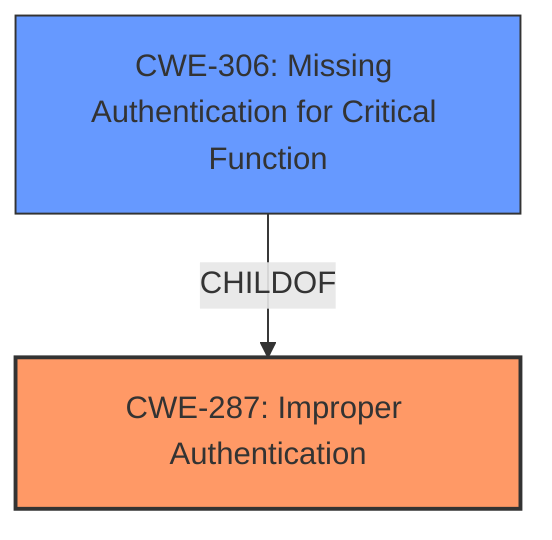

# Enhanced Analysis for CVE-2022-3173

# Summary
| CWE ID | CWE Name | Confidence | CWE Abstraction Level | CWE Vulnerability Mapping Label | CWE-Vulnerability Mapping Notes |
|---|---|---|---|---|---|
| CWE-287 | Improper Authentication | 0.8 | Class | Primary | Discouraged |
| CWE-306 | Missing Authentication for Critical Function | 0.7 | Base | Secondary | Allowed |

## Evidence and Confidence

*   **Confidence Score:** 0.8
*   **Evidence Strength:** MEDIUM

## Relationship Analysis
The primary CWE is CWE-287, a Class-level CWE. A more specific child, CWE-306, is also considered as a possible secondary mapping.



## Vulnerability Chain
The **root cause** is the **improper authentication**. The impact would be unauthorized access to the system and its resources.

## Summary of Analysis
The initial analysis pointed to **Improper Authentication** as the primary weakness, as indicated in the vulnerability description. The commit diff also suggests an improvement in permission control, which further indicates that authentication or authorization mechanisms were not sufficient prior to the change.

The final decision is based on the vulnerability description and the "CVE Reference Links Content Summary" section. The summary indicates that the commit addresses a weakness in access control by introducing more granular permissions. The vulnerability description key phrases also states that the rootcause is **Improper Authentication**.

CWE-287 is a Class-level CWE, and the MITRE guidance discourages its use when more specific CWEs are available. However, in this case, the information is not detailed enough to determine exactly which authentication step is failing. CWE-306 Missing Authentication for Critical Function is considered as a more specific option but the description doesn't specify whether the authentication is completely missing or not. Since the root cause is listed as **Improper Authentication** that includes both missing or insufficient authentication then a classification of CWE-287 and CWE-306 is appropriate.

Relevant CWE Information:

# Enhanced Context (25 CWEs)
The following CWEs were identified as potentially relevant to this vulnerability:

## CWE-639: Authorization Bypass Through User-Controlled Key
**Abstraction Level**: Base
**Similarity Score**: 0.77
**Source**: dense

**Description**:
The system's authorization functionality does not prevent one user from gaining access to another user's data or record by modifying the key value identifying the data.

**Mapping Guidance**:
- Usage: Allowed
- Rationale: This CWE entry is at the Base level of abstraction, which is a preferred level of abstraction for mapping to the root causes of vulnerabilities.

**Analysis:**
CWE-639 was considered but deemed less appropriate than CWE-287 and CWE-306 because the vulnerability description focuses on authentication issues rather than a bypass due to user-controlled keys.

## CWE-807: Reliance on Untrusted Inputs in a Security Decision
**Abstraction Level**: Base
**Similarity Score**: 0.76
**Source**: dense

**Description**:
The product uses a protection mechanism that relies on the existence or values of an input, but the input can be modified by an untrusted actor in a way that bypasses the protection mechanism.

**Mapping Guidance**:
- Usage: Allowed
- Rationale: This CWE entry is at the Base level of abstraction, which is a preferred level of abstraction for mapping to the root causes of vulnerabilities.

**Analysis:**
CWE-807 was considered but deemed less appropriate than CWE-287 and CWE-306 because the vulnerability description focuses on authentication issues rather than the reliability of inputs in security decisions.

## CWE-303: Incorrect Implementation of Authentication Algorithm
**Abstraction Level**: Base
**Similarity Score**: 0.76
**Source**: dense

**Description**:
The requirements for the product dictate the use of an established authentication algorithm, but the implementation of the algorithm is incorrect.

**Mapping Guidance**:
- Usage: Allowed
- Rationale: This CWE entry is at the Base level of abstraction, which is a preferred level of abstraction for mapping to the root causes of vulnerabilities.

**Analysis:**
CWE-303 was considered but deemed less appropriate than CWE-287 and CWE-306 because the vulnerability description does not provide enough information to determine if a specific authentication algorithm was incorrectly implemented.

## CWE-1390: Weak Authentication
**Abstraction Level**: Class
**Similarity Score**: 0.76
**Source**: dense

**Description**:
The product uses an authentication mechanism to restrict access to specific users or identities, but the mechanism does not sufficiently prove that the claimed identity is correct.

**Mapping Guidance**:
- Usage: Allowed-with-Review
- Rationale: This CWE entry is a Class and might have Base-level children that would be more appropriate

**Analysis:**
CWE-1390 was considered but deemed less appropriate than CWE-287 because the vulnerability description does not specify if the authentication mechanism is weak. It is simply **improper**.

## CWE-274: Improper Handling of Insufficient Privileges
**Abstraction Level**: Base
**Similarity Score**: 0.75
**Source**: dense

**Description**:
The product does not handle or incorrectly handles when it has insufficient privileges to perform an operation, leading to resultant weaknesses.

**Mapping Guidance**:
- Usage: Discouraged
- Rationale: This CWE entry could be deprecated in a future version of CWE.

**Analysis:**
CWE-274 was considered but deemed less appropriate than CWE-287 and CWE-306 because the vulnerability description focuses on authentication issues rather than the handling of insufficient privileges.

## CWE-280: Improper Handling of Insufficient Permissions or Privileges
**Abstraction Level**: Base
**Similarity Score**: 0.75
**Source**: dense

**Description**:
The product does not handle or incorrectly handles when it has insufficient privileges to access resources or functionality as specified by their permissions. This may cause it to follow unexpected code paths that may leave the product in an invalid state.

**Mapping Guidance**:
- Usage: Allowed
- Rationale: This CWE entry is at the Base level of abstraction, which is a preferred level of abstraction for mapping to the root causes of vulnerabilities.

**Analysis:**
CWE-280 was considered but deemed less appropriate than CWE-287 and CWE-306 because the vulnerability description focuses on authentication issues rather than the handling of insufficient permissions or privileges.

## CWE-472: External Control of Assumed-Immutable Web Parameter
**Abstraction Level**: Base
**Similarity Score**: 0.75
**Source**: dense

**Description**:
The web application does not sufficiently verify inputs that are assumed to be immutable but are actually externally controllable, such as hidden form fields.

**Mapping Guidance**:
- Usage: Allowed
- Rationale: This CWE entry is at the Base level of abstraction, which is a preferred level of abstraction for mapping to the root causes of vulnerabilities.

**Analysis:**
CWE-472 was considered but deemed less appropriate than CWE-287 and CWE-306 because the vulnerability description focuses on authentication issues rather than external control of immutable web parameters.

## CWE-204: Observable Response Discrepancy
**Abstraction Level**: Base
**Similarity Score**: 0.75
**Source**: dense

**Description**:
The product provides different responses to incoming requests in a way that reveals internal state information to an unauthorized actor outside of the intended control sphere.

**Mapping Guidance**:
- Usage: Allowed
- Rationale: This CWE entry is at the Base level of abstraction, which is a preferred level of abstraction for mapping to the root causes of vulnerabilities.

**Analysis:**
CWE-204 was considered but deemed less appropriate than CWE-287 and CWE-306 because the vulnerability description focuses on authentication issues rather than observable response discrepancies.

## CWE-345: Insufficient Verification of Data Authenticity
**Abstraction Level**: Class
**Similarity Score**: 0.75
**Source**: dense

**Description**:
The product does not sufficiently verify the origin or authenticity of data, in a way that causes it to accept invalid data.

**Mapping Guidance**:
- Usage: Discouraged
- Rationale: This CWE entry is a level-1 Class (i.e., a child of a Pillar). It might have lower-level children that would be more appropriate

**Analysis:**
CWE-345 was considered but deemed less appropriate than CWE-287 and CWE-306 because the vulnerability description focuses on authentication issues rather than the verification of data authenticity.

## CWE-288: Authentication Bypass Using an Alternate Path or Channel
**Abstraction Level**: Base
**Similarity Score**: 0.75
**Source**: dense

**Description**:
The product requires authentication, but the product has an alternate path or channel that does not require authentication.

**Mapping Guidance


## CWE Relationship Analysis

Current CWEs represent these abstraction levels: .


### Vulnerability Chain Analysis

**Chain starting from CWE-472:**
- 472 (External Control of Assumed-Immutable Web Parameter) - ROOT


**Chain starting from CWE-280:**
- 280 (Improper Handling of Insufficient Permissions or Privileges ) - ROOT


### CWE Relationship Diagram

```mermaid
graph TD
    classDef primary fill:#f96,stroke:#333,stroke-width:2px
    classDef secondary fill:#69f,stroke:#333
    classDef tertiary fill:#9e9,stroke:#333
```