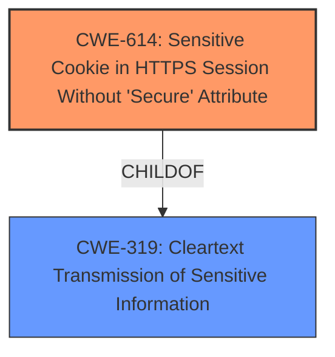

# Enhanced Analysis for CVE-2022-3174

# Summary
| CWE ID | CWE Name | Confidence | CWE Abstraction Level | CWE Vulnerability Mapping Label | CWE-Vulnerability Mapping Notes |
|---|---|---|---|---|---|
| CWE-614 | Sensitive Cookie in HTTPS Session Without 'Secure' Attribute | 1.0 | Variant | Allowed | Primary CWE |
| CWE-319 | Cleartext Transmission of Sensitive Information | 0.7 | Base | Allowed | Secondary Candidate |

## Evidence and Confidence

*   **Confidence Score:** 0.9
*   **Evidence Strength:** HIGH

## Relationship Analysis
The primary relationship influencing the decision is that CWE-614 is a variant of CWE-319 (ChildOf relationship). CWE-614 provides a more specific classification, focusing on the missing 'Secure' attribute for cookies in HTTPS sessions, while CWE-319 is a broader category encompassing any cleartext transmission of sensitive information. Given the specific details in the vulnerability description and CVE details, the variant CWE-614 is a better fit.



## Vulnerability Chain
The chain of events is as follows:
1.  **Root Cause:** **Missing secure attribute** on a sensitive cookie in an HTTPS session (CWE-614).
2.  **Weakness:** The cookie can be transmitted in cleartext over HTTP.
3.  **Impact:** Potential for session hijacking if the cookie is intercepted.

## Summary of Analysis
The initial analysis considered the primary CWE match suggestion of CWE-311 (Missing Encryption of Sensitive Data) from similar CVE descriptions. However, the provided CVE details and the retriever results pointed to CWE-614 (Sensitive Cookie in HTTPS Session Without 'Secure' Attribute) as a more precise match.

The vulnerability description key phrases highlight the **missing secure attribute** as the root cause. The CVE Reference Links Content Summary confirms that the vulnerability stems from the lack of the `Secure` attribute on session cookies when an HTTPS connection is used, which can lead to the cookie being transmitted over an insecure HTTP connection.

CWE-614 is a Variant-level CWE that directly addresses the specific issue of a missing 'Secure' attribute on sensitive cookies in HTTPS sessions. The MITRE mapping guidance allows for the use of Variant-level CWEs when they accurately represent the weakness. Therefore, CWE-614 is chosen as the primary CWE.

CWE-319 (Cleartext Transmission of Sensitive Information) is considered as a secondary CWE because it represents the broader issue of transmitting sensitive information in cleartext. While CWE-614 is more specific to the cookie issue, the cleartext transmission aspect is also relevant.

CWE-311 (Missing Encryption of Sensitive Data) was considered but not chosen as the primary CWE because it is a Class-level CWE and is too broad. The vulnerability is not about the absence of encryption in general but about a specific attribute on a cookie.

Based on the available evidence, the selection of CWE-614 as the primary CWE is justified due to its specificity and alignment with the vulnerability details. CWE-319 is a secondary candidate that encompasses a weakness that followed.

Relevant CWE Information:

# Enhanced Context (25 CWEs)

## CWE-614: Sensitive Cookie in HTTPS Session Without 'Secure' Attribute
**Abstraction:** Variant
**Status:** Draft

### Description
The Secure attribute for sensitive cookies in HTTPS sessions is not set, which could cause the user agent to send those cookies in plaintext over an HTTP session.

### Extended Description
Not provided

### Alternative Terms
None

### Relationships
ChildOf -> CWE-319

### Mapping Guidance
**Usage:** Allowed
**Rationale:** This CWE entry is at the Variant level of abstraction, which is a preferred level of abstraction for mapping to the root causes of vulnerabilities.
**Comments:** Carefully read both the name and description to ensure that this mapping is an appropriate fit. Do not try to 'force' a mapping to a lower-level Base/Variant simply to comply with this preferred level of abstraction.
**Reasons:**
- Acceptable-Use


## CWE Relationship Analysis

Current CWEs represent these abstraction levels: .


### Vulnerability Chain Analysis

**Chain starting from CWE-311:**
- 311 (Missing Encryption of Sensitive Data) - ROOT


**Chain starting from CWE-319:**
- 319 (Cleartext Transmission of Sensitive Information) - ROOT


### CWE Relationship Diagram

```mermaid
graph TD
    classDef primary fill:#f96,stroke:#333,stroke-width:2px
    classDef secondary fill:#69f,stroke:#333
    classDef tertiary fill:#9e9,stroke:#333
```