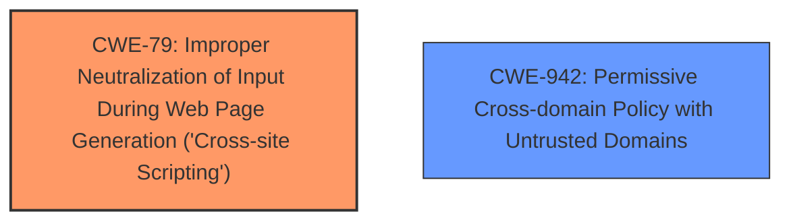

# Analysis for CVE-2022-31744

# Summary
| CWE ID | CWE Name | Confidence | CWE Abstraction Level | CWE Vulnerability Mapping Label | CWE-Vulnerability Mapping Notes |
|---|---|---|---|---|---|
| CWE-79 | Improper Neutralization of Input During Web Page Generation ('Cross-site Scripting') | 1.0 | Base | Allowed | Primary CWE. The vulnerability involves the injection of CSS due to improper handling of input during web page generation. |
| CWE-942 | Permissive Cross-domain Policy with Untrusted Domains | 0.7 | Variant | Allowed | Secondary CWE. The vulnerability description includes bypassing a Content Security Policy which can be caused by having a permissive cross-domain policy with untrusted domains. |

## Evidence and Confidence

*   **Confidence Score:** 0.9
*   **Evidence Strength:** HIGH

## Relationship Analysis
The primary CWE is CWE-79, which represents the core issue of improper neutralization leading to CSS injection. CWE-942 is a secondary consideration, as the vulnerability description mentions bypassing a Content Security Policy (CSP). The relationship between CWE-79 and CWE-942 isn't directly hierarchical but more of a potential consequence; successful exploitation of CWE-79 can lead to CSP bypass scenarios, which are sometimes related to cross-domain policy issues.

## Vulnerability Chain
The vulnerability chain starts with the improper handling of input (specifically, the URL in the `jar:` URI), which leads to CSS injection. This, in turn, allows an attacker to bypass the Content Security Policy (CSP). Therefore, the chain can be represented as:
Improper Input Handling (CWE-79) -> CSS Injection -> CSP Bypass (potentially related to CWE-942).

## Summary of Analysis
The initial analysis focused on identifying the root cause of the vulnerability based on the provided description and CVE reference. The key phrase "**bypass a pages Content Security Policy**" pointed towards a potential issue related to input handling and cross-domain policies.

The **Vulnerability Description** mentions that an attacker could inject CSS into stylesheets, which bypasses the Content Security Policy. The **CVE Reference Links Content Summary** confirms that the root cause is how Firefox handles content types for resources loaded from `jar:` URIs. The `nsJARChannel` incorrectly prioritized the content type hint, leading to the interpretation of directory listings as stylesheets and allowing CSS injection.

CWE-79 (Improper Neutralization of Input During Web Page Generation ('Cross-site Scripting')) is the primary CWE because it directly addresses the **weakness** of improper input handling leading to CSS injection. The injected CSS then bypasses the CSP.

CWE-942 (Permissive Cross-domain Policy with Untrusted Domains) is considered as a secondary CWE. Although the vulnerability is about bypassing CSP, it doesn't necessarily mean it's caused by a permissive cross-domain policy. However, the **CVE Reference Links Content Summary** mentions that bypassing CSP is a direct result of the injected CSS, and permissive cross-domain policies can contribute to such bypasses. Thus, it's considered a related, but secondary, weakness.

The selected CWEs are at the optimal level of specificity because they accurately represent the **root cause** (CWE-79) and a potential contributing factor or consequence (CWE-942) of the vulnerability.

Relevant CWE Information:

# Enhanced Context (25 CWEs)

## CWE-366: Race Condition within a Thread
**Abstraction Level**: Base
**Similarity Score**: 0.79
**Source**: dense

**Description**:
If two threads of execution use a resource simultaneously, there exists the possibility that resources may be used while invalid, in turn making the state of execution undefined.

**Mapping Guidance**:
- Usage: Allowed
- Rationale: This CWE entry is at the Base level of abstraction, which is a preferred level of abstraction for mapping to the root causes of vulnerabilities.

*Not Selected:* This CWE is not relevant because the vulnerability is not related to race conditions or multi-threading issues.

## CWE-367: Time-of-check Time-of-use (TOCTOU) Race Condition
**Abstraction Level**: Base
**Similarity Score**: 0.78
**Source**: dense

**Description**:
The product checks the state of a resource before using that resource, but the resource's state can change between the check and the use in a way that invalidates the results of the check. This can cause the product to perform invalid actions when the resource is in an unexpected state.

**Mapping Guidance**:
- Usage: Allowed
- Rationale: This CWE entry is at the Base level of abstraction, which is a preferred level of abstraction for mapping to the root causes of vulnerabilities.

*Not Selected:* This CWE is not relevant because the vulnerability is not related to race conditions or time-of-check time-of-use issues.

## CWE-362: Concurrent Execution using Shared Resource with Improper Synchronization ('Race Condition')
**Abstraction Level**: Class
**Similarity Score**: 0.78
**Source**: dense

**Description**:
The product contains a concurrent code sequence that requires temporary, exclusive access to a shared resource, but a timing window exists in which the shared resource can be modified by another code sequence operating concurrently.

**Mapping Guidance**:
- Usage: Allowed-with-Review
- Rationale: This CWE entry is a Class and might have Base-level children that would be more appropriate

*Not Selected:* This CWE is not relevant because the vulnerability is not related to race conditions or multi-threading issues.

## CWE-662: Improper Synchronization
**Abstraction Level**: Class
**Similarity Score**: 0.76
**Source**: dense

**Description**:
The product utilizes multiple threads or processes to allow temporary access to a shared resource that can only be exclusive to one process at a time, but it does not properly synchronize these actions, which might cause simultaneous accesses of this resource by multiple threads or processes.

**Mapping Guidance**:
- Usage: Discouraged
- Rationale: This CWE entry is a level-1 Class (i.e., a child of a Pillar). It might have lower-level children that would be more appropriate

*Not Selected:* This CWE is not relevant because the vulnerability is not related to synchronization issues.

## CWE-667: Improper Locking
**Abstraction Level**: Class
**Similarity Score**: 0.76
**Source**: dense

**Description**:
The product does not properly acquire or release a lock on a resource, leading to unexpected resource state changes and behaviors.

**Mapping Guidance**:
- Usage: Allowed-with-Review
- Rationale: This CWE entry is a Class and might have Base-level children that would be more appropriate

*Not Selected:* This CWE is not relevant because the vulnerability is not related to locking issues.

## CWE-368: Context Switching Race Condition
**Abstraction Level**: Base
**Similarity Score**: 0.76
**Source**: dense

**Description**:
A product performs a series of non-atomic actions to switch between contexts that cross privilege or other security boundaries, but a race condition allows an attacker to modify or misrepresent the product's behavior during the switch.

**Mapping Guidance**:
- Usage: Allowed
- Rationale: This CWE entry is at the Base level of abstraction, which is a preferred level of abstraction for mapping to the root causes of vulnerabilities.

*Not Selected:* This CWE is not relevant because the vulnerability is not related to context switching or race conditions.

## CWE-404: Improper Resource Shutdown or Release
**Abstraction Level**: Class
**Similarity Score**: 0.75
**Source**: dense

**Description**:
The product does not release or incorrectly releases a resource before it is made available for re-use.

**Mapping Guidance**:
- Usage: Allowed-with-Review
- Rationale: This CWE entry is a Class and might have Base-level children that would be more appropriate

*Not Selected:* This CWE is not relevant because the vulnerability is not related to resource shutdown or release issues.

## CWE-843: Access of Resource Using Incompatible Type ('Type Confusion')
**Abstraction Level**: Base
**Similarity Score**: 0.75
**Source**: dense

**Description**:
The product allocates or initializes a resource such as a pointer, object, or variable using one type, but it later accesses that resource using a type that is incompatible with the original type.

**Mapping Guidance**:
- Usage: Allowed
- Rationale: This CWE entry is at the Base level of abstraction, which is a preferred level of abstraction for mapping to the root causes of vulnerabilities.

*Not Selected:* While there is an element of misinterpreting the resource as a stylesheet, this is more directly caused by improper neutralization of input than type confusion.

## CWE-1289: Improper Validation of Unsafe Equivalence in Input
**Abstraction Level**: Base
**Similarity Score**: 0.75
**Source**: dense

**Description**:
The product receives an input value that is