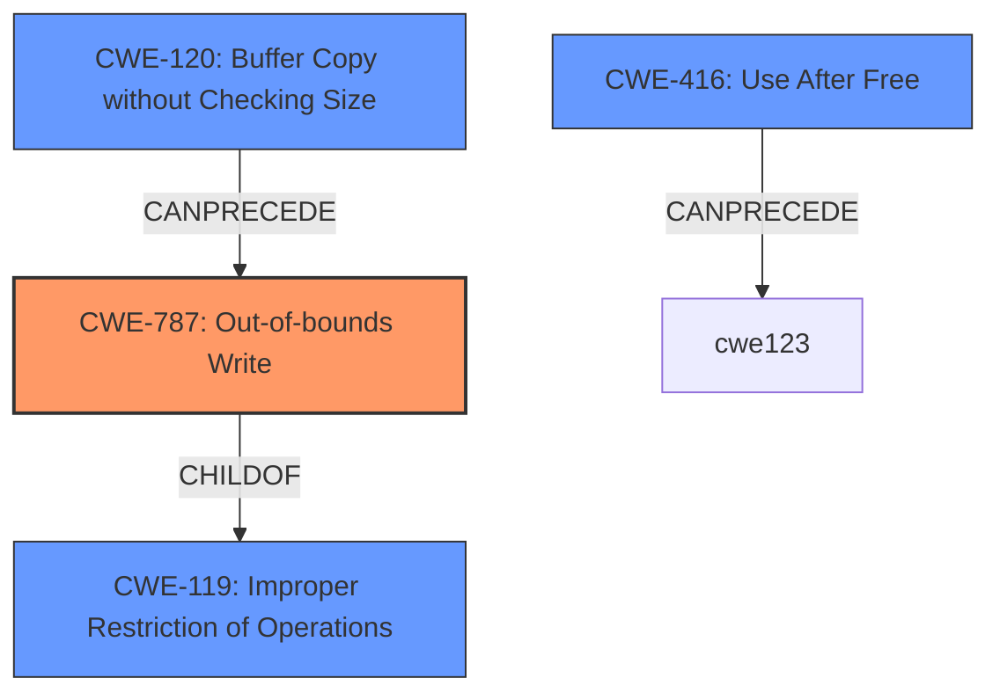

# Analysis Report for CVE-2022-31747

# Vulnerability Analysis Report: CVE-2022-31747

## Description


## Analysis (with Relationship Data)

# Summary
| CWE ID | CWE Name | Confidence | CWE Abstraction Level | CWE Vulnerability Mapping Label | CWE-Vulnerability Mapping Notes |
|---|---|---|---|---|---|
| CWE-787 | Out-of-bounds Write | 0.9 | Base | Allowed | Primary CWE |
| CWE-416 | Use After Free | 0.7 | Variant | Allowed | Secondary Candidate |
| CWE-119 | Improper Restriction of Operations within the Bounds of a Memory Buffer | 0.6 | Class | Discouraged | Secondary Candidate |

## Evidence and Confidence

*   **Confidence Score:** 0.8
*   **Evidence Strength:** HIGH

## Relationship Analysis
The primary weakness identified is **CWE-787 (Out-of-bounds Write)**, a Base-level CWE. This choice is supported by the vulnerability description referencing **memory corruption**. Out-of-bounds write can lead to memory corruption by writing data past the end of allocated buffers. **CWE-119 (Improper Restriction of Operations within the Bounds of a Memory Buffer)** is a parent Class of CWE-787, but is discouraged. While CWE-119 broadly describes memory buffer issues, CWE-787 more precisely captures the act of writing beyond buffer boundaries. The relationship between CWE-787 and **CWE-120 (Buffer Copy without Checking Size of Input)** is relevant, as unchecked buffer copies are a common cause of out-of-bounds writes. **CWE-416 (Use After Free)** is another possible weakness, given the **memory safety bugs** and **memory corruption**, but it requires more explicit evidence.



## Vulnerability Chain
The vulnerability chain starts with memory safety bugs, specifically memory corruption. The **root cause** is likely an **improper** handling of memory, leading to an out-of-bounds write (CWE-787) or use-after-free (CWE-416), and finally arbitrary code execution.

## Summary of Analysis
The initial assessment focused on the provided vulnerability description and the **memory safety bugs** causing **memory corruption**. The strongest evidence supports **CWE-787 (Out-of-bounds Write)**, driven by the potential for arbitrary code execution as a result of memory corruption. The description mentions several specific bugs from the CVE Reference Links Content Summary that support this, including "AddressSanitizer: heap-buffer-overflow in [@ mozilla::SipccSdp::GetMediaSection]". While **CWE-119 (Improper Restriction of Operations within the Bounds of a Memory Buffer)** is a broader category, CWE-787 is more specific and accurately reflects the **weakness**. CWE-416 (Use After Free) is considered because the **CVE Reference Links Content Summary** lists "heap-use-after-free".

The selection of CWE-787 as the primary CWE is based on its specific alignment with the **memory corruption** resulting in an out-of-bounds write scenario. This aligns with the MITRE mapping guidance that favors base-level CWEs when appropriate.

Relevant CWE Information:
- **CWE-787 (Out-of-bounds Write)**: This CWE is a base-level weakness and aligns with the vulnerability description stating that memory corruption could lead to arbitrary code execution. The **CVE Reference Links Content Summary** specifically calls out "heap-buffer-overflow".

The retriever results also list CWE-787 as the second highest hit. The top hit is CWE-119, but it is discouraged.


## CWE Relationship Analysis

Current CWEs represent these abstraction levels: .


### Vulnerability Chain Analysis

**Chain starting from CWE-787:**
- 787 (Out-of-bounds Write) - ROOT


**Chain starting from CWE-119:**
- 119 (Improper Restriction of Operations within the Bounds of a Memory Buffer) - ROOT


### CWE Relationship Diagram

```mermaid
graph TD
    classDef primary fill:#f96,stroke:#333,stroke-width:2px
    classDef secondary fill:#69f,stroke:#333
    classDef tertiary fill:#9e9,stroke:#333
```


*Report generated on 2025-03-30 15:10:59*
