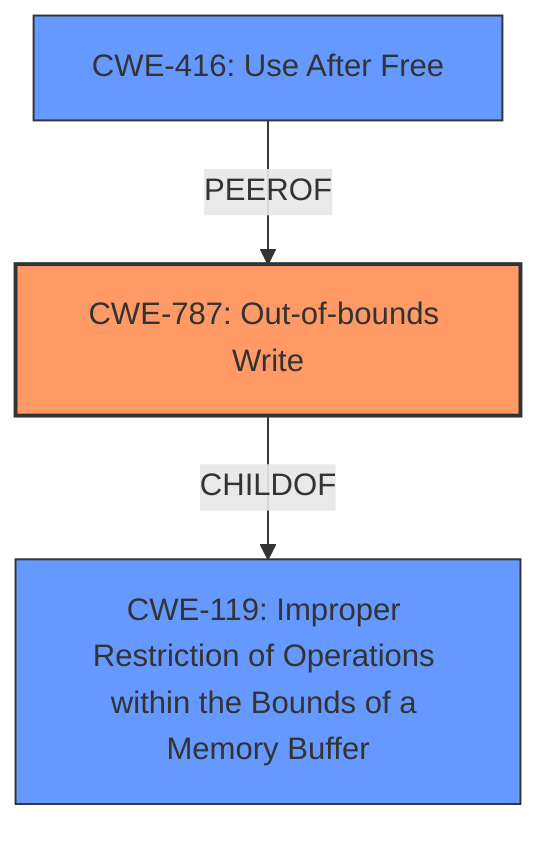

# Raw Analyzer Response for CVE-2022-31748

# Summary
| CWE ID | CWE Name | Confidence | CWE Abstraction Level | CWE Vulnerability Mapping Label | CWE-Vulnerability Mapping Notes |
|---|---|---|---|---|---|
| CWE-787 | Out-of-bounds Write | 0.8 | Base | Allowed | Primary CWE |
| CWE-416 | Use After Free | 0.7 | Variant | Allowed | Secondary CWE |
| CWE-119 | Improper Restriction of Operations within the Bounds of a Memory Buffer | 0.6 | Class | Discouraged | Secondary CWE |

## Evidence and Confidence

*   **Confidence Score:** 0.8
*   **Evidence Strength:** HIGH

## Relationship Analysis
The primary relationship that impacted the decision was the hierarchical structure with CWE-787 as a child of CWE-119. Given the evidence of **memory corruption** due to writing outside buffer boundaries, CWE-787 was favored over its parent. Additionally, the presence of Use-After-Free issues indicated by the CVE reference links suggests CWE-416 as another relevant weakness.

## Vulnerability Chain
The vulnerability chain starts with **memory safety bugs**, leading to **memory corruption**, which can then lead to arbitrary code execution. The specific types of memory safety bugs mentioned (heap-buffer-overflow, use-after-free) refine this chain.

## Summary of Analysis
The initial assessment considered several CWEs, but the final decision heavily relies on the evidence presented in the CVE Reference Links Content Summary which stated: "Multiple memory safety bugs were identified in Firefox 100. These bugs could lead to memory corruption," and "Weaknesses/vulnerabilities present: Memory safety bugs, including heap-buffer-overflow, use-after-free, data races, and crashes due to incorrect memory access or handling, leading to memory corruption".

CWE-787 (Out-of-bounds Write) is selected as the primary CWE because it directly addresses the **memory corruption** resulting from writing data past the end or before the beginning of the intended buffer. This is further supported by the mention of heap-buffer-overflow in the CVE description.

CWE-416 (Use After Free) is a secondary CWE due to its presence among the mentioned **memory safety bugs**.

CWE-119 (Improper Restriction of Operations within the Bounds of a Memory Buffer) was considered, but ultimately, the more specific CWE-787 was chosen due to the direct evidence of out-of-bounds writes. CWE-119 is still included as a secondary CWE since it is a parent of CWE-787 and represents the general class of buffer boundary errors.

These selections are at the optimal level of specificity because they directly reflect the specific types of **memory safety bugs** reported (out-of-bounds write, use-after-free) and their impact (**memory corruption**).

Relevant CWE Information:

# Enhanced Context (25 CWEs)
The following CWEs were identified as potentially relevant to this vulnerability:

## CWE-681: Incorrect Conversion between Numeric Types
**Abstraction Level**: Base
**Similarity Score**: 0.78
**Source**: dense

**Description**:
When converting from one data type to another, such as long to integer, data can be omitted or translated in a way that produces unexpected values. If the resulting values are used in a sensitive context, then dangerous behaviors may occur.

**Mapping Guidance**:
- Usage: Allowed
- Rationale: This CWE entry is at the Base level of abstraction, which is a preferred level of abstraction for mapping to the root causes of vulnerabilities.

**Analysis:** While conversions can lead to memory issues, there is no direct evidence of incorrect conversions in the description. Thus, it is not chosen.

## CWE-131: Incorrect Calculation of Buffer Size
**Abstraction Level**: Base
**Similarity Score**: 0.78
**Source**: dense

**Description**:
The product does not correctly calculate the size to be used when allocating a buffer, which could lead to a buffer overflow.

**Mapping Guidance**:
- Usage: Allowed
- Rationale: This CWE entry is at the Base level of abstraction, which is a preferred level of abstraction for mapping to the root causes of vulnerabilities.

**Analysis:** There is no direct evidence of incorrect buffer size calculations. Thus, it is not chosen.

## CWE-191: Integer Underflow (Wrap or Wraparound)
**Abstraction Level**: Base
**Similarity Score**: 0.77
**Source**: dense

**Description**:
The product subtracts one value from another, such that the result is less than the minimum allowable integer value, which produces a value that is not equal to the correct result.

**Mapping Guidance**:
- Usage: Allowed
- Rationale: This CWE entry is at the Base level of abstraction, which is a preferred level of abstraction for mapping to the root causes of vulnerabilities.

**Analysis:** No direct evidence of integer underflow is present in the description. Thus, it is not chosen.

## CWE-843: Access of Resource Using Incompatible Type ('Type Confusion')
**Abstraction Level**: Base
**Similarity Score**: 0.77
**Source**: dense

**Description**:
The product allocates or initializes a resource such as a pointer, object, or variable using one type, but it later accesses that resource using a type that is incompatible with the original type.

**Mapping Guidance**:
- Usage: Allowed
- Rationale: This CWE entry is at the Base level of abstraction, which is a preferred level of abstraction for mapping to the root causes of vulnerabilities.

**Analysis:** There is no direct evidence of type confusion. Thus, it is not chosen.

## CWE-124: Buffer Underwrite ('Buffer Underflow')
**Abstraction Level**: Base
**Similarity Score**: 0.77
**Source**: dense

**Description**:
The product writes to a buffer using an index or pointer that references a memory location prior to the beginning of the buffer.

**Mapping Guidance**:
- Usage: Allowed
- Rationale: This CWE entry is at the Base level of abstraction, which is a preferred level of abstraction for mapping to the root causes of vulnerabilities.

**Analysis:** Buffer underwrite is a possibility, but the description focuses more on general out-of-bounds writes, making CWE-787 a better fit. Thus, it is not chosen.

## CWE-404: Improper Resource Shutdown or Release
**Abstraction Level**: Class
**Similarity Score**: 0.77
**Source**: dense

**Description**:
The product does not release or incorrectly releases a resource before it is made available for re-use.

**Mapping Guidance**:
- Usage: Allowed-with-Review
- Rationale: This CWE entry is a Class and might have Base-level children that would be more appropriate

**Analysis:** This could be related to use-after-free, but the description focuses on the missing release, not the subsequent use. Thus, it is not chosen.

## CWE-125: Out-of-bounds Read
**Abstraction Level**: Base
**Similarity Score**: 0.76
**Source**: dense

**Description**:
The product reads data past the end, or before the beginning, of the intended buffer.

**Mapping Guidance**:
- Usage: Allowed
- Rationale: This CWE entry is at the Base level of abstraction, which is a preferred level of abstraction for mapping to the root causes of vulnerabilities.

**Analysis:** While out-of-bounds read could occur, the primary issue is out-of-bounds write. Thus, it is not chosen.

## CWE-226: Sensitive Information in Resource Not Removed Before Reuse
**Abstraction Level**: Base
**Similarity Score**: 0.76
**Source**: dense

**Description**:
The product releases a resource such as memory or a file so that it can be made available for reuse, but it does not clear or "zeroize" the information contained in the resource before the product performs a critical state transition or makes the resource available for reuse by other entities.

**Mapping Guidance**:
- Usage: Allowed
- Rationale: This CWE entry is at the Base level of abstraction, which is a preferred level of abstraction for mapping to the root causes of vulnerabilities.

**Analysis:** This is not directly indicated by the description. Thus, it is not chosen.

## CWE-805: Buffer Access with Incorrect Length Value
**Abstraction Level**: Base
**Similarity Score**: 0.76
**Source**: dense

**Description**:
The product uses a sequential operation to read or write a buffer, but it uses an incorrect length value that causes it to access memory that is outside of the bounds of the buffer.

**Mapping Guidance**: