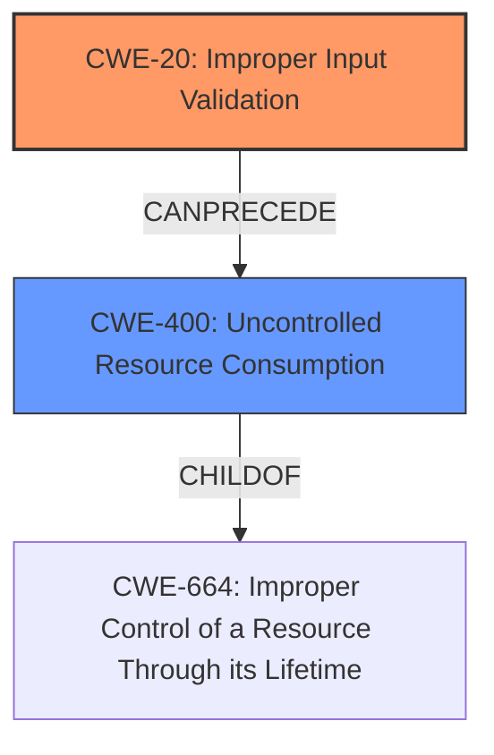

# Enhanced Analysis for CVE-2022-31766

# Summary
| CWE ID | CWE Name | Confidence | CWE Abstraction Level | CWE Vulnerability Mapping Label | CWE-Vulnerability Mapping Notes |
|---|---|---|---|---|---|
| CWE-20 | Improper Input Validation | 0.9 | Base | Primary | Allowed |
| CWE-400 | Uncontrolled Resource Consumption | 0.7 | Class | Secondary | Discouraged |

## Evidence and Confidence

*   **Confidence Score:** 0.8
*   **Evidence Strength:** HIGH

## Relationship Analysis
The primary CWE selected is CWE-20, which is a Base level CWE. CWE-20 has child relationships to more specific input validation errors, but the provided information doesn't give us enough detail to choose one of those. CWE-400 is a Class level CWE and a parent of several more specific resource consumption issues, but it is likely a secondary effect of the **improper input validation**.



## Vulnerability Chain
The vulnerability chain begins with **improper input validation** (CWE-20) when handling malformed packets, which leads to uncontrolled resource consumption (CWE-400), ultimately resulting in a denial-of-service condition and device reboot.

## Summary of Analysis
The analysis indicates that the RUGGEDCOM RM1224 LTE device is vulnerable to a denial-of-service attack due to its **failure to properly handle malformed packets** when the TCP Event service is enabled. The **root cause** of this vulnerability is the **improper input validation** (CWE-20) of network packets. This leads to uncontrolled resource consumption (CWE-400) as the device processes these malformed packets, eventually causing a denial of service and device reboot.

The selection of CWE-20 is based on the "CVE Reference Links Content Summary" section, which explicitly states "Weaknesses/vulnerabilities present: Improper Input Validation (CWE-20) when processing network packets on the TCP Event service." The description aligns perfectly with CWE-20's definition: "The product receives input or data, but it does not validate or incorrectly validates that the input has the properties required to process the data safely and correctly."

CWE-400 is considered a secondary weakness, as the **uncontrolled resource consumption** is a consequence of the **improper input validation**. The device's inability to handle malformed packets properly leads to the consumption of resources, causing the denial-of-service condition.

The evidence provided is strong, leading to a high confidence level in the assessment.

Other CWEs considered but not used:

*   CWE-94 (Improper Control of Generation of Code ('Code Injection')): While code execution could be a *potential* impact of **improper input validation**, there's no indication of code injection in the description.
*   CWE-668 (Exposure of Resource to Wrong Sphere): While the DoS could be viewed as exposing the resource to the wrong sphere, this is too high-level.
*   CWE-770 (Allocation of Resources Without Limits or Throttling): This is too specific and a child of CWE-400, which is likely a secondary effect.
*   CWE-79 (Improper Neutralization of Input During Web Page Generation ('Cross-site Scripting')): This is not related to web page generation
*   CWE-787 (Out-of-bounds Write): This is too specific and there is no mention of writing to a buffer out of bounds in the description


## CWE Relationship Analysis

Current CWEs represent these abstraction levels: .


### Vulnerability Chain Analysis

**Chain starting from CWE-400:**
- 400 (Uncontrolled Resource Consumption) - ROOT


**Chain starting from CWE-668:**
- 668 (Exposure of Resource to Wrong Sphere) - ROOT


### CWE Relationship Diagram

```mermaid
graph TD
    classDef primary fill:#f96,stroke:#333,stroke-width:2px
    classDef secondary fill:#69f,stroke:#333
    classDef tertiary fill:#9e9,stroke:#333
```