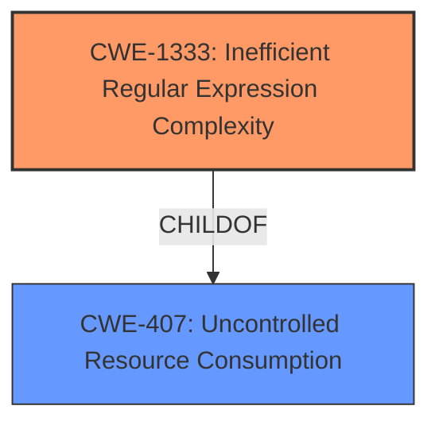

# Raw Analyzer Response for CVE-2022-31781

# Summary
| CWE ID | CWE Name | Confidence | CWE Abstraction Level | CWE Vulnerability Mapping Label | CWE-Vulnerability Mapping Notes |
|---|---|---|---|---|---|
| CWE-1333 | Inefficient Regular Expression Complexity | 1.0 | Base | Allowed | Primary CWE |

## Evidence and Confidence

*   **Confidence Score:** 1.0
*   **Evidence Strength:** HIGH

## Relationship Analysis
The primary relationship that influenced the decision was the direct match of the vulnerability to the description of CWE-1333. The description clearly states that the vulnerability is a **regular expression denial of service** due to **catastrophic backtracking**. The CWE-1333 description includes "ReDoS" and "catastrophic backtracking" as alternative terms, solidifying the match.

## Vulnerability Chain
The vulnerability chain is as follows:
1.  **Root Cause:** **Inefficient Regular Expression Complexity** (CWE-1333)
2.  **Impact:** Catastrophic backtracking leading to denial of service.

## Summary of Analysis
The initial analysis strongly pointed towards CWE-1333 due to the presence of **regular expression denial of service** (**ReDoS**) and **catastrophic backtracking** in both the vulnerability description and the CWE definition. The "CVE Reference Links Content Summary" section further reinforced this by explicitly stating that the root cause is a ReDoS vulnerability due to catastrophic backtracking.

The evidence is very strong, as shown in the "Vulnerability Description Key Phrases":
*   **rootcause:** **regular expression denial of service**
*   **impact:** catastrophic backtracking

And the "CVE Reference Links Content Summary":
*   **Root cause of vulnerability:** A regular expression used in the `org.apache.tapestry5.http.ContentType` class is vulnerable to Regular Expression Denial of Service (ReDoS) attacks.
*   **Weaknesses/vulnerabilities present:** The vulnerability is a ReDoS vulnerability due to catastrophic backtracking in the regular expression used to parse Content Types within the `ContentType` class of Apache Tapestry.

The graph relationships confirm that CWE-1333 is a specific type of uncontrolled resource consumption (CWE-407), which aligns with the denial-of-service impact.

The selection of CWE-1333 is at the optimal level of specificity because it directly addresses the root cause: the inefficient regular expression.