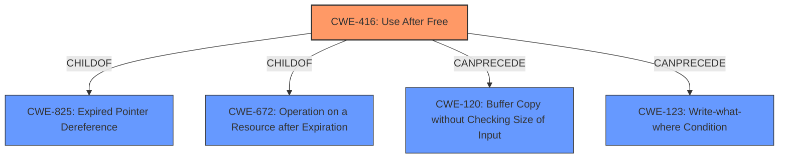

# Raw Analyzer Response for CVE-2022-3196

# Summary
| CWE ID | CWE Name | Confidence | CWE Abstraction Level | CWE Vulnerability Mapping Label | CWE-Vulnerability Mapping Notes |
|---|---|---|---|---|---|
| CWE-416 | Use After Free | 1.0 | Variant | Primary | Allowed |

## Evidence and Confidence

*   **Confidence Score:** 1.0
*   **Evidence Strength:** HIGH

## Relationship Analysis
The primary CWE is CWE-416, which is a variant. This is appropriate because the vulnerability is a specific type of memory corruption. CWE-416 is a child of CWE-825 (Expired Pointer Dereference) and CWE-672 (Operation on a Resource after Expiration). It can precede CWE-120 (Buffer Copy without Checking Size of Input) and CWE-123 (Write-what-where Condition).

## Vulnerability Chain
The vulnerability chain starts with a crafted PDF file, which triggers a **use-after-free** condition, leading to **heap corruption**. The **use-after-free** is the root cause, and the **heap corruption** is a potential impact.

## Summary of Analysis
The primary weakness is **use-after-free** (CWE-416) in the PDF component of Google Chrome. The vulnerability description explicitly states "**Use after free** in PDF" and the CVE reference summary confirms this with "**Use-after-free** vulnerability exists in the PDF component". The key phrases also include "**rootcause:** **use after free**" and "**weakness:** **heap corruption**".

The retriever results also list CWE-416 as the top candidate with a score of 0.355.

CWE-416 is a Variant level CWE, which is a preferred level of abstraction. The mapping guidance for CWE-416 states "This CWE entry is at the Variant level of abstraction, which is a preferred level of abstraction for mapping to the root causes of vulnerabilities."

I considered other CWEs like CWE-366 (Race Condition within a Thread), CWE-843 (Access of Resource Using Incompatible Type ('Type Confusion')), CWE-122 (Heap-based Buffer Overflow), and CWE-415 (Double Free), but they do not accurately represent the vulnerability. The vulnerability is specifically a **use-after-free**, not a race condition, type confusion, buffer overflow, or double free.