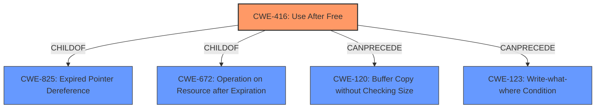

# Analysis Report for CVE-2022-3198

# Vulnerability Analysis Report: CVE-2022-3198

## Description


## Analysis (with Relationship Data)

# Summary
| CWE ID | CWE Name | Confidence | CWE Abstraction Level | CWE Vulnerability Mapping Label | CWE-Vulnerability Mapping Notes |
|---|---|---|---|---|---|
| CWE-416 | Use After Free | 1.0 | Variant | Primary | Allowed |

## Evidence and Confidence

*   **Confidence Score:** 1.0
*   **Evidence Strength:** HIGH

## Relationship Analysis
The primary identified CWE is CWE-416 (**Use After Free**), a variant-level weakness. The analysis considered its relationships, particularly its parent CWEs (CWE-825, CWE-672) and potential chains (CanPrecede CWE-120, CWE-123). Given the clear description of the vulnerability as a **use after free**, selecting the variant CWE-416 provides the most specific and accurate classification.



## Vulnerability Chain
The vulnerability chain begins with the **use after free** condition (CWE-416) in the PDF component, leading to potential heap corruption. The exploitation of the heap corruption could then lead to remote code execution.
  - Root Cause: CWE-416 (**Use After Free**)
  - Impact: Heap Corruption, Remote Code Execution

## Summary of Analysis
The analysis is based strongly on the vulnerability description and supporting evidence from the CVE reference summary, which explicitly mentions a **"use-after-free"** vulnerability. The primary CWE match from similar CVE descriptions is also CWE-416. The retriever results also ranked CWE-416 as the top result.

The vulnerability description clearly states: "**Use after free** in PDF in Google Chrome prior to 105.0.5195.125 allowed a remote attacker to potentially exploit heap corruption via a crafted PDF file." The key phrase also identifies "**use after free**" as the **rootcause**.

The choice of CWE-416 is optimal because it directly reflects the described vulnerability at the most specific (Variant) level.

CWEs considered but not selected:

*   CWE-366 (**Race Condition within a Thread**): While concurrency issues can sometimes lead to use-after-free conditions, there is no indication of a race condition in this specific vulnerability description.
*   CWE-415 (**Double Free**): This is a different type of memory corruption issue than use-after-free.
*   CWE-787 (**Out-of-bounds Write**), CWE-123 (**Write-what-where Condition**): These are potential consequences of a use-after-free, but CWE-416 accurately describes the root cause.

Relevant CWE Information:
*   CWE-416 (**Use After Free**): The product reuses or references memory after it has been freed. This aligns directly with the vulnerability description.


## CWE Relationship Analysis

Current CWEs represent these abstraction levels: .


### Vulnerability Chain Analysis

**Chain starting from CWE-825:**
- 825 (Expired Pointer Dereference) - ROOT


**Chain starting from CWE-672:**
- 672 (Operation on a Resource after Expiration or Release) - ROOT


### CWE Relationship Diagram

```mermaid
graph TD
    classDef primary fill:#f96,stroke:#333,stroke-width:2px
    classDef secondary fill:#69f,stroke:#333
    classDef tertiary fill:#9e9,stroke:#333
```


*Report generated on 2025-03-30 22:54:14*
