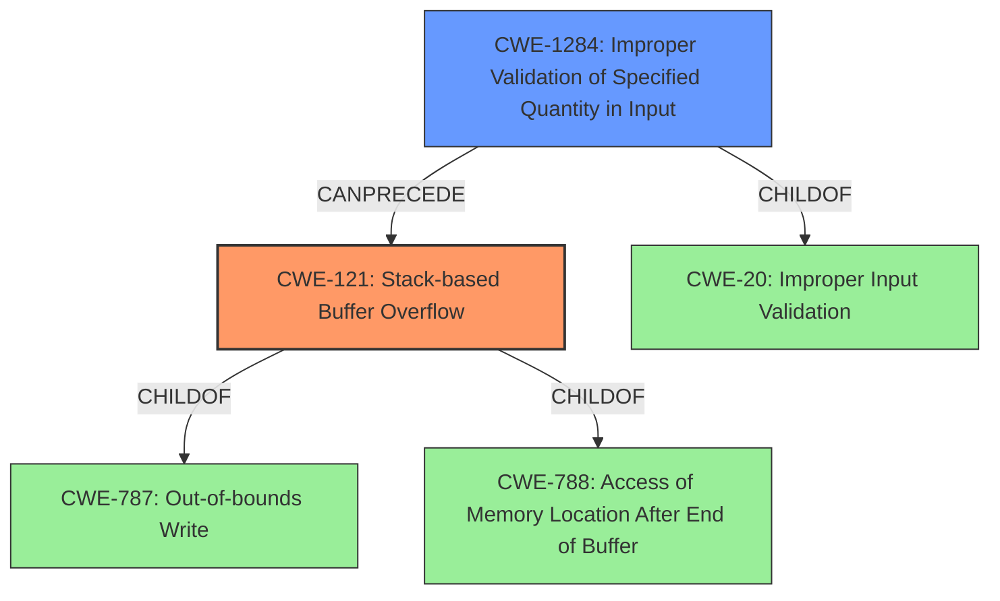

# Analysis for CVE-2022-32039

# Summary
| CWE ID | CWE Name | Confidence | CWE Abstraction Level | CWE Vulnerability Mapping Label | CWE-Vulnerability Mapping Notes |
|---|---|---|---|---|---|
| CWE-121 | Stack-based Buffer Overflow | 1.0 | Variant | Allowed | Primary CWE |
| CWE-1284 | Improper Validation of Specified Quantity in Input | 0.7 | Base | Allowed | Secondary CWE |

## Evidence and Confidence

*   **Confidence Score:** 0.9
*   **Evidence Strength:** HIGH

## Relationship Analysis
The primary CWE is CWE-121, a **Variant** of buffer overflow that occurs on the stack. This is a child of CWE-787 (Out-of-bounds Write) and CWE-788 (Access of Memory Location After End of Buffer). The secondary CWE is CWE-1284, which represents the **improper validation of the input quantity**, and is a child of CWE-20 (Improper Input Validation). The chain starts with improper input validation (CWE-1284) that can lead to a stack-based buffer overflow (CWE-121).

## Vulnerability Chain
The vulnerability chain starts with **improper validation of the input** (`listN` parameter) specified by CWE-1284, which then leads to a **stack-based buffer overflow** (CWE-121) when the oversized input is copied to a buffer on the stack without adequate size checks. The overflow corrupts the `LISTEN` pointer, causing a crash in the `atoi` function, leading to a denial of service (DoS).

## Summary of Analysis
The primary weakness is a **stack-based buffer overflow**, specifically CWE-121. This is based on the vulnerability description and CVE reference, which states, "a **stack overflow** via the listN parameter in the function fromDhcpListClient" and "The program concatenates the listN POST parameter without checking the length of the input leading to a buffer overflow on the stack". The reference also notes that the overflow causes a crash in the `atoi` function due to corruption of the `LISTEN` pointer, leading to a denial of service.

The analysis considered several other CWEs, including:

*   CWE-190 (Integer Overflow or Wraparound): While integer overflows can lead to buffer overflows, the specific vulnerability description highlights the missing length check as the root cause, making CWE-121 a more precise match.
*   CWE-120 (Buffer Copy without Checking Size of Input): This CWE is very similar to CWE-121. However, since the vulnerability is explicitly a stack-based buffer overflow, CWE-121 is more specific.
*   CWE-787 (Out-of-bounds Write): This is a parent of CWE-121, representing a broader class of vulnerabilities. While relevant, CWE-121 provides more detail about the specific location of the overflow (stack).
*   CWE-1284 (Improper Validation of Specified Quantity in Input): The vulnerability description indicates a lack of input validation for the `listN` parameter. This **improper validation** leads to the overflow, so it is assigned as a secondary CWE.

The selection of CWE-121 is at the Variant level of abstraction, which is preferred for root cause analysis. It accurately reflects the specific type of buffer overflow (stack-based) described in the vulnerability. CWE-1284 captures the **missing input validation** that is the ultimate cause of the overflow.

Relevant CWE Information:

# Enhanced Context (25 CWEs)
The following CWEs were identified as potentially relevant to this vulnerability:

## CWE-191: Integer Underflow (Wrap or Wraparound)
**Abstraction Level**: Base
**Similarity Score**: 0.77
**Source**: dense

**Description**:
The product subtracts one value from another, such that the result is less than the minimum allowable integer value, which produces a value that is not equal to the correct result.

**Mapping Guidance**:
- Usage: Allowed
- Rationale: This CWE entry is at the Base level of abstraction, which is a preferred level of abstraction for mapping to the root causes of vulnerabilities.

## CWE-131: Incorrect Calculation of Buffer Size
**Abstraction Level**: Base
**Similarity Score**: 0.77
**Source**: dense

**Description**:
The product does not correctly calculate the size to be used when allocating a buffer, which could lead to a buffer overflow.

**Mapping Guidance**:
- Usage: Allowed
- Rationale: This CWE entry is at the Base level of abstraction, which is a preferred level of abstraction for mapping to the root causes of vulnerabilities.

## CWE-805: Buffer Access with Incorrect Length Value
**Abstraction Level**: Base
**Similarity Score**: 0.76
**Source**: dense

**Description**:
The product uses a sequential operation to read or write a buffer, but it uses an incorrect length value that causes it to access memory that is outside of the bounds of the buffer.

**Mapping Guidance**:
- Usage: Allowed
- Rationale: This CWE entry is at the Base level of abstraction, which is a preferred level of abstraction for mapping to the root causes of vulnerabilities.

## CWE-789: Memory Allocation with Excessive Size Value
**Abstraction Level**: Variant
**Similarity Score**: 0.75
**Source**: dense

**Description**:
The product allocates memory based on an untrusted, large size value, but it does not ensure that the size is within expected limits, allowing arbitrary amounts of memory to be allocated.

**Mapping Guidance**:
- Usage: Allowed
- Rationale: This CWE entry is at the Variant level of abstraction, which is a preferred level of abstraction for mapping to the root causes of vulnerabilities.

## CWE-124: Buffer Underwrite ('Buffer Underflow')
**Abstraction Level**: Base
**Similarity Score**: 0.75
**Source**: dense

**Description**:
The product writes to a buffer using an index or pointer that references a memory location prior to the beginning of the buffer.

**Mapping Guidance**:
- Usage: Allowed
- Rationale: This CWE entry is at the Base level of abstraction, which is a preferred level of abstraction for mapping to the root causes of vulnerabilities.

## CWE-126: Buffer Over-read
**Abstraction Level**: Variant
**Similarity Score**: 0.75
**Source**: dense

**Description**:
The product reads from a buffer using buffer access mechanisms such as indexes or pointers that reference memory locations after the targeted buffer.

**Mapping Guidance**:
- Usage: Allowed
- Rationale: This CWE entry is at the Variant level of abstraction, which is a preferred level of abstraction for mapping to the root causes of vulnerabilities.

## CWE-193: Off-by-one Error
**Abstraction Level**: Base
**Similarity Score**: 0.75
**Source**: dense

**Description**:
A product calculates or uses an incorrect maximum or minimum value that is 1 more, or 1 less, than the correct value.

**Mapping Guidance**:
- Usage: Allowed
- Rationale: This CWE entry is at the Base level of abstraction, which is a preferred level of abstraction for mapping to the root causes of vulnerabilities.

## CWE-125: Out-of-bounds Read
**Abstraction Level**: Base
**Similarity Score**: 0.75
**Source**: dense

**Description**:
The product reads data past the end, or before the beginning, of the intended buffer.

**Mapping Guidance**:
- Usage: Allowed
- Rationale: This CWE entry is at the Base level of abstraction, which is a preferred level of abstraction for mapping to the root causes of vulnerabilities.

## CWE-130: Improper Handling of Length Parameter Inconsistency
**Abstraction Level**: Base
**Similarity Score**: 0.75
**Source**: dense

**Description**:
The product parses a formatted message or structure, but it does not handle or incorrectly handles a length field that is inconsistent with the actual length of the associated data.

**Mapping Guidance**:
- Usage: Allowed
- Rationale: This CWE