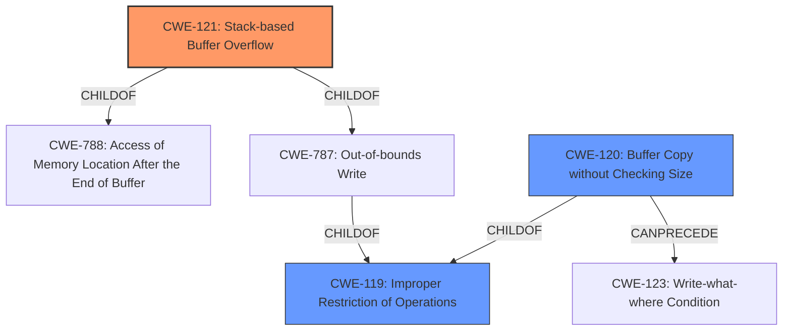

# Analysis Report for CVE-2022-32043

# Vulnerability Analysis Report: CVE-2022-32043

## Description


## Analysis (with Relationship Data)

# Summary
| CWE ID | CWE Name | Confidence | CWE Abstraction Level | CWE Vulnerability Mapping Label | CWE-Vulnerability Mapping Notes |
|---|---|---|---|---|---|
| CWE-121 | Stack-based Buffer Overflow | 1.0 | Variant | Allowed | Primary CWE |
| CWE-119 | Improper Restriction of Operations within the Bounds of a Memory Buffer | 0.5 | Class | Discouraged | Secondary Candidate |
| CWE-120 | Buffer Copy without Checking Size of Input ('Classic Buffer Overflow') | 0.5 | Base | Allowed-with-Review | Secondary Candidate |

## Evidence and Confidence

*   **Confidence Score:** 1.0
*   **Evidence Strength:** HIGH

## Relationship Analysis
The primary CWE, CWE-121, is a Variant of CWE-788 and CWE-787, indicating a more specific type of buffer overflow. CWE-119 is a Class-level CWE that is a parent of both CWE-121 and CWE-120. CWE-120 can precede CWE-123 (Write-what-where Condition). The selection of CWE-121 is based on the specific location of the buffer (stack) and the direct evidence of a **stack overflow** in the vulnerability description. The higher abstraction level of CWE-119 makes it a less precise fit, while CWE-120, although related, doesn't fully capture the stack-specific nature of the overflow.



## Vulnerability Chain
The vulnerability chain starts with the **lack of proper bounds checking** when copying POST parameters (`info` and `logo_pic_name`) to stack buffers. This leads directly to a **stack overflow** (CWE-121). The impact of this overflow can be a denial of service, and potentially remote code execution if the return address is overwritten.

## Summary of Analysis
The initial analysis strongly points towards a **stack overflow** due to **missing bounds checking** on input parameters. The retriever results also prioritize CWE-121. The vulnerability description explicitly mentions a **stack overflow**, and the CVE reference summary details the **lack of validation** when copying data to stack buffers.

The selection of CWE-121 is based on the following evidence:

*   **Vulnerability Description Key Phrases:** "**stack overflow**"
*   **CVE Reference Links Content Summary:** "A **stack-based buffer overflow** vulnerability exists in the `formSetAccessCodeInfo` function...It copies these parameters to stack buffers **without proper bounds checking**...This **lack of validation** allows an attacker to write beyond the allocated buffer, leading to a **stack overflow**."

CWE-119 is a more general category and is discouraged when a more specific CWE is available. CWE-120 is also related to buffer overflows, but it emphasizes the copying of buffers without checking size, which is a contributing factor but not the primary weakness as the location of the buffer being on the stack is a key aspect of this vulnerability.

The selected CWE-121 is at the optimal level of specificity, as it precisely describes the vulnerability as a **stack-based buffer overflow**. The evidence supports this classification, and the relationship analysis confirms that CWE-121 is a more specific variant of the more general CWE-119. Other CWEs considered like Integer Overflow (CWE-190), are not directly related to the core issue of writing beyond buffer boundaries.


## CWE Relationship Analysis

Current CWEs represent these abstraction levels: .


### Vulnerability Chain Analysis

**Chain starting from CWE-190:**
- 190 (Integer Overflow or Wraparound) - ROOT


**Chain starting from CWE-121:**
- 121 (Stack-based Buffer Overflow) - ROOT


### CWE Relationship Diagram

```mermaid
graph TD
    classDef primary fill:#f96,stroke:#333,stroke-width:2px
    classDef secondary fill:#69f,stroke:#333
    classDef tertiary fill:#9e9,stroke:#333
```


*Report generated on 2025-03-31 10:30:58*
