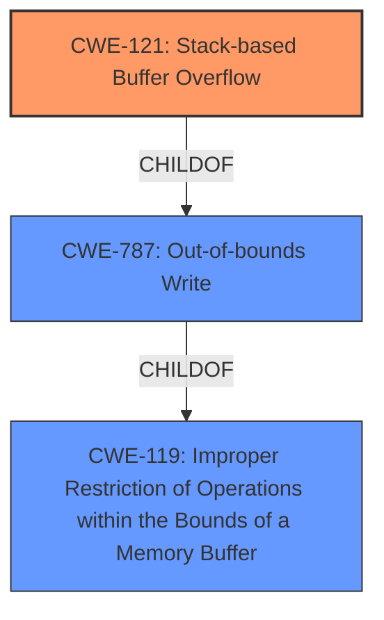

# Raw Analyzer Response for CVE-2022-32046

# Summary
| CWE ID | CWE Name | Confidence | CWE Abstraction Level | CWE Vulnerability Mapping Label | CWE-Vulnerability Mapping Notes |
|---|---|---|---|---|---|
| CWE-121 | Stack-based Buffer Overflow | 1.0 | Variant | Allowed | Primary CWE. The **stack overflow** vulnerability explicitly indicates this CWE. |

## Evidence and Confidence

*   **Confidence Score:** 1.0
*   **Evidence Strength:** HIGH

## Relationship Analysis
The primary relationship influencing the decision is the hierarchical relationship. CWE-121 (Stack-based Buffer Overflow) is a Variant of CWE-787 (Out-of-bounds Write), and CWE-119 (Improper Restriction of Operations within the Bounds of a Memory Buffer). Given the specific mention of a **stack overflow**, the more specific CWE-121 is preferred.

## Vulnerability Chain
The chain of root cause and weaknesses is as follows:
1.  **Root Cause:** A **stack overflow** due to the `desc` parameter being copied to a stack buffer without bounds checking.
2.  **Weakness:** The absence of bounds checking on the `desc` parameter within the `FUN_0041880c` function.
3.  **Impact:** Potential for arbitrary code execution by overwriting return addresses on the stack.

## Summary of Analysis
The initial analysis identified CWE-121 (Stack-based Buffer Overflow) as the primary candidate based on the vulnerability description, which explicitly states a **stack overflow** in the `desc` parameter.

The `CVE Reference Links Content Summary` confirms the **root cause** is a buffer overflow in the `/web_cste/cgi-bin/cstecgi.cgi` binary within the `FUN_0041880c` function. The `desc` parameter, received as a JSON string, is copied to a local stack buffer without any bounds checking. This aligns perfectly with the description of CWE-121.

The retriever results also list CWE-121 as the top combined result with a score of 1.0, further supporting this selection.

The hierarchical relationships and MITRE mapping guidance were considered. CWE-121 is a variant of CWE-787 (Out-of-bounds Write), which is a child of CWE-119 (Improper Restriction of Operations within the Bounds of a Memory Buffer). However, the specificity of the **stack overflow** makes CWE-121 the most appropriate choice.

The evidence is strong and directly supports the selection of CWE-121. The description explicitly mentions **stack overflow**, the content summary confirms the lack of bounds checking, and the retriever results rank CWE-121 as the top candidate.

CWE-787 (Out-of-bounds Write) was considered but deemed too general given the explicit mention of a **stack overflow**. While the vulnerability does involve writing out of bounds, the location (stack) is a critical detail that CWE-121 captures.

CWE-190 (Integer Overflow or Wraparound) was also in the retriever results, but it does not directly relate to the described vulnerability, which is a buffer overflow, not an integer handling issue.

The chosen CWE is at the optimal level of specificity, accurately representing the **root cause** and mechanism of the vulnerability.