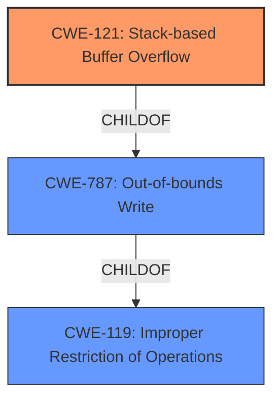

# Raw Analyzer Response for CVE-2022-32047

# Summary
| CWE ID | CWE Name | Confidence | CWE Abstraction Level | CWE Vulnerability Mapping Label | CWE-Vulnerability Mapping Notes |
|---|---|---|---|---|---|
| CWE-121 | Stack-based Buffer Overflow | 1.0 | Variant | Allowed | Primary CWE |
| CWE-119 | Improper Restriction of Operations within the Bounds of a Memory Buffer | 0.7 | Class |  | Secondary CWE, Parent of CWE-121 |

## Evidence and Confidence

*   **Confidence Score:** 1.0
*   **Evidence Strength:** HIGH

## Relationship Analysis
The primary CWE is CWE-121 Stack-based Buffer Overflow, which is a variant of the more general CWE-787 Out-of-bounds Write and CWE-119 Improper Restriction of Operations within the Bounds of a Memory Buffer. The choice of CWE-121 is based on the specific location of the buffer on the stack.

## Vulnerability Chain
The vulnerability chain starts with the **lack of input validation** which allows an attacker to supply an overly long "desc" parameter. This leads to a **stack overflow** when the overly long input is copied to a local stack buffer without checking the size. The ultimate impact is potential for arbitrary code execution.

## Summary of Analysis
The vulnerability is a **stack overflow** in the TOTOLINK T6 router due to **lack of input validation** on the `desc` parameter in the `FUN_00412ef4` function. The `desc` parameter is copied to a stack buffer without any bounds checking, which allows an attacker to overwrite the stack and potentially execute arbitrary code.

The primary evidence for this assessment comes from the "CVE Reference Links Content Summary":

> **Root cause of vulnerability**: The vulnerability is caused by a stack buffer overflow in the `/web_cste/cgi-bin/cstecgi.cgi` binary, specifically within the `FUN_00412ef4` function (address 0x412ef4). The function receives a JSON parameter `desc` and copies it directly to local stack variables without performing any length checks.

The "**weakness: stack overflow**" phrase in the "Vulnerability Description Key Phrases" section further supports this assessment.

The Retriever Results also suggest CWE-121 Stack-based Buffer Overflow as the top candidate.

I considered CWE-120 (Buffer Copy without Checking Size of Input) but it is not specific to stack overflows and the content summary clearly states that it's a stack overflow. I also considered CWE-787 (Out-of-bounds Write) but CWE-121 is a more specific variant that describes a stack-based buffer overflow. Therefore, CWE-121 is the most appropriate CWE.