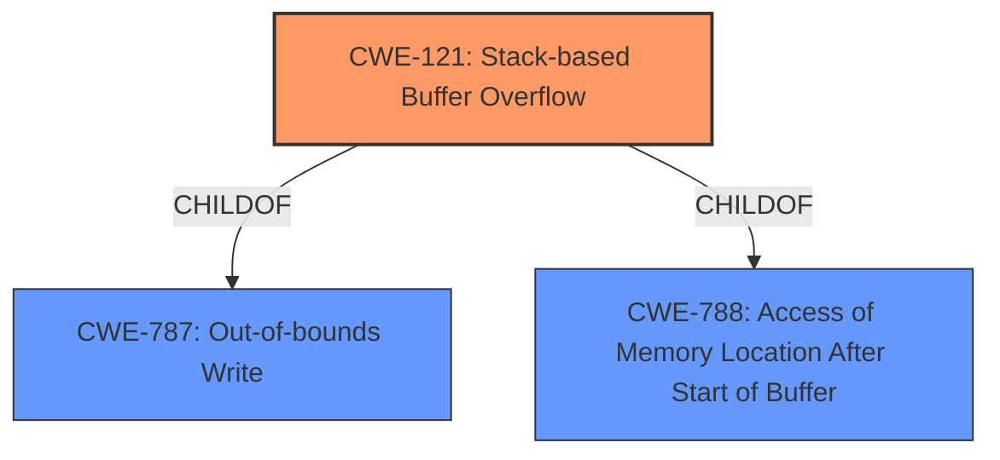

# Raw Analyzer Response for CVE-2022-32050

# Summary
| CWE ID | CWE Name | Confidence | CWE Abstraction Level | CWE Vulnerability Mapping Label | CWE-Vulnerability Mapping Notes |
|---|---|---|---|---|---|
| CWE-121 | Stack-based Buffer Overflow | 1.0 | Variant | Allowed | Primary CWE. Matches the vulnerability description's **stack overflow** due to unchecked copy of user-supplied data. |

## Evidence and Confidence

*   **Confidence Score:** 1.0
*   **Evidence Strength:** HIGH

## Relationship Analysis
The primary CWE, CWE-121, is a variant of CWE-788 and CWE-787, indicating a more specific type of buffer overflow occurring on the stack. Choosing CWE-121 provides a more precise classification than its parent CWEs.

## Vulnerability Chain
The vulnerability chain starts with the **improper handling of the cloneMac parameter**, leading to an unchecked copy of user-supplied data onto the stack, resulting in a **stack-based buffer overflow**. This allows for arbitrary code execution.

## Summary of Analysis
The initial analysis correctly identifies the vulnerability as a stack-based buffer overflow. The evidence provided, especially the CVE Reference Links Content Summary, clearly states that the **vulnerability lies in the `/web_cste/cgi-bin/cstecgi.cgi` component where the `FUN_0041af40` function retrieves the `cloneMac` parameter from a JSON payload and copies it to stack-allocated local variables without verifying its length**, which leads to a **stack buffer overflow due to unchecked copy of user-supplied data** and resulting in **arbitrary code execution**.

The vulnerability description explicitly mentions a **stack overflow** and the summary confirms the root cause as an unchecked copy to stack-allocated variables.

CWE-121 is at the Variant level, which is a preferred level of abstraction, and directly relates to the vulnerability description.

Other CWEs considered but not used:

*   CWE-787: Out-of-bounds Write - While this is a parent of CWE-121, CWE-121 is more specific as it explicitly states that the overflow occurs on the stack.
*   CWE-120: Buffer Copy without Checking Size of Input ('Classic Buffer Overflow') - Similar to CWE-787, it's a more general case of buffer overflow. CWE-121 is more specific to stack-based overflows.
*   CWE-190: Integer Overflow or Wraparound - This CWE is related to integer calculation errors and not directly applicable to the buffer overflow caused by unchecked data copy.
*   CWE-770: Allocation of Resources Without Limits or Throttling - This CWE relates to resource allocation without limits, which is not the primary issue in this vulnerability. The core issue is the unchecked buffer copy.
*   CWE-125: Out-of-bounds Read - The vulnerability is a write, not a read.
*   CWE-259: Use of Hard-coded Password - This CWE is not relevant to a buffer overflow vulnerability.
*   CWE-128: Wrap-around Error - This CWE is related to integer calculation errors and not directly applicable to the buffer overflow caused by unchecked data copy.
Relevant CWE Information: