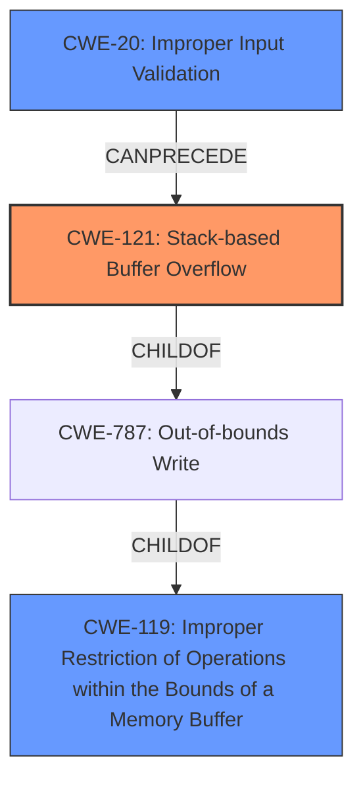

# Analysis Report for CVE-2022-32053

# Vulnerability Analysis Report: CVE-2022-32053

## Description


## Analysis (with Relationship Data)

# Summary
| CWE ID  | CWE Name                       | Confidence | CWE Abstraction Level | CWE Vulnerability Mapping Label | CWE-Vulnerability Mapping Notes |
| :------- | :----------------------------- | :--------- | :---------------------- | :------------------------------ | :------------------------------ |
| CWE-121  | Stack-based Buffer Overflow    | 1.0        | Variant               | Allowed                         | Primary CWE                     |
| CWE-119  | Improper Restriction of Operations within the Bounds of a Memory Buffer | 0.75      | Class               | Allowed                         | Secondary CWE                     |
| CWE-20 | Improper Input Validation | 0.75 | Class | Allowed | Secondary CWE |

## Evidence and Confidence

*   **Confidence Score:** 0.9
*   **Evidence Strength:** HIGH

## Relationship Analysis
The primary weakness is a stack-based buffer overflow (CWE-121), which is a variant of the more general buffer overflow (CWE-787) and improper restriction of operations within the bounds of a memory buffer (CWE-119). The root cause is the **lack of input validation** (CWE-20), which allows an attacker to provide an overly long `cloneMac` parameter.



## Vulnerability Chain
The vulnerability chain starts with **improper input validation** (CWE-20) of the `cloneMac` parameter. This leads to a **stack-based buffer overflow** (CWE-121) when the overly long input is copied to a stack buffer without proper bounds checking. The impact of this overflow is potential arbitrary code execution.

## Summary of Analysis
The primary CWE is CWE-121 (Stack-based Buffer Overflow) because the vulnerability description clearly states that a **stack overflow** occurs due to the `cloneMac` parameter in the function `FUN_0041621c`. The "CVE Reference Links Content Summary" confirms this by stating, "The vulnerability is a stack-based buffer overflow," and "By sending a crafted `cloneMac` parameter that is larger than the buffer allocated on the stack, an attacker can overwrite adjacent memory on the stack." This aligns perfectly with the definition of CWE-121, which is a variant of buffer overflows where the buffer is allocated on the stack. The evidence is strong and directly supports this classification.

CWE-119 (Improper Restriction of Operations within the Bounds of a Memory Buffer) is a parent class of CWE-121 and is relevant because the overflow occurs because the code **does not properly** restrict the operation (copying the input) within the bounds of the stack buffer. This is further supported by the "CVE Reference Links Content Summary" indicating a "Lack of Input Validation," which directly relates to improper bounds checking during the string copy operation.

CWE-20 (Improper Input Validation) is a relevant secondary CWE because the root cause of the vulnerability is the **lack of input validation** on the `cloneMac` parameter. The "CVE Reference Links Content Summary" explicitly states, "The code does not properly validate the length of the `cloneMac` parameter received via a JSON request." This **failure to validate** the input is the root cause that allows the buffer overflow to occur.

Other CWEs were considered but deemed less appropriate:

*   CWE-120 (Buffer Copy without Checking Size of Input): While this CWE is related to buffer overflows, it is more specific to cases where the size of the input is not checked *during* the copy operation. The primary issue here is the initial **lack of validation** of the input size, making CWE-20 a more accurate representation of the root cause. The stack allocation makes CWE-121 a more precise match than CWE-120.
*   CWE-787 (Out-of-bounds Write): This is a higher-level CWE and less specific than CWE-121, which explicitly identifies the stack-based nature of the overflow.
*   CWE-190 (Integer Overflow or Wraparound): While integer overflows can sometimes be related to buffer overflows, there is no direct evidence in the description to suggest that an integer overflow is involved in this vulnerability.
*   CWE-770 (Allocation of Resources Without Limits or Throttling): This CWE is related to resource exhaustion, and while a buffer overflow can lead to resource issues, the primary vulnerability is the overflow itself, not the lack of resource limits.

The selected CWEs (CWE-121, CWE-119, and CWE-20) are at the optimal level of specificity because they accurately represent the specific type of buffer overflow (stack-based), the general class of improper buffer operation restriction, and the root cause of missing input validation. This combination provides a comprehensive understanding of the vulnerability.


## CWE Relationship Analysis

Current CWEs represent these abstraction levels: .


### Vulnerability Chain Analysis

**Chain starting from CWE-190:**
- 190 (Integer Overflow or Wraparound) - ROOT


**Chain starting from CWE-20:**
- 20 (Improper Input Validation) - ROOT


### CWE Relationship Diagram

```mermaid
graph TD
    classDef primary fill:#f96,stroke:#333,stroke-width:2px
    classDef secondary fill:#69f,stroke:#333
    classDef tertiary fill:#9e9,stroke:#333
```


*Report generated on 2025-03-31 09:11:25*
