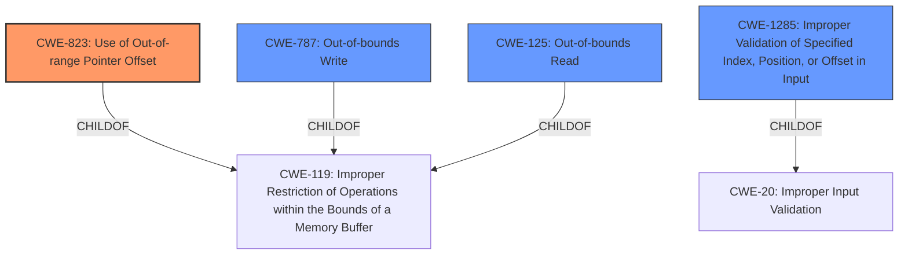

# Analysis for CVE-2022-32142

# Summary
| CWE ID | CWE Name | Confidence | CWE Abstraction Level | CWE Vulnerability Mapping Label | CWE-Vulnerability Mapping Notes |
|---|---|---|---|---|---|
| CWE-823 | Use of Out-of-range Pointer Offset | 0.9 | Base | Allowed | Primary CWE |
| CWE-1285 | Improper Validation of Specified Index, Position, or Offset in Input | 0.7 | Base | Allowed | Secondary Candidate |
| CWE-787 | Out-of-bounds Write | 0.6 | Base | Allowed | Secondary Candidate |
| CWE-125 | Out-of-bounds Read | 0.6 | Base | Allowed | Secondary Candidate |

## Evidence and Confidence

*   **Confidence Score:** 0.8
*   **Evidence Strength:** HIGH

## Relationship Analysis
The primary CWE is CWE-823, which describes the use of an out-of-range pointer offset. This is further refined by considering potential causes such as **improper input validation** (CWE-1285) that could lead to the offset being out of range, or direct **out-of-bounds read/write access** (CWE-125, CWE-787) as a result. All of these are childs of CWE-119 Improper Restriction of Operations within the Bounds of a Memory Buffer, which is too high level and discouraged.

## Vulnerability Chain
The vulnerability chain starts with the **improper handling of a crafted request with an invalid offset**. This leads to the **use of an out-of-range pointer offset** (CWE-823), potentially resulting in an **out-of-bounds read or write access** (CWE-125, CWE-787). The final impact is a denial-of-service condition or local memory overwrite. The chain highlights that the root cause is the **improper validation** and handling of the offset, and the resulting weaknesses are the memory access violations.

## Summary of Analysis
The primary assessment is based on the provided evidence, specifically:
- "A low privileged remote attacker may craft a request with invalid offset, which can cause an **out-of-bounds read or write access**"
- "Root cause of vulnerability: The CODESYS Control runtime system **improperly handles** crafted requests with **invalid offsets**."
- "Weaknesses/vulnerabilities present: CWE-823: Use of Out-of-range Pointer Offset. The software uses pointer offsets that are out of range."

The graph relationships influenced the selection by highlighting the hierarchy of CWEs related to buffer operations and input validation.

CWE-823 is selected as the primary CWE because it accurately describes the core weakness: the use of a pointer offset that points outside the intended memory range. While **out-of-bounds read/write** (CWE-125/787) are potential consequences, CWE-823 captures the underlying flaw in pointer arithmetic.

CWE-1285 (Improper Validation of Specified Index, Position, or Offset in Input) is considered as a secondary CWE to capture the **improper input validation**, which leads to the use of invalid offsets.

CWE-787 and CWE-125 are included as secondary CWEs because the description mentions both **out-of-bounds read and write access** as potential consequences.

The selected CWEs are at the optimal level of specificity because they are base-level CWEs that directly address the root cause and potential consequences of the vulnerability. Higher-level CWEs like CWE-119 are too generic, while more specific variants may not fully capture the range of potential issues.

Relevant CWE Information:
- **CWE-823: Use of Out-of-range Pointer Offset**
   - The product performs pointer arithmetic on a valid pointer, but it uses an offset that can point outside of the intended range of valid memory locations for the resulting pointer. The vulnerability description clearly indicates the use of invalid offsets.
   - Security Implications: Allows an attacker to read or write to memory locations that are used elsewhere in the product, potentially changing the state of the product, causing a crash, or leading to code execution.
   - Relationship: ChildOf -> CWE-119 (Improper Restriction of Operations within the Bounds of a Memory Buffer). CanPrecede -> CWE-125 (Out-of-bounds Read), CWE-787 (**Out-of-bounds Write**).
   - Usage: Allowed. This is a base-level CWE, which is a preferred level of abstraction.

- **CWE-1285: Improper Validation of Specified Index, Position, or Offset in Input**
   - The product receives input that is expected to specify an index, position, or offset into an indexable resource such as a buffer or file, but it does not validate or incorrectly validates that the specified index/position/offset has the required properties.
   - Security Implications: Attackers could access unauthorized portions of resources, cause buffer overflows, excessive resource allocation, or trigger unexpected failures.
   - Relationship: ChildOf -> CWE-20 (Improper Input Validation)
   - Usage: Allowed. This is a base-level CWE, which is a preferred level of abstraction.

- **CWE-787: Out-of-bounds Write**
   - The product writes data past the end, or before the beginning, of the intended buffer.
   - Security Implications: Memory corruption and potential code execution.
   - Relationship: ChildOf -> CWE-119.
   - Usage: Allowed. This is a base-level CWE, which is a preferred level of abstraction.

- **CWE-125: Out-of-bounds Read**
   - The product reads data past the end, or before the beginning, of the intended buffer.
   - Security Implications: Information disclosure or denial-of-service.
   - Relationship: ChildOf -> CWE-119.
   - Usage: Allowed. This is a base-level CWE, which is a preferred level of abstraction.

- **CWE-119: Improper Restriction of Operations within the Bounds of a Memory Buffer**
   - The product performs operations on a memory buffer, but it reads from or writes to a memory location outside the buffer's intended boundary.
   - Security Implications: Read or write operations on unexpected memory locations that could be linked to other variables, data structures, or internal program data.
   - Relationship: ChildOf -> CWE-118, ChildOf -> CWE-20
   - Usage: Discouraged. It is commonly misused, and lower-level CWEs are preferred.

- **CWE-20: Improper Input Validation**
   - The product receives input or data, but it does not validate or incorrectly validates that the input has the properties that are required to process the data safely and correctly.
   - Security Implications: Altered control flow, arbitrary control of a resource, or arbitrary code execution.
   - Relationship: ChildOf -> CWE-707
   - Usage: Discouraged. Consider lower-level children such as CWE-1284, CWE-1285, CWE-1286, CWE-1287, CWE-1288, or CWE-1289.

- **CWE-190: Integer Overflow or Wraparound**
   - The product performs a calculation that can produce an integer overflow or wraparound when the logic assumes that the resulting value will always be larger than the original value.
   - Security Implications: Can lead to unexpected behavior, including buffer overflows.
   - Relationship: ChildOf -> CWE-682, ChildOf -> CWE-20
   - Usage: Allowed.

CWEs Considered but Not Used:
- CWE-190 (Integer Overflow or Wraparound): While an integer overflow could potentially contribute to an out-of-range offset, there is no direct evidence to support this, so it is not included.
- CWE-119 (Improper Restriction of Operations within the Bounds